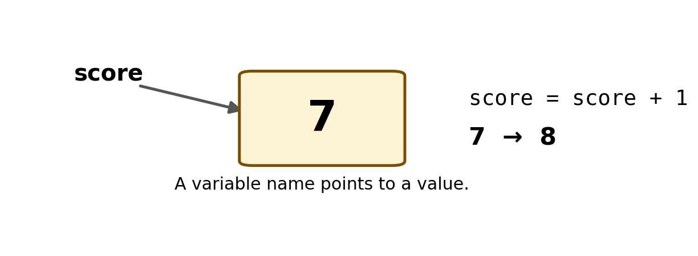

# Teach the Game to Remember {#sec-ch02}

::: {.chapter-banner}

[GAME 02 | Treasure Clicker]{.game-title}

[Variables]{.skill-chip} [Strings]{.skill-chip} [DOM]{.skill-chip}

:::

::: {.callout-tip .mission title="Your mission" icon="false"}

By the end of this chapter, you can:

- create variables with let and `const`
- change a variable
- show a value on the page

:::

::: {.callout-note .big-idea title="The big idea" icon="false"}

A score is memory. The game needs a place to store a number and change it after each successful action.

:::

## Variables are labeled storage

Use let when a value will change. Use `const` when the variable should keep referring to the same thing.

{#fig-ch02 fig-alt="The variable score refers to 7. Executing score equals score plus 1 replaces 7 with 8." width="100%"}

**Read the picture:** First read the old value, 7. Add 1 to get 8. Finally, assign 8 back to `score`. The label stays the same while the value changes.

```javascript
let score = 0;
const treasure = document.getElementById("treasure");
```

## Updating the score

The assignment operator = stores a new value. `score = score + 1` means: take the old score, add one, and store the result back into score.

```javascript
function collectTreasure() {
  score = score + 1;
  scoreText.textContent = "Score: " + score;
}
```

## Strings and numbers

Text inside quotes is a string. A score such as 7 is a number. JavaScript can join text and a number with + when text is involved.

```javascript
let playerName = "Maya";
let score = 7;
message.textContent = playerName + " has " + score + " gems!";
```

## Build the complete game

Put the pieces together. Type the code yourself if you can; typing helps your brain notice punctuation, spelling, and structure.

[COMPLETE EXAMPLE]{.code-label}

```html
<!doctype html>
<html>
<body>
  <h1>Treasure Clicker</h1>
  <button id="treasure">💎 Collect treasure</button>
  <p id="score">Score: 0</p>

  <script>
    let score = 0;
    const treasure = document.getElementById("treasure");
    const scoreText = document.getElementById("score");

    function collectTreasure() {
      score = score + 1;
      scoreText.textContent = "Score: " + score;
    }

    treasure.addEventListener("click", collectTreasure);
  </script>
</body>
</html>
```

::: {.callout-note .advanced-study title="Advanced Study | let, const, scope, and types" icon="false" collapse="false"}

[OPTIONAL DEEPER DIVE]{.study-badge}

Use `const` when a name should not be reassigned and let when the stored value needs to change. JavaScript is dynamically typed: a variable is not permanently locked to one type. For beginning games, keep each variable consistent—scores stay numbers, names stay strings, and element references stay DOM objects.

```javascript
let score = 0;
const scoreLabel = document.getElementById('score');
scoreLabel.textContent = score;
```

**A constant is not a frozen object.** `const scoreLabel` keeps the same element reference, but `scoreLabel.textContent` can still change. What cannot change is which element the name refers to.

**Scope means where a name is available.** A `let` or `const` declared inside block braces is available within that block, not everywhere. Our score lives outside the click function so repeated clicks share it.

**Predict before running:** How do `7 + 1` and `"7" + 1` differ? The first adds numbers; the second joins text.

:::

## Level-up challenges

::: {.callout-tip .challenge title="Challenge 1" icon="false"}

Make each treasure worth 5 points.

:::

::: {.callout-tip .challenge title="Challenge 2" icon="false"}

Add a “spend 10 points” button. Only worry about subtracting for now; Chapter 3 will teach you how to prevent negative scores.

:::

## Checkpoint

::: {.callout-important .checkpoint title="Explain it in your own words" icon="false"}

What new JavaScript idea made the Treasure Clicker game possible? Point to one line of code and explain what would change if you removed it.

:::
