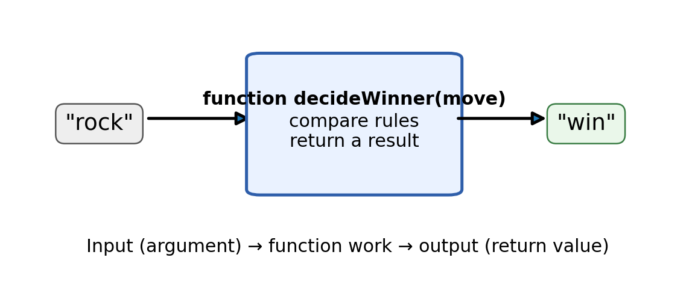

# Create Reusable Game Actions {#sec-ch04}

::: {.chapter-banner}

[GAME 04 | Rock Paper Scissors]{.game-title}

[Parameters]{.skill-chip} [Return values]{.skill-chip} [Randomness]{.skill-chip}

:::

::: {.callout-note .code-guide title="How to use the code pieces" icon="false"}

This chapter develops parts of a larger game. These short examples are **code fragments**, not a complete HTML file. Read the surrounding explanations and combine the pieces with the screen, setup, and game-loop ideas from earlier chapters.

:::

::: {.callout-tip .mission title="Your mission" icon="false"}

By the end of this chapter, you can:

- use function parameters and return values
- generate a random choice
- break a problem into small functions

:::

::: {.callout-note .big-idea title="The big idea" icon="false"}

As games grow, one giant function becomes difficult to understand. Small functions let us name behaviors such as `chooseComputerMove` and `decideWinner`.

:::

## A function can receive information

A parameter is a local name for information passed into a function.

{#fig-ch04 fig-alt="A simplified diagram sends a move into a function that compares rules and returns a result." width="100%"}

**Read the picture:** A function receives information, performs work, and may return a result. This is a simplified picture: our actual `decideWinner(player, computer)` function needs **both** moves. The player choosing rock alone does not determine a winner.

```javascript
function cheer(playerName) {
  return "Go, " + playerName + "!";
}

const message = cheer("Ari");
```

## Make a random computer choice

`Math.random()` gives a value from 0 up to (but not including) 1. We can turn it into one of three choices.

```javascript
function computerChoice() {
  const choices = ["rock", "paper", "scissors"];
  const index = Math.floor(Math.random() * 3);
  return choices[index];
}
```

## Decide a winner

The rule function compares the player move with the computer move and returns a result.

```javascript
function decideWinner(player, computer) {
  if (player === computer) return "Tie!";

  if (
    (player === "rock" && computer === "scissors") ||
    (player === "paper" && computer === "rock") ||
    (player === "scissors" && computer === "paper")
  ) {
    return "You win!";
  }
  return "Computer wins!";
}
```

::: {.callout-note .advanced-study title="Advanced Study | Parameters, return values, and local scope" icon="false" collapse="false"}

[OPTIONAL DEEPER DIVE]{.study-badge}

Parameters exist only inside the function call. A return value sends information back to the caller. This makes functions easier to test because the same function can work with different inputs and produce a result instead of depending on hidden global variables.

```javascript
function beats(a, b) {
  return (a === 'rock' && b === 'scissors');
}
const result = beats('rock', 'scissors');
```

**Argument or parameter?** In `beats("rock", "scissors")`, the strings are arguments: actual values supplied to the function. Inside the function, `a` and `b` are parameter names referring to those values during this call.

**Returning is not displaying.** `return` sends a value to the caller and ends this function call. The caller chooses whether to save it, display it, or use it in another decision.

The small `beats` example checks only rock against scissors. Use `decideWinner` for the complete three-move rules.

:::

## Level-up challenges

::: {.callout-tip .challenge title="Challenge 1" icon="false"}

Add emoji to the result message.

:::

::: {.callout-tip .challenge title="Challenge 2" icon="false"}

Track player wins and computer wins.

:::

::: {.callout-tip .challenge title="Challenge 3" icon="false"}

Invent a fourth move and decide what it beats. Notice how the rule logic becomes more complicated.

:::

## Checkpoint

::: {.callout-important .checkpoint title="Explain it in your own words" icon="false"}

What new JavaScript idea made the Rock Paper Scissors game possible? Point to one line of code and explain what would change if you removed it.

:::
