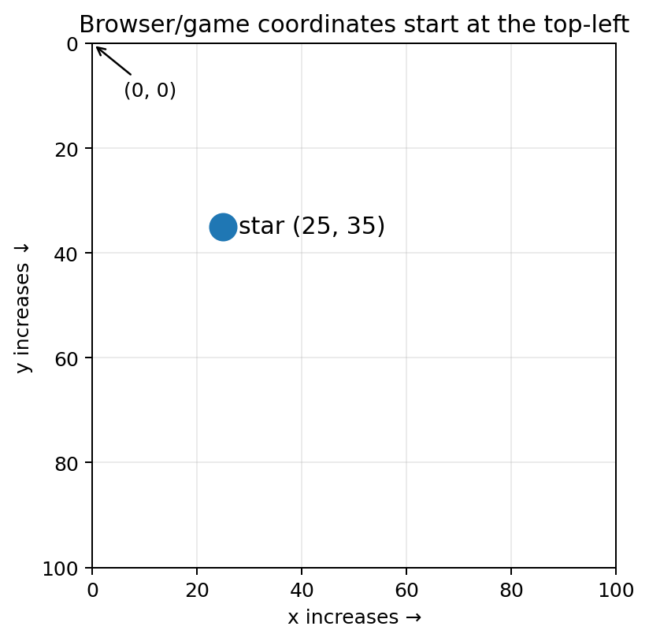
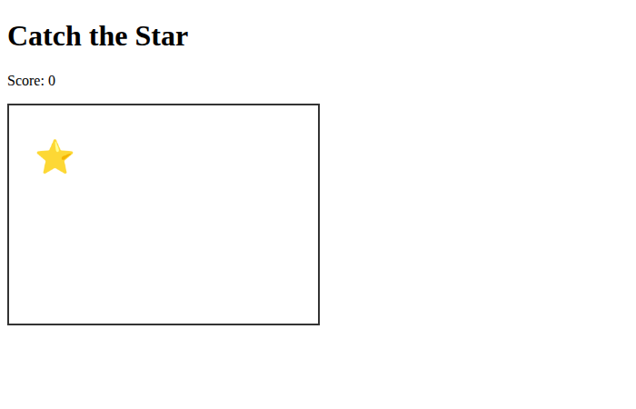
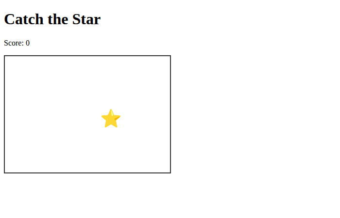
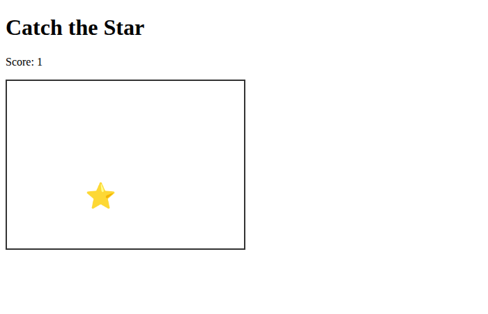

# Make Things Change Over Time {#sec-ch07}

::: {.chapter-banner}

[GAME 07 | Catch the Star]{.game-title}

[Timers]{.skill-chip} [Coordinates]{.skill-chip} [CSS]{.skill-chip}

:::

::: {.callout-note .big-idea title="Structure → Style → Behavior" icon="false"}

**Build the scene structure → Style the scene → Program game behavior.**

- **Build the scene structure:** Keep a star inside a game-area container, with score and any countdown outside it.
- **Style the scene:** Size the arena and star and establish the positioned parent and starting offsets.
- **Behavior:** Move the star with clicks and a timer; check score, speed changes, and how the game stops.

Use this plan for the examples and exercises below. Reuse parts that already work; change only what the task needs. After each step, predict one result and check it.

:::


::: {.callout-tip .mission title="Your mission" icon="false"}

By the end of this chapter, you can:

- use CSS position values from JavaScript
- use random coordinates
- use `setInterval` and `clearInterval`

:::

::: {.callout-note .big-idea title="The big idea" icon="false"}

A moving game world changes even when the player is not clicking. Timers let JavaScript run an action again and again.

:::

## Move an element

An absolutely positioned element can be moved by changing its left and top CSS properties.

{#fig-ch07 fig-alt="A coordinate plane starts at the top left. The x axis increases rightward and y increases downward; the star is at 25,35." width="100%"}

**Read the picture:** Start at the top-left corner. Move 25 units right and 35 units down to reach the star. These are example coordinates, not fixed limits for your game; use the size of your own game area.

```javascript
star.style.left = "120px";
star.style.top = "80px";
```

## Pick a random position

A helper function makes the star jump to a new place.

```javascript
function moveStar() {
  const x = Math.floor(Math.random() * 280);
  const y = Math.floor(Math.random() * 180);
  star.style.left = x + "px";
  star.style.top = y + "px";
}
```

## Repeat an action with a timer

`setInterval` calls a function repeatedly. The number is milliseconds, so 1000 means one second.

```javascript
const timerId = setInterval(moveStar, 1000);

// Later, when the game ends:
clearInterval(timerId);
```

## Build the complete game

Put the pieces together. Type the code yourself if you can; typing helps your brain notice punctuation, spelling, and structure.

[COMPLETE EXAMPLE]{.code-label}

```html
<!doctype html>
<html>
<head>
<style>
  #game { position: relative; width: 340px; height: 240px; border: 2px solid #333; }
  #star { position: absolute; font-size: 36px; cursor: pointer; }
</style>
</head>
<body>
  <h1>Catch the Star</h1>
  <p id="score">Score: 0</p>
  <div id="game"><span id="star">⭐</span></div>
<script>
  let score = 0;
  const star = document.getElementById("star");
  const scoreText = document.getElementById("score");

  function moveStar() {
    const x = Math.floor(Math.random() * 280);
    const y = Math.floor(Math.random() * 180);
    star.style.left = x + "px";
    star.style.top = y + "px";
  }

  star.addEventListener("click", function () {
    score++;
    scoreText.textContent = "Score: " + score;
    moveStar();
  });

  moveStar();
  setInterval(moveStar, 1000);
</script>
</body>
</html>
```

Open `workspace/chapter7-catch-the-star/index.html` to watch the complete example. The star moves once per second, and a click raises the score and moves it immediately. The screenshot pages use known positions and control one timer callback so their states are reproducible.

{#fig-ch07-star-start fig-alt="The Catch the Star page shows Score: 0 and a yellow star near the upper-left corner of a bordered game area." width="100%"}

{#fig-ch07-star-timer fig-alt="The same game shows Score: 0 with the yellow star near the middle-right of the game area." width="100%"}

{#fig-ch07-star-click fig-alt="The game shows Score: 1 with the yellow star in a new position inside the game area." width="100%"}

**Read the pictures:** The timer calls `moveStar()` without a player action, changing `left` and `top` while the score remains zero. The click handler also calls `moveStar()`, but first it adds one to `score` and updates the paragraph. The regular page keeps its one-second timer; the demonstration pages control when the callback runs for the screenshots.

::: {.callout-note .advanced-study title="Advanced Study | CSS positioning and browser coordinates" icon="false" collapse="false"}

[OPTIONAL DEEPER DIVE]{.study-badge}

For positioned HTML elements, left controls horizontal position and top controls vertical position. In browser coordinates, (0,0) is normally the top-left of the containing area, x increases to the right, and y increases downward. Element sizes matter when keeping an object inside the game area.

```javascript
star.style.left = x + 'px';
star.style.top = y + 'px';
```

**Which box do the coordinates belong to?** `#game { position: relative; }` makes the game area the containing block for the absolutely positioned star. Its offsets are measured from that area, not automatically from the entire page.

**Keep the whole object inside.** The largest useful x offset is approximately the game width minus the star width. The same idea applies to height.

**One timer is enough.** Keep the ID returned by `setInterval()` when you need to stop or replace it. Clearing a timer stops scheduled moves, not the separate click listener.

:::

## Level-up challenges

::: {.callout-tip .challenge title="Challenge 1" icon="false"}

Make the star move faster after the player reaches 5 points.

1. **Build the scene structure:** Reuse the arena, star, and score display.
2. **Style the scene:** Keep the star visible and inside the arena; faster movement does not require new artwork.
3. **Behavior:** Change the timer schedule at the threshold and check that old timers are cleared.

:::

::: {.callout-tip .challenge title="Challenge 2" icon="false"}

Add a 20-second countdown and stop the game when time reaches zero.

1. **Build the scene structure:** Add a countdown display beside the score.
2. **Style the scene:** Make remaining time and the finished state easy to read.
3. **Behavior:** Count down, stop timed movement at zero, and decide whether later clicks can still score.

:::

## Check your development flow {.unnumbered}

After your exercise or challenge, explain what you built, what you styled, and which game behavior you programmed. If you reused a stage unchanged, say why it already met the task. Record one predicted result and the result you observed, then choose the next small improvement.
