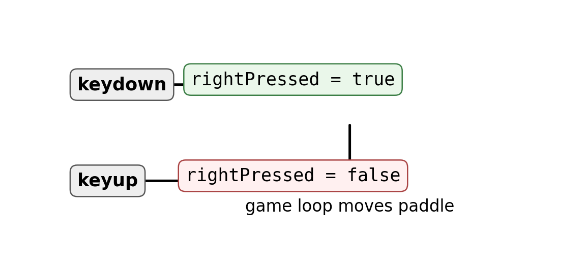

# Control a Real-Time Game {#sec-ch07}

::: {.chapter-banner}

[GAME 07 | Pong]{.game-title}

[Keyboard input]{.skill-chip} [State]{.skill-chip} [Collision]{.skill-chip}

:::

::: {.callout-note .code-guide title="How to use the code pieces" icon="false"}

This chapter develops parts of a larger game. These short examples are **code fragments**, not a complete HTML file. Read the surrounding explanations and combine the pieces with the screen, setup, and game-loop ideas from earlier chapters.

:::

::: {.callout-tip .mission title="Your mission" icon="false"}

By the end of this chapter, you can:

- track pressed keys
- move a paddle every frame
- detect simple rectangle/ball collisions

:::

::: {.callout-note .big-idea title="The big idea" icon="false"}

In a real-time game, a key press should change what happens during the next frames. Instead of moving once per key event, we remember which keys are held down.

:::

## Remember key state

`keydown` sets a state to `true`. `keyup` changes it back to `false`.

{#fig-ch07 fig-alt="Keydown sets a pressed flag to true, keyup sets it to false, and the game loop uses the flag." width="100%"}

**Read the picture:** An event changes a remembered value. The loop can then read that value on many frames. The picture uses a right-arrow flag; Pong uses the same idea for the up and down arrows.

```javascript
const keys = {};

window.addEventListener("keydown", e => {
  keys[e.key] = true;
});
window.addEventListener("keyup", e => {
  keys[e.key] = false;
});
```

## Move during the update

The game loop checks the state every frame.

```javascript
if (keys["ArrowUp"]) paddleY -= 5;
if (keys["ArrowDown"]) paddleY += 5;
```

## Keep the paddle on the screen

`Math.max` and `Math.min` can clamp a value inside a range.

```javascript
paddleY = Math.max(0, paddleY);
paddleY = Math.min(canvas.height - paddleH, paddleY);
```

## Paddle collision idea

For a first Pong game, place a vertical paddle on the right. Here, paddleX and paddleY are its top-left coordinates, paddleW and paddleH are its size, and positive dx means the ball is moving right. Test the ball bounding box against the paddle before reversing direction.

```javascript
const overlapsPaddle = (
  ballX + radius >= paddleX &&
  ballX - radius <= paddleX + paddleW &&
  ballY + radius >= paddleY &&
  ballY - radius <= paddleY + paddleH
);
if (dx > 0 && overlapsPaddle) {
  ballX = paddleX - radius;
  dx = -Math.abs(dx);
}
```

::: {.callout-note .advanced-study title="Advanced Study | Input state versus input events" icon="false" collapse="false"}

[OPTIONAL DEEPER DIVE]{.study-badge}

An event tells you that something happened once. A state variable remembers whether a key is currently held down. Real-time games usually update state in `keydown`/`keyup` handlers and let the game loop decide how far to move the player each frame.

```javascript
let rightPressed = false;
window.addEventListener("keydown", e => {
  if (e.key === "ArrowRight") rightPressed = true;
});
window.addEventListener("keyup", e => {
  if (e.key === "ArrowRight") rightPressed = false;
});
```

**Events are messages; state is memory.** Holding a key may produce repeated `keydown` events, but we do not use those repeats as a movement clock. A true flag means the loop should keep moving the paddle.

**Focus matters.** A finished game should clear remembered keys when it loses focus, because a key-up event may not arrive where expected. Prevent arrow-key scrolling only while the player is controlling the game, rather than blocking page navigation everywhere.

:::

## Level-up challenges

::: {.callout-tip .challenge title="Challenge 1" icon="false"}

Add a second paddle controlled by W and S.

:::

::: {.callout-tip .challenge title="Challenge 2" icon="false"}

Add a score when the ball passes a paddle.

:::

::: {.callout-tip .challenge title="Challenge 3" icon="false"}

Make the ball slightly faster after each paddle hit.

:::

## Checkpoint

::: {.callout-important .checkpoint title="Explain it in your own words" icon="false"}

What new JavaScript idea made the Pong game possible? Point to one line of code and explain what would change if you removed it.

:::
