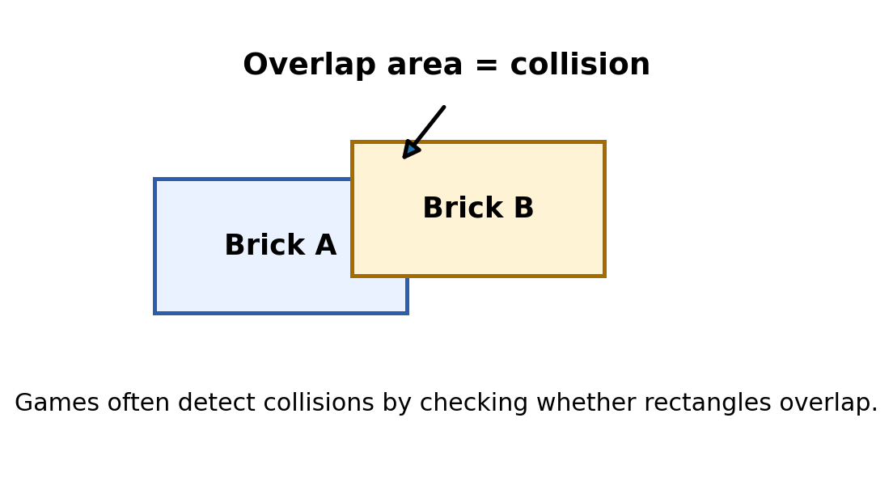

# Manage Many Game Objects {#sec-ch08}

::: {.chapter-banner}

[GAME 08 | Breakout]{.game-title}

[Objects]{.skill-chip} [Arrays]{.skill-chip} [Loops]{.skill-chip}

:::

::: {.callout-note .code-guide title="How to use the code pieces" icon="false"}

This chapter develops parts of a larger game. These short examples are **code fragments**, not a complete HTML file. Read the surrounding explanations and combine the pieces with the screen, setup, and game-loop ideas from earlier chapters.

:::

::: {.callout-tip .mission title="Your mission" icon="false"}

By the end of this chapter, you can:

- store many objects in an array
- use loops to update and draw objects
- remove or mark hit bricks
- understand basic collision tests

:::

::: {.callout-note .big-idea title="The big idea" icon="false"}

Breakout has many bricks. We do not want 30 separate variables. Arrays let one variable hold a whole collection of game objects.

:::

## Store bricks as objects

Each brick can be an object with position, size, and whether it is still active.

{#fig-ch08 fig-alt="Two rectangles partially overlap; the shared area illustrates a rectangular collision test." width="100%"}

**Read the picture:** A collision is not just being close. The shapes overlap horizontally **and** vertically. The picture uses rectangles; the beginner ball test uses a square bounding box around the ball.

```javascript
const bricks = [
  { x: 20, y: 20, w: 60, h: 20, alive: true },
  { x: 90, y: 20, w: 60, h: 20, alive: true },
  { x: 160, y: 20, w: 60, h: 20, alive: true }
];
```

## Loop through the array

`for...of` gives us each brick one at a time.

```javascript
for (const brick of bricks) {
  if (brick.alive) {
    ctx.fillRect(brick.x, brick.y, brick.w, brick.h);
  }
}
```

## A simple collision test

A ball hits a brick when its position overlaps the brick rectangle. For a beginner version, we can use the ball center plus its radius.

```javascript
function hitsBrick(ballX, ballY, r, brick) {
  return (
    ballX + r > brick.x &&
    ballX - r < brick.x + brick.w &&
    ballY + r > brick.y &&
    ballY - r < brick.y + brick.h
  );
}
```

## Change the world after a hit

When a collision happens, mark the brick as no longer alive and reverse the vertical direction of the ball.

```javascript
if (brick.alive && hitsBrick(x, y, radius, brick)) {
  brick.alive = false;
  dy = -dy;
  score++;
}
```

::: {.callout-note .advanced-study title="Advanced Study | Objects, arrays, and collision logic" icon="false" collapse="false"}

[OPTIONAL DEEPER DIVE]{.study-badge}

An object groups properties that belong to one game object. An array stores many objects in order. A common rectangle collision test checks whether one rectangle is not completely left, right, above, or below the other. Larger games often separate `update()`, `draw()`, and collision functions.

```javascript
const brick = { x: 40, y: 20, w: 60, h: 20, alive: true };
bricks.push(brick);
```

**Each object is one brick; the array is the collection.** `brick.alive = false` changes a property on that brick. A `for...of` loop can visit the collection when checking collisions and when drawing.

**Know the approximation.** `hitsBrick` checks the square around the ball against the brick. At a corner, those squares can overlap before the circle itself touches. A fast ball can also jump past a thin brick between frames.

**One hit, one response.** Avoid reversing the ball repeatedly for several bricks in one update. A simple first approach is to stop checking after the first detected hit.

:::

## Level-up challenges

::: {.callout-tip .challenge title="Challenge 1" icon="false"}

Create the brick array with nested loops instead of typing each brick.

:::

::: {.callout-tip .challenge title="Challenge 2" icon="false"}

Give some bricks two hit points.

:::

::: {.callout-tip .challenge title="Challenge 3" icon="false"}

Add a win condition when every brick is gone.

:::

## Checkpoint

::: {.callout-important .checkpoint title="Explain it in your own words" icon="false"}

What new JavaScript idea made the Breakout game possible? Point to one line of code and explain what would change if you removed it.

:::
