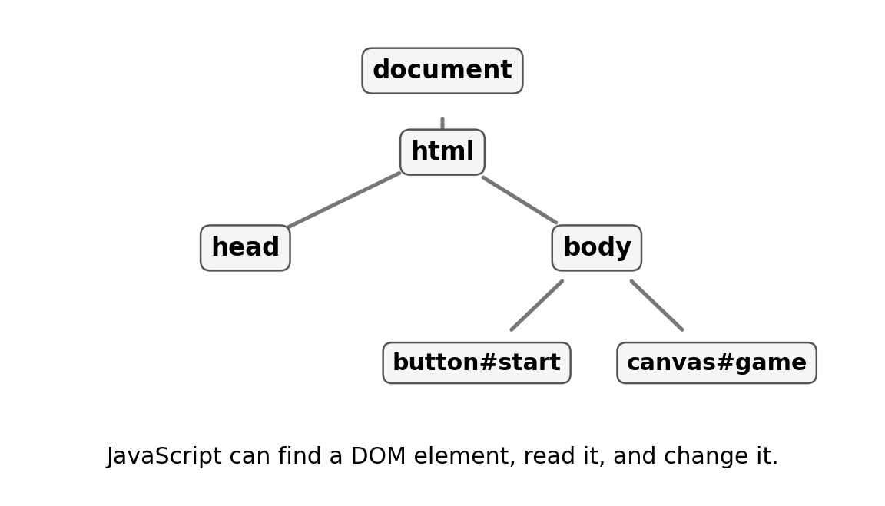

# Game Studio {#sec-ch10}

::: {.chapter-banner}

[GAME 10 | Design Your Own Game]{.game-title}

[Design]{.skill-chip} [Playtesting]{.skill-chip} [Modules]{.skill-chip}

:::

::: {.callout-note .code-guide title="Your own project" icon="false"}

This chapter gives you a plan and code sketches for your own game. The named functions in the planning example are jobs for you to implement, not functions the browser already provides.

:::

::: {.callout-tip .mission title="Your mission" icon="false"}

By the end of this chapter, you can:

- turn an idea into game rules
- plan game state before coding
- build a minimum playable version
- test and improve with player feedback

:::

::: {.callout-note .big-idea title="The big idea" icon="false"}

Game development is not “write all the code and hope.” Good game designers make a tiny playable version, test it, and improve one rule at a time.

:::

## Start with one sentence

Describe the game without features: “The player moves a basket to catch falling fruit.” If the sentence is confusing, the first version of the game is probably too complicated.

## Identify the game state

List the information the program must remember.

```javascript
// Example: Catch the Fruit
let score = 0;
let lives = 3;
let basketX = 200;
let fruitX = 100;
let fruitY = 0;
let gameOver = false;
```

## Write the game loop as a plan

Before writing details, describe the repeating cycle.

```javascript
function loop() {
  updatePlayer();
  updateFruit();
  checkCollisions();
  draw();
  requestAnimationFrame(loop);
}
```

## Build the minimum playable version

Your first version needs only enough features to answer: “Can someone play this?” Leave menus, sound, special powers, and artwork until the core rule works.

::: {.callout-tip .checklist title="Minimum playable version" icon="false"}

- [ ] Player can control something.
- [ ] Something changes over time.
- [ ] There is a clear goal.
- [ ] Success or failure can happen.
- [ ] The game can restart.

:::

## Playtest like a scientist

Give the game to another person without explaining every rule. Watch where they get confused. Ask what they expected to happen. Change one thing and test again.

::: {.callout-note .advanced-study title="Advanced Study | From one-file games to structured applications" icon="false" collapse="false"}

[OPTIONAL DEEPER DIVE]{.study-badge}

As games grow, split responsibilities. HTML defines interface elements, CSS defines appearance, and JavaScript controls behavior. JavaScript itself can be separated into modules such as `input.js`, `player.js`, `enemies.js`, and `game.js`. This is also the point where a library such as Phaser becomes useful.

```html
<script type="module" src="game.js"></script>
```

**Different files, different jobs.** HTML creates the interface, CSS controls appearance, and JavaScript reads input and changes state. Splitting files changes organization, not those responsibilities.

`type="module"` allows the entry script to use `import` and `export`. A path such as `./player.js` names an actual neighboring file, not a built-in browser feature.

Serve module-based projects through a local development server. Opening HTML directly with a `file://` address can cause module-loading restrictions. Earlier one-file examples do not need modules.

Further reading: [MDN: JavaScript modules](https://developer.mozilla.org/en-US/docs/Web/JavaScript/Guide/Modules).

{#fig-ch10 fig-alt="The document contains html, which contains head and body. Body contains a start button and a game canvas." width="100%"}

**Read the picture:** The browser keeps elements in a tree. `button#start` means a button with `id="start"`, while `canvas#game` means a canvas with `id="game"`. JavaScript can find those elements and connect them to game behavior.

:::

## Level-up challenges

::: {.callout-tip .challenge title="Challenge 1" icon="false"}

Create a one-page game design sheet with goal, controls, win/lose rules, and game state.

:::

::: {.callout-tip .challenge title="Challenge 2" icon="false"}

Build a playable version using only rectangles and circles before adding art.

:::

::: {.callout-tip .challenge title="Challenge 3" icon="false"}

Ask two players to test it and record one change you made because of their feedback.

:::

## Checkpoint

::: {.callout-important .checkpoint title="Explain it in your own words" icon="false"}

Which programming ideas did you combine in your own game? Point to one important line, explain what it does, and predict what would change if you removed it.

:::
