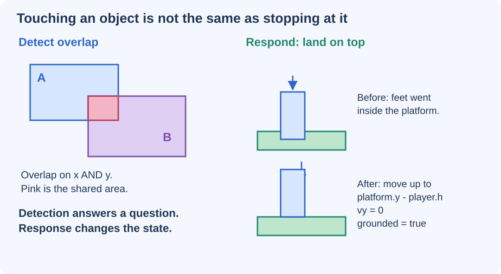

# Make Objects Collide, Stop, and Jump {#sec-ch12}

::: {.chapter-banner}
[GAME LAB 12 | Robot Orchard: movement and platforms]{.game-title}
[Hitboxes]{.skill-chip} [Collision response]{.skill-chip} [Gravity]{.skill-chip} [Jumping]{.skill-chip}
:::

::: {.callout-tip .mission title="Your mission" icon="false"}
Test rectangle and circle collisions, stop a character at a wall, land on a platform, and allow a jump only when the character is grounded.
:::

::: {.callout-note .big-idea title="The big idea" icon="false"}
The artwork helps you see a robot. A simple invisible shape helps the program decide what the robot touches. That shape is its **hitbox** or **collider**.
:::

## Decide what a collision should mean

A robot touches three objects: a wall, a gem, and a bug. The same word, "touch," leads to three different rules. A wall blocks movement. A gem increases the score. A bug costs a life. Start by detecting contact; then choose a response appropriate to the game.

Open **Robot Orchard** from the Game Lab. Press Start, then press **H** or choose **Show hitboxes**. The rectangles and circles are the shapes used by the rules, not decorations. The robot's antenna does not need to collide with a low ceiling just because it appears in the artwork.

## Rectangle against rectangle

An **axis-aligned bounding box**, often shortened to **AABB**, is a rectangle whose edges stay horizontal and vertical. Store its top-left corner and its width and height. Two such rectangles overlap only when their horizontal intervals overlap **and** their vertical intervals overlap.

```javascript
function overlaps(a, b) {
  return a.x < b.x + b.w &&
         a.x + a.w > b.x &&
         a.y < b.y + b.h &&
         a.y + a.h > b.y;
}
```

Imagine `a.x` is 10 and `a.w` is 20. Its right edge is 30. If `b.x` is 35, there is a gap, so the horizontal test fails regardless of the rectangles' heights. This function uses strict comparisons: edges that merely touch are not considered penetrating. This convention helps the character rest exactly on a platform.

AABB is one of the simple shape tests described in [MDN's 2D collision guide](https://developer.mozilla.org/en-US/docs/Games/Techniques/2D_collision_detection). Our response and game rules are built separately from the overlap test.

## Circles need a different question

For two circles, compare the distance between their centers with the sum of their radii. Squared distances avoid a square-root calculation:

```javascript
function circleCircle(a, b) {
  return (a.x - b.x) ** 2 + (a.y - b.y) ** 2 <=
         (a.r + b.r) ** 2;
}
```

For a circle and a rectangle, first find the point inside the rectangle that is closest to the circle's center. Clamp each coordinate to the rectangle's range. Then compare the distance to the circle radius.

```javascript
function circleRect(circle, rect) {
  const nearestX = clamp(circle.x, rect.x, rect.x + rect.w);
  const nearestY = clamp(circle.y, rect.y, rect.y + rect.h);
  return (circle.x - nearestX) ** 2 +
         (circle.y - nearestY) ** 2 <= circle.r ** 2;
}
```

The `clamp` helper is in `games/shared/math.js`. Unlike the strict rectangle test, these circle tests include boundary contact. That is useful for collecting gems when you just touch them. The rule is deliberate; neither boundary convention is automatically right for every game.

## Add gravity and a jump

Our 2D canvas has positive `y` downward. Gravity therefore adds a positive amount to vertical velocity. A jump gives the player a negative vertical velocity, which moves upward.

```javascript
if (command.jump && player.grounded) {
  player.vy = -550;
  player.grounded = false;
}
player.vy = Math.min(player.vy + 1400 * dt, 760);
```

The numbers are game settings, not measurements of a real robot. Gravity has units of pixels per second squared. Maximum falling speed is 760 pixels per second. Adjust one setting at a time, and test whether your platforms are still reachable.

The companion input helper distinguishes **held** input from **just pressed** input. `input.consume("Space")` reads a jump press once. Holding Space should not start a new jump every simulation step.

{#fig-ch12 fig-alt="Two boxes share a pink overlap. A separate before-and-after drawing snaps a player's feet to the platform top and clears downward velocity." width="100%"}

**Read the picture:** The overlap test notices the problem. Landing requires three changes: correct the position, stop downward velocity, and remember that the player is grounded. Changing only the velocity leaves the character partly inside the platform.

## Resolve horizontal and vertical movement separately

Robot Orchard first moves along `x` and corrects wall overlaps. It then moves along `y` and corrects floor or ceiling overlaps. This separates a sideways hit from a landing.

```javascript
// Horizontal part of moveAndCollide:
player.x += player.vx * dt;
for (const wall of solids) {
  if (!overlaps(player, wall)) continue;
  if (player.vx > 0) player.x = wall.x - player.w;
  else if (player.vx < 0) player.x = wall.x + wall.w;
  player.vx = 0;
}
```

The vertical part begins by clearing `grounded`. When downward motion produces an overlap, it sets `player.y = wall.y - player.h`, clears `vy`, and sets `grounded` to `true`. An upward collision instead places the player below the ceiling and does **not** mark it grounded.

See the full `moveAndCollide` function in `games/shared/math.js`. It expects the player to start outside all solid rectangles. A reset position inside a wall breaks that assumption.

::: {.callout-note .advanced-study title="Advanced Study | Why a small step is not a perfect collision engine" icon="false" collapse="false"}
**Tunneling** happens when an object moves completely through a thin obstacle between tests. Neither the old position nor the new position overlaps, so a simple test misses the collision.

Our movement bounds and `1/120`-second steps keep the supplied player's largest downward step about 6.3 pixels, smaller than the supplied 24-pixel platform thickness. This reduces the problem for this particular level. It does not guarantee correctness after arbitrary changes to speed, obstacles, or geometry.

Fast bullets, rotating objects, slopes, and moving platforms need additional methods such as swept collision tests, more substeps, or a physics engine. Axis-separated correction is a useful learning method for our static rectangles, not a replacement for every physics system.
:::

## Make a useful collision test plan

Test the robot landing from above, bumping its head from below, and hitting each side of a platform. Also test walking off an edge: `grounded` must become false. A game that permits jumping while falling has probably kept an old grounded value.

::: {.callout-note .advanced-study title="Advanced Study | Test a rule without drawing anything" icon="false" collapse="false"}
The collision functions take ordinary objects and return values or update coordinates. That makes them testable without opening a canvas. For example, a player with height 30 landing on a platform at `y = 100` should end at `y = 70`.

The package includes `tests/game-logic.test.mjs`. Run `node --test tests/*.test.mjs` from the textbook folder. The tests cover overlap boundaries, circle corners, landing, ceilings, jumping, scoring, and reset behavior. Passing these cases gives evidence about those cases; it is not a proof that every possible level works.
:::

## Make it your own

::: {.callout-tip .challenge title="Level up" icon="false"}
Create a platform that the robot can just reach. Predict how a stronger jump or stronger gravity changes that result, then test it. Add a new gem beside a platform corner and check whether collecting it feels fair with the hitbox display on.
:::

::: {.callout-important .checkpoint title="Explain the collision" icon="false"}
A robot stops falling but remains halfway inside the floor. Which part of collision response is missing? Why must hitting a ceiling not set `grounded = true`?
:::

**Complete companion source:** [Robot Orchard](../games/robot-orchard/index.html), [simulation rules](../games/robot-orchard/world.js), [collision helpers](../games/shared/math.js), and [level data](../games/robot-orchard/level.json).
