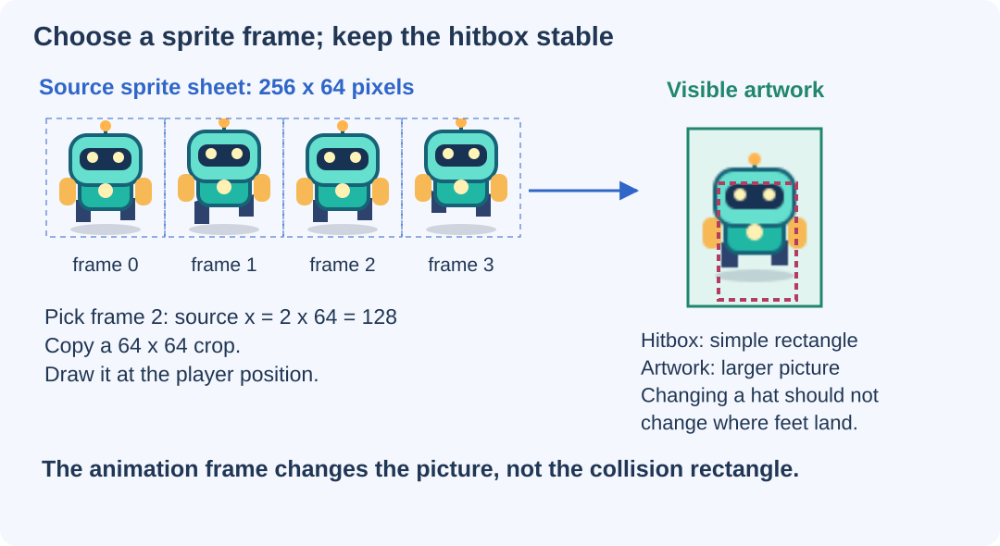

# Give Your 2D Game Its Own Artwork {#sec-ch13}

::: {.chapter-banner}
[GAME LAB 13 | Robot Orchard: sprites and assets]{.game-title}
[Custom assets]{.skill-chip} [Sprite sheets]{.skill-chip} [Loading]{.skill-chip} [Level data]{.skill-chip}
:::

::: {.callout-tip .mission title="Your mission" icon="false"}
Load your own images, animate a sprite sheet, keep artwork separate from collision, and change a level without rewriting its movement code.
:::

::: {.callout-note .big-idea title="The big idea" icon="false"}
An **asset** is something a game uses: a picture, a sound, a model, or level data. Good code lets you change an asset without rebuilding the whole game.
:::

## Meet the original asset pack

Robot Orchard includes an editable robot sprite sheet, a gem, terrain, a bug, a portal, and a background. The files in `games/assets/2d/` were created for this book. SVG files are editable vector artwork; matching PNG files are image exports. The 2D games load the SVG versions, so editing an SVG and reloading the game changes its appearance directly.

The collection sound in `games/assets/audio/collect.wav` was synthesized for this project. The custom 3D models will appear in a later chapter. Permission for reusing these original assets is recorded in `games/assets/ASSET_LICENSE.md`; third-party libraries have their own licenses.

| Asset | Job in Robot Orchard | What you can safely customize first |
| --- | --- | --- |
| `robot-strip.svg` | Four animation frames | Colors, face, antenna, clothing |
| `gem.svg` | Collectible picture | Shape and color inside the image |
| `ground.svg` | Platform and ground surface | Grass, soil, stone, or ice artwork |
| `bug.svg` | Moving hazard picture | Make a robot, beetle, or slime |
| `portal.svg` | Exit picture | Door design and glow |
| `background.svg` | Distant scenery | Sky, hills, clouds, or a space station |

## Load before you draw

Setting an image's `src` starts loading; it does not guarantee that the pixels are ready immediately. Our helper returns a Promise that resolves when loading finishes and rejects when it fails.

```javascript
function loadImage(url) {
  return new Promise((resolve, reject) => {
    const image = new Image();
    image.onload = () => resolve(image);
    image.onerror = () => reject(new Error("Missing image: " + url));
    image.src = url;
  });
}

const robotImage = await loadImage("../assets/2d/robot-strip.svg");
```

The `await` pauses this module's startup until that Promise resolves; it does not freeze the browser interface. Robot Orchard uses `Promise.all` to load several images before starting its loop. If an asset fails, the page displays an error instead of silently showing a broken game.

These paths are relative to the project HTML page. In reusable modules, `new URL("./picture.svg", import.meta.url)` instead makes a path relative to that module file. Decide which base you need instead of guessing.

## Animate by selecting a frame

The robot image has four frames, each 64 pixels wide and 64 pixels high. They sit side by side in a 256-by-64 image. To draw frame 2, start the source crop at `x = 2 * 64`, or 128.

```javascript
const frame = Math.floor(animationTime * 8) % 4;
ctx.drawImage(
  robotImage,
  frame * 64, 0, 64, 64, // source crop in the sprite sheet
  player.x - 10, player.y - 18, 48, 64 // destination on canvas
);
```

The first four numbers after the image select the crop. The next four choose where and how large to draw it. Eight frames per second means the animation advances eight frame selections per second, even if the game draws more often. `% 4` wraps the index through 0, 1, 2, and 3.

This is the nine-argument form of [`drawImage`](https://developer.mozilla.org/en-US/docs/Web/API/CanvasRenderingContext2D/drawImage). It copies part of an image; it does not modify the original file.

{#fig-ch13 fig-alt="Four 64-pixel robot frames, a selected crop, and a separate smaller dashed hitbox inside the visible character." width="100%"}

**Read the picture:** Frame numbers start at zero. The dashed rectangle is the physical body, not the full image. Transparent space, a waving arm, or a decorative antenna should not unexpectedly change where the robot lands.

## Keep an asset contract

An **asset contract** is a small agreement between the artwork and the code. For our robot: four frames, 64-by-64 source cells, the same foot position across frames, and a separate 28-by-42 collision rectangle. Keep that agreement while making your first visual changes.

If you draw a taller robot but keep the original collider, the game may still work but feel strange. If you intentionally change physical size, update the collider and test doorways, platforms, and ceilings too. Appearance-only changes and rule changes are different kinds of edits.

The complete renderer also flips the picture when the player faces left. It uses `ctx.save()`, `translate`, `scale(-1, 1)`, and `restore()` so the transformation does not accidentally flip the entire level.

::: {.callout-note .advanced-study title="Advanced Study | HTML loads the game; Canvas draws the assets" icon="false" collapse="false"}
An HTML `` becomes a page element. An `Image` loaded in JavaScript can instead supply pixels for a canvas without becoming a visible page element. Calling `drawImage` paints the current canvas; it does not add a new HTML node every frame.

Canvas content also does not automatically give each painted sprite its own keyboard control or accessible label. Our controls and status text remain ordinary HTML outside the canvas, while the canvas itself has a label and can receive keyboard focus.

Loading artwork from another site's server can introduce permission and cross-origin restrictions, especially when reading or exporting canvas pixels. Start with the included local assets instead of relying on random image URLs.
:::

## Describe a level with data

Open `games/robot-orchard/level.json`. It stores the spawn position, rectangles, gems, enemies, and goal. A new platform can be described by one object:

```json
{ "x": 240, "y": 386, "w": 144, "h": 24 }
```

That object belongs inside the `solids` array. A gem uses its center position instead:

```json
{ "x": 312, "y": 356 }
```

JSON is data, not JavaScript code. Use double quotes around property names, do not include comments, and do not leave a comma after the last item. Keep a backup before making several changes. A valid JSON file can still describe an impossible level, so syntax checking is only the first test.

## Add sound as an optional reward

A short collection sound reinforces an event. It should play once when the score changes, not continuously while the player stands near a gem. The game leaves sound off until you select the Sound checkbox. It also catches a rejected `play()` Promise so blocked audio does not stop the game.

```javascript
sound.currentTime = 0;
sound.play().catch(() => {
  // Silent play is still valid gameplay.
});
```

::: {.callout-note .advanced-study title="Advanced Study | Asset loading is a small dependency system" icon="false" collapse="false"}
A sprite renderer depends on an image. A level constructor depends on valid level data. A game should not enter its playing state before required dependencies are ready.

For this small project, startup loads everything. A larger game might load only the next level, reuse shared textures, or show progress. Keep fallback behavior intentional: a missing background may be replaceable with a plain color, but a missing level should stop startup with an explanation.

Repeatedly creating `new Image()` inside `draw()` is not an asset-loading strategy. It creates more work every frame. Load once, keep the reference, and draw many times.
:::

## Make it your own

::: {.callout-tip .challenge title="Level up" icon="false"}
Make a space-station version of Robot Orchard. Change the robot color, turn gems into energy crystals, and redraw the ground as metal panels. Keep the movement and colliders unchanged first. Then design one new platform route in `level.json` and test it separately.
:::

::: {.callout-important .checkpoint title="Explain the asset pipeline" icon="false"}
Why should the game wait for an image before drawing it? Your sprite sheet now has six frames instead of four. Which frame-selection number must change, and what source dimensions must you check?
:::

**Editable assets:** [robot sheet](../games/assets/2d/robot-strip.svg), [gem](../games/assets/2d/gem.svg), [background](../games/assets/2d/background.svg), and [asset permissions](../games/assets/ASSET_LICENSE.md). **Complete renderer:** [Robot Orchard main.js](../games/robot-orchard/main.js).
