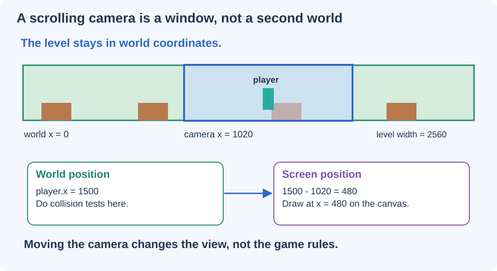

# Finish a Scrolling 2D Adventure {#sec-ch14}

::: {.chapter-banner}
[GAME LAB 14 | Robot Orchard: a complete game]{.game-title}
[Camera]{.skill-chip} [Game states]{.skill-chip} [Scoring]{.skill-chip} [Restart]{.skill-chip}
:::

::: {.callout-tip .mission title="Your mission" icon="false"}
Connect movement, collisions, artwork, camera scrolling, and game rules into one playable adventure. Make winning, losing, pausing, and restarting predictable.
:::

::: {.callout-note .big-idea title="The big idea" icon="false"}
A complete game is not just more effects. It is a collection of rules that agree about what the player is doing, what the world remembers, and when the game ends.
:::

## Name the smallest complete adventure

Robot Orchard has one sentence of rules: **collect ten gems, avoid the bugs and gaps, and reach the portal with at least one life left**. Everything else supports that sentence.

The companion project is a complete reference implementation, not a collection of disconnected fragments. Play it first. Then read `world.js` for rules, `main.js` for drawing and controls, and `level.json` for level design. The shared helpers supply input, the loop, asset loading, and shape tests.

## Keep world coordinates separate from the camera

The level is 2560 pixels wide, but the canvas displays 960 pixels. A camera decides which part you see. It does not move the entire physical world.

```javascript
const cameraX = clamp(
  player.x + player.w / 2 - canvas.width / 2,
  0,
  level.width - canvas.width
);
```

Subtract `cameraX` while drawing. Do not subtract it from the player's stored position or from collision rectangles.

```javascript
ctx.save();
ctx.translate(-cameraX, 0);
drawPlatforms();
drawGems();
drawPlayer();
ctx.restore();
```

The function names here describe drawing responsibilities. The companion `draw()` contains their actual drawing loops. After `restore`, draw interface elements in screen coordinates so a message does not scroll away with the level.

{#fig-ch14 fig-alt="A long level contains a camera window. A world x of 1500 and camera x of 1020 produce screen x 480." width="100%"}

**Read the picture:** The player and terrain keep their world coordinates. Only the drawing position changes. At the left and right ends of the level, clamping stops the camera from showing empty space beyond the level boundary.

## Give each game mode a clear job

The game has five modes: `ready`, `playing`, `paused`, `won`, and `lost`. Drawing can continue in every mode, but movement and collision rules run only in `playing`.

```javascript
function stepWorld(world, command, dt) {
  if (world.mode !== "playing") return;
  // Move, collide, collect, and check game rules.
}
```

The early `return` is a guard. It prevents enemies from moving behind a pause message and stops the player from losing another life after the game is already over.

| Event | State change |
| --- | --- |
| Start or Restart | Fresh world, then `playing` |
| Pause during play | `playing` to `paused` |
| Resume | `paused` to `playing` |
| Last life is lost | `playing` to `lost` |
| All gems collected and portal reached | `playing` to `won` |

Switching to a hidden tab pauses the game. The player resumes intentionally instead of returning to discover that a bug has already taken all three lives.

## Collect a gem only once

A gem has a `collected` flag. Once the player touches it, change the flag and increase the score. Drawing then skips collected gems.

```javascript
if (!gem.collected && circleRect(gem, player)) {
  gem.collected = true;
  world.score++;
}
```

Without that flag, the same overlap could award points every step. Collision can persist over time, but the reward should happen only once.

## Make hazards fair and understandable

A bug patrols between `minX` and `maxX`. On touching the player, it costs a life and sends the robot back to the spawn point. The game keeps already-collected gems and grants a brief immunity period. Falling below the level also costs a life.

Immunity is a number of remaining seconds. Each update reduces it toward zero. While it is positive, another contact does not take another life. The robot flashes so the player can see this temporary rule. This is a design choice; your remix might instead use checkpoints or reset the whole level.

## Finish with a rule, not a picture

Reaching the portal is not enough. The win condition combines two requirements:

```javascript
if (
  world.score === world.gems.length &&
  overlaps(player, world.level.goal)
) {
  world.mode = "won";
}
```

The portal becomes brighter when all gems are collected. The visual feedback comes from the same score condition used by the rule. A glowing door that still refuses entry would confuse the player.

::: {.callout-note .advanced-study title="Advanced Study | Data, rules, and rendering are separate layers" icon="false" collapse="false"}
`level.json` describes a world. `createWorld(level)` creates fresh mutable state from that description. `stepWorld(world, command, dt)` applies rules. `draw()` paints the state.

This separation lets the tests exercise rules without starting a browser. It also allows different artwork to show the same game state. Two visual themes do not need two different collision algorithms.

The supplied platformer uses simple static, axis-aligned platforms. Its moving bugs follow prescribed paths; they are hazards, not general rigid bodies. Sloped terrain, moving platforms that carry riders, and rotating crates would require more collision work than this project currently provides.
:::

## Restart the data, not the browser

Restart creates a new world object. Gem flags, lives, enemy positions, timers, and player velocity return to their starting values. The already-loaded images and existing event listeners are reused.

```javascript
function start() {
  world = createWorld(level);
  world.mode = "playing";
  input.clear();
  canvas.focus();
}
```

A restart is a useful test of your architecture. If the game gets faster after each restart, look for duplicate loops or listeners. If collected gems remain missing, look for reused mutable arrays.

::: {.callout-note .advanced-study title="Advanced Study | Polish includes focus and feedback" icon="false" collapse="false"}
Keyboard input is attached to the focused canvas rather than stealing keys from the whole page. On-screen buttons support basic movement too. When focus or visibility changes, input memory is cleared to avoid a stuck key.

Scores and lives are ordinary HTML text outside the canvas. That makes the status easier to inspect and separates interface text from scene drawing. This does not make the entire visual game fully accessible by itself; different players may still need alternative controls, timing, contrast, or nonvisual descriptions.

Parallax uses a smaller camera offset for the distant background. It changes appearance only. Do not use the background's offset for player collision tests.
:::

## Playtest a complete route

Test a normal win, a loss, a pause during a jump, a restart after losing, and a restart after winning. Inspect each gem location. A gem that looks attractive but is unreachable is a level-design bug. Test the collision rectangles as well as the art.

::: {.callout-tip .challenge title="Level up" icon="false"}
Add a checkpoint after the first gap, create an optional high route with extra rewards, or make an alternate level with the same code. Change one system first, write what you expect to happen, and test that expectation before adding the next feature.
:::

::: {.callout-important .checkpoint title="Explain your finished game" icon="false"}
Why does moving the camera not change whether the player hits a bug? Name three pieces of state that must reset for a new game. Explain why a gem flag is safer than awarding points whenever two shapes overlap.
:::

**Complete project:** [Play Robot Orchard](../games/robot-orchard/index.html). Source: [main.js](../games/robot-orchard/main.js), [world.js](../games/robot-orchard/world.js), and [level.json](../games/robot-orchard/level.json).
