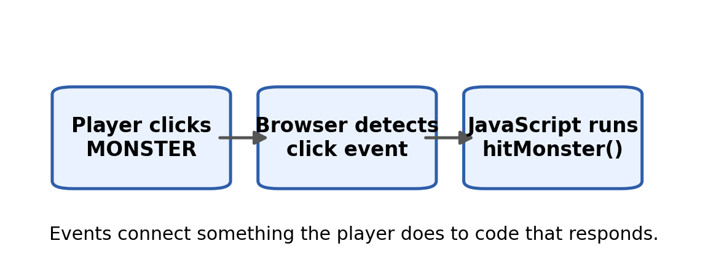
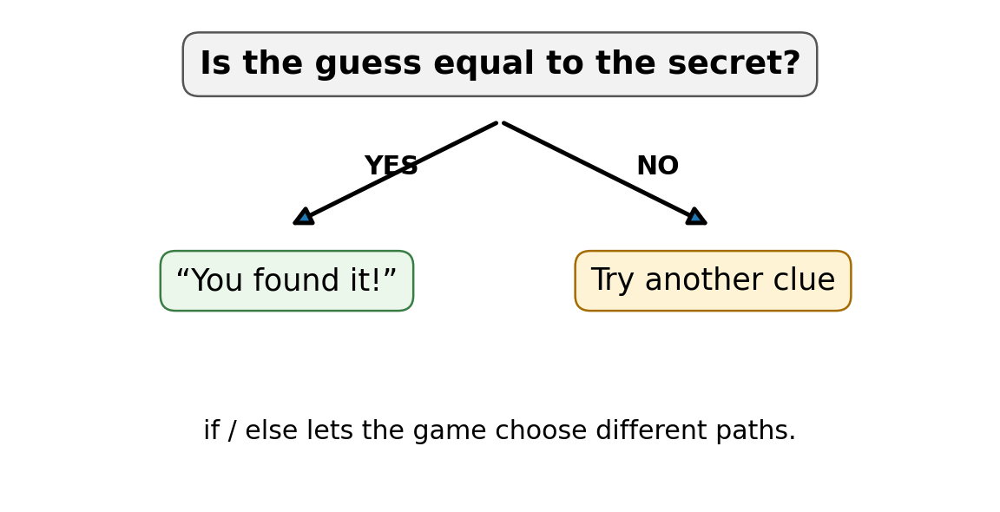
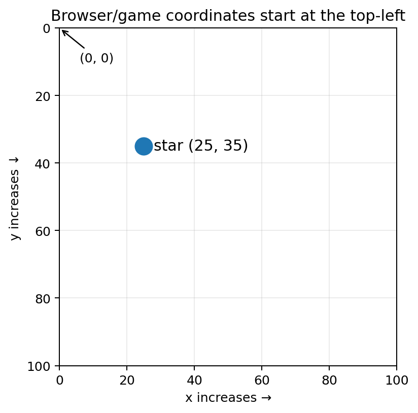
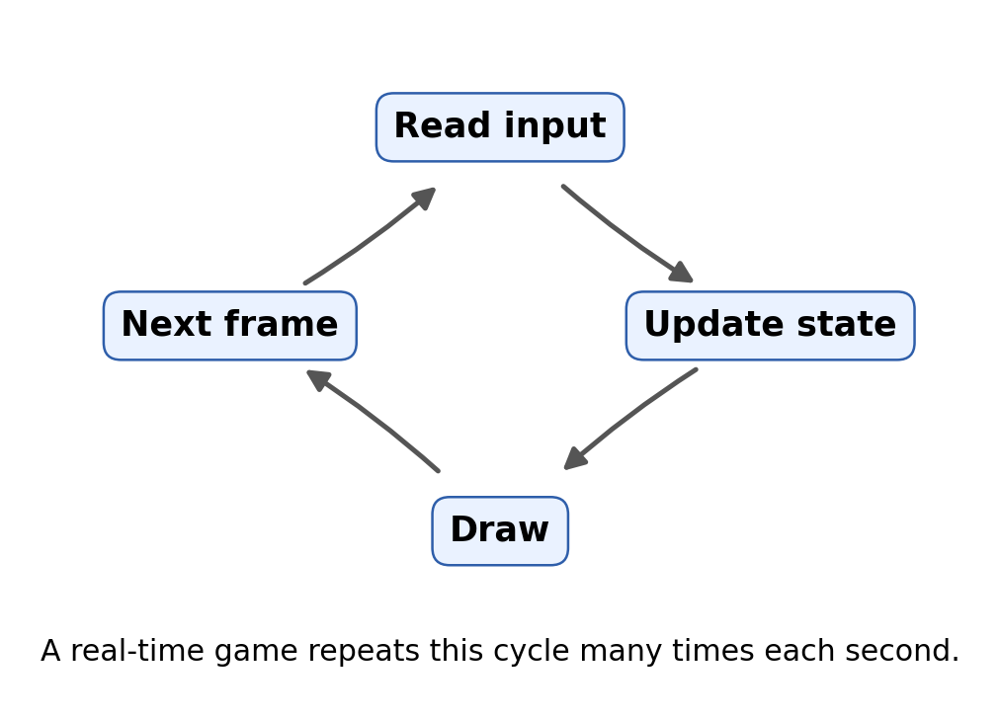
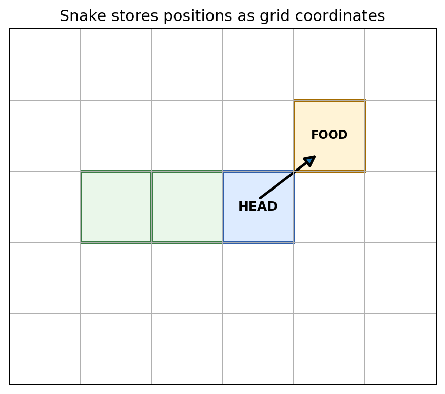
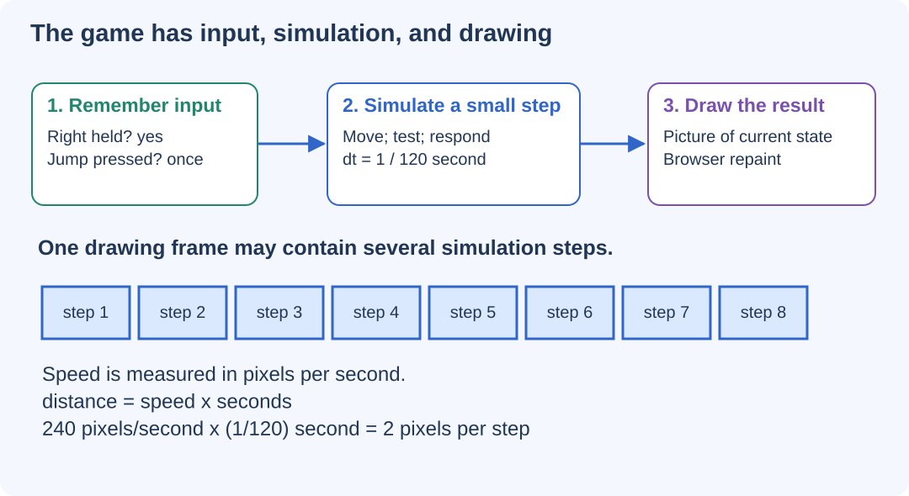
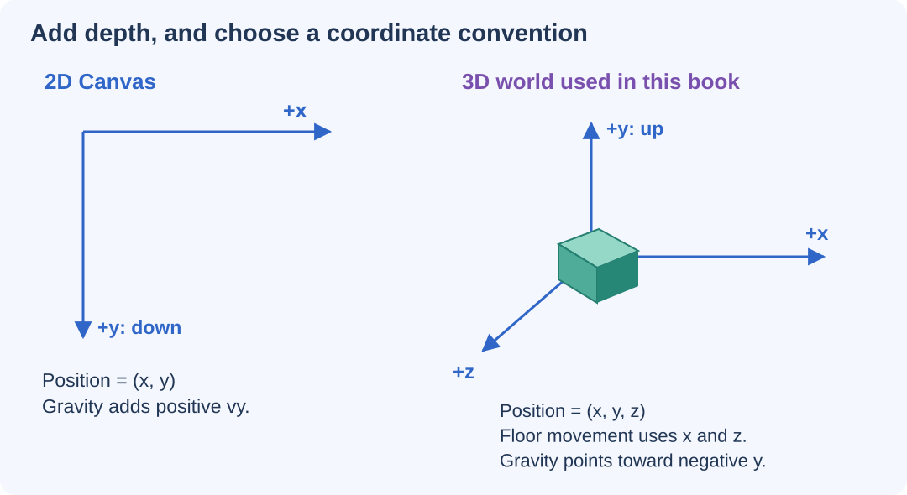
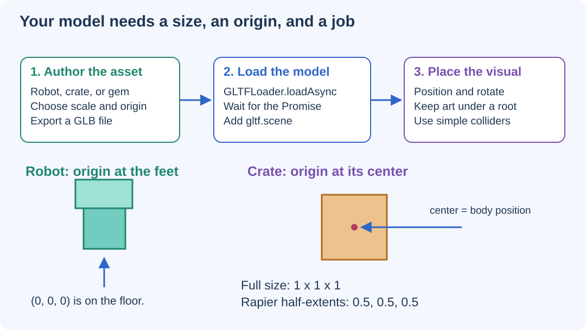
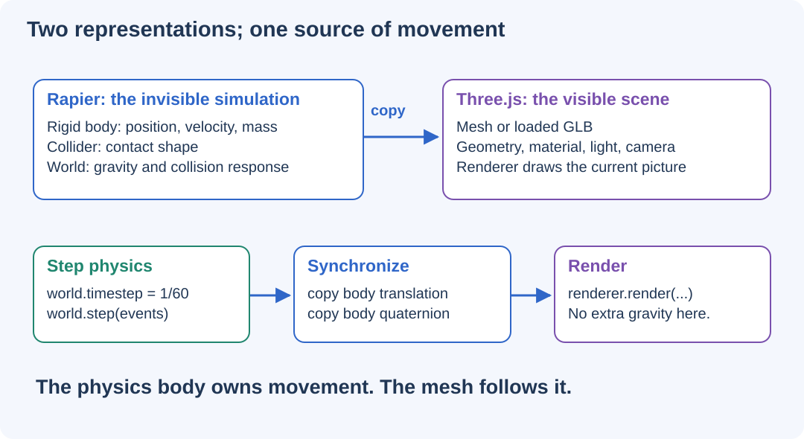
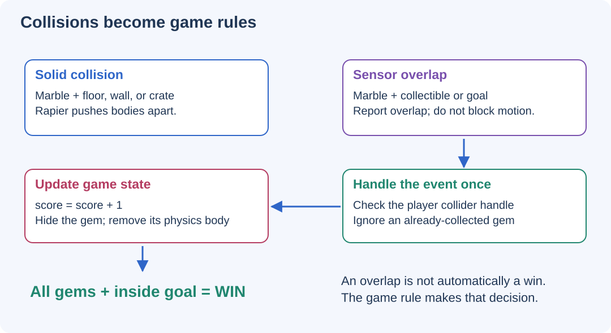

# Welcome, game maker! {.unnumbered #welcome}

::: {.book-hero}

[LEARN BY MAKING]{.eyebrow}

[JavaScript Game Programming for Kids]{.hero-title}

Build a game. Understand the code. Make it your own. Explore 2D and 3D.

[18 chapters]{.hero-chip} [Visual explanations]{.hero-chip} [Advanced Study]{.hero-chip}

:::

This book teaches JavaScript in the order a young game designer needs it. Instead of memorizing programming rules first, you will meet a problem inside a game and learn the programming idea that solves it.

::: {.callout-tip .big-idea title="The rule of this book" icon="false"}

Make something move. Make something react. Make something fun. Then study the code that made it happen.

:::

## Choose your reading path {.unnumbered}

Follow the main explanations and code examples first. Use the diagrams to trace what the program is doing. Then try a challenge and explain your result in your own words.

Chapters 1-10 establish the foundations. Chapters 11-14 build a complete 2D adventure. Chapters 15-18 introduce Three.js, custom 3D models, and Rapier physics. The later projects take more time and combine earlier ideas; work through them in small experiments.

Purple **Advanced Study** blocks are optional deeper dives into HTML, CSS, JavaScript, and game systems. They start open; you can collapse them while following the main path and return later.

:::: {.legend-grid}

::: {.legend-item .legend-blue}
**Understand**

Blue blocks introduce the big idea.
:::

::: {.legend-item .legend-green}
**Build**

Green blocks hold your mission and challenges.
:::

::: {.legend-item .legend-purple}
**Go deeper**

Purple blocks explain what happens underneath.
:::

::: {.legend-item .legend-rose}
**Explain**

Rose blocks help you check your understanding.
:::

::::

## What you need {.unnumbered}

- A modern web browser such as Chrome, Edge, Firefox, or Safari.
- A plain-text code editor available on your computer.
- A folder for each game containing an HTML file. Early examples keep HTML and JavaScript together so you can focus on the programming ideas.

::: {.callout-tip .setup title="Start with one file" icon="false"}

Create a folder named `my-first-game`. Save your complete HTML example as `index.html`, not `index.html.txt`. Open it in your browser. After editing, save the file and refresh the browser. Later, module-based projects need a local development server.

:::

## Read examples carefully {.unnumbered}

A **complete example** includes the setup for that small project. A **code fragment** illustrates one part of a game and relies on the variables or functions discussed nearby. Do not paste every fragment into one file without checking where it belongs: some examples replace earlier versions.

Chapters 7-9 use Pong, Breakout, and Snake to explain larger game-building patterns. Their snippets are building blocks rather than full finished games. Chapters 11-18 add complete companion projects in the Game Lab. Their chapter snippets explain selected parts; the linked project folders contain the complete runnable source.

## A safe learning habit {.unnumbered}

When a program does not work, do not immediately replace it with someone else's code. Read the browser console, compare one small section at a time, and explain what you expected to happen. Debugging is part of programming, not evidence that you failed.

## Your game-making journey {.unnumbered}

| Chapter | Game | Coding ideas | Your new ability |
| --- | --- | --- | --- |
| 1 | [Click the Monster](#sec-ch01) | Events, functions | Make code react to a click |
| 2 | [Treasure Clicker](#sec-ch02) | Variables, text updates | Make the game remember |
| 3 | [Secret Number](#sec-ch03) | Input, if/else | Make the game choose |
| 4 | [Rock Paper Scissors](#sec-ch04) | Functions, random numbers | Package behavior into reusable actions |
| 5 | [Catch the Star](#sec-ch05) | Timers, coordinates, DOM | Change the page over time |
| 6 | [Bouncing Ball](#sec-ch06) | Canvas, animation | Draw every frame yourself |
| 7 | [Pong](#sec-ch07) | Keyboard, game loop | Read keys while the game keeps running |
| 8 | [Breakout](#sec-ch08) | Arrays, collision | Manage many objects |
| 9 | [Snake](#sec-ch09) | Grid logic, state | Update a world one step at a time |
| 10 | [Game Studio](#sec-ch10) | Planning, polish, final project | Design your own rules |
| 11 | [Collision Playground](#sec-ch11) | Input, velocity, fixed steps | Build a predictable real-time loop |
| 12 | [Platforms and jumping](#sec-ch12) | Hitboxes, collision response, gravity | Stop at walls and land on platforms |
| 13 | [Your own 2D artwork](#sec-ch13) | Sprite sheets, loading, JSON levels | Make the game look like your design |
| 14 | [Robot Orchard](#sec-ch14) | Scrolling, enemies, goals, restart | Finish a complete 2D adventure |
| 15 | [Robot Island Explorer](#sec-ch15) | Scene, camera, renderer, 3D movement | Build and explore a 3D world |
| 16 | [3D Asset Workshop](#sec-ch16) | GLB models, origins, materials | Customize and import 3D artwork |
| 17 | [Rapier Drop Lab](#sec-ch17) | Bodies, colliders, bounce, fixed steps | Connect physics to the picture |
| 18 | [Marble Quest](#sec-ch18) | Forces, sensors, scoring, respawn | Finish a 3D physics game |

## Open the Game Lab {.unnumbered}

The companion Game Lab contains six complete projects, including two experimental labs, two collectible adventures, a 3D exploration game, and a model-customization workshop. Keep the project folders together so their shared code and assets can be found.

::: {.callout-tip .setup title="Run the later projects" icon="false"}
From the extracted textbook folder, run `node scripts/serve.mjs`. Open `http://127.0.0.1:8000/games/` in your browser. This local server needs Node.js but no package installation. Use the [Game Lab guide](#sec-game-lab) for controls, file locations, and troubleshooting.

The 2D projects use local files only. The 3D projects initially download pinned Three.js and Rapier modules from a CDN, so they need an internet connection and a browser with WebGL2. An optional dependency-download script supports later offline use.
:::

# Make the Page React {#sec-ch01}

::: {.chapter-banner}

[GAME 01 | Click the Monster]{.game-title}

[Events]{.skill-chip} [Functions]{.skill-chip} [HTML]{.skill-chip}

:::

::: {.callout-tip .mission title="Your mission" icon="false"}

By the end of this chapter, you can:

- connect JavaScript to a button
- write and call a function
- respond to a click event

:::

::: {.callout-note .big-idea title="The big idea" icon="false"}

A game begins when the player does something and the program reacts. In the browser, those actions are called events.

:::

## Your first game screen

We will start with one HTML file. The button is our monster. When the player clicks it, JavaScript runs a function.

{#fig-ch01 fig-alt="A player clicks the monster button, the browser detects a click event, and JavaScript calls hitMonster." width="100%"}

**Read the picture:** Follow the arrows from left to right. The player creates the event; the browser notices it; the registered function supplies the response. Registering a listener does not run the function immediately.

```html
<!doctype html>
<html>
<body>
  <h1>Click the Monster!</h1>
  <button id="monster">👾 Monster</button>
  <script>
    // JavaScript goes here
  </script>
</body>
</html>
```

## A function is an action you can name

A function groups instructions. The function below has a name: `hitMonster`. Nothing inside it runs until the function is called.

```javascript
function hitMonster() {
  alert("You hit the monster!");
}
```

## Connect the click to the function

The browser can listen for events. `addEventListener` tells an element what kind of event to watch for and which function should run.

```javascript
const monster = document.getElementById("monster");
monster.addEventListener("click", hitMonster);
```

## Build the complete game

Put the pieces together. Type the code yourself if you can; typing helps your brain notice punctuation, spelling, and structure.

[COMPLETE EXAMPLE]{.code-label}

```html
<!doctype html>
<html>
<body>
  <h1>Click the Monster!</h1>
  <button id="monster">👾 Monster</button>
  <p id="message">Can you catch it?</p>

  <script>
    const monster = document.getElementById("monster");
    const message = document.getElementById("message");

    function hitMonster() {
      message.textContent = "Great hit!";
    }

    monster.addEventListener("click", hitMonster);
  </script>
</body>
</html>
```

::: {.callout-note .advanced-study title="Advanced Study | HTML elements and the DOM" icon="false" collapse="false"}

[OPTIONAL DEEPER DIVE]{.study-badge}

HTML gives the browser a structure. JavaScript does not usually change the HTML file itself while the game is running; it changes the browser’s in-memory representation called the DOM. `getElementById()` returns one DOM element, and `addEventListener()` attaches behavior without mixing JavaScript directly into the HTML tag.

```javascript
const monster = document.getElementById('monster');
monster.addEventListener('click', hitMonster);
```

**HTML and JavaScript have different jobs.** In `<button id="monster">Monster</button>`, `button` identifies the kind of element, `id` gives it a unique name on this page, and the text between the tags becomes its label. The JavaScript lookup must match that ID exactly.

**Why is the script at the bottom?** The browser reaches the button before the script tries to find it. Keep that order. If the lookup finds nothing, it returns `null`.

**Function name or function call?** Pass `hitMonster` to the listener so the browser can call it later. Writing `hitMonster()` calls it immediately.

:::

## Level-up challenges

::: {.callout-tip .challenge title="Challenge 1" icon="false"}

Change the monster button into a dragon or robot.

:::

::: {.callout-tip .challenge title="Challenge 2" icon="false"}

Add a second button with a different function and message.

:::

## Checkpoint

::: {.callout-important .checkpoint title="Explain it in your own words" icon="false"}

What new JavaScript idea made the Click the Monster game possible? Point to one line of code and explain what would change if you removed it.

:::

# Teach the Game to Remember {#sec-ch02}

::: {.chapter-banner}

[GAME 02 | Treasure Clicker]{.game-title}

[Variables]{.skill-chip} [Strings]{.skill-chip} [DOM]{.skill-chip}

:::

::: {.callout-tip .mission title="Your mission" icon="false"}

By the end of this chapter, you can:

- create variables with let and `const`
- change a variable
- show a value on the page

:::

::: {.callout-note .big-idea title="The big idea" icon="false"}

A score is memory. The game needs a place to store a number and change it after each successful action.

:::

## Variables are labeled storage

Use let when a value will change. Use `const` when the variable should keep referring to the same thing.

{#fig-ch02 fig-alt="The variable score refers to 7. Executing score equals score plus 1 replaces 7 with 8." width="100%"}

**Read the picture:** First read the old value, 7. Add 1 to get 8. Finally, assign 8 back to `score`. The label stays the same while the value changes.

```javascript
let score = 0;
const treasure = document.getElementById("treasure");
```

## Updating the score

The assignment operator = stores a new value. `score = score + 1` means: take the old score, add one, and store the result back into score.

```javascript
function collectTreasure() {
  score = score + 1;
  scoreText.textContent = "Score: " + score;
}
```

## Strings and numbers

Text inside quotes is a string. A score such as 7 is a number. JavaScript can join text and a number with + when text is involved.

```javascript
let playerName = "Maya";
let score = 7;
message.textContent = playerName + " has " + score + " gems!";
```

## Build the complete game

Put the pieces together. Type the code yourself if you can; typing helps your brain notice punctuation, spelling, and structure.

[COMPLETE EXAMPLE]{.code-label}

```html
<!doctype html>
<html>
<body>
  <h1>Treasure Clicker</h1>
  <button id="treasure">💎 Collect treasure</button>
  <p id="score">Score: 0</p>

  <script>
    let score = 0;
    const treasure = document.getElementById("treasure");
    const scoreText = document.getElementById("score");

    function collectTreasure() {
      score = score + 1;
      scoreText.textContent = "Score: " + score;
    }

    treasure.addEventListener("click", collectTreasure);
  </script>
</body>
</html>
```

::: {.callout-note .advanced-study title="Advanced Study | let, const, scope, and types" icon="false" collapse="false"}

[OPTIONAL DEEPER DIVE]{.study-badge}

Use `const` when a name should not be reassigned and let when the stored value needs to change. JavaScript is dynamically typed: a variable is not permanently locked to one type. For beginning games, keep each variable consistent—scores stay numbers, names stay strings, and element references stay DOM objects.

```javascript
let score = 0;
const scoreLabel = document.getElementById('score');
scoreLabel.textContent = score;
```

**A constant is not a frozen object.** `const scoreLabel` keeps the same element reference, but `scoreLabel.textContent` can still change. What cannot change is which element the name refers to.

**Scope means where a name is available.** A `let` or `const` declared inside block braces is available within that block, not everywhere. Our score lives outside the click function so repeated clicks share it.

**Predict before running:** How do `7 + 1` and `"7" + 1` differ? The first adds numbers; the second joins text.

:::

## Level-up challenges

::: {.callout-tip .challenge title="Challenge 1" icon="false"}

Make each treasure worth 5 points.

:::

::: {.callout-tip .challenge title="Challenge 2" icon="false"}

Add a “spend 10 points” button. Only worry about subtracting for now; Chapter 3 will teach you how to prevent negative scores.

:::

## Checkpoint

::: {.callout-important .checkpoint title="Explain it in your own words" icon="false"}

What new JavaScript idea made the Treasure Clicker game possible? Point to one line of code and explain what would change if you removed it.

:::

# Let the Game Make Decisions {#sec-ch03}

::: {.chapter-banner}

[GAME 03 | Secret Number]{.game-title}

[Input]{.skill-chip} [Decisions]{.skill-chip} [Comparisons]{.skill-chip}

:::

::: {.callout-tip .mission title="Your mission" icon="false"}

By the end of this chapter, you can:

- read a player value
- compare values
- use if, `else if`, and `else`

:::

::: {.callout-note .big-idea title="The big idea" icon="false"}

Games constantly ask questions: Did the player touch the enemy? Is the timer finished? Is this guess too high? An if statement lets code choose what happens next.

:::

## Read input

The value property reads what a player typed. `Number(...)` converts text such as "7" into the number 7.

{#fig-ch03 fig-alt="A decision branches on whether a guess equals the secret. Yes gives success; no asks for another clue." width="100%"}

**Read the picture:** A condition chooses one path. In our game, the first check is equality. Only when it is false do the later checks decide between too low and too high.

```javascript
const guessBox = document.getElementById("guess");
const guess = Number(guessBox.value);
```

## Ask a yes/no question

A comparison produces `true` or `false`. `===` asks whether two values are equal in both value and type.

```javascript
if (guess === secret) {
  message.textContent = "You found it!";
}
```

## More than two choices

`else if` lets the program check another condition when the first one was `false`.

```javascript
if (guess === secret) {
  message.textContent = "Correct!";
} else if (guess < secret) {
  message.textContent = "Too low!";
} else {
  message.textContent = "Too high!";
}
```

## Build the complete game

Put the pieces together. Type the code yourself if you can; typing helps your brain notice punctuation, spelling, and structure.

[COMPLETE EXAMPLE]{.code-label}

```html
<!doctype html>
<html>
<body>
  <h1>Secret Number</h1>
  <input id="guess" type="number" min="1" max="10">
  <button id="check">Check</button>
  <p id="message">Guess a number from 1 to 10.</p>

  <script>
    const secret = Math.floor(Math.random() * 10) + 1;
    const guessBox = document.getElementById("guess");
    const message = document.getElementById("message");

    document.getElementById("check").addEventListener("click", function () {
      const guess = Number(guessBox.value);
      if (guess === secret) {
        message.textContent = "Correct!";
      } else if (guess < secret) {
        message.textContent = "Too low!";
      } else {
        message.textContent = "Too high!";
      }
    });
  </script>
</body>
</html>
```

::: {.callout-note .advanced-study title="Advanced Study | How comparisons really work" icon="false" collapse="false"}

[OPTIONAL DEEPER DIVE]{.study-badge}

Conditions are expressions that become `true` or `false`. Prefer `===` over `==` because `===` compares both value and type. `Number(input.value)` converts typed text into a number before comparison. You can combine conditions with `&&` (AND), `||` (OR), and ! (NOT).

```javascript
if (guess >= 1 && guess <= 10) {
  // valid range
}
```

**HTML constraints are not the whole game rule.** `type="number"`, `min`, and `max` describe an input and its validity constraints, but our custom click handler still needs to check the value. An empty string becomes `0` when passed to `Number()`.

For a stricter version, place this guard inside the handler before comparing with `secret`:

```javascript
const raw = guessBox.value.trim();
const guess = Number(raw);
if (raw === "" || !Number.isInteger(guess) ||
    guess < 1 || guess > 10) {
  message.textContent = "Enter a whole number from 1 to 10.";
  return;
}
```

Replace the original `const guess` line rather than declaring it twice. `return` exits this handler early.

Further reading: [MDN: number inputs and validation](https://developer.mozilla.org/en-US/docs/Web/HTML/Reference/Elements/input/number).

:::

## Level-up challenges

::: {.callout-tip .challenge title="Challenge 1" icon="false"}

Count how many guesses the player uses.

:::

::: {.callout-tip .challenge title="Challenge 2" icon="false"}

Add a rule: after 5 guesses, show the secret number.

:::

## Checkpoint

::: {.callout-important .checkpoint title="Explain it in your own words" icon="false"}

What new JavaScript idea made the Secret Number game possible? Point to one line of code and explain what would change if you removed it.

:::

# Create Reusable Game Actions {#sec-ch04}

::: {.chapter-banner}

[GAME 04 | Rock Paper Scissors]{.game-title}

[Parameters]{.skill-chip} [Return values]{.skill-chip} [Randomness]{.skill-chip}

:::

::: {.callout-note .code-guide title="How to use the code pieces" icon="false"}

This chapter develops parts of a larger game. These short examples are **code fragments**, not a complete HTML file. Read the surrounding explanations and combine the pieces with the screen, setup, and game-loop ideas from earlier chapters.

:::

::: {.callout-tip .mission title="Your mission" icon="false"}

By the end of this chapter, you can:

- use function parameters and return values
- generate a random choice
- break a problem into small functions

:::

::: {.callout-note .big-idea title="The big idea" icon="false"}

As games grow, one giant function becomes difficult to understand. Small functions let us name behaviors such as `chooseComputerMove` and `decideWinner`.

:::

## A function can receive information

A parameter is a local name for information passed into a function.

{#fig-ch04 fig-alt="A simplified diagram sends a move into a function that compares rules and returns a result." width="100%"}

**Read the picture:** A function receives information, performs work, and may return a result. This is a simplified picture: our actual `decideWinner(player, computer)` function needs **both** moves. The player choosing rock alone does not determine a winner.

```javascript
function cheer(playerName) {
  return "Go, " + playerName + "!";
}

const message = cheer("Ari");
```

## Make a random computer choice

`Math.random()` gives a value from 0 up to (but not including) 1. We can turn it into one of three choices.

```javascript
function computerChoice() {
  const choices = ["rock", "paper", "scissors"];
  const index = Math.floor(Math.random() * 3);
  return choices[index];
}
```

## Decide a winner

The rule function compares the player move with the computer move and returns a result.

```javascript
function decideWinner(player, computer) {
  if (player === computer) return "Tie!";

  if (
    (player === "rock" && computer === "scissors") ||
    (player === "paper" && computer === "rock") ||
    (player === "scissors" && computer === "paper")
  ) {
    return "You win!";
  }
  return "Computer wins!";
}
```

::: {.callout-note .advanced-study title="Advanced Study | Parameters, return values, and local scope" icon="false" collapse="false"}

[OPTIONAL DEEPER DIVE]{.study-badge}

Parameters exist only inside the function call. A return value sends information back to the caller. This makes functions easier to test because the same function can work with different inputs and produce a result instead of depending on hidden global variables.

```javascript
function beats(a, b) {
  return (a === 'rock' && b === 'scissors');
}
const result = beats('rock', 'scissors');
```

**Argument or parameter?** In `beats("rock", "scissors")`, the strings are arguments: actual values supplied to the function. Inside the function, `a` and `b` are parameter names referring to those values during this call.

**Returning is not displaying.** `return` sends a value to the caller and ends this function call. The caller chooses whether to save it, display it, or use it in another decision.

The small `beats` example checks only rock against scissors. Use `decideWinner` for the complete three-move rules.

:::

## Level-up challenges

::: {.callout-tip .challenge title="Challenge 1" icon="false"}

Add emoji to the result message.

:::

::: {.callout-tip .challenge title="Challenge 2" icon="false"}

Track player wins and computer wins.

:::

::: {.callout-tip .challenge title="Challenge 3" icon="false"}

Invent a fourth move and decide what it beats. Notice how the rule logic becomes more complicated.

:::

## Checkpoint

::: {.callout-important .checkpoint title="Explain it in your own words" icon="false"}

What new JavaScript idea made the Rock Paper Scissors game possible? Point to one line of code and explain what would change if you removed it.

:::

# Make Things Change Over Time {#sec-ch05}

::: {.chapter-banner}

[GAME 05 | Catch the Star]{.game-title}

[Timers]{.skill-chip} [Coordinates]{.skill-chip} [CSS]{.skill-chip}

:::

::: {.callout-tip .mission title="Your mission" icon="false"}

By the end of this chapter, you can:

- use CSS position values from JavaScript
- use random coordinates
- use `setInterval` and `clearInterval`

:::

::: {.callout-note .big-idea title="The big idea" icon="false"}

A moving game world changes even when the player is not clicking. Timers let JavaScript run an action again and again.

:::

## Move an element

An absolutely positioned element can be moved by changing its left and top CSS properties.

{#fig-ch05 fig-alt="A coordinate plane starts at the top left. The x axis increases rightward and y increases downward; the star is at 25,35." width="100%"}

**Read the picture:** Start at the top-left corner. Move 25 units right and 35 units down to reach the star. These are example coordinates, not fixed limits for your game; use the size of your own game area.

```javascript
star.style.left = "120px";
star.style.top = "80px";
```

## Pick a random position

A helper function makes the star jump to a new place.

```javascript
function moveStar() {
  const x = Math.floor(Math.random() * 280);
  const y = Math.floor(Math.random() * 180);
  star.style.left = x + "px";
  star.style.top = y + "px";
}
```

## Repeat an action with a timer

`setInterval` calls a function repeatedly. The number is milliseconds, so 1000 means one second.

```javascript
const timerId = setInterval(moveStar, 1000);

// Later, when the game ends:
clearInterval(timerId);
```

## Build the complete game

Put the pieces together. Type the code yourself if you can; typing helps your brain notice punctuation, spelling, and structure.

[COMPLETE EXAMPLE]{.code-label}

```html
<!doctype html>
<html>
<head>
<style>
  #game { position: relative; width: 340px; height: 240px; border: 2px solid #333; }
  #star { position: absolute; font-size: 36px; cursor: pointer; }
</style>
</head>
<body>
  <h1>Catch the Star</h1>
  <p id="score">Score: 0</p>
  <div id="game"><span id="star">⭐</span></div>
<script>
  let score = 0;
  const star = document.getElementById("star");
  const scoreText = document.getElementById("score");

  function moveStar() {
    const x = Math.floor(Math.random() * 280);
    const y = Math.floor(Math.random() * 180);
    star.style.left = x + "px";
    star.style.top = y + "px";
  }

  star.addEventListener("click", function () {
    score++;
    scoreText.textContent = "Score: " + score;
    moveStar();
  });

  moveStar();
  setInterval(moveStar, 1000);
</script>
</body>
</html>
```

::: {.callout-note .advanced-study title="Advanced Study | CSS positioning and browser coordinates" icon="false" collapse="false"}

[OPTIONAL DEEPER DIVE]{.study-badge}

For positioned HTML elements, left controls horizontal position and top controls vertical position. In browser coordinates, (0,0) is normally the top-left of the containing area, x increases to the right, and y increases downward. Element sizes matter when keeping an object inside the game area.

```javascript
star.style.left = x + 'px';
star.style.top = y + 'px';
```

**Which box do the coordinates belong to?** `#game { position: relative; }` makes the game area the containing block for the absolutely positioned star. Its offsets are measured from that area, not automatically from the entire page.

**Keep the whole object inside.** The largest useful x offset is approximately the game width minus the star width. The same idea applies to height.

**One timer is enough.** Keep the ID returned by `setInterval()` when you need to stop or replace it. Clearing a timer stops scheduled moves, not the separate click listener.

:::

## Level-up challenges

::: {.callout-tip .challenge title="Challenge 1" icon="false"}

Make the star move faster after the player reaches 5 points.

:::

::: {.callout-tip .challenge title="Challenge 2" icon="false"}

Add a 20-second countdown and stop the game when time reaches zero.

:::

## Checkpoint

::: {.callout-important .checkpoint title="Explain it in your own words" icon="false"}

What new JavaScript idea made the Catch the Star game possible? Point to one line of code and explain what would change if you removed it.

:::

# Draw Your Own Game World {#sec-ch06}

::: {.chapter-banner}

[GAME 06 | Bouncing Ball]{.game-title}

[Canvas]{.skill-chip} [Animation]{.skill-chip} [Velocity]{.skill-chip}

:::

::: {.callout-tip .mission title="Your mission" icon="false"}

By the end of this chapter, you can:

- create a canvas
- draw shapes with a 2D context
- animate with `requestAnimationFrame`

:::

::: {.callout-note .big-idea title="The big idea" icon="false"}

Canvas is different from ordinary HTML. Instead of moving page elements, your code redraws the game world frame after frame.

:::

## Meet canvas

The canvas element is a rectangular drawing surface. JavaScript asks it for a 2D drawing context.

{#fig-ch06 fig-alt="A cycle connects read input, update state, draw, and next frame." width="100%"}

**Read the picture:** Each frame is one trip around the cycle. Bouncing Ball has no keyboard input yet, so it begins by updating position. The next chapter adds player input before movement.

```javascript
const canvas = document.getElementById("game");
const ctx = canvas.getContext("2d");
```

## Draw a ball

A circle is an arc that goes all the way around.

```javascript
ctx.beginPath();
ctx.arc(x, y, 15, 0, Math.PI * 2);
ctx.fill();
```

## Animation is update + draw + repeat

Each frame changes the position, clears the old picture, draws the new picture, and asks the browser for another frame.

```javascript
function loop() {
  x = x + dx;
  y = y + dy;

  ctx.clearRect(0, 0, canvas.width, canvas.height);
  drawBall();

  requestAnimationFrame(loop);
}
```

## Bounce at the edges

Reverse a velocity when the ball reaches a wall.

```javascript
if (x < radius || x > canvas.width - radius) {
  dx = -dx;
}
if (y < radius || y > canvas.height - radius) {
  dy = -dy;
}
```

## Build the complete game

Put the pieces together. Type the code yourself if you can; typing helps your brain notice punctuation, spelling, and structure.

[COMPLETE EXAMPLE]{.code-label}

```html
<canvas id="game" width="500" height="300"></canvas>
<script>
const canvas = document.getElementById("game");
const ctx = canvas.getContext("2d");
let x = 100, y = 80;
let dx = 3, dy = 2;
const radius = 15;

function drawBall() {
  ctx.beginPath();
  ctx.arc(x, y, radius, 0, Math.PI * 2);
  ctx.fill();
}

function loop() {
  x += dx;
  y += dy;
  if (x < radius || x > canvas.width - radius) dx = -dx;
  if (y < radius || y > canvas.height - radius) dy = -dy;
  ctx.clearRect(0, 0, canvas.width, canvas.height);
  drawBall();
  requestAnimationFrame(loop);
}
loop();
</script>
```

::: {.callout-note .advanced-study title="Advanced Study | requestAnimationFrame and frame time" icon="false" collapse="false"}

[OPTIONAL DEEPER DIVE]{.study-badge}

`requestAnimationFrame` asks the browser to run your animation code before the next repaint. Real games should not assume every computer draws the same number of frames per second. Advanced games use the timestamp passed to the callback to calculate delta time so motion depends on elapsed time, not frame count.

```javascript
let previousTime;
function loop(time) {
  const dt = previousTime === undefined
    ? 0
    : (time - previousTime) / 1000;
  previousTime = time;
  update(dt); // Speeds are in pixels per second.
  draw();
  requestAnimationFrame(loop);
}
requestAnimationFrame(loop);
```

**The timestamp is not the time since the last frame.** Subtract the previous timestamp and divide milliseconds by 1000 to get seconds. A speed of 180 pixels per second moves about 3 pixels in a 1/60-second frame.

This is a timing pattern, not a second loop to add beside the existing one. Supply your own `update(dt)` and `draw()` functions. Start the pattern with `requestAnimationFrame(loop)`. A more robust game should also handle a long pause, for example by resetting its previous timestamp when resuming.

Further reading: [MDN: requestAnimationFrame](https://developer.mozilla.org/en-US/docs/Web/API/Window/requestAnimationFrame).

:::

## Level-up challenges

::: {.callout-tip .challenge title="Challenge 1" icon="false"}

Change the ball speed. What values feel playable?

:::

::: {.callout-tip .challenge title="Challenge 2" icon="false"}

Add a second ball with its own position and velocity.

:::

## Checkpoint

::: {.callout-important .checkpoint title="Explain it in your own words" icon="false"}

What new JavaScript idea made the Bouncing Ball game possible? Point to one line of code and explain what would change if you removed it.

:::

# Control a Real-Time Game {#sec-ch07}

::: {.chapter-banner}

[GAME 07 | Pong]{.game-title}

[Keyboard input]{.skill-chip} [State]{.skill-chip} [Collision]{.skill-chip}

:::

::: {.callout-note .code-guide title="How to use the code pieces" icon="false"}

This chapter develops parts of a larger game. These short examples are **code fragments**, not a complete HTML file. Read the surrounding explanations and combine the pieces with the screen, setup, and game-loop ideas from earlier chapters.

:::

::: {.callout-tip .mission title="Your mission" icon="false"}

By the end of this chapter, you can:

- track pressed keys
- move a paddle every frame
- detect simple rectangle/ball collisions

:::

::: {.callout-note .big-idea title="The big idea" icon="false"}

In a real-time game, a key press should change what happens during the next frames. Instead of moving once per key event, we remember which keys are held down.

:::

## Remember key state

`keydown` sets a state to `true`. `keyup` changes it back to `false`.

{#fig-ch07 fig-alt="Keydown sets a pressed flag to true, keyup sets it to false, and the game loop uses the flag." width="100%"}

**Read the picture:** An event changes a remembered value. The loop can then read that value on many frames. The picture uses a right-arrow flag; Pong uses the same idea for the up and down arrows.

```javascript
const keys = {};

window.addEventListener("keydown", e => {
  keys[e.key] = true;
});
window.addEventListener("keyup", e => {
  keys[e.key] = false;
});
```

## Move during the update

The game loop checks the state every frame.

```javascript
if (keys["ArrowUp"]) paddleY -= 5;
if (keys["ArrowDown"]) paddleY += 5;
```

## Keep the paddle on the screen

`Math.max` and `Math.min` can clamp a value inside a range.

```javascript
paddleY = Math.max(0, paddleY);
paddleY = Math.min(canvas.height - paddleH, paddleY);
```

## Paddle collision idea

For a first Pong game, place a vertical paddle on the right. Here, paddleX and paddleY are its top-left coordinates, paddleW and paddleH are its size, and positive dx means the ball is moving right. Test the ball bounding box against the paddle before reversing direction.

```javascript
const overlapsPaddle = (
  ballX + radius >= paddleX &&
  ballX - radius <= paddleX + paddleW &&
  ballY + radius >= paddleY &&
  ballY - radius <= paddleY + paddleH
);
if (dx > 0 && overlapsPaddle) {
  ballX = paddleX - radius;
  dx = -Math.abs(dx);
}
```

::: {.callout-note .advanced-study title="Advanced Study | Input state versus input events" icon="false" collapse="false"}

[OPTIONAL DEEPER DIVE]{.study-badge}

An event tells you that something happened once. A state variable remembers whether a key is currently held down. Real-time games usually update state in `keydown`/`keyup` handlers and let the game loop decide how far to move the player each frame.

```javascript
let rightPressed = false;
window.addEventListener("keydown", e => {
  if (e.key === "ArrowRight") rightPressed = true;
});
window.addEventListener("keyup", e => {
  if (e.key === "ArrowRight") rightPressed = false;
});
```

**Events are messages; state is memory.** Holding a key may produce repeated `keydown` events, but we do not use those repeats as a movement clock. A true flag means the loop should keep moving the paddle.

**Focus matters.** A finished game should clear remembered keys when it loses focus, because a key-up event may not arrive where expected. Prevent arrow-key scrolling only while the player is controlling the game, rather than blocking page navigation everywhere.

:::

## Level-up challenges

::: {.callout-tip .challenge title="Challenge 1" icon="false"}

Add a second paddle controlled by W and S.

:::

::: {.callout-tip .challenge title="Challenge 2" icon="false"}

Add a score when the ball passes a paddle.

:::

::: {.callout-tip .challenge title="Challenge 3" icon="false"}

Make the ball slightly faster after each paddle hit.

:::

## Checkpoint

::: {.callout-important .checkpoint title="Explain it in your own words" icon="false"}

What new JavaScript idea made the Pong game possible? Point to one line of code and explain what would change if you removed it.

:::

# Manage Many Game Objects {#sec-ch08}

::: {.chapter-banner}

[GAME 08 | Breakout]{.game-title}

[Objects]{.skill-chip} [Arrays]{.skill-chip} [Loops]{.skill-chip}

:::

::: {.callout-note .code-guide title="How to use the code pieces" icon="false"}

This chapter develops parts of a larger game. These short examples are **code fragments**, not a complete HTML file. Read the surrounding explanations and combine the pieces with the screen, setup, and game-loop ideas from earlier chapters.

:::

::: {.callout-tip .mission title="Your mission" icon="false"}

By the end of this chapter, you can:

- store many objects in an array
- use loops to update and draw objects
- remove or mark hit bricks
- understand basic collision tests

:::

::: {.callout-note .big-idea title="The big idea" icon="false"}

Breakout has many bricks. We do not want 30 separate variables. Arrays let one variable hold a whole collection of game objects.

:::

## Store bricks as objects

Each brick can be an object with position, size, and whether it is still active.

{#fig-ch08 fig-alt="Two rectangles partially overlap; the shared area illustrates a rectangular collision test." width="100%"}

**Read the picture:** A collision is not just being close. The shapes overlap horizontally **and** vertically. The picture uses rectangles; the beginner ball test uses a square bounding box around the ball.

```javascript
const bricks = [
  { x: 20, y: 20, w: 60, h: 20, alive: true },
  { x: 90, y: 20, w: 60, h: 20, alive: true },
  { x: 160, y: 20, w: 60, h: 20, alive: true }
];
```

## Loop through the array

`for...of` gives us each brick one at a time.

```javascript
for (const brick of bricks) {
  if (brick.alive) {
    ctx.fillRect(brick.x, brick.y, brick.w, brick.h);
  }
}
```

## A simple collision test

A ball hits a brick when its position overlaps the brick rectangle. For a beginner version, we can use the ball center plus its radius.

```javascript
function hitsBrick(ballX, ballY, r, brick) {
  return (
    ballX + r > brick.x &&
    ballX - r < brick.x + brick.w &&
    ballY + r > brick.y &&
    ballY - r < brick.y + brick.h
  );
}
```

## Change the world after a hit

When a collision happens, mark the brick as no longer alive and reverse the vertical direction of the ball.

```javascript
if (brick.alive && hitsBrick(x, y, radius, brick)) {
  brick.alive = false;
  dy = -dy;
  score++;
}
```

::: {.callout-note .advanced-study title="Advanced Study | Objects, arrays, and collision logic" icon="false" collapse="false"}

[OPTIONAL DEEPER DIVE]{.study-badge}

An object groups properties that belong to one game object. An array stores many objects in order. A common rectangle collision test checks whether one rectangle is not completely left, right, above, or below the other. Larger games often separate `update()`, `draw()`, and collision functions.

```javascript
const brick = { x: 40, y: 20, w: 60, h: 20, alive: true };
bricks.push(brick);
```

**Each object is one brick; the array is the collection.** `brick.alive = false` changes a property on that brick. A `for...of` loop can visit the collection when checking collisions and when drawing.

**Know the approximation.** `hitsBrick` checks the square around the ball against the brick. At a corner, those squares can overlap before the circle itself touches. A fast ball can also jump past a thin brick between frames.

**One hit, one response.** Avoid reversing the ball repeatedly for several bricks in one update. A simple first approach is to stop checking after the first detected hit.

:::

## Level-up challenges

::: {.callout-tip .challenge title="Challenge 1" icon="false"}

Create the brick array with nested loops instead of typing each brick.

:::

::: {.callout-tip .challenge title="Challenge 2" icon="false"}

Give some bricks two hit points.

:::

::: {.callout-tip .challenge title="Challenge 3" icon="false"}

Add a win condition when every brick is gone.

:::

## Checkpoint

::: {.callout-important .checkpoint title="Explain it in your own words" icon="false"}

What new JavaScript idea made the Breakout game possible? Point to one line of code and explain what would change if you removed it.

:::

# Build a World on a Grid {#sec-ch09}

::: {.chapter-banner}

[GAME 09 | Snake]{.game-title}

[Grid cells]{.skill-chip} [Arrays]{.skill-chip} [Game state]{.skill-chip}

:::

::: {.callout-note .code-guide title="How to use the code pieces" icon="false"}

This chapter develops parts of a larger game. These short examples are **code fragments**, not a complete HTML file. Read the surrounding explanations and combine the pieces with the screen, setup, and game-loop ideas from earlier chapters.

:::

::: {.callout-tip .mission title="Your mission" icon="false"}

By the end of this chapter, you can:

- represent positions as grid cells
- store the snake as an array
- update the world one step at a time
- detect self and wall collisions

:::

::: {.callout-note .big-idea title="The big idea" icon="false"}

Snake becomes easier when the world is a grid. Instead of moving by tiny pixels, the snake moves one cell at a time.

:::

## A snake is a list of body cells

The first item can be the head. Each cell stores x and y coordinates.

{#fig-ch09 fig-alt="A snake occupies three adjacent cells in a grid. A food cell is above and to the right of the head." width="100%"}

**Read the picture:** Each square is one cell, not one screen pixel. The head is the first item in the body array. The arrow points toward food; it does not allow a diagonal move. Move one horizontal or vertical cell per step.

```javascript
let snake = [
  { x: 5, y: 5 },
  { x: 4, y: 5 },
  { x: 3, y: 5 }
];
```

## Move by creating a new head

We calculate a new head from the old head and the current direction. Then `unshift` adds it to the front. `pop` removes the last tail cell.

```javascript
const head = snake[0];
const newHead = { x: head.x + dx, y: head.y + dy };
snake.unshift(newHead);
snake.pop();
```

## Grow when food is eaten

If the head lands on food, do not remove the tail that step. The snake becomes one cell longer.

```javascript
if (newHead.x === food.x && newHead.y === food.y) {
  score++;
  placeFood();
} else {
  snake.pop();
}
```

## Prevent instant reverse direction

If the snake is moving right, switching directly to left would make the head collide with the body. Check the old direction before accepting the new one.

```javascript
if (e.key === "ArrowLeft" && dx !== 1) {
  dx = -1;
  dy = 0;
}
```

::: {.callout-note .advanced-study title="Advanced Study | Game state as data" icon="false" collapse="false"}

[OPTIONAL DEEPER DIVE]{.study-badge}

Snake works well because the entire game can be described as data: an array of body cells, a direction, food coordinates, and score. Separating state from drawing makes the program easier to reason about. The screen becomes a picture of the current state rather than the place where the state is stored.

```javascript
const snake = [
  {x: 3, y: 2},
  {x: 2, y: 2}
];
```

**Grid coordinates are data, not pixels.** At 20 pixels per cell, `{ x: 3, y: 2 }` is drawn with its top-left corner at pixel `(60, 40)`. Multiplication happens during drawing; positions stay stored as cells.

**Choose one tail rule.** Section 9.2 shows constant-length movement. When adding Section 9.3, replace the unconditional `snake.pop()` with the conditional version. Keeping both removes the tail twice on an ordinary step.

**Accept one turn per step.** For a more robust game, allow at most one queued turn between updates, so two fast key presses cannot cause an accidental reversal. Food placement should avoid occupied cells.

:::

## Level-up challenges

::: {.callout-tip .challenge title="Challenge 1" icon="false"}

Add obstacles to some grid cells.

:::

::: {.callout-tip .challenge title="Challenge 2" icon="false"}

Increase the update speed every five pieces of food.

:::

::: {.callout-tip .challenge title="Challenge 3" icon="false"}

Add a start screen and a restart key.

:::

## Checkpoint

::: {.callout-important .checkpoint title="Explain it in your own words" icon="false"}

What new JavaScript idea made the Snake game possible? Point to one line of code and explain what would change if you removed it.

:::

# Game Studio {#sec-ch10}

::: {.chapter-banner}

[GAME 10 | Design Your Own Game]{.game-title}

[Design]{.skill-chip} [Playtesting]{.skill-chip} [Modules]{.skill-chip}

:::

::: {.callout-note .code-guide title="Your own project" icon="false"}

This chapter gives you a plan and code sketches for your own game. The named functions in the planning example are jobs for you to implement, not functions the browser already provides.

:::

::: {.callout-tip .mission title="Your mission" icon="false"}

By the end of this chapter, you can:

- turn an idea into game rules
- plan game state before coding
- build a minimum playable version
- test and improve with player feedback

:::

::: {.callout-note .big-idea title="The big idea" icon="false"}

Game development is not “write all the code and hope.” Good game designers make a tiny playable version, test it, and improve one rule at a time.

:::

## Start with one sentence

Describe the game without features: “The player moves a basket to catch falling fruit.” If the sentence is confusing, the first version of the game is probably too complicated.

## Identify the game state

List the information the program must remember.

```javascript
// Example: Catch the Fruit
let score = 0;
let lives = 3;
let basketX = 200;
let fruitX = 100;
let fruitY = 0;
let gameOver = false;
```

## Write the game loop as a plan

Before writing details, describe the repeating cycle.

```javascript
function loop() {
  updatePlayer();
  updateFruit();
  checkCollisions();
  draw();
  requestAnimationFrame(loop);
}
```

## Build the minimum playable version

Your first version needs only enough features to answer: “Can someone play this?” Leave menus, sound, special powers, and artwork until the core rule works.

::: {.callout-tip .checklist title="Minimum playable version" icon="false"}

- [ ] Player can control something.
- [ ] Something changes over time.
- [ ] There is a clear goal.
- [ ] Success or failure can happen.
- [ ] The game can restart.

:::

## Playtest like a scientist

Give the game to another person without explaining every rule. Watch where they get confused. Ask what they expected to happen. Change one thing and test again.

::: {.callout-note .advanced-study title="Advanced Study | From one-file games to structured applications" icon="false" collapse="false"}

[OPTIONAL DEEPER DIVE]{.study-badge}

As games grow, split responsibilities. HTML defines interface elements, CSS defines appearance, and JavaScript controls behavior. JavaScript itself can be separated into modules such as `input.js`, `player.js`, `enemies.js`, and `game.js`. This is also the point where a library such as Phaser becomes useful.

```html
<script type="module" src="game.js"></script>
```

**Different files, different jobs.** HTML creates the interface, CSS controls appearance, and JavaScript reads input and changes state. Splitting files changes organization, not those responsibilities.

`type="module"` allows the entry script to use `import` and `export`. A path such as `./player.js` names an actual neighboring file, not a built-in browser feature.

Serve module-based projects through a local development server. Opening HTML directly with a `file://` address can cause module-loading restrictions. Earlier one-file examples do not need modules.

Further reading: [MDN: JavaScript modules](https://developer.mozilla.org/en-US/docs/Web/JavaScript/Guide/Modules).

{#fig-ch10 fig-alt="The document contains html, which contains head and body. Body contains a start button and a game canvas." width="100%"}

**Read the picture:** The browser keeps elements in a tree. `button#start` means a button with `id="start"`, while `canvas#game` means a canvas with `id="game"`. JavaScript can find those elements and connect them to game behavior.

:::

## Level-up challenges

::: {.callout-tip .challenge title="Challenge 1" icon="false"}

Create a one-page game design sheet with goal, controls, win/lose rules, and game state.

:::

::: {.callout-tip .challenge title="Challenge 2" icon="false"}

Build a playable version using only rectangles and circles before adding art.

:::

::: {.callout-tip .challenge title="Challenge 3" icon="false"}

Ask two players to test it and record one change you made because of their feedback.

:::

## Checkpoint

::: {.callout-important .checkpoint title="Explain it in your own words" icon="false"}

Which programming ideas did you combine in your own game? Point to one important line, explain what it does, and predict what would change if you removed it.

:::

# Build a Real-Time 2D Game {#sec-ch11}

::: {.chapter-banner}
[GAME LAB 11 | Collision Playground]{.game-title}
[Time]{.skill-chip} [Velocity]{.skill-chip} [Input state]{.skill-chip} [Game loop]{.skill-chip}
:::

::: {.callout-tip .mission title="Your mission" icon="false"}
Move a character smoothly, measure movement in seconds, and separate input, simulation, and drawing. You will use these same ideas in both 2D and 3D games.
:::

::: {.callout-note .big-idea title="The big idea" icon="false"}
A dynamic game keeps changing while you play. The keyboard tells it what you want; the simulation decides what happens; the drawing code shows the result.
:::

## From a moving picture to a moving world

In Bouncing Ball, a few changing numbers created animation. Now imagine a robot that can move, jump, collect a gem, and bump into a wall. Several rules must work together without fighting each other. A useful solution is to keep three jobs separate: **read input**, **update the world**, and **draw the world**.

Start with the Collision Playground. Move the blue shape with the arrow keys, switch between a rectangle and a circle, and turn rectangle blocking off. With blocking off, a shape can overlap a wall even though the program correctly notices the collision. Detecting a collision and responding to it are different jobs.

::: {.callout-tip .setup title="Open the companion project" icon="false"}
From the extracted textbook folder, run `node scripts/serve.mjs`. Open `http://127.0.0.1:8000/games/`, then choose **Collision Playground**. No `npm install` is needed. An alternative is `python3 -m http.server 8000 --bind 127.0.0.1` from the textbook folder.

Keep the complete `games/` folder together: the projects share code and artwork. These new projects use JavaScript modules and must be opened through a local server, not by double-clicking an HTML file.
:::

## Give the player state, not just a picture

The player is an object that remembers its position, size, and velocity. Here `vx` means horizontal velocity: how quickly `x` changes. A positive value moves right; a negative value moves left.

```javascript
const player = {
  x: 100, y: 250,
  w: 48, h: 48,
  vx: 0, vy: 0
};
```

The picture is drawn from those values. Do not use the picture itself as the only place where the game remembers its position. That would make collision tests and restarting much harder.

## Measure speed in seconds

The instruction `player.x += 4` means "move four pixels each time this code runs." That can produce different speeds on computers that draw different numbers of frames. Instead, give speed a unit: **pixels per second**.

```javascript
const speed = 240;  // pixels per second
const dt = 1 / 120; // seconds in one simulation step
player.x += speed * dt;
```

In this example, one step moves the player two pixels. After 120 equal steps, the player has moved 240 pixels, assuming no wall stopped it. The formula is ordinary multiplication: distance equals speed multiplied by time.

The browser supplies the animation callback timestamp in milliseconds. Divide elapsed milliseconds by 1000 to get seconds. Its callbacks follow display repaint opportunities, so you should not assume a particular display refresh rate. See [MDN's animation-frame reference](https://developer.mozilla.org/en-US/docs/Web/API/Window/requestAnimationFrame).

## Read held keys during each update

A `keydown` event means a key was pressed. It does not promise that another event will arrive at exactly the time your game needs to move. Remember the held keys, then read that memory during each simulation step.

```javascript
const direction =
  Number(input.isDown("ArrowRight", "KeyD")) -
  Number(input.isDown("ArrowLeft", "KeyA"));

player.vx = direction * 240;
```

`Number(true)` is `1`, and `Number(false)` is `0`. Right alone gives `1`, left alone gives `-1`, and neither or both gives `0`. The companion helper is defined in `games/shared/input.js`; `isDown` is our helper, not a built-in browser method.

For movement in two directions, normalize the direction vector. Otherwise, holding two keys can make diagonal movement faster than straight movement. The helper `normalize2(x, y)` returns a direction with length one, or `(0, 0)` when no key is held.

{#fig-ch11 fig-alt="Input feeds a fixed simulation step, which feeds drawing. A row shows eight equally spaced simulation steps." width="100%"}

**Read the picture:** The numbered steps are simulation updates, not necessarily separate screen images. One browser frame may require zero, one, or several updates. The arrows show responsibilities, not three separate programs.

## Keep one loop in charge

The projects share `games/shared/loop.js`. It gathers elapsed time in an **accumulator**. Whenever enough time has accumulated for a small step, it updates the world. It then draws the latest state.

```javascript
import { fixedLoop } from "../shared/loop.js";

fixedLoop(
  dt => update(dt),
  () => draw(),
  1 / 120
);
```

This is a connection fragment: `update` and `draw` are your game's functions. Open `games/collision-lab/main.js` to see them connected to the canvas, input, and collision helpers. Start the loop once. A Restart button should reset game data, not start another loop on top of the first one.

::: {.callout-note .advanced-study title="Advanced Study | Fixed steps and elapsed time" icon="false" collapse="false"}
A fixed step keeps the simulation interval constant while drawing can happen at a different rate. The shared loop caps a single elapsed interval at `0.1` second and limits catch-up work. This deliberately discards a long delay instead of simulating every missed moment when you return to a hidden tab. It is a playability choice, not a claim that no time was lost.

The loop also resets its clock after a visibility change. A more demanding simulation might preserve all elapsed time, use interpolation between states, or choose another catch-up policy. Interpolation makes drawing smoother; it does not replace collision detection.

A step of `1/120` is a design choice for our small 2D world. The Rapier projects later use `1/60`. Do not change either number without checking movement, collision behavior, and processor cost.
:::

## Inspect the numbers while you play

Try moving into the wall with blocking enabled. Then disable blocking and repeat. The overlap message changes because the second version allows the player to enter the wall. Dragging the player is different again: it directly changes position. The lab allows this so you can inspect overlaps; dragging is not a collision-safe movement controller.

::: {.callout-note .advanced-study title="Advanced Study | Canvas size is not CSS size" icon="false" collapse="false"}
`<canvas width="960" height="540">` sets the drawing coordinate space. CSS can display that canvas at a smaller size without changing those logical coordinates.

To turn a pointer position into a canvas position, first subtract the canvas's page position, then multiply by the scale ratio:

```javascript
const bounds = canvas.getBoundingClientRect();
const x = (event.clientX - bounds.left) *
          canvas.width / bounds.width;
```

The lab uses this conversion when you drag a shape. Without it, the shape would jump to the wrong place when the page is resized. Pointer coordinates, world coordinates, and drawing coordinates should not be mixed casually.
:::

## Make it your own

::: {.callout-tip .challenge title="Level up" icon="false"}
Change the speed from 240 to 120 and predict the distance traveled in one second. Next, make a diagonal move and compare it with a straight move. Finally, add a second wall by putting another rectangle in an array and checking each wall.
:::

::: {.callout-important .checkpoint title="Explain the system" icon="false"}
Why should a Restart button not call `fixedLoop` again? Explain why "the collision test worked" does not necessarily mean "the player stopped at the wall."
:::

**Complete companion source:** [Collision Playground](../games/collision-lab/index.html), [main.js](../games/collision-lab/main.js), [fixed-step loop](../games/shared/loop.js), and [input helper](../games/shared/input.js).

# Make Objects Collide, Stop, and Jump {#sec-ch12}

::: {.chapter-banner}
[GAME LAB 12 | Robot Orchard: movement and platforms]{.game-title}
[Hitboxes]{.skill-chip} [Collision response]{.skill-chip} [Gravity]{.skill-chip} [Jumping]{.skill-chip}
:::

::: {.callout-tip .mission title="Your mission" icon="false"}
Test rectangle and circle collisions, stop a character at a wall, land on a platform, and allow a jump only when the character is grounded.
:::

::: {.callout-note .big-idea title="The big idea" icon="false"}
The artwork helps you see a robot. A simple invisible shape helps the program decide what the robot touches. That shape is its **hitbox** or **collider**.
:::

## Decide what a collision should mean

A robot touches three objects: a wall, a gem, and a bug. The same word, "touch," leads to three different rules. A wall blocks movement. A gem increases the score. A bug costs a life. Start by detecting contact; then choose a response appropriate to the game.

Open **Robot Orchard** from the Game Lab. Press Start, then press **H** or choose **Show hitboxes**. The rectangles and circles are the shapes used by the rules, not decorations. The robot's antenna does not need to collide with a low ceiling just because it appears in the artwork.

## Rectangle against rectangle

An **axis-aligned bounding box**, often shortened to **AABB**, is a rectangle whose edges stay horizontal and vertical. Store its top-left corner and its width and height. Two such rectangles overlap only when their horizontal intervals overlap **and** their vertical intervals overlap.

```javascript
function overlaps(a, b) {
  return a.x < b.x + b.w &&
         a.x + a.w > b.x &&
         a.y < b.y + b.h &&
         a.y + a.h > b.y;
}
```

Imagine `a.x` is 10 and `a.w` is 20. Its right edge is 30. If `b.x` is 35, there is a gap, so the horizontal test fails regardless of the rectangles' heights. This function uses strict comparisons: edges that merely touch are not considered penetrating. This convention helps the character rest exactly on a platform.

AABB is one of the simple shape tests described in [MDN's 2D collision guide](https://developer.mozilla.org/en-US/docs/Games/Techniques/2D_collision_detection). Our response and game rules are built separately from the overlap test.

## Circles need a different question

For two circles, compare the distance between their centers with the sum of their radii. Squared distances avoid a square-root calculation:

```javascript
function circleCircle(a, b) {
  return (a.x - b.x) ** 2 + (a.y - b.y) ** 2 <=
         (a.r + b.r) ** 2;
}
```

For a circle and a rectangle, first find the point inside the rectangle that is closest to the circle's center. Clamp each coordinate to the rectangle's range. Then compare the distance to the circle radius.

```javascript
function circleRect(circle, rect) {
  const nearestX = clamp(circle.x, rect.x, rect.x + rect.w);
  const nearestY = clamp(circle.y, rect.y, rect.y + rect.h);
  return (circle.x - nearestX) ** 2 +
         (circle.y - nearestY) ** 2 <= circle.r ** 2;
}
```

The `clamp` helper is in `games/shared/math.js`. Unlike the strict rectangle test, these circle tests include boundary contact. That is useful for collecting gems when you just touch them. The rule is deliberate; neither boundary convention is automatically right for every game.

## Add gravity and a jump

Our 2D canvas has positive `y` downward. Gravity therefore adds a positive amount to vertical velocity. A jump gives the player a negative vertical velocity, which moves upward.

```javascript
if (command.jump && player.grounded) {
  player.vy = -550;
  player.grounded = false;
}
player.vy = Math.min(player.vy + 1400 * dt, 760);
```

The numbers are game settings, not measurements of a real robot. Gravity has units of pixels per second squared. Maximum falling speed is 760 pixels per second. Adjust one setting at a time, and test whether your platforms are still reachable.

The companion input helper distinguishes **held** input from **just pressed** input. `input.consume("Space")` reads a jump press once. Holding Space should not start a new jump every simulation step.

{#fig-ch12 fig-alt="Two boxes share a pink overlap. A separate before-and-after drawing snaps a player's feet to the platform top and clears downward velocity." width="100%"}

**Read the picture:** The overlap test notices the problem. Landing requires three changes: correct the position, stop downward velocity, and remember that the player is grounded. Changing only the velocity leaves the character partly inside the platform.

## Resolve horizontal and vertical movement separately

Robot Orchard first moves along `x` and corrects wall overlaps. It then moves along `y` and corrects floor or ceiling overlaps. This separates a sideways hit from a landing.

```javascript
// Horizontal part of moveAndCollide:
player.x += player.vx * dt;
for (const wall of solids) {
  if (!overlaps(player, wall)) continue;
  if (player.vx > 0) player.x = wall.x - player.w;
  else if (player.vx < 0) player.x = wall.x + wall.w;
  player.vx = 0;
}
```

The vertical part begins by clearing `grounded`. When downward motion produces an overlap, it sets `player.y = wall.y - player.h`, clears `vy`, and sets `grounded` to `true`. An upward collision instead places the player below the ceiling and does **not** mark it grounded.

See the full `moveAndCollide` function in `games/shared/math.js`. It expects the player to start outside all solid rectangles. A reset position inside a wall breaks that assumption.

::: {.callout-note .advanced-study title="Advanced Study | Why a small step is not a perfect collision engine" icon="false" collapse="false"}
**Tunneling** happens when an object moves completely through a thin obstacle between tests. Neither the old position nor the new position overlaps, so a simple test misses the collision.

Our movement bounds and `1/120`-second steps keep the supplied player's largest downward step about 6.3 pixels, smaller than the supplied 24-pixel platform thickness. This reduces the problem for this particular level. It does not guarantee correctness after arbitrary changes to speed, obstacles, or geometry.

Fast bullets, rotating objects, slopes, and moving platforms need additional methods such as swept collision tests, more substeps, or a physics engine. Axis-separated correction is a useful learning method for our static rectangles, not a replacement for every physics system.
:::

## Make a useful collision test plan

Test the robot landing from above, bumping its head from below, and hitting each side of a platform. Also test walking off an edge: `grounded` must become false. A game that permits jumping while falling has probably kept an old grounded value.

::: {.callout-note .advanced-study title="Advanced Study | Test a rule without drawing anything" icon="false" collapse="false"}
The collision functions take ordinary objects and return values or update coordinates. That makes them testable without opening a canvas. For example, a player with height 30 landing on a platform at `y = 100` should end at `y = 70`.

The package includes `tests/game-logic.test.mjs`. Run `node --test tests/*.test.mjs` from the textbook folder. The tests cover overlap boundaries, circle corners, landing, ceilings, jumping, scoring, and reset behavior. Passing these cases gives evidence about those cases; it is not a proof that every possible level works.
:::

## Make it your own

::: {.callout-tip .challenge title="Level up" icon="false"}
Create a platform that the robot can just reach. Predict how a stronger jump or stronger gravity changes that result, then test it. Add a new gem beside a platform corner and check whether collecting it feels fair with the hitbox display on.
:::

::: {.callout-important .checkpoint title="Explain the collision" icon="false"}
A robot stops falling but remains halfway inside the floor. Which part of collision response is missing? Why must hitting a ceiling not set `grounded = true`?
:::

**Complete companion source:** [Robot Orchard](../games/robot-orchard/index.html), [simulation rules](../games/robot-orchard/world.js), [collision helpers](../games/shared/math.js), and [level data](../games/robot-orchard/level.json).

# Give Your 2D Game Its Own Artwork {#sec-ch13}

::: {.chapter-banner}
[GAME LAB 13 | Robot Orchard: sprites and assets]{.game-title}
[Custom assets]{.skill-chip} [Sprite sheets]{.skill-chip} [Loading]{.skill-chip} [Level data]{.skill-chip}
:::

::: {.callout-tip .mission title="Your mission" icon="false"}
Load your own images, animate a sprite sheet, keep artwork separate from collision, and change a level without rewriting its movement code.
:::

::: {.callout-note .big-idea title="The big idea" icon="false"}
An **asset** is something a game uses: a picture, a sound, a model, or level data. Good code lets you change an asset without rebuilding the whole game.
:::

## Meet the original asset pack

Robot Orchard includes an editable robot sprite sheet, a gem, terrain, a bug, a portal, and a background. The files in `games/assets/2d/` were created for this book. SVG files are editable vector artwork; matching PNG files are image exports. The 2D games load the SVG versions, so editing an SVG and reloading the game changes its appearance directly.

The collection sound in `games/assets/audio/collect.wav` was synthesized for this project. The custom 3D models will appear in a later chapter. Permission for reusing these original assets is recorded in `games/assets/ASSET_LICENSE.md`; third-party libraries have their own licenses.

| Asset | Job in Robot Orchard | What you can safely customize first |
| --- | --- | --- |
| `robot-strip.svg` | Four animation frames | Colors, face, antenna, clothing |
| `gem.svg` | Collectible picture | Shape and color inside the image |
| `ground.svg` | Platform and ground surface | Grass, soil, stone, or ice artwork |
| `bug.svg` | Moving hazard picture | Make a robot, beetle, or slime |
| `portal.svg` | Exit picture | Door design and glow |
| `background.svg` | Distant scenery | Sky, hills, clouds, or a space station |

## Load before you draw

Setting an image's `src` starts loading; it does not guarantee that the pixels are ready immediately. Our helper returns a Promise that resolves when loading finishes and rejects when it fails.

```javascript
function loadImage(url) {
  return new Promise((resolve, reject) => {
    const image = new Image();
    image.onload = () => resolve(image);
    image.onerror = () => reject(new Error("Missing image: " + url));
    image.src = url;
  });
}

const robotImage = await loadImage("../assets/2d/robot-strip.svg");
```

The `await` pauses this module's startup until that Promise resolves; it does not freeze the browser interface. Robot Orchard uses `Promise.all` to load several images before starting its loop. If an asset fails, the page displays an error instead of silently showing a broken game.

These paths are relative to the project HTML page. In reusable modules, `new URL("./picture.svg", import.meta.url)` instead makes a path relative to that module file. Decide which base you need instead of guessing.

## Animate by selecting a frame

The robot image has four frames, each 64 pixels wide and 64 pixels high. They sit side by side in a 256-by-64 image. To draw frame 2, start the source crop at `x = 2 * 64`, or 128.

```javascript
const frame = Math.floor(animationTime * 8) % 4;
ctx.drawImage(
  robotImage,
  frame * 64, 0, 64, 64, // source crop in the sprite sheet
  player.x - 10, player.y - 18, 48, 64 // destination on canvas
);
```

The first four numbers after the image select the crop. The next four choose where and how large to draw it. Eight frames per second means the animation advances eight frame selections per second, even if the game draws more often. `% 4` wraps the index through 0, 1, 2, and 3.

This is the nine-argument form of [`drawImage`](https://developer.mozilla.org/en-US/docs/Web/API/CanvasRenderingContext2D/drawImage). It copies part of an image; it does not modify the original file.

{#fig-ch13 fig-alt="Four 64-pixel robot frames, a selected crop, and a separate smaller dashed hitbox inside the visible character." width="100%"}

**Read the picture:** Frame numbers start at zero. The dashed rectangle is the physical body, not the full image. Transparent space, a waving arm, or a decorative antenna should not unexpectedly change where the robot lands.

## Keep an asset contract

An **asset contract** is a small agreement between the artwork and the code. For our robot: four frames, 64-by-64 source cells, the same foot position across frames, and a separate 28-by-42 collision rectangle. Keep that agreement while making your first visual changes.

If you draw a taller robot but keep the original collider, the game may still work but feel strange. If you intentionally change physical size, update the collider and test doorways, platforms, and ceilings too. Appearance-only changes and rule changes are different kinds of edits.

The complete renderer also flips the picture when the player faces left. It uses `ctx.save()`, `translate`, `scale(-1, 1)`, and `restore()` so the transformation does not accidentally flip the entire level.

::: {.callout-note .advanced-study title="Advanced Study | HTML loads the game; Canvas draws the assets" icon="false" collapse="false"}
An HTML `` becomes a page element. An `Image` loaded in JavaScript can instead supply pixels for a canvas without becoming a visible page element. Calling `drawImage` paints the current canvas; it does not add a new HTML node every frame.

Canvas content also does not automatically give each painted sprite its own keyboard control or accessible label. Our controls and status text remain ordinary HTML outside the canvas, while the canvas itself has a label and can receive keyboard focus.

Loading artwork from another site's server can introduce permission and cross-origin restrictions, especially when reading or exporting canvas pixels. Start with the included local assets instead of relying on random image URLs.
:::

## Describe a level with data

Open `games/robot-orchard/level.json`. It stores the spawn position, rectangles, gems, enemies, and goal. A new platform can be described by one object:

```json
{ "x": 240, "y": 386, "w": 144, "h": 24 }
```

That object belongs inside the `solids` array. A gem uses its center position instead:

```json
{ "x": 312, "y": 356 }
```

JSON is data, not JavaScript code. Use double quotes around property names, do not include comments, and do not leave a comma after the last item. Keep a backup before making several changes. A valid JSON file can still describe an impossible level, so syntax checking is only the first test.

## Add sound as an optional reward

A short collection sound reinforces an event. It should play once when the score changes, not continuously while the player stands near a gem. The game leaves sound off until you select the Sound checkbox. It also catches a rejected `play()` Promise so blocked audio does not stop the game.

```javascript
sound.currentTime = 0;
sound.play().catch(() => {
  // Silent play is still valid gameplay.
});
```

::: {.callout-note .advanced-study title="Advanced Study | Asset loading is a small dependency system" icon="false" collapse="false"}
A sprite renderer depends on an image. A level constructor depends on valid level data. A game should not enter its playing state before required dependencies are ready.

For this small project, startup loads everything. A larger game might load only the next level, reuse shared textures, or show progress. Keep fallback behavior intentional: a missing background may be replaceable with a plain color, but a missing level should stop startup with an explanation.

Repeatedly creating `new Image()` inside `draw()` is not an asset-loading strategy. It creates more work every frame. Load once, keep the reference, and draw many times.
:::

## Make it your own

::: {.callout-tip .challenge title="Level up" icon="false"}
Make a space-station version of Robot Orchard. Change the robot color, turn gems into energy crystals, and redraw the ground as metal panels. Keep the movement and colliders unchanged first. Then design one new platform route in `level.json` and test it separately.
:::

::: {.callout-important .checkpoint title="Explain the asset pipeline" icon="false"}
Why should the game wait for an image before drawing it? Your sprite sheet now has six frames instead of four. Which frame-selection number must change, and what source dimensions must you check?
:::

**Editable assets:** [robot sheet](../games/assets/2d/robot-strip.svg), [gem](../games/assets/2d/gem.svg), [background](../games/assets/2d/background.svg), and [asset permissions](../games/assets/ASSET_LICENSE.md). **Complete renderer:** [Robot Orchard main.js](../games/robot-orchard/main.js).

# Finish a Scrolling 2D Adventure {#sec-ch14}

::: {.chapter-banner}
[GAME LAB 14 | Robot Orchard: a complete game]{.game-title}
[Camera]{.skill-chip} [Game states]{.skill-chip} [Scoring]{.skill-chip} [Restart]{.skill-chip}
:::

::: {.callout-tip .mission title="Your mission" icon="false"}
Connect movement, collisions, artwork, camera scrolling, and game rules into one playable adventure. Make winning, losing, pausing, and restarting predictable.
:::

::: {.callout-note .big-idea title="The big idea" icon="false"}
A complete game is not just more effects. It is a collection of rules that agree about what the player is doing, what the world remembers, and when the game ends.
:::

## Name the smallest complete adventure

Robot Orchard has one sentence of rules: **collect ten gems, avoid the bugs and gaps, and reach the portal with at least one life left**. Everything else supports that sentence.

The companion project is a complete reference implementation, not a collection of disconnected fragments. Play it first. Then read `world.js` for rules, `main.js` for drawing and controls, and `level.json` for level design. The shared helpers supply input, the loop, asset loading, and shape tests.

## Keep world coordinates separate from the camera

The level is 2560 pixels wide, but the canvas displays 960 pixels. A camera decides which part you see. It does not move the entire physical world.

```javascript
const cameraX = clamp(
  player.x + player.w / 2 - canvas.width / 2,
  0,
  level.width - canvas.width
);
```

Subtract `cameraX` while drawing. Do not subtract it from the player's stored position or from collision rectangles.

```javascript
ctx.save();
ctx.translate(-cameraX, 0);
drawPlatforms();
drawGems();
drawPlayer();
ctx.restore();
```

The function names here describe drawing responsibilities. The companion `draw()` contains their actual drawing loops. After `restore`, draw interface elements in screen coordinates so a message does not scroll away with the level.

{#fig-ch14 fig-alt="A long level contains a camera window. A world x of 1500 and camera x of 1020 produce screen x 480." width="100%"}

**Read the picture:** The player and terrain keep their world coordinates. Only the drawing position changes. At the left and right ends of the level, clamping stops the camera from showing empty space beyond the level boundary.

## Give each game mode a clear job

The game has five modes: `ready`, `playing`, `paused`, `won`, and `lost`. Drawing can continue in every mode, but movement and collision rules run only in `playing`.

```javascript
function stepWorld(world, command, dt) {
  if (world.mode !== "playing") return;
  // Move, collide, collect, and check game rules.
}
```

The early `return` is a guard. It prevents enemies from moving behind a pause message and stops the player from losing another life after the game is already over.

| Event | State change |
| --- | --- |
| Start or Restart | Fresh world, then `playing` |
| Pause during play | `playing` to `paused` |
| Resume | `paused` to `playing` |
| Last life is lost | `playing` to `lost` |
| All gems collected and portal reached | `playing` to `won` |

Switching to a hidden tab pauses the game. The player resumes intentionally instead of returning to discover that a bug has already taken all three lives.

## Collect a gem only once

A gem has a `collected` flag. Once the player touches it, change the flag and increase the score. Drawing then skips collected gems.

```javascript
if (!gem.collected && circleRect(gem, player)) {
  gem.collected = true;
  world.score++;
}
```

Without that flag, the same overlap could award points every step. Collision can persist over time, but the reward should happen only once.

## Make hazards fair and understandable

A bug patrols between `minX` and `maxX`. On touching the player, it costs a life and sends the robot back to the spawn point. The game keeps already-collected gems and grants a brief immunity period. Falling below the level also costs a life.

Immunity is a number of remaining seconds. Each update reduces it toward zero. While it is positive, another contact does not take another life. The robot flashes so the player can see this temporary rule. This is a design choice; your remix might instead use checkpoints or reset the whole level.

## Finish with a rule, not a picture

Reaching the portal is not enough. The win condition combines two requirements:

```javascript
if (
  world.score === world.gems.length &&
  overlaps(player, world.level.goal)
) {
  world.mode = "won";
}
```

The portal becomes brighter when all gems are collected. The visual feedback comes from the same score condition used by the rule. A glowing door that still refuses entry would confuse the player.

::: {.callout-note .advanced-study title="Advanced Study | Data, rules, and rendering are separate layers" icon="false" collapse="false"}
`level.json` describes a world. `createWorld(level)` creates fresh mutable state from that description. `stepWorld(world, command, dt)` applies rules. `draw()` paints the state.

This separation lets the tests exercise rules without starting a browser. It also allows different artwork to show the same game state. Two visual themes do not need two different collision algorithms.

The supplied platformer uses simple static, axis-aligned platforms. Its moving bugs follow prescribed paths; they are hazards, not general rigid bodies. Sloped terrain, moving platforms that carry riders, and rotating crates would require more collision work than this project currently provides.
:::

## Restart the data, not the browser

Restart creates a new world object. Gem flags, lives, enemy positions, timers, and player velocity return to their starting values. The already-loaded images and existing event listeners are reused.

```javascript
function start() {
  world = createWorld(level);
  world.mode = "playing";
  input.clear();
  canvas.focus();
}
```

A restart is a useful test of your architecture. If the game gets faster after each restart, look for duplicate loops or listeners. If collected gems remain missing, look for reused mutable arrays.

::: {.callout-note .advanced-study title="Advanced Study | Polish includes focus and feedback" icon="false" collapse="false"}
Keyboard input is attached to the focused canvas rather than stealing keys from the whole page. On-screen buttons support basic movement too. When focus or visibility changes, input memory is cleared to avoid a stuck key.

Scores and lives are ordinary HTML text outside the canvas. That makes the status easier to inspect and separates interface text from scene drawing. This does not make the entire visual game fully accessible by itself; different players may still need alternative controls, timing, contrast, or nonvisual descriptions.

Parallax uses a smaller camera offset for the distant background. It changes appearance only. Do not use the background's offset for player collision tests.
:::

## Playtest a complete route

Test a normal win, a loss, a pause during a jump, a restart after losing, and a restart after winning. Inspect each gem location. A gem that looks attractive but is unreachable is a level-design bug. Test the collision rectangles as well as the art.

::: {.callout-tip .challenge title="Level up" icon="false"}
Add a checkpoint after the first gap, create an optional high route with extra rewards, or make an alternate level with the same code. Change one system first, write what you expect to happen, and test that expectation before adding the next feature.
:::

::: {.callout-important .checkpoint title="Explain your finished game" icon="false"}
Why does moving the camera not change whether the player hits a bug? Name three pieces of state that must reset for a new game. Explain why a gem flag is safer than awarding points whenever two shapes overlap.
:::

**Complete project:** [Play Robot Orchard](../games/robot-orchard/index.html). Source: [main.js](../games/robot-orchard/main.js), [world.js](../games/robot-orchard/world.js), and [level.json](../games/robot-orchard/level.json).

# Step into a 3D World with Three.js {#sec-ch15}

::: {.chapter-banner}
[GAME LAB 15 | Robot Island Explorer]{.game-title}
[Three.js]{.skill-chip} [Scene]{.skill-chip} [Camera]{.skill-chip} [3D coordinates]{.skill-chip}
:::

::: {.callout-tip .mission title="Your mission" icon="false"}
Create a 3D scene, position a camera, light a mesh, and move a character across a floor. Keep the familiar input-update-draw structure while adding a third coordinate.
:::

::: {.callout-note .big-idea title="The big idea" icon="false"}
Three.js helps you draw a 3D world. It does not automatically decide your game rules or make every object physically solid. A camera sees the scene; a renderer turns that view into pixels.
:::

## Start with the familiar ideas

You already know that a game needs state, input, rules, and drawing. Those ideas still work. The major change is that a position now has three coordinates: `x`, `y`, and `z`.

Open **Robot Island Explorer** in the Game Lab. Move with WASD or the arrow keys and collect four crystals. Drag to orbit the camera and scroll to zoom. The decorative crates are intentionally not solid in this pre-physics project. We will give objects real physical behavior with Rapier later.

::: {.callout-tip .setup title="Set up the 3D projects" icon="false"}
Use the same local server from Chapter 11. The supplied 3D pages load **Three.js 0.180.0** and, where needed, **Rapier 0.17.3** from a CDN. These are pinned lesson dependencies, not a claim that they are the newest releases.

Internet access is required for those library downloads unless you run the optional vendoring script described in the Game Lab appendix. Your local images and GLB files are included. A WebGL 2-capable browser and graphics setup are required by this Three.js renderer; see the [renderer documentation](https://threejs.org/docs/pages/WebGLRenderer.html).
:::

## Learn the four scene jobs

A **scene** holds objects. A **camera** decides the viewpoint. A **mesh** combines geometry and a material. A **renderer** draws the scene from the camera's viewpoint.

Geometry describes shape: a cube, sphere, or a more detailed model. A material describes surface appearance. A light helps a lit material show its shape. A mesh with a dark material in an unlit scene may be present but difficult to see.

```javascript
import * as THREE from "three";

const scene = new THREE.Scene();
const camera = new THREE.PerspectiveCamera(50, 960 / 540, 0.1, 100);
camera.position.set(4, 3, 6);
camera.lookAt(0, 0.5, 0);

const robot = new THREE.Mesh(
  new THREE.BoxGeometry(1, 1, 1),
  new THREE.MeshStandardMaterial({ color: "#20b7a5" })
);
robot.position.y = 0.5;
scene.add(robot);
scene.add(new THREE.HemisphereLight(0xffffff, 0x456b55, 2));
```

This fragment creates the scene objects. `games/shared/three-scene.js` completes the browser setup by creating `WebGLRenderer`, attaching its canvas, sizing it, and adding lights. The complete Explorer project connects that helper to controls, models, and the loop.

## Tell the browser where imports live

A browser needs to know what the bare name `"three"` means. The supplied HTML uses an **import map**, followed by a module script. JSON requires double quotes and does not allow comments.

```html
<script type="importmap">
{
  "imports": {
    "three": "https://cdn.jsdelivr.net/npm/three@0.180.0/build/three.module.js",
    "three/addons/": "https://cdn.jsdelivr.net/npm/three@0.180.0/examples/jsm/"
  }
}
</script>
<script type="module" src="main.js"></script>
```

Put the map before the module that uses it. Keep Three.js core and its addons on the same version. The companion pages also catch startup errors so a failed dependency load produces a message instead of an unexplained blank canvas. For the browser's mapping rules, see [MDN's import-map reference](https://developer.mozilla.org/en-US/docs/Web/HTML/Reference/Elements/script/type/importmap).

## Choose your coordinate convention

In this book's 3D worlds, `y` points upward. The floor lies in the `x-z` plane. Positive `x` moves right along the world axis; positive `z` moves toward the near side in the starting camera view. These are world directions, not permanent screen directions.

{#fig-ch15 fig-alt="Canvas uses x right and y down. The 3D world uses x, y up, and z depth, with floor movement in x and z." width="100%"}

**Read the picture:** Do not carry the 2D gravity sign into the 3D game unchanged. Downward motion increased `y` on the canvas. In this 3D convention, downward motion decreases `y`.

## Move across the floor

The Explorer uses world-relative controls: right changes `x`, and forward changes `z`. Normalize the two input components before applying speed.

```javascript
const direction = normalize2(horizontalInput, forwardInput);
robot.position.x += direction.x * speed * dt;
robot.position.z += direction.y * speed * dt;
```

Our two-dimensional helper calls its second component `y`, but here that component is used for the world's `z` coordinate. A helper's field name does not automatically change the coordinate system of your game.

The Explorer also clamps the robot to the island boundary. This is a simple rule, not a general 3D collision solver. Distance checks on the floor collect crystals; decorative crates still do not block motion.

## Move the camera without moving the robot

`OrbitControls` changes the camera viewpoint around a target. It is imported as a Three.js addon:

```javascript
import { OrbitControls } from "three/addons/controls/OrbitControls.js";
const controls = new OrbitControls(camera, renderer.domElement);
controls.target.set(0, 0.5, 0);
controls.enableDamping = true;
```

Call `controls.update()` during drawing when damping is enabled. Orbit controls are for viewing the scene, not for solving player movement. See the [official OrbitControls reference](https://threejs.org/docs/pages/OrbitControls.html).

::: {.callout-note .advanced-study title="Advanced Study | World-relative and camera-relative controls" icon="false" collapse="false"}
After orbiting the camera, world `+x` may no longer look like screen-right. The Explorer deliberately keeps world-relative movement so you can learn the axes.

A camera-relative controller instead builds movement from the camera's right and forward directions. For a floor-walking character, project forward onto the `x-z` plane, normalize it, and combine it with right. Otherwise, pointing the camera upward could make a supposed walking controller fly.

Either design can be valid. The important step is to choose one and describe it clearly to the player rather than mixing them accidentally.
:::

## Keep the view the right shape

When the browser window changes size, resize the renderer and update the camera's aspect ratio. Changing only the canvas size can stretch the picture.

```javascript
renderer.setSize(width, height, false);
camera.aspect = width / height;
camera.updateProjectionMatrix();
```

The shared setup watches the display area with `ResizeObserver` and limits the device pixel ratio to two. The limit trades some sharpness on dense displays for less rendering work. The [PerspectiveCamera reference](https://threejs.org/docs/pages/PerspectiveCamera.html) explains its projection properties.

::: {.callout-note .advanced-study title="Advanced Study | A camera angle is not an object position" icon="false" collapse="false"}
The camera's field of view is measured in degrees in the `PerspectiveCamera` constructor. Object rotation values such as `robot.rotation.y` use radians. Mixing those units can produce surprising rotations.

The camera's near and far distances bound what it can see. A model outside that range may disappear even though its data is loaded correctly. Also check the camera direction, model scale, lighting, and whether the model is behind the camera before concluding that the loader failed.
:::

## Make it your own

::: {.callout-tip .challenge title="Level up" icon="false"}
Move the starting camera higher, change the island material, and place one extra crystal. Then orbit the camera halfway around and explain why the movement keys now look different. Keep the world controls unchanged while you investigate.
:::

::: {.callout-important .checkpoint title="Explain the 3D scene" icon="false"}
Which object decides the viewpoint, and which object draws the image? Why does adding a crate mesh not automatically make the crate solid? What changes when you add `z` to the player's position?
:::

**Complete companion source:** [Robot Island Explorer](../games/three-explorer/index.html), [main.js](../games/three-explorer/main.js), and [shared Three.js setup](../games/shared/three-scene.js).

# Build and Import Your Own 3D Assets {#sec-ch16}

::: {.chapter-banner}
[GAME LAB 16 | Your own robot, crate, and crystal]{.game-title}
[GLB]{.skill-chip} [Models]{.skill-chip} [Materials]{.skill-chip} [Scale and origin]{.skill-chip}
:::

::: {.callout-tip .mission title="Your mission" icon="false"}
Load a custom model, understand its size and origin, make your own visual variation, and export a GLB that another Three.js project can load.
:::

::: {.callout-note .big-idea title="The big idea" icon="false"}
A model needs more than an attractive shape. It needs a predictable size, orientation, origin, and loading path so the rest of the game can use it correctly.
:::

## Meet the included models

The original asset pack contains `robot.glb`, `crate.glb`, and `gem.glb` in `games/assets/3d/`. The robot is built from simple rigid parts. The crate is one unit wide, high, and deep, with its origin at the center. The crystal is a faceted shape suitable for a collectible.

These models have no skeletal rig or animation clips. The robot can move and turn as a whole, and the crystal can spin by changing its rotation. A walking animation with bending joints would require additional authored animation or a skeleton-based approach.

Open **3D Asset Workshop** in the Game Lab. Change the robot's body color, inspect it from several angles, and choose **Export robot.glb**. The workshop produces `my-robot.glb`; it does not overwrite your original asset automatically.

## Load a GLB with GLTFLoader

GLB is a binary container for glTF content. Three.js provides `GLTFLoader` as an addon. It returns a loaded object containing the scene and, when present, animations.

```javascript
import { GLTFLoader } from "three/addons/loaders/GLTFLoader.js";

const loader = new GLTFLoader();
const gltf = await loader.loadAsync("../assets/3d/robot.glb");
const robot = gltf.scene;
scene.add(robot);
```

This is the model-loading part of the complete Explorer. The surrounding program has already created `scene`, `camera`, and `renderer`. Loading is asynchronous, so keep the loading message visible until required assets finish. See the [official GLTFLoader reference](https://threejs.org/docs/pages/GLTFLoader.html).

A `.gltf` file may refer to separate buffers or textures. A `.glb` can package them together, but the extension alone does not guarantee that every possible external resource has been embedded. Keep all required files together. The included GLBs use locally embedded geometry and materials with no external texture dependencies.

## Give the model a useful origin

An origin is the point used as the model's local `(0, 0, 0)`. A character often benefits from an origin at its feet: placing it at world `y = 0` then puts it on the floor. A physical crate often benefits from a center origin: its visual center can match its rigid-body position.

{#fig-ch16 fig-alt="Author a model, load its GLB, then place it. A robot's origin is at the feet, while a unit crate uses a center origin and half-unit collider extents." width="100%"}

**Read the picture:** The two origins are both sensible because the objects have different jobs. Problems happen when your code assumes one origin but the asset was authored with another.

## Separate the gameplay root from the artwork

A useful pattern puts the visible model under a parent `Group`. Move the parent for gameplay. Adjust the child model to repair its visual orientation or offset.

```javascript
const playerRoot = new THREE.Group();
const visual = gltf.scene;
playerRoot.add(visual);
scene.add(playerRoot);

playerRoot.position.set(2, 0, -3); // gameplay position
visual.rotation.y = Math.PI;     // only if this asset faces the wrong way
```

Do not copy the rotation adjustment blindly: the included robot already faces local `+z`. The example shows where an asset-specific correction belongs. If a physics body uses a center origin while your character art uses a foot origin, an intentional child offset can align them without changing the body's coordinates.

Three.js positions and rotations are local to an object's parent. A parent transform affects its children. The [Object3D reference](https://threejs.org/docs/pages/Object3D.html) describes this hierarchy.

## Check scale before adding physics

A model that is a thousand times too large may fill the screen or surround the camera. A model that is too small may look missing. Check the model bounds and compare them with your intended game units.

```javascript
const bounds = new THREE.Box3().setFromObject(visual);
const size = bounds.getSize(new THREE.Vector3());
console.log("Model width, height, depth:", size.x, size.y, size.z);
```

Measure before adding unrelated parent scaling. For an intentional height adjustment, a uniform scale factor is `targetHeight / size.y`, provided `size.y` is positive. After changing scale, recheck the origin and collider dimensions. Scaling a visible mesh does not automatically resize a separately created Rapier collider.

## Customize materials without changing every copy

Cloning a model can reuse its geometry and materials. Sharing saves memory, but it also means changing a shared material can recolor several objects. Clone a material before customizing only one copy.

```javascript
robot.traverse(object => {
  if (object.isMesh && object.name === "body") {
    object.material = object.material.clone();
    object.material.color.set("#e77791");
  }
});
```

This example is written for the included robot's single-material body mesh. Other models may have arrays of materials or different part names. Inspect the model hierarchy instead of assuming every model has a mesh called `body`.

::: {.callout-note .advanced-study title="Advanced Study | Images, textures, and color" icon="false" collapse="false"}
A texture is image data used by a material. Marble Quest loads the original `marble-pattern.png` with `TextureLoader`, marks it as an sRGB color texture, and assigns it to a material's `map`.

```javascript
const texture = await new THREE.TextureLoader().loadAsync(
  "../assets/2d/marble-pattern.png"
);
texture.colorSpace = THREE.SRGBColorSpace;
const material = new THREE.MeshStandardMaterial({ map: texture });
```

A picture used for surface color is not the same kind of data as a normal or roughness map. Do not mark every texture as a color image automatically. The included GLBs use simple materials so you can learn scale and placement before dealing with a complicated texture pipeline.
:::

## Export a custom version

The workshop uses `GLTFExporter`. It exports a scene containing the robot, not the camera, grid, or the entire game. The binary option creates a GLB file.

```javascript
import { GLTFExporter } from "three/addons/exporters/GLTFExporter.js";

const exportScene = new THREE.Scene();
exportScene.add(robot.clone(true));
const bytes = await new GLTFExporter().parseAsync(
  exportScene,
  { binary: true }
);
```

The companion program turns `bytes` into a Blob and offers a file save. See the [GLTFExporter reference](https://threejs.org/docs/pages/GLTFExporter.html). To use the result, keep your original as a backup, copy the new file into the asset folder, and change the loader filename. A GLB export is artwork; it does not automatically contain your JavaScript game rules or Rapier bodies.

::: {.callout-note .advanced-study title="Advanced Study | Imported animation is a separate system" icon="false" collapse="false"}
Some GLB files include animation clips. Three.js can play those clips with `AnimationMixer`, but the included models have no clips. Do not write `gltf.animations[0]` and assume it exists.

A visual walk cycle changes the pose; a movement controller changes the player's position. A physics collider may remain a capsule even while arms and legs move. Keep those responsibilities separate. Also, ordinary model cloning is not always enough for a skinned character; shared skeletons need appropriate cloning and animation handling.
:::

## Make it your own

::: {.callout-tip .challenge title="Level up" icon="false"}
Export a different-colored robot and load it into the Explorer. Next, change the gem's displayed scale and inspect whether the collection distance still feels fair. Finally, write a tiny asset specification with the model's size, forward direction, origin, and intended collider.
:::

::: {.callout-important .checkpoint title="Explain your model" icon="false"}
Your crate looks twice as wide, but the player passes through its outer half. What probably stayed unchanged? Why might recoloring one cloned robot recolor all of them?
:::

**Companion workshop:** [3D Asset Workshop](../games/asset-workshop/index.html), [workshop source](../games/asset-workshop/main.js), and [model specifications](../games/assets/3d/model-specifications.json). **Included models:** [robot.glb](../games/assets/3d/robot.glb), [crate.glb](../games/assets/3d/crate.glb), and [gem.glb](../games/assets/3d/gem.glb).

# Add Gravity and Solid Objects with Rapier {#sec-ch17}

::: {.chapter-banner}
[GAME LAB 17 | Rapier Drop Lab]{.game-title}
[Rapier.js]{.skill-chip} [Rigid bodies]{.skill-chip} [Colliders]{.skill-chip} [Physics steps]{.skill-chip}
:::

::: {.callout-tip .mission title="Your mission" icon="false"}
Create a physics world, give objects colliders, compare bounces, and synchronize Rapier's invisible simulation with Three.js's visible scene.
:::

::: {.callout-note .big-idea title="The big idea" icon="false"}
Three.js draws the ball. Rapier calculates how it falls and collides. Your code connects the two, then supplies the rules that turn a simulation into a game.
:::

## See a physics engine at work

Open **Rapier Drop Lab**. Three balls begin at the same height and fall onto the same floor. Their bounce settings differ. Choose Drop again, then show the colliders. Watch the shapes that the simulation actually uses.

This book uses **Rapier**, often called Rapier.js for its JavaScript bindings, with Three.js. The compatibility package includes WebAssembly data in the JavaScript package and still needs asynchronous initialization. See [Rapier's JavaScript getting-started guide](https://rapier.rs/docs/user_guides/javascript/getting_started_js/).

## Initialize before creating a world

```javascript
import RAPIER from "@dimforge/rapier3d-compat";

await RAPIER.init();
const world = new RAPIER.World({ x: 0, y: -9.81, z: 0 });
world.timestep = 1 / 60;
```

The HTML import map supplies the pinned compatibility-module URL. `await RAPIER.init()` must finish before constructing the world. In our convention, `y` is up and gravity points down. We use meter-like world units consistently; do not mix pixel distances from the 2D game with the 3D world's dimensions.

## Separate a rigid body from its collider

A **rigid body** remembers motion information such as position, velocity, and how it responds to forces. A **collider** supplies the shape used for contact tests. A body without a collider has no contact shape, even when you draw a visible mesh at its position.

```javascript
const ballBody = world.createRigidBody(
  RAPIER.RigidBodyDesc.dynamic().setTranslation(0, 5, 0)
);
const ballCollider = world.createCollider(
  RAPIER.ColliderDesc.ball(0.5),
  ballBody
);
```

The visible sphere should use the same radius unless you deliberately choose a more forgiving collision shape. Rapier's [rigid-body guide](https://rapier.rs/docs/user_guides/javascript/rigid_bodies/) and [collider guide](https://rapier.rs/docs/user_guides/javascript/colliders/) explain the two responsibilities.

## Choose the body's job

| Body type | Who controls its motion? | Useful example |
| --- | --- | --- |
| Fixed | It stays in place | Ground, a permanent wall |
| Dynamic | Physics reacts to gravity, impulses, and contacts | Marble, falling crate |
| Kinematic | Your program prescribes motion | Moving platform, controlled character |

A kinematic body is not a magic wall-avoiding character. If you command it to pass through a wall, contact forces do not automatically correct its path. Character controllers or scene queries are needed when you want controlled motion to respect obstacles.

## Build a floor with half-extents

Three.js box geometry is usually described with full width, height, and depth. Rapier's `cuboid` constructor takes **half-extents**. For a floor 14 units wide, 1 high, and 10 deep, use `(7, 0.5, 5)`.

```javascript
const floorBody = world.createRigidBody(
  RAPIER.RigidBodyDesc.fixed().setTranslation(0, -0.5, 0)
);
world.createCollider(
  RAPIER.ColliderDesc.cuboid(7, 0.5, 5),
  floorBody
);
```

Placing the floor's center at `y = -0.5` puts its top surface at `y = 0`. A collider twice as large as its visible model is often a full-size-versus-half-size mistake.

{#fig-ch17 fig-alt="The Rapier physics representation and Three.js visual representation are connected by a one-way transform copy after each fixed physics step." width="100%"}

**Read the picture:** The body owns movement. The mesh follows it. Do not also add homemade gravity to the mesh after Rapier has already moved the body.

## Synchronize position and rotation

After stepping the world, copy each body's translation and quaternion into its corresponding visible object:

```javascript
world.step();
mesh.position.copy(body.translation());
mesh.quaternion.copy(body.rotation());
renderer.render(scene, camera);
```

Rapier's rotation is a quaternion, so copy it into `mesh.quaternion`, not into Euler-angle fields such as `mesh.rotation.x`. The example assumes the visual root is directly under an untransformed scene group. A translated or scaled parent requires coordinate conversion or a different hierarchy.

In the complete lab, the shared fixed-step loop advances the world at `1/60` second and renders separately. The world's `timestep` matches that update interval. The [World API](https://rapier.rs/javascript3d/classes/World.html) documents the timestep and simulation step.

## Compare bounce and friction

**Restitution** controls bounce at contact. **Friction** affects sliding contact. Both colliding shapes can have settings, so the engine uses a combination rule.

Drop Lab chooses restitution values `0`, `0.45`, and `0.85`. It explicitly selects the **Max** combination rule on each ball and sets the floor's restitution to zero. This makes the experiment compare the chosen ball coefficients instead of silently averaging each one with the floor.

```javascript
RAPIER.ColliderDesc.ball(0.5)
  .setRestitution(0.85)
  .setRestitutionCombineRule(RAPIER.CoefficientCombineRule.Max);
```

Keep the starting height and other conditions the same while comparing the bounces. A higher bounce setting is not automatically more fun; it depends on the control and game goal you want.

::: {.callout-note .advanced-study title="Advanced Study | Forces, impulses, and teleporting" icon="false" collapse="false"}
An impulse is a brief change to momentum; a force acts over time. Marble Quest uses small impulses each fixed step while a movement key is held. Scaling those impulses by the step duration turns them into a controlled, force-like input.

Changing a dynamic body's position directly is a teleport. It is useful for a deliberate respawn but usually wrong for ordinary movement because it bypasses the path between positions. Move a dynamic body with appropriate impulses, forces, or velocity changes instead.

Rapier's accumulated forces persist until cleared; do not repeatedly add a supposed one-frame force without understanding its lifetime. The companion marble controller uses impulses to keep its input behavior explicit.
:::

## Inspect the collider, not just the art

The debug display draws Rapier's actual shapes over the scene. Use it when a ball seems to float, a crate stops the player too early, or a custom model appears to fall through a floor. Check whether the collider exists, whether it has the correct size, and whether its body is where the visual appears to be.

::: {.callout-note .advanced-study title="Advanced Study | Fast objects and character controllers" icon="false" collapse="false"}
Rapier supports continuous collision detection, or CCD, for dynamic bodies that might cross an obstacle between steps. The marble enables it with `setCcdEnabled(true)`. It costs additional work and is not a promise that every thin sensor will report every high-speed crossing; test the particular interaction you need.

For a walking humanoid, a capsule and a kinematic character controller can be more suitable than a free-rolling sphere. Rapier's controller computes a corrected movement against obstacles; your game still supplies input, gravity or jump policy, and the visual animation. See the [character-controller guide](https://rapier.rs/docs/user_guides/javascript/character_controller/).

Our next game deliberately uses a marble so you can focus on dynamic bodies, contacts, and game rules before adding a walking controller.
:::

## Make it your own

::: {.callout-tip .challenge title="Level up" icon="false"}
Change one ball's bounce coefficient and predict the result. Next, deliberately mismatch a sphere's visible radius and collider radius, turn on the debug display, and explain the strange contact. Restore matching sizes before building a game.
:::

::: {.callout-important .checkpoint title="Explain the simulation" icon="false"}
Why can a visible object fall through the floor when it has a rigid body but no collider? What half-extents match a crate whose full size is 2 by 1 by 3? Why must the game not apply gravity both to the body and separately to the mesh?
:::

**Complete companion source:** [Rapier Drop Lab](../games/physics-lab/index.html), [main.js](../games/physics-lab/main.js), and [physics debug display](../games/shared/physics-debug.js).

# Create a 3D Physics Game: Marble Quest {#sec-ch18}

::: {.chapter-banner}
[GAME LAB 18 | Marble Quest]{.game-title}
[Three.js + Rapier]{.skill-chip} [Sensors]{.skill-chip} [Collision events]{.skill-chip} [Custom assets]{.skill-chip}
:::

::: {.callout-tip .mission title="Your mission" icon="false"}
Control a physical marble, push crates, collect custom crystal models, unlock a gate, and restart a complete game without duplicating the simulation.
:::

::: {.callout-note .big-idea title="The big idea" icon="false"}
Physics tells you what touched. Game rules decide what that contact means: stop, bounce, collect, lose a life, or win.
:::

## Play the complete reference game

Open **Marble Quest** in the Game Lab and choose Start. Use WASD or the arrow keys to roll the marble. Collect five crystals and enter the far gate. Walls block you; crates can be pushed; the ramp changes your motion. Rolling off the board costs a life.

The game uses the original crystal and crate GLBs, a custom marble texture, Three.js rendering, and Rapier physics. The source is fully supplied in `games/marble-quest/`, with shared helpers in `games/shared/`. Snippets in this chapter explain selected parts of that implementation; they are not meant to be pasted together as an unrelated second loop.

## Build two representations of solid objects

For a crate, the visible object is a clone of `crate.glb`. The simulation uses a dynamic body with a cuboid collider. Both share a center-origin convention and a one-unit full size.

```javascript
const body = world.createRigidBody(
  RAPIER.RigidBodyDesc.dynamic().setTranslation(x, 0.6, z)
);
world.createCollider(
  RAPIER.ColliderDesc.cuboid(0.5, 0.5, 0.5), body
);
const mesh = crateFile.scene.clone(true);
links.push({ body, mesh });
```

The complete code also adds the visual to the scene group and applies material and friction settings. `links` remembers which visual follows which body. Each draw copies body transforms into these visible objects.

Walls and the ramp instead use fixed bodies. The ramp's visual and collider receive the same quaternion. Rotating only the visible ramp would create a convincing picture of a slope with the physics of a flat box.

## Control the marble without teleporting

The marble is a dynamic sphere. A movement key applies a small horizontal impulse during each fixed step. The impulse is proportional to body mass and step duration, giving a chosen acceleration-like input.

```javascript
const impulse = playerBody.mass() * 18 * dt;
playerBody.applyImpulse({
  x: direction.x * impulse,
  y: 0,
  z: direction.y * impulse
}, true);
```

The second direction component is mapped to world `z`. Normalization prevents diagonal input from being stronger than straight input. Linear damping helps the marble slow down, and a horizontal speed cap keeps this small course controllable. The cap preserves vertical velocity so it does not cancel gravity.

This is an arcade controller, not a claim to model every force acting on a real marble. The purpose is predictable, playful motion using Rapier's contacts and collisions.

## Make collectibles sensors, not walls

A crystal should report an overlap without pushing the marble away. Use a **sensor collider**. Its visible GLB and its collision shape do not need identical facets; this game uses a forgiving spherical sensor.

```javascript
const descriptor = RAPIER.ColliderDesc.ball(0.65)
  .setSensor(true)
  .setActiveEvents(RAPIER.ActiveEvents.COLLISION_EVENTS);
const sensor = world.createCollider(descriptor, gemBody);
```

The crystal's body is fixed because the collectible stays in place. Its visual can rotate for decoration without rotating a spherical sensor. Rapier distinguishes nonblocking sensors from contact-generating colliders in its [collider guide](https://rapier.rs/docs/user_guides/javascript/colliders/).

{#fig-ch18 fig-alt="Solid collisions push bodies apart. Sensor overlaps produce an event, which is checked once before score and win conditions are updated." width="100%"}

**Read the picture:** The physics response to a solid object and the game response to a collectible take different paths. The sensor itself does not know how many points a crystal is worth.

## Read collision events after stepping

Create an event queue, pass it into the physics step, and drain the generated events. Each collision event identifies two collider handles and whether the overlap or collision started or stopped.

```javascript
const events = new RAPIER.EventQueue(true);

// Inside each physics update:
world.step(events);
events.drainCollisionEvents((a, b, started) => {
  if (!started) return;
  const other = a === playerCollider.handle ? b :
                b === playerCollider.handle ? a : null;
  if (other !== null && gems.has(other)) picked.add(other);
});
```

`gems` is a `Map` from sensor handles to collectible records. `picked` is a `Set` for this step. Checking which collider belongs to the player prevents a crate from accidentally collecting a crystal on the player's behalf. See Rapier's [event-queue API](https://rapier.rs/javascript3d/classes/EventQueue.html) and [advanced collision-detection guide](https://rapier.rs/docs/user_guides/javascript/advanced_collision_detection/).

## Award the reward once

After draining the queue, process the collected handles. Mark the item as collected, increase the score, hide its visual, and remove its physics body. The one-time flag protects the rule from duplicate requests.

```javascript
if (!item.collected && state.mode === "playing") {
  item.collected = true;
  state.score++;
  item.mesh.visible = false;
  world.removeRigidBody(item.body);
}
```

The supplied code puts the one-time rule in `rules.js` so it can be tested without Three.js or Rapier. Object removal happens after the event loop has finished, rather than while it is iterating through engine events.

## Check the gate using current state

The gate is another sensor. Winning requires every crystal and a current overlap with the gate:

```javascript
if (
  state.mode === "playing" &&
  state.score === gemPositions.length &&
  world.intersectionPair(playerCollider, goalCollider)
) {
  state.mode = "won";
}
```

Why check overlap every step rather than only on the gate's entry event? You might enter the gate while collecting the final nearby crystal. Depending only on event order could make you leave and reenter before winning. Checking current state after processing pickups avoids that unnecessary surprise.

## Handle a fall deliberately

When the marble falls below the board, reduce lives. If lives remain, teleport it to a safe spawn position and reset both linear and angular velocity. Otherwise, enter `lost`. This teleport is a deliberate respawn, not the ordinary movement method.

A respawn should not put the sphere inside a wall, crate, or floor. Changing position but keeping a large old velocity can launch the player away immediately; resetting motion is part of the respawn rule.

::: {.callout-note .advanced-study title="Advanced Study | Collision handles are identities, not array positions" icon="false" collapse="false"}
A handle identifies an engine object. It is not the same as "crystal number 2" or an array index. Store the relationship explicitly in a `Map`, and rebuild that mapping when creating a new physics world.

Keep the collected flag even when a visual has been hidden. Visibility is a rendering choice; it should not be the only source of truth for a game rule. Similarly, removing a Three.js mesh does not remove a Rapier body. Both representations have their own lifetimes.
:::

## Restart one world, not several

Restart frees the old Rapier world and event queue, clears its visual group, and creates fresh bodies, sensors, mappings, lives, and score. The single animation loop and its input listeners remain in place.

```javascript
if (world) world.free();
if (events) events.free();
group.clear();
links = [];
gems = new Map();
```

The project reuses shared visual geometry, materials, and loaded GLB templates. Shared resources should not be disposed of while new clones still use them. Debug wireframe buffers, which are replaced as the display changes, are disposed when replaced.

::: {.callout-note .advanced-study title="Advanced Study | A game loop is also a lifetime plan" icon="false" collapse="false"}
There are three kinds of lifetime to think about: page lifetime for loaded libraries and reusable assets, round lifetime for physics bodies and score, and frame lifetime for temporary input or event sets.

Putting an object in the wrong lifetime can produce bugs. A new listener per frame accumulates callbacks. A new physics world per frame wastes resources and resets motion. A collectible flag reused across rounds makes a fresh game begin with missing crystals.

The same design applies to a future walking character, vehicle, or multiplayer game, even though their controls and simulation details will be different.
:::

## Design your own 3D physics challenge

Start with a small change that has a clear test: move one wall, reposition a crystal, change a crate's density, or change the marble's damping. Then try a visual remix by replacing a model while keeping its physical dimensions.

A more ambitious extension is a capsule-controlled character with a matching visual model. That requires grounded movement, jump handling, and a character-controller policy; changing the sphere mesh into a robot is not enough. Return to the character-controller discussion in Chapter 17 before attempting it.

::: {.callout-tip .challenge title="Level up" icon="false"}
Make a delivery game: push a crate into a target sensor to unlock the exit. Decide which collider may trigger the target, whether the crate must remain inside, and what happens after a restart. Draw the event-to-rule flow before changing the code.
:::

::: {.callout-important .checkpoint title="Explain your complete 3D game" icon="false"}
Why should a collectible use a sensor? Why does the event handler check the player's collider handle? Explain why removing the picture of a crate is different from removing its physics body. Name one rule that belongs to your game rather than to the physics engine.
:::

**Complete companion source:** [Marble Quest](../games/marble-quest/index.html), [main.js](../games/marble-quest/main.js), [testable rules](../games/marble-quest/rules.js), and [shared debug display](../games/shared/physics-debug.js).

# Appendix A | JavaScript Game Maker Cheat Sheet {.unnumbered #sec-cheat-sheet}

Keep these patterns nearby while you build. Examples with `...` are sketches, not finished code.

| Tool | `Example` | Use it when... |
| --- | --- | --- |
| Variable | `let score = 0;` | Stores a value that can change. |
| Constant | `const speed = 4;` | Names a value whose binding you do not plan to reassign. |
| Decision | `if (score >= 10) { ... }` | Runs code only when a condition is true. |
| Function | `function jump() { ... }` | Names a reusable action. |
| Random | `Math.floor(Math.random() * 10)` | Makes an integer from 0 to 9. |
| Array | `const enemies = [];` | Stores a collection. |
| Loop | `for (const enemy of enemies) { ... }` | Processes items one at a time. |
| Timer | `setInterval(move, 1000);` | Repeats on a time interval. |
| Animation | `requestAnimationFrame(loop);` | Runs the next animation frame. |
| Canvas | `ctx.fillRect(x, y, w, h);` | Draws a rectangle. |

# Appendix B | Debugging Checklist {.unnumbered #sec-debugging}

- [ ] Open the browser developer console and read the first error.
- [ ] Check spelling and capitalization. JavaScript is case-sensitive.
- [ ] Check matching pairs: ( ), { }, [ ], and quote marks.
- [ ] Check whether the element ID in JavaScript exactly matches the HTML id.
- [ ] Use `console.log(...)` to inspect a value.
- [ ] Change one thing at a time, then test again.
- [ ] If you copied code, type the suspicious line yourself and explain each part.

::: {.callout-important .checkpoint title="A useful debugging sentence" icon="false"}

"I expected ______ to happen, but instead ______ happened. The last value I know is correct is ______."

:::

# Appendix C | Optional Next Step: Phaser {.unnumbered #sec-phaser}

Once you understand variables, functions, state, animation, and collision in plain JavaScript, you can explore a game framework such as Phaser. A framework provides tools for game tasks so you can spend less time on low-level drawing code.

Keep the ideas you already know: loading resources, creating the world, and updating the game. The sketch below names those responsibilities. It is not a complete Phaser project and does not load or configure the library.

```javascript
// Conceptual Phaser-style structure
function preload() {
  // Load images and sounds
}

function create() {
  // Create the game world
}

function update() {
  // Run once per frame
}
```

::: {.callout-important .checkpoint title="Before you move on" icon="false"}

Explain the difference between game state and its picture on the screen. Then describe what happens during one update. A framework is most useful when you can still explain the game underneath it.

:::

Explore the [official Phaser website](https://phaser.io/) for its documentation and examples.

# Appendix D | Check Your Game-Making Skills {.unnumbered #sec-self-check}

A working game is only part of what you have learned. Use this checklist to collect evidence that you understand your program and can improve it.

| Skill | I can show that... | My evidence |
| --- | --- | --- |
| Playable game | My controls and core rules work. | A short playthrough. |
| Code understanding | I can explain important variables, decisions, functions, and state. | Three annotated code examples. |
| Debugging | I can describe a bug and how I investigated it. | A before-and-after debugging note. |
| Modification | I can make a small change without replacing the whole program. | One change and its test result. |
| Game design | Another player can understand the goal and feedback. | A playtest observation and improvement. |

::: {.callout-important .checkpoint title="Your game-maker reflection" icon="false"}

Choose one skill that feels strong and one you are still building. Explain each choice using something that happened while you worked on a game.

:::

# Appendix E | Your Game Lab {.unnumbered #sec-game-lab}

## Start a local server

Keep this textbook's folder structure intact. In a terminal opened at the project root, run:

```bash
node scripts/serve.mjs
```

Open `http://127.0.0.1:8000/games/` to choose a project. Open `http://127.0.0.1:8000/preview.html` to read the included HTML edition. Stop the server with Ctrl+C. The server listens only on your computer's loopback interface; it is a development tool, not a public hosting service.

Node.js must already be installed. No `npm install` is needed. Another local static server also works. Double-clicking an HTML file is not enough for the module-based projects because model and JSON loading use browser requests.

## Choose a project

| Project | Chapter | Controls and purpose |
| --- | --- | --- |
| Collision Playground | 11-12 | Move with arrows/WASD or drag the player. Switch shape and turn wall blocking on or off. |
| Robot Orchard | 12-14 | Start; move with A/D or left/right; jump with Space/up/W; P pauses, R restarts, H shows hitboxes. Collect every gem and enter the portal. |
| Robot Island Explorer | 15-16 | Move with arrows/WASD; drag to orbit the camera; scroll to zoom. Collect four gems. Crates are decorative in this non-physics project. |
| Rapier Drop Lab | 17 | Drop again; orbit the camera; show colliders. Compare three bounce coefficients. |
| Marble Quest | 18 | Start; arrows/WASD move the marble; P pauses, R restarts, H shows colliders. Collect five gems and enter the gate. Falling costs a life. |
| 3D Asset Workshop | 16 | Change the robot body's color, orbit the view, and export your own GLB file. |

Click the game canvas before using keys. Movement controls are intentionally world-relative in the 3D games: W/up moves toward negative Z even if you rotate the exploration camera. The lab also supplies large onscreen controls where movement is needed. These are useful alternatives, not a claim that every canvas interaction is fully accessible to every player.

## Find the source you need

```text
chapters/               The textbook's Quarto chapters
figures/                Original diagrams with editable SVGs for Chapters 11-18
games/
  index.html            Game Lab menu
  collision-lab/        Shape detection and wall-response experiment
  robot-orchard/        Complete 2D game and editable level.json
  three-explorer/       Three.js exploration without physics
  physics-lab/          Rapier bounce experiment
  marble-quest/         Complete 3D physics game
  asset-workshop/       GLB model customization and export
  shared/               Input, loops, collision helpers, styles, 3D setup
  assets/               Original SVG, PNG, GLB, JSON, and WAV files
scripts/                Local server, dependency download, book builders
tests/                  Automated checks for reusable game logic
```

The complete project folders are the source of truth for runnable code. Snippets in the chapter explain selected pieces; some are deliberately simplified to focus on one idea. Do not append every snippet to `main.js` as though they were all additional instructions.

## Use the custom asset pack

The supplied robot sprite has four 64 by 64 frames. Edit the SVG source while keeping the 256 by 64 sheet size, or replace it with a PNG sprite sheet and update the image path. An image's transparent space is not a collider. Keep the player's physics dimensions separate from the drawing dimensions.

The 3D pack contains `robot.glb`, `crate.glb`, and `gem.glb`. `model-specifications.json` records their origins and dimensions. They are rigid models without a skeleton or animation clips. Move and rotate their roots in the game; use a different animated GLB only after adding animation handling.

The artwork and short collection sound were created for this project. The asset permission statement in `games/assets/ASSET_LICENSE.md` allows reuse and modification. It does not grant rights to unrelated images, commercial characters, or library code. When adding downloaded assets, record their source and license.

## Make the 3D projects available offline

By default, import maps load Three.js `0.180.0` and Rapier's compatibility package `0.17.3` from jsDelivr. These fixed versions keep the four 3D projects on the same dependency set. On a computer with internet access, Python 3 can download the two packages and switch the import maps to local copies:

```bash
python3 scripts/vendor-dependencies.py
```

On Windows, `py scripts/vendor-dependencies.py` may be the appropriate command. Keep `games/vendor/` with the project when copying it to another computer. Test every 3D page once while offline. Continue using the local server even after downloading the dependencies.

The script retains the packages' licenses. To switch the pages back to their original CDN imports, use `python3 scripts/vendor-dependencies.py --cdn`. Downloading packages and changing browser caches can be subject to your computer or network's restrictions.

## Debug in layers

::: {.callout-warning title="A blank page is not automatically a game-logic bug" icon="false"}
Check the page's visible error message and then the browser console. First check that the local server is running. Next check file paths and dependency requests. For a 3D page, check WebGL2 support and hardware acceleration. Only after the scene loads should you investigate collisions and score rules.
:::

| Symptom | Check first |
| --- | --- |
| A model or JSON file is not found | Keep the folder tree together; check spelling, capitalization, and the Network panel. |
| A 3D page reports a module error | Check internet/CDN access or run the optional dependency-download script. |
| The ball passes through the ground | Check that both relevant shapes have colliders, dimensions match, and the physics world is stepped. |
| The player stops far from a wall | Show hitboxes/colliders; compare the collision shape with the visible asset. |
| A score increases repeatedly | Collect only once and ignore end-of-overlap events. |
| Movement continues after changing tabs | Clear input state on blur and pause the game appropriately. |
| Restart makes the game faster | Look for a second animation loop or duplicated event listeners. |
| Sound is silent | Enable the sound option after starting; browser audio rules may require a user action. |

## Test before changing several things

From the project root, run:

```bash
node --test tests/*.test.mjs
```

These tests check reusable collision and game-rule functions. They do not replace playtesting, visual review, or running Rapier's actual simulation. After editing a rule, test its edge cases and then play the game. Make one change at a time so the result teaches you something.

# References and Further Learning {.unnumbered #references}

Use these resources when you want another explanation or a new project idea. Follow the main chapters first; some external material assumes more programming experience.

| Resource | Explore it for... |
| --- | --- |
| [MDN: Game development tutorials](https://developer.mozilla.org/en-US/docs/Games/Tutorials) | More browser-game projects and explanations. |
| [MDN: 2D Breakout with pure JavaScript](https://developer.mozilla.org/en-US/docs/Games/Tutorials/2D_Breakout_game_pure_JavaScript) | A step-by-step Breakout implementation. |
| [MDN: Canvas API](https://developer.mozilla.org/en-US/docs/Web/API/Canvas_API) | Drawing shapes and working with a canvas. |
| [MDN: Number inputs](https://developer.mozilla.org/en-US/docs/Web/HTML/Reference/Elements/input/number) | Input constraints and validation. |
| [MDN: requestAnimationFrame](https://developer.mozilla.org/en-US/docs/Web/API/Window/requestAnimationFrame) | Animation callbacks and time-based movement. |
| [MDN: JavaScript modules](https://developer.mozilla.org/en-US/docs/Web/JavaScript/Guide/Modules) | Organizing JavaScript across files. |
| [Eloquent JavaScript, by Marijn Haverbeke](https://eloquentjavascript.net/) | Deeper JavaScript study after you have experience. |
| [Phaser](https://phaser.io/) | A possible next step in browser-game development. |


## Dynamic 2D and 3D game development {.unnumbered}

The new projects are original examples. The following official documentation explains the browser and engine APIs used in Chapters 11-18. Read the short examples in the book first, then consult an API page when you need to check a specific behavior.

- [MDN: 2D collision detection](https://developer.mozilla.org/en-US/docs/Games/Techniques/2D_collision_detection) - geometric overlap tests and the difference between simple bounding shapes and visible artwork.
- [MDN: requestAnimationFrame](https://developer.mozilla.org/en-US/docs/Web/API/Window/requestAnimationFrame) - browser animation callbacks and timestamp-based motion.
- [MDN: Canvas drawImage](https://developer.mozilla.org/en-US/docs/Web/API/CanvasRenderingContext2D/drawImage) - cropping sprite sheets and drawing images.
- [MDN: import maps](https://developer.mozilla.org/en-US/docs/Web/HTML/Element/script/type/importmap) - how module names map to URLs.
- [Three.js: WebGLRenderer](https://threejs.org/docs/pages/WebGLRenderer.html) - rendering a scene with WebGL2.
- [Three.js: GLTFLoader](https://threejs.org/docs/pages/GLTFLoader.html) and [GLTFExporter](https://threejs.org/docs/pages/GLTFExporter.html) - loading and exporting the supplied custom 3D assets.
- [Three.js: OrbitControls](https://threejs.org/docs/pages/OrbitControls.html) - inspecting a scene by orbiting the camera.
- [Rapier: JavaScript getting started](https://rapier.rs/docs/user_guides/javascript/getting_started_js/) - initialization and package choices.
- [Rapier: rigid bodies](https://rapier.rs/docs/user_guides/javascript/rigid_bodies/), [colliders](https://rapier.rs/docs/user_guides/javascript/colliders/), and [advanced collision detection](https://rapier.rs/docs/user_guides/javascript/advanced_collision_detection/) - motion, contact shapes, sensors, and events.
- [Rapier: character controller](https://rapier.rs/docs/user_guides/javascript/character_controller/) - an optional next step beyond a rolling marble.

The companion project intentionally pins Three.js `0.180.0` and `@dimforge/rapier3d-compat` `0.17.3`; these are selected versions, not a claim about the latest release. Online documentation can evolve independently. Update dependencies deliberately and retest all projects together.
