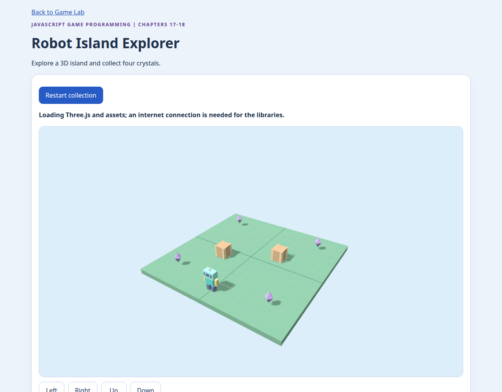
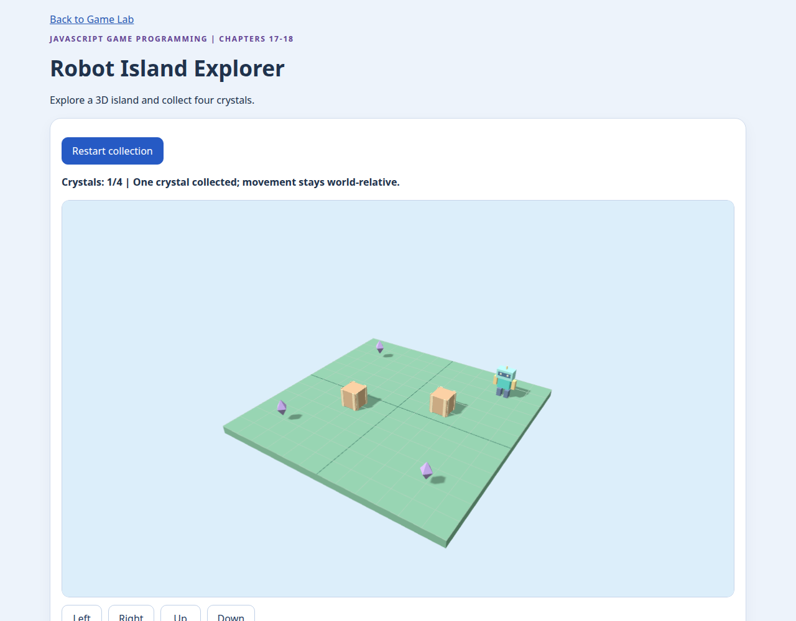
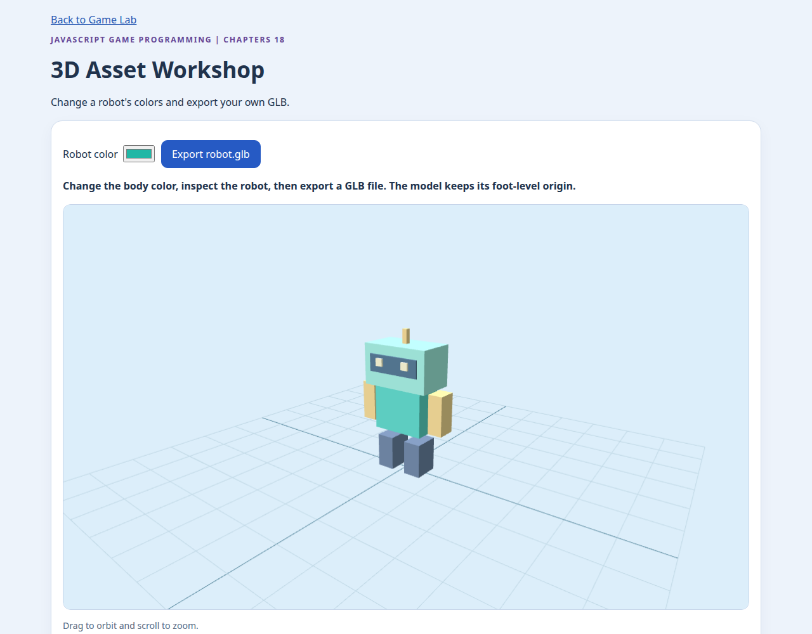
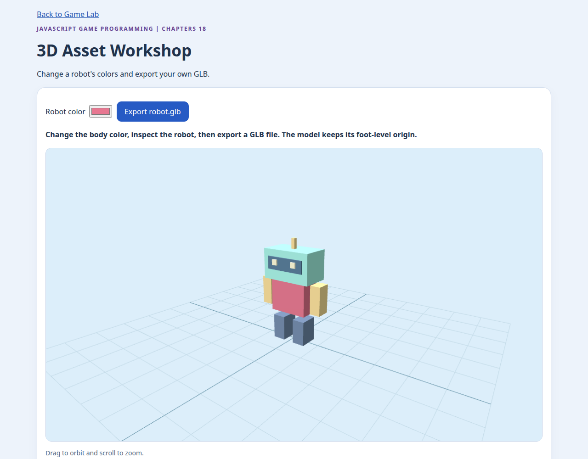

# Welcome, game maker! {.unnumbered #welcome}

::: {.book-hero}

[LEARN BY MAKING]{.eyebrow}

[Web Game Coding for Kids]{.hero-title}

*Learn JavaScript by Building 2D and 3D Games*

**Hung-Fu Chang, Ph.D. and Wenhui Zhu, Ph.D.**

Build a game. Understand the code. Make it your own.

[20 chapters]{.hero-chip} [Visual explanations]{.hero-chip} [Advanced Study]{.hero-chip}

:::

This book teaches JavaScript in the order a young game designer needs it. Instead of memorizing programming rules first, you will meet a problem inside a game and learn the programming idea that solves it.

::: {.callout-tip .big-idea title="The rule of this book" icon="false"}

**Build the scene structure → Style the scene → Program game behavior.**

First decide what belongs in the game. Next make those parts readable and recognizable. Then give them actions and rules. Use the same thinking strategy for every example, exercise, and challenge.

:::

## Your three-step game-making guide {.unnumbered #sec-development-guide}

Remember **Structure → Style → Behavior**. The full names tell you what to do:

| Step | Ask yourself | What you produce | How to check it |
| --- | --- | --- | --- |
| **1. Build the scene structure** | What needs to exist, and how do its parts fit together? | A page or world plan: controls, player, objects, score/status, groups, and starting positions | Point to each required part and explain its job. |
| **2. Style the scene** | How will the player recognize and understand those parts? | Readable layout, colors, shapes, artwork, materials, lighting, and visible feedback | Check visibility, labels, spacing, contrast, and the view of the play area. |
| **3. Program game behavior** | What happens on a player action, a timer tick, or a collision? | Data, operations, actions, rules, and their connections | Predict a result, run or trace the action, and compare the result with your prediction. |

The full names turn the three responsibilities into instructions: **build the structure**, **style**, and **program game behavior**. In the first projects, HTML builds the page, CSS styles it, and JavaScript gives it game actions. In canvas and 3D projects, JavaScript also creates and draws world objects. The steps describe **your design decisions**, not exclusive ownership by a programming language.

A **scene** includes what the player sees and uses: the surrounding page and the game world inside it. A 3D scene object is one part of that larger player-facing scene. **Program game behavior** includes memory, input, movement, rules, timing, and reset—not only animation. **Style** includes readable placeholder shapes; you do not need finished artwork before testing an action.

### Use the guide for every exercise {.unnumbered}

1. **Structure:** identify the parts the task uses. Reuse the current scene, or sketch one for a paper exercise. Add parts only when they are needed.
2. **Style:** check that those parts and their feedback are understandable. Keep the current style when the task changes only a rule.
3. **Behavior:** state the operation or expected result. Write code, trace code, or explain the result, depending on the exercise.

Short reading and prediction exercises can focus on one step. Their **Flow focus** tells you which responsibility you are investigating; it does not ask you to rebuild a game. For challenges, use the concrete **Structure**, **Style**, and **Program game behavior** prompts. Finish with a small check: what did you expect, what happened, and what would you change next?

Repeat the flow for each new feature. A new action may need a new control; return to Structure, style that control, and connect the action. These steps are a development strategy, not the browser's loading order or the game's repeating update-and-draw loop.

## Your computer toolkit {.unnumbered}

Before you make a game, meet the tools you will use. A **computer** runs programs: sets of instructions that tell it what to do. A web browser is one program. A text editor is another. You are about to write instructions that a browser can follow.

### Files and folders {.unnumbered}

A **file** is one named piece of information saved on a computer. A game picture, a sound, and a page of code can each be files. A **folder** is a container that helps you keep related files together. Think of a folder as a game box and the files inside as its cards, pieces, and rule sheet.

Give each game its own folder. For example, your `my-first-game` folder can hold its HTML page now and later hold pictures, sounds, and more JavaScript files. Keep those files together when you copy or move your game.

### A text editor is for code {.unnumbered}

You write code in a **plain-text editor**. It saves exactly the letters, numbers, spaces, and punctuation that you type. Many editors color code and point out mistakes; that can be helpful, but the colors are not part of the code.

A word processor is great for essays, but it may add special quotation marks, hidden formatting, or page layouts. Those extras can confuse code. Use a plain-text editor for your game files. Ask your teacher which editor is available on your computer.

### File names and extensions {.unnumbered}

The end of a file name after the final dot is its **file extension**. It helps people and programs recognize the file's job.

| File name | Extension | What it usually contains |
| --- | --- | --- |
| `index.html` | `.html` | The page structure a browser opens. |
| `main.js` | `.js` | JavaScript instructions for the browser. |
| `style.css` | `.css` | Colors, sizes, and other visual choices. |
| `level.json` | `.json` | Organized game data, such as a level layout. |
| `robot.svg` | `.svg` | A picture made from shapes and lines. |

The extension is important. `index.html` and `index.html.txt` are different files: the first is a web page, while the second is usually treated as ordinary text. Some computers hide extensions, so check the full name when you save a file. Do not rename a file just to give it a new extension; save it in the right kind of file from the start.

## Choose your reading path {.unnumbered}

Follow the main explanations and code examples first. Use the diagrams to trace what the program is doing. Then try a challenge and explain your result in your own words.

Chapters 1-12 establish the web and JavaScript foundations. Chapters 13-16 build a complete 2D adventure. Chapters 17-20 introduce Three.js, custom 3D models, and Rapier physics. The later projects take more time and combine earlier ideas; work through them in small experiments.

Purple **Advanced Study** blocks are optional deeper dives into HTML, CSS, JavaScript, and game systems. They start open; you can collapse them while following the main path and return later.

:::: {.legend-grid}

::: {.legend-item .legend-blue}
**Understand**

Blue blocks introduce the big idea.
:::

::: {.legend-item .legend-green}
**Build**

Green blocks hold your mission and challenges.
:::

::: {.legend-item .legend-purple}
**Go deeper**

Purple blocks explain what happens underneath.
:::

::: {.legend-item .legend-rose}
**Explain**

Rose blocks help you check your understanding.
:::

::::

## What you need {.unnumbered}

- A modern web browser such as Chrome, Edge, Firefox, or Safari.
- A plain-text code editor available on your computer.
- A folder for each website or game containing its files. Chapter 2 begins with separate HTML and CSS files; early JavaScript examples keep their code close to the page so you can focus on the programming ideas.

::: {.callout-tip .setup title="Start with one file" icon="false"}

Create a folder named `my-game-site`. Save your first HTML page as `index.html`, not `index.html.txt`. Open it in your browser. After editing, save the file and refresh the browser. Later, module-based projects need a local development server.

:::

## Meet the browser team {.unnumbered}

Your web browser is the program that turns your game files into a page you can play. Three kinds of code often work together:

| Part | Its job | A game example |
| --- | --- | --- |
| **HTML** | Builds the page and names its parts. | A heading, a button, and a canvas. |
| **CSS** | Chooses how those parts look. | A purple button or a large play area. |
| **JavaScript** | Makes the page react and change. | Add a point when the player clicks. |

Use **Build the scene structure → Style the scene → Program game behavior**: HTML describes the first pages, CSS makes their parts readable, and JavaScript adds game operations and actions. Chapter 2 uses linked HTML and CSS files; Chapter 3 combines a styled scene and JavaScript data in one starter file.

### What “client-side JavaScript” means {.unnumbered}

The **client** is the player's browser. Client-side JavaScript runs on the same computer, tablet, or Chromebook that displays the game. When a player presses a key, the browser can run your JavaScript right there and update the picture right away.

That is different from code on a **server**—another computer that can store shared scores, accounts, or messages. Our first games do not need a server on the internet. Their rules and scores stay in the browser while the page is open.

## Run a one-file game from your drive {.unnumbered}

For the complete examples in the first chapters, you can run your game directly from your computer's drive.

1. Make a folder called `my-first-game` somewhere you can find again, such as Documents.
2. In a plain-text code editor, save the complete example as `index.html` inside that folder. Check that the name ends in `.html`, not `.html.txt`.
3. Open the folder and double-click `index.html`. Your browser should open it. You may see an address beginning with `file:///`; that means the browser opened a file from your own drive.
4. Return to the editor, make one small change, save, and refresh the browser page. On many computers, refresh is `Ctrl+R` or `Command+R`.

If double-clicking opens an editor instead of a browser, right-click the file and choose **Open with**, then choose your browser. If you cannot see the `.html` ending, ask an adult or teacher to turn on file-name extensions. A file named `index.html.txt` is a text document, not a web page.

## When a local web server helps {.unnumbered}

Some later games use several JavaScript files, images, level-data files, or 3D models. A **web server** is a small program that hands files to a browser when the browser asks for them. It is like a careful librarian: the browser asks for a particular file, and the server gives back that file.

For a one-file beginner game, `file:///` is enough. For a project that uses JavaScript `import`, JSON data, or files loaded by the game, start a **local web server** instead. A local server runs only on your own computer and gives the page an address such as `http://127.0.0.1:8000/`. Modern browsers use extra safety rules for those multi-file requests, so opening the HTML by double-clicking may not work.

`127.0.0.1` means “this same computer.” Starting this book's local server does not put your game on the internet or let classmates visit it. The Game Lab instructions in [Appendix E](#sec-game-lab) show exactly how to start it.

## Read examples carefully {.unnumbered}

A **complete example** includes the setup for that small project. A **code fragment** illustrates one part of a game and relies on the variables or functions discussed nearby. Do not paste every fragment into one file without checking where it belongs: some examples replace earlier versions.

Chapters 9–11 use Pong, Breakout, and Snake to explain larger game-building patterns. Each chapter includes a complete small browser example alongside fragments explaining individual rules. Locate its scene, its style, and its actions before changing a fragment. Chapters 13-20 add complete companion projects in the Game Lab. Their chapter snippets explain selected parts; the linked project folders contain the complete runnable source.

## A safe learning habit {.unnumbered}

When a program does not work, do not immediately replace it with someone else's code. Read the browser console, compare one small section at a time, and explain what you expected to happen. Debugging is part of programming, not evidence that you failed.

## Your game-making journey {.unnumbered}

| Chapter | Game | Coding ideas | Your new ability |
| --- | --- | --- | --- |
| 1 | [Computer and web basics](#sec-ch01) | Client, browser, files, servers | Explain where a web page comes from |
| 2 | [Game Maker HQ](#sec-ch02) | HTML, CSS, input elements | Build a static website ready for JavaScript |
| 3 | [Monster Clicker Starter](#sec-ch03) | Variables, arrays, objects | Prepare memory for game actions |
| 4 | [Make the Page React](#sec-ch04) | DOM, events, functions | Connect player actions to page updates |
| 5 | [Monster Decisions](#sec-ch05) | Conditions, branches | Enforce game rules |
| 6 | [Monster Swarm](#sec-ch06) | Arrays, loops | Process a collection of monsters |
| 7 | [Catch the Star](#sec-ch07) | Timers, coordinates, DOM | Change the page over time |
| 8 | [Bouncing Ball](#sec-ch08) | Canvas, animation | Draw every frame yourself |
| 9 | [Pong](#sec-ch09) | Keyboard, game loop | Read keys while the game keeps running |
| 10 | [Breakout](#sec-ch10) | Arrays, collision | Manage many objects |
| 11 | [Snake](#sec-ch11) | Grid logic, state | Update a world one step at a time |
| 12 | [Game Studio](#sec-ch12) | Planning, polish, final project | Design your own rules |
| 13 | [Collision Playground](#sec-ch13) | Input, velocity, fixed steps | Build a predictable real-time loop |
| 14 | [Platforms and jumping](#sec-ch14) | Hitboxes, collision response, gravity | Stop at walls and land on platforms |
| 15 | [Your own 2D artwork](#sec-ch15) | Sprite sheets, loading, JSON levels | Make the game look like your design |
| 16 | [Robot Orchard](#sec-ch16) | Scrolling, enemies, goals, restart | Finish a complete 2D adventure |
| 17 | [Robot Island Explorer](#sec-ch17) | Scene, camera, renderer, 3D movement | Build and explore a 3D world |
| 18 | [3D Asset Workshop](#sec-ch18) | GLB models, origins, materials | Customize and import 3D artwork |
| 19 | [Rapier Drop Lab](#sec-ch19) | Bodies, colliders, bounce, fixed steps | Connect physics to the picture |
| 20 | [Marble Quest](#sec-ch20) | Forces, sensors, scoring, respawn | Finish a 3D physics game |

## Open the Game Lab {.unnumbered}

The companion Game Lab contains six complete projects, including two experimental labs, two collectible adventures, a 3D exploration game, and a model-customization workshop. Keep the project folders together so their shared code and assets can be found.

::: {.callout-tip .setup title="Run the later projects" icon="false"}
From the extracted textbook folder, run `node scripts/serve.mjs`. Open `http://127.0.0.1:8000/games/` in your browser. This local server needs Node.js but no package installation. Use the [Game Lab guide](#sec-game-lab) for controls, file locations, and troubleshooting.

The 2D projects use local files only. The 3D projects initially download pinned Three.js and Rapier modules from a CDN, so they need an internet connection and a browser with WebGL2. An optional dependency-download script supports later offline use.
:::

# Computer, Browser, and Web {#sec-ch01}

::: {.chapter-banner}

[WEB 01 | Before we build a web game]{.game-title}

[Hardware]{.skill-chip} [Software]{.skill-chip} [Browser]{.skill-chip} [Web]{.skill-chip} [URL]{.skill-chip} [Server]{.skill-chip}

:::

## Overview {.unnumbered}

Before you build a web game, it helps to know **where the game lives**, **what runs it**, and **how the pieces reach the screen**.

A web game may look like one thing when you play it, but several parts work together behind the scenes. Your computer provides the hardware. Programs such as a browser provide the software. Files store the pictures, sounds, page information, and game instructions. The Web lets a browser request files from other computers when those files are not already on your own computer.

You do **not** need to memorize every technical word in this chapter. The goal is to build a simple picture in your mind. Later chapters will add HTML, CSS, and JavaScript to that picture one step at a time.

::: {.callout-note title="The big picture" icon="false"}
When you play a web game, you are usually using **software** called a browser on **hardware** such as a laptop or desktop computer. The browser opens game files from your computer or receives them from a server, then uses those files to show and run the game.
:::

```{mermaid}
flowchart LR
    A[Computer hardware] --> B[Browser software]
    C[Game files] --> B
    B --> D[Web game on the screen]
```

**Read the picture:** The computer is the physical machine. The browser is a program running on that machine. The browser uses files to create the game experience you see.

## Our development flow: Structure → Style → Behavior {#sec-ch01-development-flow}

**Build the scene structure → Style the scene → Program game behavior.**

The names tell you what to do: **build the structure** by deciding what belongs in the scene, **style** it so the player understands it, and **program game behavior** with operations and actions. Use this thinking strategy whenever you plan a page or game. A **scene** here means the page the player sees: its title, instructions, play area, characters or pictures, controls, and score. First decide what belongs in that scene and how its parts are grouped. Then choose how those parts look. Finally, decide what operations and actions should happen.

```{mermaid}
flowchart LR
    A[1. Build the scene structure<br/>What belongs on the page?] --> B[2. Style the scene<br/>How should it look?]
    B --> C[3. Program game behavior<br/>What operations and actions happen?]
```

| Development step | Thinking question | Tool and example | Check before moving on |
| --- | --- | --- | --- |
| 1. Build the scene structure | What does the player need to see or use? | HTML: a monster button, message, and score area | Each part exists and is in a sensible group and reading order. |
| 2. Style the scene | How can the player recognize and use those parts? | CSS: readable text, spacing, colors, button size | The scene is readable; its controls and play area are easy to find. |
| 3. Program game behavior | What should happen when the player acts or time passes? | JavaScript: remember a score, respond to a hit, move a star | Predict the result of one action, then compare it with the actual result. |

For example, plan **Robot Rescue** in this order: sketch a robot, an arena, a Start button, and a score; choose their sizes and colors; then describe actions such as starting, moving, collecting, and restarting. A drawing on paper is enough to begin the structure step.

This is our **development order**, not a promise about exactly when a browser loads each file. You will return to an earlier step when a new game action needs a new control or display. Build a small scene, style it, add one behavior, and check the result before expanding it.

Chapter 1 helps you plan these three steps. Chapter 2 builds structure and style and writes a behavior plan. Chapter 3 prepares JavaScript memory for the behavior step. Chapter 4 connects that memory to player actions.

## Learning Objectives {.unnumbered}

By the end of this chapter, you will be able to:

- use the development flow **Build the scene structure → Style the scene → Program game behavior** to plan a game;
- distinguish **hardware** from **software**;
- explain the difference between a **program**, a **file**, and a **folder**;
- explain what a **browser** does;
- distinguish the **Internet** from the **Web**;
- distinguish a **web page**, **website**, and **web game**;
- explain what a **URL** is and recognize its basic parts;
- describe the jobs of a **client** and a **server**;
- trace a simple **request and response** between a browser and a server;
- explain the difference between opening a **local file** and visiting a web address;
- describe, at a high level, where a web game can do its work.

## Hardware and software work together

Look at the computer in front of you. You may see a screen, keyboard, mouse, trackpad, and perhaps a desktop computer or laptop case. These are examples of **hardware**.

**Hardware** means the physical parts of a computer system---the parts that are built from electronic or mechanical components. You can usually touch hardware.

Examples include:

- a screen;
- a keyboard;
- a mouse or trackpad;
- a processor;
- memory;
- a storage drive;
- speakers.

Hardware by itself does not know how to open a website or run a game. It needs instructions. Those instructions are provided by **software**.

**Software** is a program, or a collection of programs and data, that tells computer hardware what work to do.

Examples include:

- a web browser such as Chrome, Edge, Firefox, or Safari;
- a text editor used to write code;
- a drawing program;
- a music player;
- a web game running in a browser.

```{mermaid}
flowchart TB
    C[Computer system]
    C --> H[Hardware<br/>physical parts]
    C --> S[Software<br/>programs and instructions]
    H --> H1[Screen]
    H --> H2[Keyboard]
    H --> H3[Storage]
    S --> S1[Browser]
    S --> S2[Text editor]
    S --> S3[Games]
```

::: {.callout-warning title="Watch Out: A browser is not hardware" icon="false"}
Chrome, Edge, Firefox, and Safari are **software**. The screen that shows the browser is hardware.
:::

### What is a program? {.unnumbered}

A **program** is a set of instructions that a computer can follow. A browser is a program. A calculator app is a program. A game is also a program.

When you start a program, the computer loads the instructions and begins carrying them out. Some programs open documents. Some programs play music. A browser opens and runs web content.

For this book, two programs will be especially important:

- A **text editor** lets you create and change code files.
- A **web browser** reads web files and shows the result.

You will spend a lot of time moving between these two programs: edit something, save it, return to the browser, and see what changed.

## Files and folders keep a project organized

Computers store information in **files**. A file can contain many kinds of information: words, pictures, music, video, data, or program instructions.

A **file name** helps you recognize a file. Many file names also end with a **file extension**, such as `.png` or `.txt`. The extension gives people and programs a clue about what kind of information the file contains.

A **folder** is a container used to organize files and other folders.

Think of a folder as a project box. If you make a space game, you want the files for that game to stay together instead of being scattered around your computer.

```text
space-game/
  index.html
  styles.css
  game.js
  images/
    spaceship.png
    planet.png
  sounds/
    launch.mp3
```

These are real web-project file names. `index.html` describes the page, `styles.css` describes its appearance, and `game.js` holds JavaScript instructions. The name `index.html` is a common starting-page name. An early example may keep all three kinds of code inside one HTML file; a larger project usually separates them.

| File category | Extensions used in this book | Browser's job |
| --- | --- | --- |
| Page | `.html` | Read the page structure and find its linked resources. |
| Stylesheet | `.css` | Apply colors, sizes, spacing, and layout rules. |
| Program | `.js` | Run the game instructions. |
| Picture | `.svg`, `.png` | Display an image or use it in a game drawing. |
| Sound | `.wav`, `.mp3` | Load audio that the game can play. |
| Data | `.json` | Read organized information, such as a level layout. |
| 3D model | `.glb` | Supply model data to the later 3D game code. |

The book itself is written in `.qmd` files. **Quarto** turns that manuscript into web pages for reading. When you build a game, you work with the game files above. A browser does not open a `.qmd` chapter as a playable game.

```{mermaid}
flowchart TB
    A[space-game folder] --> B[Page file]
    A --> C[Style file]
    A --> D[Game program file]
    A --> E[images folder]
    A --> F[sounds folder]
    E --> G[spaceship.png]
    E --> H[planet.png]
    F --> I[launch.mp3]
```

::: {.callout-tip title="Try It: Find a file and its folder" icon="false"}
Open a folder on your computer. Pick one file and answer these questions:

1. What is the file's name?
2. Does it have a file extension?
3. Which folder contains it?
4. Which program would you use to open it?
:::

## The Internet and the Web are related, but they are not the same thing

People often use the words **Internet** and **Web** as if they mean the same thing. They are related, but they describe different ideas.

The **Internet** is a huge network that connects computers and devices around the world. It is the communication system that lets connected computers exchange information.

The **World Wide Web**, usually called the **Web**, is a system of pages and other resources that we access through the Internet, usually with a web browser.

One simple way to remember the difference is:

- **Internet:** the network that connects computers.
- **Web:** pages, sites, games, pictures, and other resources that browsers access using that network.

```{mermaid}
flowchart LR
    A[Your computer] --> B[Internet<br/>connects computers]
    B --> C[Web server]
    C --> D[Web pages and game files]
```

The Internet can be used for things other than the Web. The Web is one important service that uses the Internet.

::: {.callout-note title="A useful comparison" icon="false"}
Imagine roads connecting many towns. The **Internet** is like the road system. A **website** is like a place you can reach using those roads. A **browser** is one of the tools that helps you travel to and use that place.

The comparison is not perfect, but it can help you keep the words separate.
:::

## A browser is software that works with web resources

A **web browser** is software that helps you open and use web pages and web applications. Chrome, Edge, Firefox, and Safari are examples.

A browser can get web files in two common ways:

1. It can open files that are already stored on your computer.
2. It can request files from another computer through a network.

After it receives the files, the browser uses them to create what you see and interact with on the screen.

```{mermaid}
flowchart LR
    L[Files on your computer] -->|open| B[Browser]
    B --> S[What you see and use]
    W[Files from a web server] -->|receive| B
```

::: {.callout-warning title="Watch Out: The browser is not the Internet" icon="false"}
A browser is a program on your device. The Internet is the network connecting devices. You can even use a browser to open some local files when your computer is not connected to the Internet.
:::

### What happens when you type something in the address bar? {.unnumbered}

The long box near the top of a browser is usually called the **address bar**. You can use it to enter a web address. Browsers can also send words from the address bar to a search engine, so typing into the address bar does not always mean that you typed a web address.

When you enter a web address, the browser tries to find the resource at that address. If the resource is on another computer, the browser sends a request for it.

## Web pages, websites, and web games

These three terms are connected, but they do not mean exactly the same thing.

A **web page** is one page or view that a browser can display. A page might show instructions, a menu, a story, a score screen, or part of a game.

A **website** is a collection of related web pages and other files that belong together. A school website, news website, and game website may each contain many pages, images, and other resources.

A **web game** is a game designed to run through a web browser. It may use one page or several files. The browser may draw graphics, play sounds, read keyboard or mouse input, update scores, and run the rules of the game.

| Term | Simple meaning | Example |
| --- | --- | --- |
| Web page | one page shown by a browser | a game's start screen |
| Website | related pages and resources | a game site with a home page, instructions, and games |
| Web game | a game that runs in a browser | a game where you move a character and collect stars |

::: {.callout-note title="Why this matters for our book" icon="false"}
The games in this book are **web games**. That means the browser is not just showing information. It will eventually run instructions that let the game react to clicks, keys, timers, collisions, and other events.
:::

## A URL tells a browser where to look

A **URL** is an address for a resource. URL stands for **Uniform Resource Locator**.

You can think of a URL as directions that help a browser locate something. That "something" might be a web page, an image, a game file, or another resource.

Here is a simple example:

```text
https://example.com/games/space-quest
```

For now, focus on three parts:

| Part | Example | What it tells us |
| --- | --- | --- |
| Scheme | `https://` | how the browser should communicate |
| Domain | `example.com` | which site or server name to contact |
| Path | `/games/space-quest` | which resource or location to ask for |

You do not need to memorize every possible URL part yet. The important idea is that a URL gives the browser an address it can use.

::: {.callout-important collapse="true" title="Advanced Study: A URL can contain more parts" icon="false"}
A URL can include additional information. For example:

```text
https://games.example.com:443/levels/maze?mode=easy#start
```

It may contain:

- a **scheme** such as `https`;
- a **host name** such as `games.example.com`;
- an optional **port** such as `443`;
- a **path** such as `/levels/maze`;
- an optional **query** such as `?mode=easy`;
- an optional **fragment** such as `#start`.

You will not need most of these pieces to begin making games. Return to them when a later project needs them.
:::

## Local files and web addresses

A browser does not always need to get a page from the Internet. It can also open a file stored directly on your computer.

A local file address may begin with `file:///`. For example:

```text
file:///Users/your-name/Documents/space-game/start.html
```

The important part is not the exact folder name. `file:///` tells you that the browser is opening a file from the local computer.

A web address often begins with `http://` or `https://`:

```text
https://example.com/games/space-quest
```

That normally tells the browser to contact a server through a network.

| Address begins with | Usual meaning |
| --- | --- |
| `file:///` | open a file stored on this computer |
| `http://` | request a web resource using HTTP |
| `https://` | request a web resource using encrypted HTTP communication |

```{mermaid}
flowchart TB
    B[Browser]
    L[Local file<br/>on your computer]
    I[Internet]
    S[Web server]
    L -->|open directly| B
    B -->|request| I
    I --> S
    S -->|response| I
    I --> B
```

**Read the picture:** A local file can go directly from storage on your computer to your browser. A web resource takes another route: the browser sends a request through the network and receives a response.

## Client and server describe jobs

When computers communicate, we often describe them by the job they are doing.

A **client** asks for or uses a service or resource. In this book, your browser often acts as a client because it asks for web files.

A **server** provides a service or resource. A web server can receive a request and send back a requested file or other data.

The words **client** and **server** describe roles. They do not always describe special kinds of hardware.

For example, your laptop is hardware. Chrome is software. When Chrome asks a web server for a page, Chrome is acting as a **client**.

A server also involves software. In everyday conversation, people sometimes use the word *server* for both the server program and the computer running that program. For now, remember the job: **a server responds to requests**.

```{mermaid}
sequenceDiagram
    participant B as Browser (client)
    participant S as Web server
    B->>S: Request a game file
    S-->>B: Send a response
    B->>B: Use the file
```

### Request and response {.unnumbered}

A **request** is a message asking for something.

A **response** is the answer that comes back.

For a web game, a simplified conversation might look like this:

> Browser: "Please send the game page."
>
> Server: "Here it is."
>
> Browser: "Now I need a picture used by the game."
>
> Server: "Here is that picture."

Real web communication contains more details, but this request-and-response idea is the foundation.

## Where does a web game do its work?

A web game can do a lot of work directly inside the browser. For example, the browser can respond when a player presses a key, move an object, update a score, draw graphics, and play sounds.

Some web games also communicate with servers. A server might help with jobs such as:

- saving an online account;
- storing a high score;
- loading shared game data;
- connecting several players.

A beginner game does not need all of those features. Many of the first games in this book can run mostly on your own computer in the browser.

```{mermaid}
flowchart LR
    P[Player] -->|clicks and keys| B[Browser game]
    B -->|updates| G[Game screen]
    B -. optional requests .-> S[Server]
    S -. optional data .-> B
```

::: {.callout-note title="Client-side and server-side" icon="false"}
When work happens in the browser on the player's device, programmers often call it **client-side** work. When work happens in a server program, they call it **server-side** work.

You only need the basic idea now. Most of our early attention will stay on the browser side.
:::

## How HTML, CSS, and JavaScript fit together

You will write HTML and CSS in Chapter 2. First, recognize the three jobs that work together in our games:

- **HTML** describes the page's structure and content.
- **CSS** describes much of the page's appearance and layout.
- **JavaScript** gives the page programmable behavior.

Use them in our development flow: **HTML builds the scene structure → CSS gives it style → JavaScript supplies behaviors**. These three jobs let you build and check a game in manageable stages.

| Technology | Job in a future web game | Example |
| --- | --- | --- |
| HTML | what is on the page | a score area or game button |
| CSS | how it looks | size, spacing, color, position |
| JavaScript | what it does | increase the score after an action |

```{mermaid}
flowchart LR
    H[HTML<br/>Build the scene structure] --> C[CSS<br/>Style the scene]
    C --> J[JavaScript<br/>Program game behavior]
    J --> G[Web game]
```

Do not worry about the code yet. Chapter 2 begins with HTML and shows how a browser turns page structure into something you can see.

### The browser builds a page from connected files {.unnumbered}

The page file is the starting point. It can point to a stylesheet, pictures, and JavaScript files. The browser loads those resources, builds the page's structure, applies its styles, and runs its scripts. Loading a picture or a program may take time, so later games wait until their resources are ready.

```{mermaid}
flowchart LR
    H[index.html] --> B[Browser builds page elements]
    C[styles.css] --> S[Browser styles the elements]
    B --> S
    S --> P[Page on the screen]
    J[game.js] --> R[Browser runs game instructions]
    R --> P
    A[Pictures, sounds, and models] --> P
```

The browser keeps a working representation of the page called the **Document Object Model**, or **DOM**. A heading, a button, and a score paragraph become elements in that representation. Chapter 2 gives some elements unique labels called **IDs**. Chapter 4 teaches JavaScript to find those elements and change them. Changing the page in the browser does not automatically change the saved HTML file.

### Recognize the page structures we will reuse {.unnumbered}

Our games grow in stages, but they keep familiar page parts: a title, instructions, a play area, controls, and a message or score. The play area changes as we learn new drawing techniques.

| Book stage | Structure to recognize | What HTML and CSS provide | What JavaScript adds |
| --- | --- | --- | --- |
| Chapter 2: static website | Heading, sections, picture, list, player form | Content, labeled controls, a styled card | Game behavior comes later. |
| Chapters 3–5: Monster Clicker | Monster button, message, score paragraph | Visible elements with unique IDs | Chapter 3 stores data; Chapters 4–5 connect clicks and decisions. |
| Chapter 6: Monster Swarm | Container of buttons and a score span | Shared button classes and a flexible row | A loop connects the monsters. |
| Chapter 7: Catch the Star | Game-area container with a star inside | A sized box and coordinates for the star | Timers and clicks change its position. |
| Chapters 8–12: canvas games | Drawing surface, instructions, status, sometimes Restart | Canvas dimensions, frame, and page layout | Drawing, movement, collisions, and game rules |
| Chapters 13–16: complete 2D projects | Canvas, toolbar, choices, movement buttons, status, error area | A reusable game page and shared stylesheet | Modules load assets and run the game. |
| Chapters 17–20: 3D projects | A stage container plus the same controls and messages | Space for a canvas created by the renderer | Three.js draws the world; Rapier adds physics where needed. |

Use this table as a map. Chapter 2 explains the HTML and CSS vocabulary for these structures before Chapter 3 begins teaching JavaScript variables.

::: {.callout-important collapse="true" title="Advanced Study: What is a local web server?" icon="false"}
Later games in this book will use several JavaScript files, data files, or 3D models. For those projects, we will sometimes run a **local web server**.

A local server is server software running on your own computer. It may give your browser an address such as:

```text
http://127.0.0.1:8000/
```

`127.0.0.1` is a special address that refers back to the same computer. Starting a local server for a project does **not** automatically publish that project to the Internet.

For now, you only need to recognize the idea. Later chapters will tell you when to use the local server and how to start it.
:::

## Exercises {.unnumbered}

Use **Structure → Style → Behavior** to connect these computer concepts to a future game. These are explanation and planning tasks; no game code is required.

### Exercise 1: Hardware or software?

**Flow focus:** Preparation for all three steps: identify the machine and tools that build, display, and run a scene.

Classify each item as **hardware** or **software**.

1. Keyboard
2. Firefox
3. Monitor
4. Text editor
5. Speakers
6. A browser game

### Exercise 2: File, folder, or program?

**Flow focus:** Preparation for all three steps: distinguish the saved resources from the programs that use them.

For each item, choose **file**, **folder**, or **program**.

1. `spaceship.png`
2. Chrome
3. `space-game/`
4. `launch.mp3`
5. A text editor
6. `images/`

### Exercise 3: Internet or Web?

**Flow focus:** Preparation for all three steps: explain how the browser can receive the files for a game.

Complete each sentence with **Internet** or **Web**.

1. The __________ connects computers and devices so they can exchange information.
2. The __________ includes pages and resources that a browser can access.
3. A browser normally uses the __________ to reach a website on another computer.

### Exercise 4: Page, site, or game?

**Flow focus:** Build the scene structure: distinguish one view, a collection of pages, and an interactive game.

Choose **web page**, **website**, or **web game**.

1. One instruction screen displayed in a browser
2. A collection containing a home page, help page, and several games
3. An interactive browser program where the player catches falling stars

### Exercise 5: Read a URL

**Flow focus:** Build the scene structure: identify the address used to locate a page or one of its resources.

Look at this URL:

```text
https://games.example.com/arcade/star-catcher
```

Answer the questions.

1. What is the scheme?
2. What is the domain or host name?
3. What is the path?
4. Does this look like a local file address or a web address?

### Exercise 6: Local or remote?

**Flow focus:** Build the scene structure: decide where a resource comes from before trying to load it.

For each address, decide whether the browser is most likely opening a **local file** or requesting a **web resource**.

```text
file:///Users/Ari/Games/star-game/start.html
https://example.com/games/star-game
file:///C:/Games/maze/start.html
http://school.example.org/game-lab
```

### Exercise 7: Trace the request

**Flow focus:** Preparation for all three steps: trace delivery of the files; this is separate from development order.

Put these actions in a sensible order:

- The server sends a response.
- The browser shows or uses the returned resource.
- The browser sends a request.
- The player enters a web address.

### Exercise 8: Who is doing the job?

**Flow focus:** Program game behavior: identify where browser actions run and what the server supplies.

A player opens a browser and visits an online game. The browser asks another computer for the game files.

Answer these questions:

1. Which software is acting as the client?
2. What is the server's job?
3. Which part is hardware: the laptop or the browser?
4. After the files arrive, where can much of the game logic run?

### Exercise 9: Explain the picture

**Flow focus:** Preparation for all three steps: show how the files needed by the scene reach the browser.

Draw four boxes labeled **Player**, **Browser**, **Internet**, and **Server**. Add arrows to show how a player can request a web game. Label at least one arrow **request** and one arrow **response**.

## Challenges {.unnumbered}

### Challenge 1: Explain a web game to a beginner

**Structure:** Describe the game page and the files it needs. **Style:** Explain that the browser uses visual rules to display those parts. **Behavior:** Describe which program carries out the game actions; use the requested vocabulary.

Imagine a friend says, "A web game is stored inside Chrome."

Write a short explanation that uses at least four of these words correctly:

**hardware, software, browser, file, Internet, Web, server, client**

### Challenge 2: Draw the journey of a game

**Structure:** Draw the browser and the two routes by which its scene files arrive. **Style:** Keep box labels and arrows readable. **Behavior:** Trace a request and response; explain how file delivery supports later game actions.

Draw a diagram showing two ways a browser can get game files:

1. from the same computer;
2. from a web server through the Internet.

Your diagram must include **browser**, **local file**, **request**, **response**, and **server**.

Then write two or three sentences explaining the difference between the two routes.

### Challenge 3: Plan a future game project

**Structure:** Sketch Robot Rescue and its project files. **Style:** Choose two visual decisions that help a player read the scene. **Behavior:** List three player actions and their expected results.

Imagine you will build a game called **Robot Rescue**. First sketch its **scene structure**: instructions, play area, robot, controls, and score. Next note two **style** choices. Then list three **behaviors**, each as an action and its expected result. Sketch a folder for the project. Include folders or files for at least:

- the game page;
- game instructions or code;
- images;
- sounds.

Use `index.html`, `styles.css`, and `game.js` for the three web-code files, then choose meaningful names for your pictures and sounds.

Then answer: **Why is keeping related game files in one project folder useful?**

### Challenge 4: Local game or online game?

**Structure:** Identify the maze, controls, and score in each game plan. **Style:** Keep the scene legible in both plans; server location does not choose its colors. **Behavior:** Decide which actions and saved/shared data need browser or server work.

You are designing two games:

- **Game A** is a simple maze that runs on one student's laptop.
- **Game B** lets students on different computers compare high scores online.

For each game, explain which work could happen in the browser and whether a server would be useful. You do not need to design the server; explain only the jobs it might perform.

### Challenge 5: Trace the development flow

**Structure:** Identify the treasure, Collect control, and score. **Style:** Identify the task that changes how those existing parts look. **Behavior:** Identify the task that connects collection to a score update, then order all three tasks.

A friend wants to make a treasure game. Put these development tasks in order and name their stages:

- choose colors and spacing so the treasure is easy to see;
- create a treasure picture, a Collect button, and a score area;
- make Collect increase the score.

Then explain why changing a picture's color does not, by itself, make collecting it increase the score.

# Build a Static Website with HTML and CSS {#sec-ch02}

::: {.chapter-banner}

[WEB 02 | Game Maker HQ]{.game-title}

[HTML]{.skill-chip} [CSS]{.skill-chip} [Forms]{.skill-chip} [Page structure]{.skill-chip}

:::

::: {.callout-tip .mission title="Your mission" icon="false"}

By the end of this chapter, you can:

- make an HTML page and connect a CSS file to it
- use headings, sections, lists, and classes to give a page structure
- use basic CSS rules, selectors, and declarations
- change font family, size, weight, and style to give a site its voice
- style a local image with size, borders, rounded corners, and a shadow
- add labeled text, menu, checkbox, and button input elements
- read the tags, attributes, and nested containers reused in later game pages
- explain the box model, flexible layouts, positioning, and canvas sizing
- use categorized HTML and CSS tables as a reference for the whole book

:::

::: {.callout-note .big-idea title="The big idea" icon="false"}

HTML says what belongs on a page. CSS says how it should look. Together they make a static website—the visual stage for the game. Chapter 3 adds JavaScript data; Chapter 4 connects that data to clicks and page updates.

:::

## Follow the same three-step development flow {#sec-ch02-development-flow}

**Build the scene structure → Style the scene → Program game behavior.**

Before typing code, sketch the page. Ask what a player should see, how it should look, and what actions it should eventually support. For Game Maker HQ, the plan is:

| Step | Plan for this example | How to check it |
| --- | --- | --- |
| 1. Build the scene structure | Title, gem preview, mission list, and a player card with labeled controls | Open the plain HTML page and find every planned part. |
| 2. Style the scene | A centered card, readable fonts, a framed gem, and spaced controls | Link the stylesheet, refresh, and compare it with the plain page. |
| 3. Program game behavior | Later, read player choices and use them to set up a game | For now, write the desired action and expected result; no game logic is attached yet. |

HTML controls already let a person type or choose. In this flow, **behaviors** means the programmed game operations and actions you design, such as using those choices to start a game. Chapter 3 prepares their data; Chapter 4 begins connecting player actions to code.

For every small example below, identify its stage. An HTML-only fragment practices structure. A CSS-only fragment practices style on an existing structure. Neither fragment is a complete game action by itself. Save and check your work after each stage.

## Make the project folder

Create the folder from Chapter 1 and open it in your text editor:

```
my-game-site/
  index.html
  styles.css
  gem.svg
```

Keep the files in the same folder. The HTML file will use a `<link>` element to tell the browser where to find the CSS file. Copy [gem.svg](../games/assets/2d/gem.svg) from this textbook into your new folder so the page can show a local image.

## Step 1: Build the scene structure — build the page with HTML {#build-the-page-with-html}

Start with the **scene structure**: decide which parts belong on the page and place them in reading order. Save this complete example as `index.html`. HTML tags use angle brackets. Most tags have an opening tag and a matching closing tag; the content goes between them.

[COMPLETE EXAMPLE | `index.html`]{.code-label}

```html
<!doctype html>
<html lang="en">
<head>
  <meta charset="utf-8">
  <meta name="viewport" content="width=device-width, initial-scale=1">
  <title>Game Maker HQ</title>
  <!-- Step 2: Style the scene is supplied by the linked stylesheet. -->
  <link rel="stylesheet" href="styles.css">
</head>
<body>
  <!-- Step 1: Build the scene structure (page structure). -->
  <main class="card">
    <p class="eyebrow">MY STATIC WEBSITE</p>
    <h1>Game Maker HQ</h1>
    <p class="intro">Plan the next game you want to build.</p>

    <section class="game-preview">
      
      <div>
        <h2>Gem Quest</h2>
        <p>Collect three gems, then open the portal.</p>
      </div>
    </section>

    <section>
      <h2>Today's missions</h2>
      <ul>
        <li>Sketch one game character.</li>
        <li>Choose a goal for the player.</li>
        <li>Invent a fair challenge.</li>
      </ul>
    </section>

    <section>
      <h2>Player card</h2>
      <form>
        <label for="player-name">Your game-maker name</label>
        <input id="player-name" name="player-name" type="text"
               placeholder="Type a nickname">

        <label for="game-type">Game type</label>
        <select id="game-type" name="game-type">
          <option>Adventure</option>
          <option>Puzzle</option>
          <option>Sports</option>
        </select>

        <label class="check-row" for="sound-on">
          <input id="sound-on" name="sound-on" type="checkbox">
          I want sound effects in my game.
        </label>

        <button type="button">My game will use this later</button>
      </form>
    </section>

    <!-- Step 3: Program game behavior — plan behaviors; game operations and actions come later. -->
    <p class="hint">This is a static site: the controls are ready, but JavaScript has not given them behavior yet.</p>
  </main>
</body>
</html>
```

Open `index.html` in a browser. If you edit it, save the file and refresh the browser tab. The page will have structure, but it will look plain until you add the CSS. A ready-to-run copy of these files is in `workspace/chapter2/`; open `plain.html` there to see the same page with its stylesheet link removed.

{#fig-ch02-plain-page fig-alt="A plain white browser page shows Game Maker HQ, a small gem, three missions, and a player form with default browser controls." width="100%"}

**Read the picture:** The content is already in a useful order: heading, game preview, missions, then player card. The gem loads because its `` path points to a real local file. Without the stylesheet link, the browser supplies its default fonts, spacing, and control layout.

### Read the important HTML pieces {.unnumbered}

- `<head>` holds information *about* the page. The browser-tab title and the CSS link belong there.
- `<body>` holds the parts people see and use.
- `<main>` groups the main content. Its `class="card"` gives CSS a useful name for this group.
- `<h1>` and `<h2>` are headings. `<p>` is a paragraph. `<ul>` and `<li>` make a list.
- `<section>` groups a related part of the page.
- `` puts the local `gem.svg` picture on the page. Its `alt` text describes the picture for people who cannot see it.

### Read a tag, an element, and an attribute {.unnumbered}

A **tag** marks the beginning or end of an HTML element. An **element** includes its opening tag, content, and closing tag. An **attribute** supplies extra information inside the opening tag.

```html
<button id="monster" class="monster" type="button">👾 Monster</button>
```

Here, `<button ...>` is the opening tag, `</button>` is the closing tag, and the words and emoji are the content. Together they form one button element. `id`, `class`, and `type` are attribute names; `"monster"`, `"monster"`, and `"button"` are their values. Write attributes in the opening tag, separated by spaces, and put their values in quotes.

Some elements are **void elements**: they have no content or closing tag. In our projects these include `<meta>`, `<link>`, ``, `<input>`, and `<br>`. A `<canvas>` or `<script>` always needs its closing tag, even when it looks empty.

HTML comments look like `<!-- A note for the code reader -->`. The browser does not display them as page text. To display angle brackets as text, use `&lt;` for `<` and `&gt;` for `>`. For example, `<code>&lt;button&gt;</code>` displays the tag name instead of creating a button.

### Understand the document skeleton {.unnumbered}

Read the beginning of the complete example from top to bottom:

| Piece | Job | Why our games need it |
| --- | --- | --- |
| `<!doctype html>` | Declares modern HTML; it is a declaration, not an element. | Helps the browser use its standard page-layout rules. |
| `<html lang="en">` | Contains the document and identifies English as its language. | Helps tools interpret the page, including spoken reading. |
| `<head>` | Contains information about the page and resource connections. | Holds the title, metadata, stylesheet, and sometimes an import map. |
| `<meta charset="utf-8">` | Chooses the text encoding. | Allows names, symbols, and emoji to be read correctly. |
| `<meta name="viewport" content="width=device-width, initial-scale=1">` | Sets the mobile layout viewport to the device width and an initial zoom of 1. | Makes our responsive CSS useful on small screens. |
| `<title>` | Names the browser tab. | Distinguishes an open game from other tabs; it does not create a visible heading. |
| `<link rel="stylesheet" href="styles.css">` | Loads a separate CSS file. | Lets several pages share a visual design. |
| `<body>` | Contains the page content and controls. | Holds the heading, game area, score, and buttons. |
| `<style>` | Holds CSS rules inside an HTML file, usually in the head. | Keeps later short game examples in one file. |
| `<script>` | Holds or loads JavaScript, depending on its attributes. | Provides the place for the game instructions starting in Chapter 3. |

The browser's reading order also matters. The early games put their ordinary `<script>` after the page elements it will use, just before `</body>`. Those elements exist when the script reaches them. In Chapter 3, you will fill that script with variables; you do not need to write those instructions yet.

### Nest elements to describe the page structure {.unnumbered}

**Nesting** means placing one element inside another. The outside element is the **parent**; the elements directly inside it are its **children**. Close the inner element before closing the outer one.

```html
<main>
  <section>
    <h2>Monster arena</h2>
    <div id="monsters">
      <button id="slime" class="monster" type="button">Slime</button>
      <button id="bat" class="monster" type="button">Bat</button>
    </div>
    <p>Score: <span id="score">0</span></p>
  </section>
</main>
```

`main` contains `section`. Inside the section, the heading, monster container, and score paragraph are siblings. The two buttons are children of the same `div`. Indentation makes these relationships easy to see; spaces alone do not create the relationships.

`<main>` identifies the main content, and `<section>` identifies a related topic, normally with a heading. `<div>` is a general container without a special topic meaning. It is useful for arranging a row of monster buttons or holding a 3D stage. `<span>` groups a small piece of content within a line. In the score paragraph, JavaScript will later update just the number inside the span.

Headings and paragraphs normally begin new blocks of content. A span normally stays in the surrounding line. CSS can change their layout, but choose the HTML element for its meaning first.

### HTML element reference for the whole book {#sec-ch02-html-reference}

The following tables cover the HTML used in the chapter code and the playable companion pages. Rows marked **extra workspace examples** describe the additional exploration pages shipped in `workspace/`, including `workspace/chapter1/`. They are optional practice, so their folder names do not define the current chapter sequence. The textbook's generated navigation and publishing theme are separate from the game code you write.

| Category | Elements | Meaning and example | Where you will meet them |
| --- | --- | --- | --- |
| Document | `<html>`, `<head>`, `<body>` | Whole document, page information, visible content | Complete game pages throughout the book |
| Metadata and resources | `<meta>`, `<title>`, `<link>` | Encoding/viewport, tab title, stylesheet or tab icon | Chapters 2–4, 6, 8–12; Game Lab pages |
| Code containers | `<style>`, `<script>` | Embedded CSS; embedded or external JavaScript/data | Chapters 3–12; module projects in 13–20 |
| Main structure | `<main>`, `<section>` | Main content and a related section | Chapter 2, Monster Swarm, canvas games, Game Lab |
| Headings and text | `<h1>`, `<h2>`, `<p>` | Main heading, subsection heading, paragraph | Titles, instructions, scores, and messages |
| General groups | `<div>`, `<span>` | Container for a group; small part of a line | Chapter 6 monster row and score; Chapter 7 star; 3D stage |
| Lists | `<ul>`, `<ol>`, `<li>` | Bulleted list, numbered list, one list item | Chapter 2 missions; ordered missions in extra workspace examples |
| Navigation | `<a>` | Link to another page, a resource, or an ID such as `href="#missions"` | Game Lab menu and Back links |
| Pictures | `` | Loads the picture named by `src`; `alt` supplies its text alternative | Chapter 2 gem; Chapter 4 image events |
| Drawing | `<canvas>` | Drawing surface with a coordinate space | Chapters 8–16; created by Three.js in 17–20 |
| Form group | `<form>` | Groups controls for collecting input | Chapter 2 player card |
| Control label | `<label>` | Gives a control an understandable name | Player card and Game Lab choices |
| Input and action | `<input>`, `<button>` | Text/checkbox/color and other controls; a pressable action | Chapter 2 onward; later game toolbars |
| Menu | `<select>`, `<option>` | Choice menu and one of its choices | Player card; Collision Playground shape choice |
| Meaning within text | `<strong>`, `<code>` | Important text; a code name or command shown as text | Game Lab cards and source-file hints |
| Extra page regions | `<header>`, `<nav>`, `<aside>`, `<footer>` | Introductory area, navigation area, related side note, closing information | Extra workspace examples |
| Extra form controls | `<textarea>`, `<fieldset>`, `<legend>` | Several lines of input, related-control group, group caption | Extra workspace player form |
| Extra table structure | `<table>`, `<thead>`, `<tbody>`, `<tr>`, `<th>`, `<td>` | Table, heading/body groups, row, header cell, data cell | Extra workspace element reference |
| Extra line break | `<br>` | A deliberate break inside text | Extra workspace example links; use CSS for spacing |

For a table, nest cells inside rows and rows inside the table's heading or body group. For example, `<thead><tr><th>Element</th><th>Job</th></tr></thead>` creates a heading row. `<th>` describes a heading cell; `<td>` describes an ordinary data cell. The summary tables in this chapter are written in Quarto's Markdown table syntax; Quarto creates the HTML table elements when it compiles the book.

### HTML attribute reference {#sec-ch02-attribute-reference}

An attribute's meaning depends on its element. `type="button"` on a button and `type="module"` on a script describe different things.

| Category | Attribute | What it means in our projects |
| --- | --- | --- |
| Identity | `id` | A unique label in this document: `id="score"`. CSS can select it with `#score`; JavaScript will find it in Chapter 4. |
| Shared group | `class` | Reusable group names: `class="monster"`. Several elements can share a class, and one element can have several classes, such as `class="card primary"`. |
| Language | `lang` | The content language, such as `lang="en"` on `html`. |
| Encoding | `charset` | The encoding on `meta`, here `utf-8`. |
| Named metadata | `name`, `content` | On `meta`, identify a setting and its value, such as the viewport. |
| Resource relationship | `rel` | On `link`, explains the resource's purpose: `stylesheet` for CSS, `icon` for the tab picture. |
| Link destination | `href` | Where an `a` or `link` points. `#missions` points to an ID on this page. |
| Resource source | `src` | Where an `img` or external `script` loads its resource. |
| Picture alternative | `alt` | Describes the image's meaning; a purely decorative image can use `alt=""`. |
| Dimensions | `width`, `height` | On images, dimension hints; on canvas, the drawing-space dimensions. Use numbers such as `width="500"`, without `px`. |
| Label connection | `for` | On `label`, matches the control's `id`, such as `for="player-name"`. |
| Control name | `name` | Names form data; radio buttons sharing a name form a choice group. This does not replace an ID. |
| Control kind | `type` | On `input`: `text`, `checkbox`, `color`, and other kinds. On `button`: `button` prevents ordinary form submission. |
| Starting input | `value`, `placeholder` | `value` sets initial input content or an option's data value. `placeholder` is a temporary hint in an empty text input, not a label. |
| Starting state | `checked` | Starts a checkbox or radio button checked. It is a Boolean attribute: its presence means true; `checked="false"` still checks it. |
| Visibility | `hidden` | Initially hides the Game Lab error box. For the plain `hidden` used here, omit it to show the box; `hidden="false"` still hides it. |
| Script/data kind | `type` | On `script`: `module` enables JavaScript modules; `importmap` identifies mapping data. On an icon `link`, `image/svg+xml` identifies the image format. |
| Accessible name | `aria-label`, `aria-labelledby` | Supply a name directly, or refer to the ID of visible text that names the region/control. Used for game surfaces, controls, and extra workspace sections. |
| Live message | `role`, `aria-live` | `role="status"` identifies a status message. `aria-live="polite"` asks assistive technology to announce changes at a suitable pause. |
| Decorative content | `aria-hidden` | `aria-hidden="true"` keeps decorative content out of the accessibility tree. It does not visually hide it. |
| Custom game data | `data-key`, `data-move` | Store our own labels: a movement key in the Game Lab or a move in extra choice-game examples. They do not create behavior on their own. |
| Keyboard focus | `tabindex` | `tabindex="0"` lets a canvas join the normal Tab-key order. The Game Lab input helper sets the matching JavaScript property `tabIndex`. |
| File download | `download` | Suggests a filename when an anchor downloads a resource. The Asset Workshop sets this through JavaScript when exporting a model. |
| Extra input limits | `min`, `max` | Bounds for number/range controls in extra workspace examples. |
| Extra text area | `rows` | Visible text-line count for a textarea, such as `rows="3"`. |
| Extra autofill | `autocomplete` | Gives an autofill hint, such as `autocomplete="nickname"`. |

IDs and classes are names you choose. `monster`, `card`, and `game-art` are not built-in HTML commands. Each ID must be unique in its page, while a class is useful precisely because several elements can share it. Match spelling and capitalization when referring to those names.

A path is relative to the HTML page unless another base is specified. `gem.svg` means a file beside the page, `assets/gem.svg` means inside a child folder, and `../assets/gem.svg` goes up one folder first. Moving a page without its related files can break its links. The Game Lab uses paths such as `../shared/lab.css` because its games share one stylesheet.

::: {.callout-note title="Attributes, CSS properties, and DOM properties are different" icon="false"}
In `<canvas width="500">`, `width` is an **HTML attribute**. In `canvas { width: 100%; }`, `width` is a **CSS property**. Later, `canvas.width` is a **JavaScript property** on the browser's canvas element. These affect related parts of the page, but they use different syntax and can describe different sizes.

Likewise, `checked` in HTML is a checkbox's starting state; JavaScript's `.checked` reads its current state. `.value` reads current input, `.textContent` changes text, and `.style.left` changes a CSS position. Chapter 4 teaches the DOM; Chapter 7 uses style properties for movement. You only need to recognize the distinction now.
:::

## CSS basics: rules change how HTML looks

CSS is a list of rules. A rule starts with a **selector**—the HTML element or class that you want to style. Inside the braces, each **declaration** has a property, a colon, a value, and a semicolon.

```css
selector {
  property: value;
}
```

Read this rule aloud as: “For every element with the class `game-art`, make the border rounded.”

```css
.game-art {
  border-radius: 24px;
}
```

The dot is important. `.game-art` means “find `class="game-art"` in the HTML.” An element selector has no dot: `h1` styles every level-one heading and `img` styles every image. You can write more than one declaration inside the same braces.

| Selector | What it selects | Example use |
| --- | --- | --- |
| `body` | the whole visible page | choose a default font and text color |
| `h1` | every main heading | make the title large and bold |
| `.intro` | elements with `class="intro"` | make the introduction italic |
| `.game-art` | the gem image with that class | set the image's frame and size |

## Step 2: Style the scene — make the scene readable {#style-fonts-and-images-with-css}

The scene is built. Now **style the scene** with size, spacing, colors, fonts, and layout. Save this in a second file named `styles.css`. Keep the same HTML so you can see exactly what styling changes.

[COMPLETE EXAMPLE | `styles.css`]{.code-label}

```css
/* Step 2: Style the scene; this file adds no game actions. */
:root {
  --ink: #17243b;
  --paper: #f7f4ff;
  --purple: #6d3df5;
  --yellow: #ffe48a;
}

* {
  box-sizing: border-box;
}

body {
  margin: 0;
  min-height: 100vh;
  display: grid;
  place-items: center;
  background: linear-gradient(135deg, #c9efff, var(--paper));
  color: var(--ink);
  font-family: "Trebuchet MS", Verdana, sans-serif;
  font-size: 1rem;
  line-height: 1.6;
}

.card {
  width: min(92%, 620px);
  margin: 32px;
  padding: 32px;
  border: 4px solid var(--ink);
  border-radius: 24px;
  background: white;
  box-shadow: 10px 10px 0 var(--yellow);
}

.eyebrow {
  margin: 0;
  color: var(--purple);
  font-family: Verdana, sans-serif;
  font-size: 0.8rem;
  font-weight: 700;
  letter-spacing: 0.08em;
}

h1 {
  margin: 8px 0;
  color: var(--purple);
  font-family: Georgia, "Times New Roman", serif;
  font-size: clamp(2.2rem, 7vw, 3.5rem);
  font-weight: 800;
  line-height: 1.1;
}

.intro {
  color: #4c3f74;
  font-size: 1.15rem;
  font-style: italic;
}

.hint {
  font-size: 0.9rem;
}

.game-preview {
  display: flex;
  align-items: center;
  gap: 22px;
  margin-top: 28px;
  padding: 18px;
  border: 2px solid #b7aee5;
  border-radius: 20px;
  background: #f2edff;
}

.game-preview h2 {
  margin: 0;
  font-family: Georgia, "Times New Roman", serif;
}

.game-preview p {
  margin: 4px 0 0;
}

.game-art {
  width: 140px;
  height: 140px;
  padding: 14px;
  border: 4px solid var(--purple);
  border-radius: 24px;
  background: white;
  box-shadow: 7px 7px 0 var(--yellow);
  object-fit: contain;
}

section {
  margin-top: 28px;
  padding-top: 8px;
  border-top: 2px dashed #b7aee5;
}

form {
  display: grid;
  gap: 10px;
}

input,
select,
button {
  min-height: 44px;
  padding: 10px 12px;
  border: 2px solid var(--ink);
  border-radius: 10px;
  font: inherit;
}

.check-row {
  display: flex;
  align-items: center;
  gap: 8px;
}

.check-row input {
  min-height: auto;
}

button {
  margin-top: 8px;
  background: var(--purple);
  color: white;
  cursor: pointer;
  font-weight: 800;
}

button:hover {
  background: #4d24c8;
}

input:focus-visible,
select:focus-visible,
button:focus-visible {
  outline: 4px solid var(--yellow);
  outline-offset: 2px;
}

@media (max-width: 520px) {
  .game-preview {
    align-items: flex-start;
    flex-direction: column;
  }
}
```

Save `styles.css` beside `index.html`, then refresh the page. Compare this browser result with the plain version above. The HTML content is the same; the linked CSS file changes its appearance.

{#fig-ch02-styled-page fig-alt="A styled Game Maker HQ page has a pale blue background, white card, purple title, framed gem, mission list, and full-width player form controls." width="100%"}

**Read the picture:** `.card` makes the white panel, `.game-preview` arranges the gem and its text, and `.game-art` adds the gem's rounded frame and shadow. The `form` rule stacks the labeled controls. Try changing one CSS value, saving, and refreshing to see which part of this picture changes.

### Give the site a readable voice {.unnumbered}

```css
body {
  font-family: "Trebuchet MS", Verdana, sans-serif;
}

h1 {
  font-family: Georgia, "Times New Roman", serif;
  font-size: clamp(2.2rem, 7vw, 3.5rem);
  font-weight: 800;
}

.intro {
  font-style: italic;
}
```

`font-family` chooses the lettering style. The comma-separated names are a **font stack**: the browser tries the first font and then tries the next one if needed. The last name, such as `sans-serif` or `serif`, is a broad backup family, so the page still has a sensible look on another computer.

`font-size` changes how large the letters appear. `font-weight` changes how thick they look: `400` is similar to normal text, while `700` is similar to bold. `font-style: italic` adds a slant for emphasis. Use the right HTML tag first—an `<h1>` should still be the main heading even if you later change its size with CSS.

### Frame an image with CSS {.unnumbered}

```css
.game-art {
  width: 140px;
  padding: 14px;
  border: 4px solid var(--purple);
  border-radius: 24px;
  box-shadow: 7px 7px 0 var(--yellow);
}
```

`width` keeps the image at a friendly size. `padding` adds breathing room inside its frame. `border` draws the edge, `border-radius` rounds the corners, and `box-shadow` makes the gem look as if it is resting above the card. Try changing `border-radius` to `50%`; the square frame becomes a circle.

::: {.callout-note .advanced-study title="Practice CSS one property at a time" icon="false" collapse="false"}

[OPTIONAL DEEPER DIVE]{.study-badge}

Change one value, save the CSS file, and refresh the browser. That small experiment tells you exactly which property made the difference. Helpful next references are the [W3Schools CSS tutorial](https://www.w3schools.com/css/), [CSS Fonts](https://www.w3schools.com/css/css_font.asp), and [CSS Styling Images](https://www.w3schools.com/css/css3_images.asp).

:::

## Understand the CSS that our games reuse {#sec-ch02-css-reference}

The complete stylesheet above already uses layout, size limits, custom colors, and responsive rules. Read these explanations with the page open. Change one value at a time so that each rule has a visible meaning.

### Selectors find the right elements {.unnumbered}

A selector chooses **which elements** get a rule; the declarations choose **what changes**. An HTML class name has no dot, but a CSS class selector does. An HTML ID has no hash mark, but a CSS ID selector does.

| Selector category | Example from our pages | Read it as |
| --- | --- | --- |
| Element | `canvas` | Every canvas element |
| Class | `.monster` | Every element with the class `monster` |
| ID | `#star` | The element with `id="star"` |
| Universal | `*` | Every element; used for consistent box sizing |
| Root | `:root` | The document's root element; a useful place for shared color variables |
| Selector list | `input, select, button` | Apply the same declarations to each listed kind |
| Descendant | `.game-preview h2` | An `h2` anywhere inside an element with class `game-preview` |
| Combined element/class | `button.primary` | A button that also has class `primary` |
| Attribute | `button[data-key]` | A button carrying a `data-key` attribute |
| Attribute value | `input[type="color"]` | An input whose type is `color`, in the extra workspace form |
| Hover state | `button:hover` | A button while a pointer is over it |
| Visible focus state | `button:focus-visible` | A focused button when the browser determines a focus indicator should be shown, commonly during keyboard use |

A space in `.game-preview h2` means “inside”; a comma in `input, select, button` means “any of these.” `button.primary` has no space because both conditions describe the same element. Later rules such as `#stage canvas` style the renderer's canvas inside the 3D stage.

### Understand inheritance and competing rules {.unnumbered}

Text properties such as `color` and `font-family` often pass from a parent to its children. This is **inheritance**. The `body` rule sets a default font; the `h1` rule chooses a different one. `font: inherit` asks form controls to use their parent's font settings. Borders, padding, and margins do not normally inherit.

Several rules can match the same element. In our ordinary stylesheets, a more specific selector wins when competing declarations have the same importance and origin. For example, `#star` is more specific than `span`, and `.game-preview h2` is more specific than `h2`. If specificity is tied, the later declaration wins. These selection rules are part of the **cascade**.

```css
button { background: purple; }
button { background: teal; }
```

The second rule wins here. This does not mean that the last rule always wins: selector specificity still matters. CSS comments use `/* A note for the code reader */`; the browser ignores the comment.

### Every element has a box {.unnumbered}

Imagine four layers: the content, its inner padding, its border, and the margin outside that border. This is the **box model**.

```text
margin: space outside the box
  border: the box's edge
    padding: space inside the edge
      content: text, picture, or drawing surface
```

With `box-sizing: border-box`, the CSS width includes the content, padding, and border. A box with `width: 140px`, `padding: 14px`, and `border: 4px solid purple` still has a total border-box width of 140 pixels; its content gets the space left inside. Margin is outside that width. Without `border-box`, those padding and border widths would be added to the content width.

Read spacing shorthand clockwise: `margin: 10px 20px 30px 40px` sets top, right, bottom, and left. Two values such as `padding: 10px 12px` mean vertical then horizontal. Three values such as `margin: 4px 0 0` mean top, horizontal, then bottom. One value applies to all four sides. A side-specific property such as `margin-top` changes just that side.

`margin: 40px auto` gives 40 pixels above and below and automatic left/right margins. For an ordinary block with a limited width, those automatic margins center it horizontally. `min-height: 1.5em` reserves message space even when the message is short, so the page does not jump as much when the text changes.

### Read sizes, colors, and functions {.unnumbered}

CSS values carry units. Write `140px`, not just `140`, for a pixel length. Zero can be written without a unit, and properties such as `font-weight` or a relative `line-height` use unitless numbers.

| Value kind | Examples in our projects | Meaning |
| --- | --- | --- |
| CSS pixels | `140px`, `24px` | A CSS layout unit, useful for frames and game-area sizes; not necessarily one physical display pixel |
| Percentage | `92%`, `100%`, `50%` | Relative to a relevant size; width usually uses the containing box, while `border-radius: 50%` uses the element's own dimensions |
| Root-font size | `1rem`, `2.2rem` | Relative to the root element's font size |
| Local-font size | `1.5em`, `0.08em` | In our message height and letter spacing, relative to that element's font size |
| Viewport size | `7vw`, `100vh` | One `vw` is 1% of viewport width; one `vh` is 1% of viewport height |
| Flexible grid share | `1fr` | One share of the space available to grid tracks |
| Named/hex color | `white`, `#6d3df5`, `#333` | A color name or hexadecimal red/green/blue values; short hex repeats each digit |
| Transparent color | `rgba(255, 255, 255, .92)`, `#2237540b`, `transparent` | A color with opacity, an eight-digit hex color with alpha, or no visible color |
| Custom property | `--purple: #6d3df5` and `var(--purple)` | Define a reusable value and retrieve it |
| Smaller value | `min(92%, 620px)` | Use the smaller result: the card fits its container and never grows past 620 pixels |
| Bounded value | `clamp(2.2rem, 7vw, 3.5rem)` | Use the middle value while keeping it between a minimum and a maximum |
| Calculation | `calc(100% - 40px)` | Calculate a size; used by the extra workspace pages |
| Grid functions | `repeat(auto-fit, minmax(230px, 1fr))` | Repeat as many tracks as fit, with a 230-pixel minimum and room to share extra width |
| Gradient | `linear-gradient(135deg, #c9efff, var(--paper))` | Blend colors along a direction; `deg` measures the angle |
| Extra radial gradient | `radial-gradient(circle, white, transparent)` | Blend colors outward from a center; used in the extra workspace background |
| Automatic/default value | `auto`, `inherit`, `none` | Let sizing be automatic, reuse a parent's value, or disable a feature, depending on the property |

A **custom property** starts with `--`. In this chapter, `:root` defines `--ink`, `--paper`, `--purple`, and `--yellow`. The extra workspace palette also uses `--muted`, `--purple-dark`, `--aqua`, and `--line`. These are our chosen names. Change one shared color and every rule using that `var(...)` value can change with it.

### Arrange a page with Grid and Flexbox {.unnumbered}

Normal page flow places headings and paragraphs in document order. `display: block` gives an element a block box; the canvas games use it to put the drawing surface on its own line. `display: inline-block` gives a badge a box while letting it sit in a line of text.

`display: grid` arranges children in rows and columns. In our Chapter 2 `body`, `place-items: center` centers the card within its grid area, and `min-height: 100vh` gives the page at least a viewport of height. The `form` uses a one-column grid with `gap: 10px` to separate controls. The Game Lab's `.cards` uses `grid-template-columns` to make several card columns when space allows.

`display: flex` arranges children along a main direction. The game preview places the gem and its text side by side. `gap` separates the children. `align-items: center` lines them up across the main direction; `justify-content: center` centers them along the main direction. Monster Swarm uses this to center its buttons. `flex-wrap: wrap` lets a long row continue onto another line.

```css
#monsters {
  display: flex;
  justify-content: center;
  align-items: center;
  flex-wrap: wrap;
  gap: 12px;
}
```

The default flex direction is a row. `flex-direction: column` changes it to a column. In this chapter's small-screen rule, `align-items: flex-start` places the column's children at its start edge.

### Make the layout respond to the screen {.unnumbered}

An **at-rule** begins with `@`. Our `@media` rule applies its nested CSS only when a condition matches:

```css
@media (max-width: 520px) {
  .game-preview {
    align-items: flex-start;
    flex-direction: column;
  }
}
```

When the viewport is at most 520 CSS pixels wide, the preview stacks vertically. The Game Lab uses a 600-pixel breakpoint; the extra workspace pages use 760 pixels. A **breakpoint** is a chosen layout threshold, not a special type of device. Resize the browser to see the rule start and stop applying. Flexible widths, size limits, and media queries work together; adding viewport metadata alone does not make a fixed-width game fit every screen.

### Position a game object inside its play area {.unnumbered}

Chapter 7 uses an ordinary HTML star inside a game container. You can prepare its starting position with CSS before adding a timer:

```html
<div id="game"><span id="star">⭐</span></div>
```

```css
#game {
  position: relative;
  width: 340px;
  height: 240px;
  border: 2px solid #333;
}

#star {
  position: absolute;
  left: 120px;
  top: 80px;
  font-size: 36px;
  cursor: pointer;
}
```

`position: relative` keeps the game box in normal flow and makes it the reference box for the absolutely positioned star. `position: absolute` takes the star out of normal flow. `left` and `top` place it relative to that reference box: 120 pixels from the left, 80 from the top. Increasing `left` moves right; increasing `top` moves down.

Keep the star's width and height in mind when choosing a position. An object whose left edge is inside the play area can still stick out at the right. Chapter 7 changes these same CSS properties through JavaScript; the positioning system itself is already in place.

### Prepare a canvas and a 3D stage {.unnumbered}

A canvas is one HTML element, even when JavaScript draws many balls, bricks, or characters inside it. Those drawings are not separate HTML buttons or spans.

```html
<canvas id="game" width="500" height="300"
        aria-label="Game drawing area">This game needs Canvas support.</canvas>
```

```css
canvas {
  display: block;
  width: 100%;
  max-width: 500px;
  height: auto;
  border: 2px solid #17243b;
  background: #f0f7ff;
}
```

HTML `width="500" height="300"` sets the drawing coordinate space. CSS sizes its display box. In this example, a narrower container can show a smaller version of the same drawing without changing those coordinates. `height: auto` keeps the canvas's proportions. Arbitrarily changing both displayed dimensions can stretch the picture. Chapter 13 explains how pointer coordinates must be scaled when drawing size and display size differ. See the [MDN canvas reference](https://developer.mozilla.org/en-US/docs/Web/HTML/Reference/Elements/canvas).

The canvas stays blank until JavaScript draws. Fallback text does not describe every drawn object, and an accessible label does not make all canvas gameplay accessible. Keep useful instructions and status information in ordinary HTML alongside the game.

For Chapters 17–20, the HTML starts with a host such as `<div id="stage"></div>`. Three.js creates a canvas and attaches it inside that div. The Game Lab gives `#stage` a height, rounded corners, and `overflow: hidden` so drawing outside its box is clipped. `#stage canvas` styles the child canvas. CSS controls the page frame; JavaScript and the renderer control the 3D world.

### CSS property summary: text and appearance {.unnumbered}

These tables include the properties in the chapter examples, the shared Game Lab stylesheet, and the supplied workspace practice pages. A comma-separated group lists related properties, not one property with a long name. The optional Game Lab rows are a reference to return to when those projects begin.

| Category | Property | Job and example |
| --- | --- | --- |
| Lettering | `font-family` | Choose a font stack: `system-ui, sans-serif`. |
| Letter size | `font-size` | Set text size: `1.1rem` or `36px`. |
| Emphasis | `font-weight`, `font-style` | Set thickness (`700`, `bold`) and slant (`italic`). |
| Font shorthand | `font` | Set several font settings together; `font: inherit` copies the parent's font settings. |
| Text spacing | `line-height`, `letter-spacing` | Separate lines (`1.6`) and letters (`0.08em`). |
| Text alignment | `text-align` | Align text inside a box: `center` in Monster Swarm, `left` in tables. |
| Links | `text-decoration` | Control decoration such as underlining; Game Lab card links use `none`. |
| Extra link details | `text-decoration-thickness`, `text-underline-offset` | Set underline thickness and distance from letters in workspace navigation. |
| Foreground | `color` | Choose text color: `#17243b`. |
| Surface | `background` | Set a surface color or image/gradient; canvas CSS colors the surface, not individual drawn objects. |
| Frame | `border` | Width, line style, color: `2px solid #17243b`; `dashed` makes a dashed line. |
| Frame sides | `border-top`, `border-bottom`, `border-left`, `border-color` | Change one border side or its color; section separators use these. |
| Corners | `border-radius` | Round the frame: `24px`; `50%` makes a square frame circular. |
| Shadow | `box-shadow` | Offset, blur, optional spread, color; `7px 7px 0 var(--yellow)` has no blur. |
| Image fit | `object-fit` | `contain` keeps the whole picture visible within its content box without stretching it. |
| Focus indicator | `outline`, `outline-offset` | Draw a focus ring and separate it from the border; unlike a border, the outline does not occupy layout space. |
| Pointer cue | `cursor` | `pointer` suggests a clickable target; it does not add a click handler. |

### CSS property summary: size, space, and layout {.unnumbered}

| Category | Property | Job and example |
| --- | --- | --- |
| Box size | `width`, `height` | Set dimensions: the gem frame is 140 by 140 pixels; the star arena is 340 by 240. |
| Size limits | `min-width`, `max-width`, `min-height`, `max-height` | Set bounds; the Game Lab reserves a minimum stage height and limits canvas height. |
| Width accounting | `box-sizing` | `border-box` includes border and padding in the stated CSS size. |
| Outer spacing | `margin`, `margin-top`, `margin-bottom` | Separate a box from other content or center it with horizontal `auto` margins. |
| Inner spacing | `padding`, `padding-top`, `padding-bottom`, `padding-left` | Separate content from its border; workspace lists add left padding. |
| Layout mode | `display` | Choose `block`, `inline-block`, `grid`, or `flex` for the jobs explained above. |
| Between children | `gap` | Space between grid/flex items: `12px` between monsters. |
| Flex direction | `flex-direction` | Arrange children in a `row` or `column`. |
| Flex wrapping | `flex-wrap` | `wrap` allows another line when a row becomes too long. |
| Alignment | `align-items`, `justify-content`, `place-items` | Align across a flex row, distribute along it, or align grid items on both axes. |
| Grid tracks | `grid-template-columns` | Describe columns; `repeat(auto-fit, minmax(230px, 1fr))` makes flexible Game Lab cards. |
| Positioned objects | `position`, `left`, `top` | Choose the positioning method and offsets; Catch the Star uses `relative` and `absolute`. |
| Overflow | `overflow` | `hidden` clips content outside the box; used for the 3D stage. |

### Optional CSS reference: Game Lab and extra workspace details {.unnumbered}

| Category | Property or construct | What it does in the supplied examples |
| --- | --- | --- |
| Shared palette | Custom properties `--ink`, `--paper`, `--purple`, `--yellow`, `--muted`, `--purple-dark`, `--aqua`, `--line`; `var()` | Store and reuse named theme values. The names are chosen by us. |
| Conditional layout | `@media (max-width: ...)` | Apply nested rules below a viewport-width threshold. This is an at-rule, not a property. |
| Browser control theme | `color-scheme` | `light` asks browser-rendered controls to use a light scheme; it does not set every page color. |
| Hover appearance | `filter` | `brightness(.96)` slightly darkens the Game Lab's hovered buttons. |
| Touch behavior | `touch-action` | `none` reserves touch gestures on game surfaces/buttons for the interaction code instead of browser panning/zooming there. |
| Text selection | `user-select` | `none` prevents selecting movement-button text during play. |
| Error formatting | `white-space` | `pre-wrap` preserves spaces and line breaks while allowing long error text to wrap. |
| Screen-reader utility | `clip` | The supplied `.sr-only` rule uses `rect(0,0,0,0)` with absolute positioning, a tiny box, and hidden overflow to conceal content visually. This older property is deprecated; recognize it in the existing stylesheet rather than choose it for a new design. |
| Extra table borders | `border-collapse` | `collapse` merges neighboring table-cell borders. |
| Extra control color | `accent-color` | Colors supported native control accents, such as the range slider. |
| Extra text-area resizing | `resize` | `vertical` lets the player change a textarea's height. |
| Extra hover motion | `transform` | `translateY(-3px)` shifts a link upward visually without rearranging normal flow. |
| Extra gradual change | `transition` | `transform .15s ease, box-shadow .15s ease` smooths changes over 0.15 seconds. `s` means seconds and `ease` controls the timing curve. |

The `.sr-only` class is a supplied utility rule, not a requirement to conceal your instructions. It differs from HTML `hidden`, which also removes ordinary hidden content from assistive reading. For the legacy property's status, see [MDN: clip](https://developer.mozilla.org/en-US/docs/Web/CSS/Reference/Properties/clip).

CSS styles HTML boxes. Later code such as `ctx.fillStyle`, `ctx.strokeStyle`, and `ctx.font` controls canvas drawing; Three.js material colors control 3D surfaces. Those are JavaScript drawing settings, not additional CSS properties. Return to the appropriate drawing chapter when changing a ball, sprite, or model.

## Step 3: Program game behavior — plan game operations and actions {#prepare-the-inputs-for-javascript}

Start the **behavior** step with a rule in words: “When the player presses the button, read the nickname and game choices, then use them to prepare a game.” This is a plan, not an instruction to add click-handling code in Chapter 2.

The text box, menu, checkbox, and button are all **input elements**: parts of a page a person can use. Their labels make the controls easier to understand and help assistive technology describe them.

Look closely at this pair:

```html
<label for="player-name">Your game-maker name</label>
<input id="player-name" name="player-name" type="text">
```

The label's `for="player-name"` matches the input's `id="player-name"`. That connection means clicking the words “Your game-maker name” focuses the correct text box. The `id` will also let JavaScript find this exact element later.

The button uses `type="button"`. It looks and feels like a button, but it has no task yet. It will not submit the form or save the choices. JavaScript needs to listen for a click, read the inputs, and decide what to do.

::: {.callout-note .advanced-study title="Static does not mean unfinished" icon="false" collapse="false"}

[OPTIONAL DEEPER DIVE]{.study-badge}

Static pages are excellent for information, art portfolios, instructions, and game-planning pages. HTML gives them a sensible order; CSS makes them readable and expressive. HTML controls and CSS states already provide some interaction. JavaScript adds programmed responses, calculations, game memory, data loading, and changes such as score updates.

The browser may remember what you typed for a moment, but this example has no code to save a player name. Refreshing or reopening the page can clear it. Code that remembers choices comes later.

:::

### Choose a control for the player's task {.unnumbered}

Controls have built-in browser behavior even before you write game logic. A text box accepts typing, a checkbox toggles, and a select menu changes its selected option. Your Chapter 2 button has no application-specific action yet. JavaScript will supply that action later.

| Control kind | HTML pattern | Purpose in our examples |
| --- | --- | --- |
| Text | `<input type="text">` | Player nickname |
| Checkbox | `<input type="checkbox">` | Sound or wall-blocking on/off |
| Color | `<input type="color" value="#20b7a5">` | Robot body color in the Chapter 18 Asset Workshop |
| Choice menu | `<select><option value="box">Rectangle</option></select>` | Game type or Collision Playground shape; the data value can differ from visible text |
| Action | `<button type="button">Restart</button>` | A game action connected by JavaScript |
| Extra numeric input | `<input type="number" min="1" max="10">` | A numeric choice in the extra workspace examples |
| Extra slider | `<input type="range" min="1" max="10" value="7">` | A bounded setting such as hero speed |
| Extra single choice | `<input type="radio" name="power">` | One choice from the radios sharing `name="power"` |
| Extra email/date | `<input type="email">`, `<input type="date">` | Browser controls for these kinds of input in the extra player form |
| Extra longer text | `<textarea rows="3">My game idea</textarea>` | Several lines; the initial text goes between its tags |

You can connect a label with `for` and a matching ID, as in the player card. You can also place the input inside its label: `<label><input type="checkbox"> Sound</label>`. The Game Lab uses this second pattern for compact checkboxes. A `fieldset` with a `legend` can give related controls, such as a group of radio choices, one shared description.

### Recognize the three ways scripts appear {.unnumbered}

You do not need to write a module or an import map in this chapter. Learn what their HTML wrappers mean so the later projects have a familiar page structure.

| Script form | HTML | Meaning and later use |
| --- | --- | --- |
| Inline ordinary script | `<script>` followed by code and `</script>` | Code stored in the page; Chapters 3–12 usually put it after the visible elements. |
| External module | `<script type="module" src="game.js"></script>` | Load a JavaScript file that can import/export other modules; introduced in Chapter 12 and used in the Game Lab. |
| Import map | `<script type="importmap">` followed by JSON and `</script>` | Data mapping module names to resource addresses; Chapter 17 uses it for Three.js. Put it before the module that needs the map. |

Module scripts are deferred until the HTML has been parsed, and their dependencies must load before they can run. Module-based game projects use the local server introduced in Chapter 1 and set up in the Game Lab guide. An import map contains data, not game instructions; Chapter 17 explains its actual entries. See [MDN: script](https://developer.mozilla.org/en-US/docs/Web/HTML/Reference/Elements/script).

## Rehearse the page that Chapter 3 will use {#sec-ch02-monster-page}

Use **Build the scene structure → Style the scene → Program game behavior** again. Before working with variables, make a small **static Monster Clicker page**. This connects the Game Maker HQ skills to the next chapter. Create a separate `monster-page/` folder with `index.html` and `styles.css`; keep your HQ project too.

**Step 1 — Build the scene structure:** make the title, monster button, message, and score. Their IDs identify the parts that later actions will use.

```html
<!doctype html>
<html lang="en">
<head>
  <meta charset="utf-8">
  <meta name="viewport" content="width=device-width, initial-scale=1">
  <title>Monster Clicker</title>
  <!-- Step 2: Style the scene with styles.css. -->
  <link rel="stylesheet" href="styles.css">
</head>
<body>
  <!-- Step 1: Build the scene structure (page structure). -->
  <main class="card">
    <h1>Monster Clicker</h1>
    <p>Meet the monster. Its click action comes in Chapter 4.</p>
    <button id="monster" class="monster" type="button">👾 Monster</button>
    <p id="message">The monster is waiting...</p>
    <p id="score">Score: 0</p>
  </main>
  <script>
    // Step 3: Program game behavior: prepare data in Chapter 3 and click actions in Chapter 4.
  </script>
</body>
</html>
```

The empty script contains only a JavaScript comment beginning with `//`. It creates a place for later instructions without adding game behavior.

**Step 2 — Style the scene:** save this small stylesheet beside the page. It makes the existing scene readable without changing its game rules:

```css
/* Step 2: Style the scene. */
* { box-sizing: border-box; }
body {
  margin: 0;
  min-height: 100vh;
  display: grid;
  place-items: center;
  background: #eef7ff;
  color: #17243b;
  font-family: system-ui, sans-serif;
}
.card {
  width: min(92%, 620px);
  padding: 24px;
  border: 3px solid #17243b;
  border-radius: 20px;
  background: white;
}
#monster {
  padding: 18px;
  border: 2px solid #17243b;
  border-radius: 14px;
  background: #e7dcff;
  font: inherit;
  cursor: pointer;
}
#monster:focus-visible {
  outline: 4px solid #ffe48a;
  outline-offset: 2px;
}
#message { min-height: 1.5em; }
```

Open the page, then locate the heading, button, message, and score in the source. Explain how `#monster` in CSS refers to `id="monster"` in HTML. Press Tab to focus the button and observe the focus ring. Clicking the monster does not change the score yet: appearance and game rules are separate jobs.

**Step 3 — Program game behavior:** write the rule “When the monster is hit, increase the score and show a message.” The page does not implement that rule yet. Chapter 3 keeps the scene and style and fills the script with the data needed by the rule. A runnable copy of this static rehearsal is in `workspace/chapter2/monster-page/`. Chapter 4 adds the DOM and event code. The familiar HTML is the stage for those new JavaScript ideas.

### Apply the flow to every example {.unnumbered}

Use this table when practicing the smaller examples as well as the complete page. Each row begins with something that exists in the scene, then a visual choice, then a possible game action.

| Example | 1. Build the scene structure | 2. Style the scene | 3. Program game behavior: planned or taught later |
| --- | --- | --- | --- |
| Game Maker HQ | Preview, missions, labeled player controls | Card, fonts, gem frame, form layout | Read choices and prepare a game; plan only here. |
| Nested monster group | Container, buttons, score span | Shared button class and flexible row | Hit a monster and update the score; Chapters 4–6. |
| Gem picture | An image with a source and text alternative | Size, padding, border, shadow | Collect the gem on an action; Chapter 4's image example. |
| Static star arena | A game div containing a star span | Relative parent; absolute star with left/top | Move the star on clicks and timer ticks; Chapter 7. |
| Canvas preview | A drawing surface with dimensions and instructions | Border, background, responsive display size | Draw and move game objects; Chapters 8 onward. |
| 3D stage preview | A stage host, controls, and status area | Stage height and clipped drawing area | Load and render a 3D world; Chapters 17–20. |
| Monster Clicker rehearsal | Title, monster, message, score | Card and monster button styling | Prepare memory in Chapter 3; connect the hit action in Chapter 4. |

The font, image-frame, selector, and layout snippets each practice **Step 2: Style the scene** on one of these existing structures. The HTML control and container snippets practice **Step 1: Build the scene structure**. For an extra workspace page, trace the same three stages before changing it.

### Page-structure summary for later projects {.unnumbered}

| Project stage | Visible page structure | CSS to recognize | New work left for JavaScript |
| --- | --- | --- | --- |
| Chapters 3–5 | Heading → monster/actions → message and score → script | Font, color, frame, spacing, ID selectors | Variables, clicks, score updates, decisions |
| Chapter 6 | Main card → score span → container of monster buttons → Power Hit/message | Shared `.monster` class, Flexbox, wrapping, gap, reserved message height | Loop over monsters |
| Chapter 7 | Heading/score → game div containing the star | Sized container, relative/absolute positioning, left/top | Random positions and timers |
| Chapters 8–12 | Heading/instructions → canvas → status and optional Restart | Canvas frame, block layout, centered card | Drawing and game rules |
| Chapters 13–16 | Main → panel → toolbar/choices → status → canvas → movement controls → error area | Shared `lab.css`, flexible toolbar, responsive canvas, focus and touch rules | Modules, loading, real-time input and simulation |
| Chapters 17–20 | Same game-page pattern, with a stage div containing a renderer-created canvas | Stage height, child selector, overflow, responsive size limits | Imports, renderer, models, and physics where needed |

## Level-up challenges

::: {.callout-tip .challenge title="Challenge 1" icon="false"}

Make the `Gem Quest` title look different from the body text. Try a different `font-family`, a new `font-weight`, or `font-style: italic`.

1. **Build the scene structure:** Find the existing Gem Quest heading and surrounding text.
2. **Style the scene:** Change one font property and compare the result with body text.
3. **Behavior:** Keep the planned game actions unchanged; this challenge focuses on visual presentation.

:::

::: {.callout-tip .challenge title="Challenge 2" icon="false"}

Turn the gem's rounded-square frame into a circle, then make a color theme of your own. Which `game-art` property changes the shape, and which properties change the colors?

1. **Build the scene structure:** Keep the gem image and its existing class.
2. **Style the scene:** Change its frame to a circle and choose readable theme colors.
3. **Behavior:** Check that the picture still loads and the planned actions remain separate from its appearance.

:::

## Checkpoint

::: {.callout-important .checkpoint title="Explain it in your own words" icon="false"}

Say the development flow in order: **Build the scene structure → Style the scene → Program game behavior**. For the Monster Clicker, name one task in each stage. Which selector styles the purple gem frame? Name two font properties that change the appearance of the title. What game behavior is still missing from the purple button? Explain the difference between an HTML attribute and a CSS property. Why does the star need a positioned parent, and why can a canvas have different drawing and display sizes?

:::

## Practice before Chapter 3

For each task, first locate the existing scene parts, check their style, and name the expected operation. The notes identify what changes; keep the other stages when they already meet the goal.

1. **Structure → Style → Behavior:** Sketch the Monster Clicker scene, name two style choices, and write one planned action with its expected result. Then point to the opening tag, content, closing tag, and three attributes of the monster button.
2. **Build + Style:** Add a second button with its own ID. Give both buttons `class="monster"` and write one `.monster` rule that styles them together. Explain why their IDs must differ.
3. **Structure:** Change the score paragraph to `Score: <span id="score">0</span>`, removing the old paragraph ID. What content does that new ID identify?
4. **Style:** Make the static star arena above. Move the star by editing only `left` and `top`. Explain which box those offsets belong to.
5. **Build + Style:** Add the canvas example to a separate page. Resize the browser and compare its HTML dimensions with its CSS width. Why is the drawing surface still blank?
6. **Structure → Style → Behavior:** Use the reference tables to identify the CSS property for inner spacing, the attribute for an image source, and the element for a group of related controls.

You are ready for Chapter 3 when you can follow **Build the scene structure → Style the scene → Program game behavior**: read the Monster Clicker's HTML, explain its CSS, and describe the action its JavaScript will eventually perform. Keep these tables nearby as the game grows.

# Teach the Game to Remember {#sec-ch03}

::: {.chapter-banner}

[GAME 03 | Monster Clicker Starter]{.game-title}

[Variables]{.skill-chip} [Data Types]{.skill-chip} [Arrays]{.skill-chip} [Objects]{.skill-chip}

:::

## Overview

Keep using our development flow:

**Build the scene structure → Style the scene → Program game behavior.**

First use HTML to build what the player sees and uses. Next use CSS to make that scene readable. Then use JavaScript to implement the game's operations and actions. This chapter begins the behavior stage by giving those actions **data and memory**; Chapter 4 connects them to clicks.

Before a game can react to a player, it needs something very important: **memory**.

A game may need to remember:

- the player's score;
- the player's name;
- the number of lives left;
- whether the game has started;
- which treasures have been collected;
- information about the player or a monster.

JavaScript stores these values in **variables**.

In this chapter, you will build the starting version of a **Monster Clicker** project. The monster will appear on the page, and JavaScript will create the data the game needs. The monster will not react to a click yet. In Chapter 4, you will connect this same project to the page and make the monster clickable.

```{mermaid}
flowchart LR
    A[Chapter 3<br/>Create game data] --> B[score, name, lives, inventory]
    B --> C[Chapter 4<br/>Connect JavaScript to the page]
    C --> D[Click the monster<br/>and update the game]
```

::: {.callout-note title="The Main Idea"}
Chapter 3 answers this question:

**What information should the game remember?**

Chapter 4 will answer the next question:

**How does JavaScript react when the player clicks something on the page?**
:::

## Think through the Monster Clicker before coding {#sec-ch03-development-flow}

| Development step | Decision for our game | Check |
| --- | --- | --- |
| 1. Build the scene structure | Show a title, monster button, message, and score inside a main card. | All four parts exist; `monster`, `message`, and `score` have distinct IDs. |
| 2. Style the scene | Reuse Chapter 2's readable card, button frame, colors, and spacing. | The monster and score are easy to find; the button has a visible keyboard focus ring. |
| 3. Program game behavior | Plan a hit that raises the score and changes the message. Prepare score, lives, treasures, and player data first. | Inspect the starting values in the console. The hit action is implemented in Chapter 4. |

For every JavaScript example in this chapter, ask **which future operation needs this value?** A score supports counting hits. Lives support tracking remaining chances. A Boolean supports a running/not-running decision. An array supports a treasure collection. An object groups player information. These small examples practice the memory part of Step 3; they do not each need a new page or stylesheet.

When a practice task changes only data, keep the existing structure and style and work on that one behavior preparation. When a task needs a new visible part, return to structure, style the new part, and then connect its behavior.

## Learning Objectives

By the end of this chapter, you will be able to:

- apply **Build the scene structure → Style the scene → Program game behavior** when building the starter;
- explain why games need variables;
- declare variables with `let`, `const`, and `var`;
- choose between `let` and `const` in simple programs;
- recognize number, string, Boolean, and `undefined` values;
- explain that JavaScript uses the `Number` type for both whole and decimal numbers;
- create an array to store a list of values;
- create an object to store related key-value pairs;
- change the value stored in a variable;
- build the starting data for the Monster Clicker project that will continue in Chapter 4.

## A Variable Gives a Value a Name

Imagine that your game has a score of `0`.

You could write:

```javascript
0
```

But this number does not explain what it means. Is it the score? The number of lives? The level number?

Instead, we give the value a useful name:

```javascript
let score = 0;
```

A **variable** is a named place where a program keeps a value.

```{mermaid}
flowchart LR
    A[Variable name<br/>score] --> B[Stored value<br/>0]
```

Read this line in pieces:

```javascript
let score = 0;
```

- `let` tells JavaScript to create a variable.
- `score` is the variable's name.
- `=` means **assign** or **store**.
- `0` is the value being stored.
- `;` marks the end of the statement.

::: {.callout-note title="Understand `=`"}
In JavaScript, `=` means **assignment**.

```javascript
score = 5;
```

means:

**Store the value `5` in `score`.**

It does not mean mathematical equality.
:::

### Use meaningful names {.unnumbered}

Compare these two variables:

```javascript
let x = 0;
```

```javascript
let score = 0;
```

Both work, but `score` tells us what the value means.

Game variables might have names such as:

```javascript
let score = 0;
let lives = 3;
let level = 1;
let playerSpeed = 5;
```

JavaScript variable names cannot contain spaces. For names with several words, JavaScript programmers often use **camelCase**:

```javascript
let playerName = "Maya";
let monsterHealth = 10;
let treasureCount = 0;
```

The first word starts with a lowercase letter. Each later word begins with a capital letter.

## Variables Can Store Different Kinds of Values

Games need to remember more than scores. A game might remember a name, a speed, whether a door is open, or a list of treasures.

The kind of value stored in a variable is called its **data type**.

### Numbers {.unnumbered}

JavaScript uses the type `Number` for ordinary numbers.

```javascript
let score = 7;
let lives = 3;
let speed = 2.5;
```

`7` and `3` are whole-number values. They are often called **integers**.

`2.5` contains a decimal part. It is often called a **floating-point** or decimal value.

But JavaScript does not normally separate these into `int` and `float` variable types. Both are JavaScript numbers.

```javascript
console.log(typeof 7);    // number
console.log(typeof 2.5);  // number
```

::: {.callout-warning title="JavaScript Is Different from Some Languages"}
In languages such as Java or C++, you may see declarations using types such as `int`, `float`, or `double`.

In JavaScript, both of these are ordinary `Number` values:

```javascript
let hits = 7;
let speed = 2.5;
```
:::

### Strings {.unnumbered}

A **string** stores text.

```javascript
let playerName = "Maya";
let monsterName = "Pixel Beast";
let message = "Get ready!";
```

String values go inside quotation marks.

Compare:

```javascript
let score = 7;     // Number
let label = "7";   // String
```

They look similar, but JavaScript treats them as different kinds of values.

### Boolean values {.unnumbered}

A **Boolean** has only two possible values:

```javascript
true
false
```

For example:

```javascript
let gameStarted = false;
let monsterVisible = true;
```

Booleans are useful for yes-or-no game states:

- Is the game running?
- Is the player alive?
- Is the door open?
- Has the treasure been collected?

Do not put quotation marks around a Boolean value:

```javascript
let gameStarted = true;    // Boolean
let word = "true";         // String
```

### `undefined`: no value yet {.unnumbered}

A variable can exist before a useful value has been stored in it.

```javascript
let playerChoice;
```

At this point, the value is `undefined`.

For beginner programs, it is usually easier to give variables a useful starting value:

```javascript
let score = 0;
let playerName = "";
let gameStarted = false;
```

## Changing a Variable

The most useful game values usually change while the game runs.

Start with:

```javascript
let score = 0;
```

Later, the game can store a new value:

```javascript
score = 1;
```

Then another:

```javascript
score = 2;
```

The variable name stays `score`, but the stored value changes.

```{mermaid}
flowchart LR
    A[score = 0] --> B[score = 1]
    B --> C[score = 2]
    C --> D[score = 3]
```

A shorter way to add one is:

```javascript
score = score + 1;
```

Read it from right to left:

1. read the current value of `score`;
2. add `1`;
3. store the new value back in `score`.

If `score` begins at `0`, then:

```javascript
score = score + 1;
```

changes it to `1`.

Run it again, and the value becomes `2`.

::: {.callout-tip title="Try It in the Console"}
Try:

```javascript
let score = 0;
console.log(score);

score = score + 1;
console.log(score);

score = score + 1;
console.log(score);
```

Predict all three outputs before running the code.
:::

::: {.callout-important collapse="true" title="Advanced Study: A Shorter `+ 1`"}
JavaScript also lets you write:

```javascript
score++;
```

For now, `score = score + 1` is easier to read because it shows all three steps: read, add, and store. You will see `++` again when loops are introduced later.
:::

## Three Ways to Declare Variables: `let`, `const`, and `var`

JavaScript has three declaration keywords you will commonly see:

```javascript
let score = 0;
const gameTitle = "Monster Clicker";
var oldStyleScore = 0;
```

They all create names, but they are not used in exactly the same way.

### Use `let` when the value will be reassigned {.unnumbered}

A score changes, so `let` is a good choice:

```javascript
let score = 0;
score = 1;
score = 2;
```

Other common game examples are:

```javascript
let lives = 3;
let level = 1;
let gameStarted = false;
```

### Use `const` when the variable should keep the same value or reference {.unnumbered}

Some names do not need to point to a different value.

```javascript
const gameTitle = "Monster Clicker";
const maxLives = 3;
```

You cannot reassign a `const` variable:

```javascript
const maxLives = 3;
maxLives = 5; // Error
```

A useful beginner rule is:

> Use `const` when you do not plan to reassign the variable. Use `let` when you know the stored value must be replaced later.

### What is `var`? {.unnumbered}

Older JavaScript programs often use `var`:

```javascript
var score = 0;
```

`var` was the traditional way to declare JavaScript variables before `let` and `const` were added to the language.

You should recognize it because you may see it in older tutorials and programs.

For the games in this book, we will usually prefer `let` and `const`.

| Declaration | Beginner use in this book | Example |
|---|---|---|
| `let` | the variable will be reassigned | `let score = 0;` |
| `const` | the variable should keep the same value/reference | `const gameTitle = "Monster Clicker";` |
| `var` | recognize older JavaScript code | `var score = 0;` |

::: {.callout-note title="Book Rule"}
When writing new code:

1. Ask: **Will I reassign this variable later?**
2. If yes, use `let`.
3. If no, use `const`.
4. Recognize `var`, but you usually do not need to choose it for new code in this book.
:::

::: {.callout-important collapse="true" title="Advanced Study: Why Modern JavaScript Prefers `let` and `const`"}
`let` and `const` use **block scope**. A variable created inside a `{ }` block belongs to that block.

```javascript
{
  let bonus = 5;
  console.log(bonus);
}

// bonus cannot be used here
```

`var` follows older scoping rules and does not behave the same way inside blocks. You do not need to master scope yet, but this difference is one reason modern JavaScript usually uses `let` and `const`.
:::

## Arrays Store a List of Values

Suppose the Monster Clicker game can award several treasures:

- a coin;
- a gem;
- a key.

You could create three variables:

```javascript
const treasure1 = "coin";
const treasure2 = "gem";
const treasure3 = "key";
```

But these values belong together. An **array** stores a list in one variable.

```javascript
const treasures = ["coin", "gem", "key"];
```

Square brackets `[` and `]` mark the array. Commas separate the items.

```{mermaid}
flowchart LR
    A[treasures] --> B[0: coin]
    A --> C[1: gem]
    A --> D[2: key]
```

Each item has a numbered position called an **index**.

JavaScript starts array indexes at `0`:

```javascript
console.log(treasures[0]); // coin
console.log(treasures[1]); // gem
console.log(treasures[2]); // key
```

So the first item is at index `0`, not index `1`.

### An array can change even when declared with `const` {.unnumbered}

Start with an inventory:

```javascript
const inventory = ["map"];
```

Add another item:

```javascript
inventory.push("key");
```

Now the array contains:

```text
map, key
```

This is allowed because `const` keeps the variable from being reassigned to a different array. It does not freeze the contents of the array.

This is allowed:

```javascript
const inventory = ["map"];
inventory.push("key");
```

This is not:

```javascript
const inventory = ["map"];
inventory = ["gem"]; // Error
```

You can also check how many items an array contains:

```javascript
console.log(inventory.length);
```

## Objects Store Related Information with Keys

An array is useful for an ordered list. Sometimes, however, each value needs a name.

Imagine that the Monster Clicker player has a name, score, and lives:

```javascript
const player = {
  name: "Maya",
  score: 0,
  lives: 3
};
```

This is an **object**.

An object stores related information as **key-value pairs**.

```{mermaid}
flowchart LR
    A[player] --> B[name → Maya]
    A --> C[score → 0]
    A --> D[lives → 3]
```

In this object:

- `name` is a key and `"Maya"` is its value;
- `score` is a key and `0` is its value;
- `lives` is a key and `3` is its value.

You can read an object property with a dot:

```javascript
console.log(player.name);
console.log(player.score);
```

You can also change a property:

```javascript
player.score = 1;
```

Even though `player` was declared with `const`, changing one of its properties is allowed. The variable still refers to the same object.

::: {.callout-note title="Array or Object?"}
Use an **array** when you mainly need an ordered list:

```javascript
const treasures = ["coin", "gem", "key"];
```

Use an **object** when each piece of information needs a descriptive key:

```javascript
const player = {
  name: "Maya",
  score: 0,
  lives: 3
};
```
:::

::: {.callout-important collapse="true" title="Advanced Study: Object and `Map` Are Not the Same Thing"}
A JavaScript object can be used like a simple key-value collection, but JavaScript also has a separate built-in type called `Map`.

`Map` is a later topic. For now, objects are enough for storing small groups of named game information.
:::

## Build the Monster Clicker Starter

Now use the ideas from this chapter to start a project that will continue in Chapter 4.

At the end of this chapter, your game will have:

- a monster on the page;
- a place for a message;
- a place where the score will eventually appear;
- JavaScript variables that describe the game;
- an inventory array;
- a player object.

The monster will **not respond to clicks yet**. That is intentional.

Chapter 4 will introduce the missing ideas: how JavaScript finds HTML elements and how **events** tell the program that the player clicked something.

### Step 1: Build the scene structure — build the HTML game board {.unnumbered}

Sketch the title, monster, message, and score first. Create a file such as `monster-clicker.html`, or continue the Chapter 2 rehearsal page. Keep the script as a placeholder while checking this first stage:

```html
<!doctype html>
<html lang="en">
<head>
  <meta charset="utf-8">
  <meta name="viewport" content="width=device-width, initial-scale=1">
  <title>Monster Clicker</title>
  <style>
    /* Step 2: Style the scene rules will go here. */
  </style>
</head>
<body>
  <!-- Step 1: Build the scene structure (page structure). -->
  <main class="card">
    <h1>Monster Clicker</h1>
    <button id="monster" class="monster" type="button">👾 Monster</button>
    <p id="message">The monster is waiting...</p>
    <p id="score">Score: 0</p>
  </main>

  <script>
    // Step 3: Program game behavior — prepare data; click actions come in Chapter 4.
  </script>
</body>
</html>
```

You already know the HTML pieces from Chapter 2.

Notice these IDs:

```html
id="monster"
id="message"
id="score"
```

Do not write JavaScript to use them yet. Keep them in the page because **Chapter 4 will show how JavaScript uses an element's `id` to find that exact element**.

```{mermaid}
flowchart LR
    A[id="monster"] --> B[Monster button]
    C[id="message"] --> D[Message paragraph]
    E[id="score"] --> F[Score paragraph]
```

::: {.callout-note title="A Preview for Chapter 4"}
The `id` values are like unique labels attached to HTML elements.

In Chapter 4, JavaScript will use those labels to find the monster, message, and score on the page.
:::

### Step 2: Style the scene — reuse the page design {.unnumbered}

The structure is ready. Put this familiar CSS inside the head's `<style>` element, replacing its placeholder comment. These are Chapter 2's styling ideas; the shared `.monster` class will also work when you add more monsters later.

```css
* { box-sizing: border-box; }
body {
  margin: 0;
  min-height: 100vh;
  display: grid;
  place-items: center;
  background: #eef7ff;
  color: #17243b;
  font-family: system-ui, sans-serif;
}
.card {
  width: min(92%, 620px);
  padding: 24px;
  border: 3px solid #17243b;
  border-radius: 20px;
  background: white;
}
.monster {
  padding: 18px;
  border: 2px solid #17243b;
  border-radius: 14px;
  background: #e7dcff;
  font: inherit;
  cursor: pointer;
}
.monster:focus-visible {
  outline: 4px solid #ffe48a;
  outline-offset: 2px;
}
#message { min-height: 1.5em; }
```

Save and refresh. Check the card, monster, message, and score before adding JavaScript. If you continued the Chapter 2 page, you can instead keep its linked `styles.css`; the development step is the same. This chapter embeds CSS only to keep the complete example in one file.

### Step 3: Program game behavior — prepare memory for game actions {.unnumbered}

Write the intended rule first: **When the monster is hit, add one to the score and update the message.** That action needs a score to remember between hits. Prepare the starting data now; Chapter 4 will implement the event and display changes. Styling a button does not connect that operation.

The substeps below all belong to this behavior-preparation stage.

#### Prepare the basic game variables {.unnumbered}

Inside the `<script>` block, add:

```javascript
const gameTitle = "Monster Clicker";
const monsterName = "Pixel Beast";

let score = 0;
let lives = 3;
let gameStarted = false;
```

Why are the declarations different?

```javascript
const gameTitle = "Monster Clicker";
const monsterName = "Pixel Beast";
```

These values are not expected to be reassigned during this simple game, so `const` is a good choice.

```javascript
let score = 0;
let lives = 3;
let gameStarted = false;
```

These values may change while the game runs, so `let` is a good choice.

#### Prepare a treasure list {.unnumbered}

Add an array:

```javascript
const treasures = ["coin", "gem", "key"];
```

Later, the game could choose one of these rewards when the monster is hit.

For now, inspect the values in the browser console:

```javascript
console.log(treasures[0]);
console.log(treasures[1]);
console.log(treasures[2]);
```

#### Group player information in an object {.unnumbered}

Add:

```javascript
const player = {
  name: "Maya",
  score: 0,
  lives: 3
};
```

Then try:

```javascript
console.log(player.name);
console.log(player.score);
console.log(player.lives);
```

This object shows another way the game could organize related data.

For the first version of Monster Clicker, Chapter 4 will continue to use the simpler variable:

```javascript
let score = 0;
```

That keeps the first event example easy to follow. The `player` object gives you a preview of how larger games can organize several related values together.

#### Practice changing the score in memory {.unnumbered}

Before a click can change the score automatically, practice changing it yourself:

```javascript
console.log(score); // 0

score = score + 1;
console.log(score); // 1

score = score + 1;
console.log(score); // 2
```

The number on the web page still says:

```text
Score: 0
```

Why?

Because the JavaScript variable and the HTML paragraph are not connected yet.

```{mermaid}
flowchart LR
    A[JavaScript memory<br/>score = 2] -. not connected yet .-> B[HTML display<br/>Score: 0]
```

This is the exact problem Chapter 4 will solve.

::: {.callout-note title="Important: Memory and Display Are Different"}
The variable:

```javascript
let score = 0;
```

stores information in JavaScript memory.

The HTML:

```html
<p id="score">Score: 0</p>
```

displays text on the page.

Changing one does not automatically change the other. In Chapter 4, you will learn how JavaScript finds the paragraph and updates it.
:::

## Complete Chapter 3 Starter Code

Read this complete example in our development order: locate the **scene structure** in the body, then its **style** in the head, then the data preparing its **behaviors** in the script. The head comes before the body in HTML file order; that does not change the thinking strategy. A runnable copy is in `workspace/chapter3/starter.html`.

```html
<!doctype html>
<html lang="en">
<head>
  <meta charset="utf-8">
  <meta name="viewport" content="width=device-width, initial-scale=1">
  <title>Monster Clicker</title>
  <style>
    /* Step 2: Style the scene. */
    * { box-sizing: border-box; }
    body {
      margin: 0;
      min-height: 100vh;
      display: grid;
      place-items: center;
      background: #eef7ff;
      color: #17243b;
      font-family: system-ui, sans-serif;
    }
    .card {
      width: min(92%, 620px);
      padding: 24px;
      border: 3px solid #17243b;
      border-radius: 20px;
      background: white;
    }
    .monster {
      padding: 18px;
      border: 2px solid #17243b;
      border-radius: 14px;
      background: #e7dcff;
      font: inherit;
      cursor: pointer;
    }
    .monster:focus-visible {
      outline: 4px solid #ffe48a;
      outline-offset: 2px;
    }
    #message { min-height: 1.5em; }
  </style>
</head>
<body>
  <!-- Step 1: Build the scene structure (page structure). -->
  <main class="card">
    <h1>Monster Clicker</h1>
    <button id="monster" class="monster" type="button">👾 Monster</button>
    <p id="message">The monster is waiting...</p>
    <p id="score">Score: 0</p>
  </main>

  <script>
    // Step 3: Program game behavior — prepare data; click actions come in Chapter 4.
    const gameTitle = "Monster Clicker";
    const monsterName = "Pixel Beast";

    let score = 0;
    let lives = 3;
    let gameStarted = false;

    const treasures = ["coin", "gem", "key"];

    const player = {
      name: "Maya",
      score: 0,
      lives: 3
    };

    console.log(gameTitle);
    console.log(monsterName);
    console.log(score);
    console.log(treasures);
    console.log(player);
  </script>
</body>
</html>
```

When you open the page:

- the monster appears;
- the score display begins at `0`;
- JavaScript creates the game variables;
- clicking the monster does nothing yet.

That last point is not a bug. It marks your progress.

```{mermaid}
flowchart TD
    A[Build the scene structure<br/>HTML page elements] --> S[Style the scene<br/>CSS presentation]
    S --> B[Program game behavior: Chapter 3<br/>Prepare game data and memory]
    B --> C[Program game behavior: Chapter 4<br/>Find page elements with the DOM]
    C --> D[Listen for clicks with events]
    D --> E[Update score and message]
```

::: {.callout-tip title="Save This Project for Chapter 4"}
Keep this exact file. In Chapter 4, you will extend it instead of starting over.

The next version will reuse:

- `id="monster"`;
- `id="message"`;
- `id="score"`;
- `let score = 0;`;
- the Monster Clicker theme.

You will add only the new DOM and event code needed to make the project interactive.
:::

## Exercises

Use **Structure → Style → Behavior** as a check before each task. The focus below identifies the stage you are practicing. For reading or prediction tasks, trace or explain the result; you do not need a new page or visual redesign.

### Exercise 1: Name the parts of a declaration

**Flow focus:** Program game behavior: identify the memory a future score action will change; keep the existing scene and style.

Look at:

```javascript
let score = 0;
```

Identify:

1. the declaration keyword;
2. the variable name;
3. the assignment operator;
4. the starting value.

### Exercise 2: Choose `let` or `const`

**Flow focus:** Program game behavior: decide which values future actions can replace and which bindings stay fixed.

Choose the better declaration for each value.

1. A player's score that changes after each hit.
2. The title `"Monster Clicker"`.
3. The current level, which can change.
4. An array named `treasures` that will remain the same array.
5. The maximum number of lives, which does not change.

### Exercise 3: Recognize `var`

**Flow focus:** Program game behavior: change the declaration style while preserving the value the game will remember.

You find this older code online:

```javascript
var score = 0;
```

Rewrite it using the declaration style used for a changing value in this book.

### Exercise 4: Identify the data type

**Flow focus:** Program game behavior: identify the kinds of data available to game operations.

For each value, identify whether it is a **Number**, **String**, or **Boolean**.

```javascript
10
2.5
"10"
"Pixel Beast"
true
false
```

### Exercise 5: Predict the score

**Flow focus:** Program game behavior: predict successive updates to memory before checking the output.

What is printed?

```javascript
let score = 0;
score = score + 1;
score = score + 1;
score = score + 1;
console.log(score);
```

Explain why.

### Exercise 6: Read an array

**Flow focus:** Program game behavior: identify which treasure a collection index selects.

Given:

```javascript
const treasures = ["coin", "gem", "key"];
```

What does each expression produce?

```javascript
treasures[0]
treasures[1]
treasures[2]
```

### Exercise 7: Read an object

**Flow focus:** Program game behavior: read related player values without changing the player scene or its style.

Given:

```javascript
const player = {
  name: "Maya",
  score: 4,
  lives: 2
};
```

What values are produced by:

```javascript
player.name
player.score
player.lives
```

### Exercise 8: Memory versus page display

**Flow focus:** Structure + Behavior: distinguish the visible score element from score memory; styling cannot connect them.

Suppose the page contains:

```html
<p id="score">Score: 0</p>
```

and JavaScript later runs:

```javascript
let score = 0;
score = score + 1;
```

Does the paragraph automatically change to `Score: 1`?

Explain your answer using the ideas of **JavaScript memory** and **HTML display**.

## Challenges

### Challenge 1: Customize Your Monster

**Structure:** Change the visible title and monster label. **Style:** Choose one readable button color or spacing change. **Behavior:** Customize the starting data and inspect it in the console; the hit action still waits for Chapter 4.

Use **Build the scene structure → Style the scene → Program game behavior**. First change the visible title and monster label. Next choose one button color or spacing change. Then change the starter data so that it uses your own:

- game title;
- monster name;
- starting number of lives;
- three treasure names.

Choose `let` or `const` for each variable and explain one of your choices.

### Challenge 2: Build a Better Player Object

**Structure:** Keep the existing player page and identify the player information it represents. **Style:** Keep the current page style; no new display is required for this exercise. **Behavior:** Add the player properties and print their values.

The scene structure and style are already in place. Continue **Step 3: Program game behavior** by preparing memory for a future player action. Extend the player object with two new properties, such as:

```javascript
level
speed
favoriteTreasure
monsterHits
```

Print the new properties in the console.

### Challenge 3: Grow the Inventory

**Structure:** Keep the monster scene and identify the collection of gathered treasures. **Style:** Keep the current scene style; use the console to inspect this small operation. **Behavior:** Add the inventory items, predict its length, and check the result.

Keep the scene structure and style. In the **behavior** stage, practice the operation “add treasure to inventory.” Start with:

```javascript
const inventory = [];
```

Use `push()` to add three items. Then print:

```javascript
inventory
inventory.length
```

Predict the length before you run the code.

### Challenge 4: Prepare One More Value for Chapter 4

**Structure:** Keep the monster and the feedback areas. **Style:** Keep their current readable style. **Behavior:** Describe the future hit action and prepare one value it will change.

Keep the scene structure and style. In the **behavior** stage, describe one future hit action, then add a variable that it might change when the monster is clicked in the next chapter. Examples include:

```javascript
let monsterHealth = 5;
let combo = 0;
let hits = 0;
```

Write one sentence explaining how a click event could change your variable later.

## Development-flow checkpoint

Explain your starter in this order:

1. **Build the scene structure:** Which HTML parts form the game scene? Which IDs identify the monster, message, and score?
2. **Style the scene:** Which CSS rules make those parts readable and recognizable? Change one visual value and check that the game data stays the same.
3. **Behavior:** What should one hit do? Which variables prepare memory for that operation, and which connection is still waiting for Chapter 4?

For a new example, begin with the same questions. Build and check the structure, style it, then prepare and connect one game action at a time.

# Make the Page React: DOM Elements and Click Events {#sec-ch04}

::: {.chapter-banner}

[GAME 04 | Click the Monster]{.game-title}

[DOM]{.skill-chip} [Events]{.skill-chip} [JavaScript]{.skill-chip}

:::

::: {.callout-note .big-idea title="Structure → Style → Behavior" icon="false"}

**Build the scene structure → Style the scene → Program game behavior.**

- **Build the scene structure:** Identify or add the character, buttons, images, and message elements with unique IDs.
- **Style the scene:** Keep controls recognizable and text readable; default browser styling is enough for a small test.
- **Behavior:** Find the elements, attach one event handler, and compare its actual response with your prediction.

Use this plan for the examples and exercises below. Reuse parts that already work; change only what the task needs. After each step, predict one result and check it.

:::


## Overview

In Chapter 2, you used **HTML** to put things on a page and **CSS** to change how they look. In Chapter 3, you learned how JavaScript stores values using variables such as `const` and `let`.

Now we can connect JavaScript to the web page itself. A game needs to know **which thing on the page** JavaScript should work with and **when something happens** to that thing.

Imagine a monster button on the screen. Two questions must be answered before JavaScript can make it part of a game:

1. **How can JavaScript find the monster on the page?**
2. **How can JavaScript know when the player clicks it?**

Those two questions introduce two of the most important ideas in browser programming:

- the **DOM**, which lets JavaScript find and change page elements;
- **events**, which let JavaScript react to things that happen.

```{mermaid}
flowchart LR
    A[HTML creates the page] --> B[Browser builds the DOM]
    B --> C[JavaScript finds an element]
    D[Player clicks] --> E[Click event]
    E --> F[JavaScript reacts]
    F --> C
```

By the end of this chapter, one ordinary web page will become your first interactive web game.

## Learning Objectives

By the end of this chapter, you will be able to:

- explain what an **HTML element** is;
- explain why the HTML `id` attribute gives JavaScript a way to identify one element;
- describe the DOM as the browser's JavaScript-friendly representation of the page;
- connect `id="..."` in HTML to the string used by `document.getElementById("...")`;
- explain what an **event** is;
- distinguish normal top-to-bottom execution from **event-driven execution**;
- connect a `click` event to a JavaScript function with `addEventListener()`;
- trace the flow from **page setup → waiting → event → handler → DOM change**;
- recognize that keyboard, input, and other events follow the same event-listener pattern.

## From HTML Elements to DOM Elements

Start with a small page:

```html
<h1>Click the Monster!</h1>
<button id="monster">👾 Monster</button>
<p id="message">Can you catch it?</p>
```

The browser shows three visible pieces:

- a heading;
- a button;
- a paragraph.

Each piece created by an HTML tag is an **HTML element**.

For example:

```html
<button id="monster">👾 Monster</button>
```

This creates a button element. The attribute `id="monster"` gives that element a unique name on the page.

::: {.callout-note title="Understand"}
An **element** is one part of a web page. Headings, paragraphs, buttons, images, and input boxes are all examples of elements.
:::

### The browser creates a page model {.unnumbered}

When the browser reads HTML, it does more than draw words and buttons on the screen. It also creates an organized representation of those elements in memory.

That representation is called the **Document Object Model**, usually shortened to **DOM**.

For beginners, you can think of the DOM as the browser's **live map of the page**.

```{mermaid}
flowchart TD
    D[document] --> H[h1: Click the Monster!]
    D --> B[button: monster]
    D --> P[p: message]
```

The HTML file is the code you wrote. The DOM is the live page structure the browser created from that code.

JavaScript works with this live DOM while the page is running.

::: {.callout-note title="HTML File vs. DOM"}
**HTML file:** the source code saved on your computer.

**DOM:** the browser's live representation of the page after it reads the HTML.

JavaScript usually changes the DOM while the program runs. It does not rewrite your saved HTML file.
:::

## The `id`: The Link Between HTML and JavaScript

Before JavaScript can change a monster, button, message, or picture, it must know **which element you mean**.

HTML gives us an important attribute for this job: `id`.

Look closely at this button:

```html
<button id="monster">👾 Monster</button>
```

The whole thing is a `button` element. Inside its opening tag, this part:

```html
id="monster"
```

gives that element an **ID value** of `monster`.

Think of an ID like a name tag attached to one object on the page.

```{mermaid}
flowchart LR
    A[HTML button element] --> B[id="monster"]
    B --> C[Unique label: monster]
```

::: {.callout-note title="Understand: Attribute Name and Attribute Value"}
In:

```html
id="monster"
```

- `id` is the **attribute name**;
- `monster` is the **attribute value**.

The value is written inside quotation marks in the HTML.
:::

### Why the ID matters {.unnumbered}

A page may contain many buttons, paragraphs, and images.

```html
<button id="monster">👾 Monster</button>
<button id="startButton">Start</button>
<p id="message">Can you catch it?</p>
```

If JavaScript only said, “Give me a button,” which button should the browser choose?

The ID gives JavaScript a precise way to identify one element.

For this HTML:

```html
<button id="monster">👾 Monster</button>
```

JavaScript can ask:

```javascript
const monster = document.getElementById("monster");
```

The string inside `getElementById()` must match the HTML ID value.

```{mermaid}
flowchart LR
    H[HTML] --> I[id="monster"]
    I -->|same value| J[getElementById("monster")]
    J --> D[DOM button element]
    D --> V[const monster]
```

This connection is so important that it is worth reading both directions:

```text
HTML:       id="monster"
                     ↓ same text
JavaScript: getElementById("monster")
```

The word `monster` is **not special JavaScript vocabulary**. You chose that ID in the HTML, and JavaScript uses the same value to find the element.

::: {.callout-warning title="The Two Names Do Not Have to Match"}
This is valid:

```html
<button id="monster">👾 Monster</button>
```

```javascript
const enemyButton = document.getElementById("monster");
```

There are two different names here:

- `"monster"` is the **HTML ID value** JavaScript searches for;
- `enemyButton` is the **JavaScript variable name** that stores the found DOM element.

Using the same word for both can be easier for beginners, but JavaScript does not require it.
:::

### Step by step: from HTML to a JavaScript variable {.unnumbered}

Start with the HTML:

```html
<p id="message">Can you catch it?</p>
```

**Step 1 — HTML gives the element an ID.**

```text
id value = message
```

**Step 2 — The browser creates a DOM element.**

The DOM element keeps information about that paragraph, including its ID.

**Step 3 — JavaScript asks the DOM for that ID.**

```javascript
document.getElementById("message")
```

**Step 4 — The browser returns the matching DOM element.**

**Step 5 — A variable stores the returned element.**

```javascript
const message = document.getElementById("message");
```

Because Chapter 3 introduced variables, you can read this as an assignment:

> Put the DOM element whose ID is `message` into the constant named `message`.

```{mermaid}
flowchart TD
    A[HTML source] --> B["<p id='message'>"]
    B --> C[Browser builds DOM]
    C --> D[DOM paragraph with id message]
    E["getElementById('message')"] --> F{Matching ID?}
    D --> F
    F -->|Yes| G[Return DOM element]
    G --> H[Store it in const message]
```

### IDs should identify one element {.unnumbered}

An HTML `id` should be unique on the page.

Good:

```html
<button id="monster">Monster</button>
<p id="message">Ready!</p>
```

Avoid giving two different elements the same ID:

```html
<button id="monster">Monster 1</button>
<button id="monster">Monster 2</button>
```

If several game objects need to belong to the same group, later you will learn other ways to select groups of elements. For now, use one unique ID for each element JavaScript needs to find directly.

::: {.callout-warning title="IDs Must Match Exactly"}
This HTML:

```html
<button id="monster">Monster</button>
```

matches:

```javascript
document.getElementById("monster")
```

but it does **not** match:

```javascript
document.getElementById("Monster")
document.getElementById("monsters")
document.getElementById("monsterButton")
```

The browser searches for the exact ID value you provide.
:::

### What does `document` mean? {.unnumbered}

In browser JavaScript, `document` represents the current web page's DOM.

So:

```javascript
document.getElementById("monster")
```

can be read as:

> In the current page, get the element whose ID value is `monster`.

This gives us our first reusable browser-programming pattern:

```text
Give an HTML element an ID
        ↓
Use the same ID in getElementById()
        ↓
Store the returned DOM element in a variable
```

## A DOM Element Can Be Changed

Finding an element matters because JavaScript can now do something with it.

For example, this line changes the paragraph text:

```javascript
message.textContent = "Great hit!";
```

`textContent` means the text stored inside that DOM element.

Before JavaScript runs:

```html
<p id="message">Can you catch it?</p>
```

After this JavaScript runs:

```javascript
message.textContent = "Great hit!";
```

the browser shows:

```text
Great hit!
```

The saved HTML file has not changed. The browser changed the **DOM**, so the player sees the new text immediately.

::: {.callout-tip title="Try It"}
Open the browser console on a simple page and try:

```javascript
document.getElementById("message").textContent = "Hello from JavaScript!";
```

If the page has an element with `id="message"`, its text changes immediately.
:::

This gives us our first important game pattern:

```text
Find an element → Change the element
```

But a game should not change everything immediately. Usually it should wait for the **player**.

That brings us to events.

## 4.4 What Is an Event?

An **event** is something that happens while the page is running.

Many events come from the player:

- clicking or tapping;
- pressing a key;
- moving the mouse;
- typing in an input box;
- changing a selection.

Some events come from the browser or program:

- the page finishes loading;
- a timer finishes;
- an animation frame is ready.

For now, we will begin with the easiest event to see: **click**.

### Normal programs often run top to bottom {.unnumbered}

When beginners first learn programming, code often looks like a fixed sequence:

```javascript
const playerName = "Mia";
const score = 0;
console.log(playerName);
console.log(score);
```

The computer begins at the top and executes the statements in order.

```{mermaid}
flowchart TD
    A[Start] --> B[Run statement 1]
    B --> C[Run statement 2]
    C --> D[Run statement 3]
    D --> E[Finish]
```

That model is useful, but an interactive web game has another kind of execution.

## Event-Driven Programming: Set Up, Then Wait

A web page cannot know **when** the player will click.

The player might click immediately, five seconds later, or never.

So an event-driven program usually has two phases:

1. **Setup phase** — JavaScript runs code that prepares the page and registers event listeners.
2. **Waiting-and-response phase** — the browser waits. When an event occurs, it runs the connected handler function.

```{mermaid}
flowchart TD
    A[Page starts] --> B[Run setup code]
    B --> C[Find DOM elements]
    C --> D[Register event listeners]
    D --> E[Browser waits]
    E --> F{Did an event happen?}
    F -->|No| E
    F -->|Yes: click| G[Run click handler]
    G --> H[Change game state or DOM]
    H --> E
```

The important difference is the loop back to **waiting**.

The whole JavaScript file does not restart after every click. Instead, the browser remembers the event listener and calls the connected function whenever the event happens.

::: {.callout-note title="Event-Driven Does Not Mean Random Order"}
The browser still executes each function's statements in order.

What changes is **when a function begins**. An event handler starts because an event occurred, not simply because it was the next line in the original file.
:::

### Compare the two execution models {.unnumbered}

```{mermaid}
flowchart LR
    subgraph Normal[Simple sequential program]
      A1[Start] --> A2[Statement A] --> A3[Statement B] --> A4[Statement C] --> A5[End]
    end

    subgraph EventDriven[Event-driven web program]
      B1[Setup] --> B2[Register listener] --> B3[Wait]
      B3 -->|event| B4[Run handler]
      B4 --> B3
    end
```

This is a major idea in web games: **the program spends much of its time waiting for events and reacting to them**.

## Listening for a Click Event

Consider this game rule:

> When the player clicks the monster, show “Great hit!”

It contains two parts:

1. **Event:** the player clicks the monster.
2. **Event handler:** the code that responds to the click.

First, JavaScript gets the element:

```javascript
const monster = document.getElementById("monster");
```

Then we define the response function:

```javascript
function hitMonster() {
  message.textContent = "Great hit!";
}
```

Finally, we connect the element, event type, and function:

```javascript
monster.addEventListener("click", hitMonster);
```

Read it like this:

> On the `monster` DOM element, listen for a `click`. When that click occurs, run `hitMonster`.

```{mermaid}
flowchart LR
    A[DOM element: monster] --> D[Event listener]
    B[Event type: click] --> D
    C[Handler: hitMonster] --> D
    D --> E[Browser remembers the connection]
    F[Player clicks later] --> G[click event occurs]
    G --> E
    E --> H[Browser calls hitMonster]
```

### Why `hitMonster` has no parentheses {.unnumbered}

Use:

```javascript
monster.addEventListener("click", hitMonster);
```

not:

```javascript
monster.addEventListener("click", hitMonster());
```

`hitMonster` gives the browser the function so it can run it **later** when the event happens.

`hitMonster()` means **run the function now** while the setup code is executing.

## The Same Event Pattern Works for Other Events

The click event is only the first example. The same structure can be reused for many events.

```text
DOM element + event type + handler function
```

For a click:

```javascript
monster.addEventListener("click", hitMonster);
```

For typing into an input box:

```javascript
nameBox.addEventListener("input", updateName);
```

For pressing a key:

```javascript
document.addEventListener("keydown", movePlayer);
```

The event names are different, but the mental model is the same.

```{mermaid}
flowchart TD
    A[Something happens] --> B{Which event?}
    B -->|click| C[Run click handler]
    B -->|keydown| D[Run keyboard handler]
    B -->|input| E[Run input handler]
    C --> F[Update game]
    D --> F
    E --> F
    F --> G[Wait for the next event]
```

You do **not** need to memorize all event types now. The important idea is that browsers report events, and your program chooses which events to listen for.

### Put the DOM and event ideas together {.unnumbered}

The full browser-game pattern is:

```{mermaid}
flowchart TD
    A[HTML gives element an id] --> B[Browser builds DOM]
    B --> C[JavaScript gets element by id]
    C --> D[JavaScript registers event listener]
    D --> E[Browser waits]
    E --> F[Player action creates event]
    F --> G[Browser runs handler function]
    G --> H[Handler changes game state or DOM]
    H --> E
```

Or remember it as:

```text
ID → Get element → Listen → Wait → Event → Handler → Change → Wait again
```

## Build the First Click Game

Now put everything into one page.

```html
<!doctype html>
<html lang="en">
<head>
  <meta charset="utf-8">
  <title>Click the Monster</title>
</head>
<body>
  <h1>Click the Monster!</h1>

  <button id="monster">👾 Monster</button>
  <p id="message">Can you catch it?</p>

  <script>
    const monster = document.getElementById("monster");
    const message = document.getElementById("message");

    function hitMonster() {
      message.textContent = "Great hit!";
    }

    monster.addEventListener("click", hitMonster);
  </script>
</body>
</html>
```

### What happens when the page opens? {.unnumbered}

The browser:

1. reads the HTML;
2. builds DOM elements for the heading, button, and paragraph;
3. reaches the `<script>`;
4. finds the `monster` and `message` DOM elements;
5. creates the `hitMonster` function;
6. attaches a click listener to the monster;
7. enters the waiting phase.

Nothing says “Great hit!” yet because the handler has not been called. The browser is waiting for a click event.

### What happens when the player clicks? {.unnumbered}

The browser:

1. detects a `click` event on the monster;
2. sees that a click listener is attached;
3. runs `hitMonster()`;
4. changes `message.textContent`;
5. redraws the page with the new message.

That is your first event-driven game interaction.

## A Picture Can Receive Events Too

A click event is not only for buttons.

Any DOM element can receive events, including an image.

```html

<p id="message">Click the gem.</p>
```

JavaScript can find the image:

```javascript
const gem = document.getElementById("gem");
const message = document.getElementById("message");
```

Then listen for its click:

```javascript
function collectGem() {
  message.textContent = "You collected the gem!";
}

gem.addEventListener("click", collectGem);
```

The important idea is not “buttons can be clicked.”

The important idea is:

> JavaScript can find a DOM element and listen for events on that element.

That is much more powerful. Later, game characters, cards, menu items, pictures, and parts of a game screen can all become interactive.

## One Mental Model to Remember

If this chapter feels like many new words, remember this simple model:

```{mermaid}
flowchart LR
    A[HTML element] --> B[DOM element]
    B --> C[JavaScript gets it]
    D[Player action] --> E[Event]
    E --> F[Event listener]
    F --> G[Function runs]
    G --> H[DOM changes]
```

Or say it in one sentence:

> **JavaScript gets a DOM element, listens for an event, and changes the page when that event happens.**

::: {.callout-important collapse="true" title="Advanced Study: What If JavaScript Cannot Find the Element?"}
If this code cannot find a matching element:

```javascript
const monster = document.getElementById("monster");
```

JavaScript receives a special value called `null`.

This can happen when:

- the ID is misspelled;
- the element does not have that ID;
- JavaScript runs before the browser has created that element.

For now, keep the `<script>` near the bottom of `<body>`, after the elements your JavaScript needs. That way, the browser creates those DOM elements before JavaScript searches for them.
:::

## Exercises

Use **Structure → Style → Behavior** as a check before each task. The focus below identifies the stage you are practicing. For reading or prediction tasks, trace or explain the result; you do not need a new page or visual redesign.

### Exercise 1: Element or Event?

**Flow focus:** Structure + Behavior: separate a scene part from the event that can act on it.

For each item, write **element** or **event**.

1. a button
2. a paragraph
3. a click
4. an image
5. a key press

### Exercise 2: Match the HTML and JavaScript

**Flow focus:** Structure + Behavior: match the existing scene IDs to the code that finds them.

Given this HTML:

```html
<button id="dragon">🐉 Dragon</button>
<p id="status">Ready!</p>
```

Complete the JavaScript:

```javascript
const dragon = document.getElementById("________");
const status = document.getElementById("________");
```

### Exercise 3: Read the DOM Lookup

**Flow focus:** Program game behavior: explain how this operation selects one existing scene part.

Explain this line in plain English:

```javascript
const treasure = document.getElementById("treasure");
```

### Exercise 4: Predict Before You Run

**Flow focus:** Program game behavior: predict the response on the existing button and message; keep their style.

What will the player see after clicking the button?

```html
<button id="door">Open Door</button>
<p id="message">The door is closed.</p>

<script>
  const door = document.getElementById("door");
  const message = document.getElementById("message");

  function openDoor() {
    message.textContent = "The door is open!";
  }

  door.addEventListener("click", openDoor);
</script>
```

### Exercise 5: Find the Bug

**Flow focus:** Structure + Behavior: check the element identity before changing the event code.

Why does this code fail to find the button?

```html
<button id="monster">Monster</button>
```

```javascript
const monster = document.getElementById("Monster");
```

Fix the JavaScript.

### Exercise 6: Trace the Event Flow

**Flow focus:** Program game behavior: trace one action from input to visible feedback.

Put these steps in the correct order:

- `hitMonster` changes the message.
- The browser detects a click.
- The player clicks the monster.
- The event listener tells the browser which function to run.
- The player sees the changed message.


### Exercise 7: Follow the ID Connection

**Flow focus:** Structure + Behavior: verify each scene identity and its exact lookup spelling.

For each pair, decide whether `getElementById()` will find the element.

1.

```html

```

```javascript
document.getElementById("star")
```

2.

```html
<button id="startGame">Start</button>
```

```javascript
document.getElementById("start")
```

3.

```html
<p id="Score">0</p>
```

```javascript
document.getElementById("score")
```

Explain why each one does or does not match.

### Exercise 8: Sequential or Event-Driven?

**Flow focus:** Program game behavior: distinguish setting up an action from performing it later.

For each statement, decide whether it belongs to the **setup phase** or happens **later because of an event**.

1. `getElementById("monster")` runs when the page script starts.
2. The player waits three seconds and clicks the monster.
3. `hitMonster` runs because the click occurred.
4. `addEventListener()` connects the click to `hitMonster`.
5. The browser waits for another event.

### Exercise 9: Same Pattern, New Event

**Flow focus:** Program game behavior: identify the input event and the operation it will trigger.

Look at this code:

```javascript
document.addEventListener("keydown", movePlayer);
```

Identify:

1. the object receiving the listener;
2. the event type;
3. the handler function;
4. when `movePlayer` runs.

## Challenges

### Challenge 1: Change the Character

**Structure:** Replace the visible character and give it the intended ID. **Style:** Keep or choose a recognizable character appearance. **Behavior:** Update the matching lookup and response, then perform one click.

Change the monster into a dragon, robot, ghost, or another character.

You must change:

- the visible HTML;
- the element's `id`;
- the matching `getElementById()` call;
- the response message.

### Challenge 2: Two Clickable Game Objects

**Structure:** Add two distinct objects and their message area, each object with its own ID. **Style:** Make the objects recognizable and their targets easy to use. **Behavior:** Connect separate responses and test each object.

Create two buttons or images.

For example:

- a monster;
- a treasure chest.

Give each element its own ID, event listener, and response function.

### Challenge 3: Build a Choice Game

**Structure:** Create both door choices and one message area. **Style:** Make the choice labels and red/blue identity clear. **Behavior:** Connect each choice to its response and test both paths.

Create two choices such as:

- **Open the red door**
- **Open the blue door**

When the player clicks each choice, show a different message.

Use the same four-part pattern:

```text
Get element → Listen for click → Run function → Change DOM
```

### Challenge 4: Explain Your Game Like a Programmer

**Structure:** Identify the object, its element, and its ID. **Style:** Describe the visual cue that helps the player recognize it. **Behavior:** Explain the lookup, event, handler, and visible result in order.

Choose one clickable object from your game and explain:

1. which HTML element represents it;
2. which ID identifies it;
3. how JavaScript gets its DOM element;
4. which event the program listens for;
5. which function runs;
6. which DOM element changes after the event.

# Let the Monster Clicker Make Decisions {#sec-ch05}

::: {.chapter-banner}

[GAME 05 | Monster Clicker: Decisions]{.game-title}

[Branches]{.skill-chip} [Comparisons]{.skill-chip} [Game Rules]{.skill-chip}

:::

::: {.callout-note .big-idea title="Structure → Style → Behavior" icon="false"}

**Build the scene structure → Style the scene → Program game behavior.**

- **Build the scene structure:** Identify the monster, special-action controls, score, and message; add a control only if the rule needs one.
- **Style the scene:** Make action labels, costs, and success/refusal messages easy to distinguish.
- **Behavior:** Implement the conditions and score changes, then test below, at, and above each threshold.

Use this plan for the examples and exercises below. Reuse parts that already work; change only what the task needs. After each step, predict one result and check it.

:::


## Overview

In Chapter 3, you prepared the game’s **memory** with variables such as a score. In Chapter 4, you connected that memory to the page and increased the score when the player clicked the monster.

Now the game needs something new: **rules**.

A real game does not always do the same thing. It asks questions:

- Is the score high enough for a power move?
- Has the player reached a new level?
- Has the player won?
- Should the game show encouragement or a victory message?

JavaScript answers these questions with **conditions** and **branches**. A branch lets the program choose one path or another.

```{mermaid}
flowchart LR
    A[Player clicks monster] --> B[Score changes]
    B --> C{What is the score?}
    C -->|Less than 5| D[Keep going!]
    C -->|5 to 9| E[Monster is nervous!]
    C -->|10 or more| F[You win!]
```

The game is still the same project. We are not throwing away Chapters 3 and 4. We are **upgrading** them.

## Learning Objectives

By the end of this chapter, you will be able to:

- explain what a **condition** is;
- use comparison operators such as `===`, `<`, `>`, `<=`, and `>=`;
- write an `if` statement;
- choose between two paths with `if` and `else`;
- choose among several paths with `if`, `else if`, and `else`;
- use branches to create rules for the Monster Clicker game.

## 5.1 From Memory to Decisions

At the end of Chapter 4, your clicker had code like this:

```javascript
let score = 0;

function hitMonster() {
  score = score + 1;
  scoreText.textContent = "Score: " + score;
}
```

Every click does exactly the same thing:

1. add 1 to `score`;
2. show the new score.

But suppose you want the game to say **"You reached 5 hits!"** when the score reaches 5.

Now the program must ask a question:

> Is the score equal to 5?

That kind of yes-or-no question is called a **condition**.

## 5.2 Conditions Become `true` or `false`

A condition is an expression that JavaScript can answer with either:

- `true` — yes;
- `false` — no.

For example:

```javascript
score === 5
```

If `score` is 5, this condition is `true`.

If `score` is 3, this condition is `false`.

::: {.callout-note title="Important: `=` and `===` Have Different Jobs"}

These symbols look similar, but they do different jobs.

```javascript
score = 5;      // store 5 in score
score === 5     // ask: is score equal to 5?
```

Use `=` to **assign** a value.

Use `===` to **compare** values.

:::

Here are several useful comparison operators:

| Operator | Meaning | Example |
|---|---|---|
| `===` | equal to | `score === 5` |
| `!==` | not equal to | `score !== 5` |
| `>` | greater than | `score > 5` |
| `<` | less than | `score < 5` |
| `>=` | greater than or equal to | `score >= 5` |
| `<=` | less than or equal to | `score <= 5` |

::: {.callout-tip title="Try It: Predict Before Running"}

Suppose `score` is 7. Decide whether each condition is `true` or `false`.

```javascript
score === 7
score > 10
score >= 5
score < 7
score !== 3
```

:::

## 5.3 Your First Branch with `if`

An `if` statement tells JavaScript:

> If this condition is true, run this code.

```javascript
if (score === 5) {
  message.textContent = "You reached 5 hits!";
}
```

Read it from top to bottom:

1. `if` starts a decision.
2. `(score === 5)` is the condition.
3. `{` and `}` surround the code that belongs to this branch.
4. The message changes only when the condition is `true`.

Add it to the Monster Clicker:

```javascript
function hitMonster() {
  score = score + 1;
  scoreText.textContent = "Score: " + score;

  if (score === 5) {
    message.textContent = "You reached 5 hits!";
  }
}
```

Now the game behaves differently on one special click.

```{mermaid}
flowchart TD
    A[Monster clicked] --> B[Add 1 to score]
    B --> C{score === 5?}
    C -->|Yes| D[Show milestone message]
    C -->|No| E[Do nothing extra]
```

::: {.callout-warning title="Watch Out: The Condition Goes Inside Parentheses"}

Write:

```javascript
if (score === 5) {
```

not:

```javascript
if score === 5 {
```

JavaScript needs the parentheses around the condition.

:::

## 5.4 Choose Between Two Paths with `if` and `else`

Sometimes the game should do one thing when a condition is true and something different when it is false.

Suppose the monster should react differently before and after 5 hits.

```javascript
if (score < 5) {
  message.textContent = "Keep clicking!";
} else {
  message.textContent = "The monster is getting nervous!";
}
```

There are now two possible paths:

```{mermaid}
flowchart LR
    A{score < 5?} -->|Yes| B[Keep clicking!]
    A -->|No| C[Monster is getting nervous!]
```

Notice that `else` does not need another condition. It means:

> If the first condition was false, do this instead.

### Put it into the click function

```javascript
function hitMonster() {
  score = score + 1;
  scoreText.textContent = "Score: " + score;

  if (score < 5) {
    message.textContent = "Keep clicking!";
  } else {
    message.textContent = "The monster is getting nervous!";
  }
}
```

This is already more game-like because the response changes as the player makes progress.

## 5.5 Choose Among Several Paths with `else if`

Games often need more than two choices.

For our Monster Clicker, let us create three stages:

- score 1–4: **Keep clicking!**
- score 5–9: **The monster is getting nervous!**
- score 10 or more: **You win!**

Use `else if` for the middle choice:

```javascript
if (score < 5) {
  message.textContent = "Keep clicking!";
} else if (score < 10) {
  message.textContent = "The monster is getting nervous!";
} else {
  message.textContent = "You win!";
}
```

JavaScript checks the branches **from top to bottom**.

If `score` is 3:

1. `score < 5` is true;
2. JavaScript uses the first branch;
3. it skips the rest.

If `score` is 7:

1. `score < 5` is false;
2. `score < 10` is true;
3. JavaScript uses the second branch.

If `score` is 12:

1. `score < 5` is false;
2. `score < 10` is false;
3. `else` runs.

::: {.callout-note title="Why Does the Middle Branch Mean 5 Through 9?"}

Look at this code again:

```javascript
if (score < 5) {
  // 0 through 4
} else if (score < 10) {
  // 5 through 9
}
```

The second branch is checked only after JavaScript already knows that `score < 5` is false.

So when JavaScript reaches `score < 10`, the score must already be 5 or more.

That is why the middle branch covers 5 through 9.

:::

## 5.6 Use a Branch to Enforce a Game Rule

Chapter 4 ended with a challenge about spending points without letting the score become negative. Branches solve that problem.

Imagine a **Power Hit** costs 5 points.

The game should ask:

> Does the player have at least 5 points?

```javascript
if (score >= 5) {
  score = score - 5;
  message.textContent = "POWER HIT! You spent 5 points.";
} else {
  message.textContent = "You need 5 points for a Power Hit.";
}
```

This branch protects the game rule. The score cannot drop below zero because subtraction happens only when `score >= 5` is true.

::: {.callout-tip title="Game Design Idea"}

A branch is more than JavaScript syntax. It is how you turn a **game rule** into code.

Rule in words:

> A Power Hit costs 5 points.

Rule in JavaScript:

```javascript
if (score >= 5) {
  score = score - 5;
}
```

:::

## 5.7 Build the Complete Game: Monster Clicker with Levels

Now combine what you built across three chapters.

- Chapter 3: the game remembers a score.
- Chapter 4: the monster listens for a click and updates the score.
- Chapter 5: the game makes decisions using that score.

[COMPLETE EXAMPLE]{.code-label}

```html
<!doctype html>
<html>
<body>
  <h1>Monster Clicker</h1>

  <button id="monster">👾 Hit the monster</button>
  <button id="power">⚡ Power Hit (-5 points)</button>

  <p id="score">Score: 0</p>
  <p id="message">Start clicking the monster!</p>

  <script>
    let score = 0;

    const monster = document.getElementById("monster");
    const power = document.getElementById("power");
    const scoreText = document.getElementById("score");
    const message = document.getElementById("message");

    function showGameState() {
      scoreText.textContent = "Score: " + score;

      if (score < 5) {
        message.textContent = "Keep clicking!";
      } else if (score < 10) {
        message.textContent = "The monster is getting nervous!";
      } else {
        message.textContent = "You reached Monster Master level!";
      }
    }

    function hitMonster() {
      score = score + 1;
      showGameState();
    }

    function powerHit() {
      if (score >= 5) {
        score = score - 5;
        scoreText.textContent = "Score: " + score;
        message.textContent = "POWER HIT! You spent 5 points.";
      } else {
        message.textContent = "You need 5 points for a Power Hit.";
      }
    }

    monster.addEventListener("click", hitMonster);
    power.addEventListener("click", powerHit);
  </script>
</body>
</html>
```

Open `workspace/chapter5-monster-decisions/index.html` to try the complete example, or save the code above as `index.html`.

### Trace one game

Suppose the player starts at 0.

1. Click the monster four times. The score becomes 4 and the message says **Keep clicking!**
2. Click one more time. The score becomes 5 and the message changes to **The monster is getting nervous!**
3. Click **Power Hit**. Because `score >= 5` is true, the game spends 5 points and the score returns to 0.
4. Click **Power Hit** again. Now `score >= 5` is false, so the game refuses the move.
5. Build the score to 10. The message changes to **You reached Monster Master level!**

That is branching in action: the same button can lead to different results because the game checks its current state first.

## 5.8 Reading Branches Like a Game Designer

When you see a branch, translate it into a rule written in plain language.

```javascript
if (score >= 10) {
  message.textContent = "You win!";
}
```

Plain-language rule:

> If the player has 10 or more points, show the winning message.

Now go the other direction. Start with a rule:

> If the player has fewer than 3 points, the shield cannot be used.

One possible branch is:

```javascript
if (score < 3) {
  message.textContent = "Not enough points for a shield.";
}
```

This skill becomes very important as games grow. Collision rules, health rules, timers, lives, levels, and winning conditions all depend on decisions.

::: {.callout-important collapse="true" title="Advanced Study: Combining Conditions"}

Sometimes one rule needs more than one condition.

Use `&&` to mean **AND**:

```javascript
if (score >= 5 && score < 10) {
  message.textContent = "Level 2";
}
```

Both conditions must be true.

Use `||` to mean **OR**:

```javascript
if (score === 5 || score === 10) {
  message.textContent = "Milestone reached!";
}
```

At least one condition must be true.

You do not need these operators for the main Monster Clicker yet, but you will see them again in larger games.

:::

## Exercises

Use **Structure → Style → Behavior** as a check before each task. The focus below identifies the stage you are practicing. For reading or prediction tasks, trace or explain the result; you do not need a new page or visual redesign.

### Exercise 1: `true` or `false`?

**Flow focus:** Program game behavior: evaluate the rule using the current score; no scene or style change is needed.

Suppose:

```javascript
let score = 6;
```

Write `true` or `false` for each condition.

1. `score === 6`
2. `score < 5`
3. `score >= 5`
4. `score > 10`
5. `score !== 2`

### Exercise 2: Assignment or comparison?

**Flow focus:** Program game behavior: separate changing game memory from testing a rule.

For each line, decide whether it **stores a value** or **asks a question**.

```javascript
score = 10;
score === 10;
score = score + 1;
score >= 5;
```

### Exercise 3: Predict the branch

**Flow focus:** Program game behavior: trace which rule changes the existing message.

Suppose `score` is 8.

```javascript
if (score < 5) {
  message.textContent = "A";
} else if (score < 10) {
  message.textContent = "B";
} else {
  message.textContent = "C";
}
```

Which letter appears? Explain why.

### Exercise 4: Complete the rule

**Flow focus:** Program game behavior: define the action threshold and check an affordable and an unaffordable case.

Fill in the missing condition so a shield can be used only when the player has at least 3 points.

```javascript
if (________________) {
  message.textContent = "Shield activated!";
} else {
  message.textContent = "Not enough points.";
}
```

### Exercise 5: Add a milestone

**Flow focus:** Program game behavior: reuse the score and message, then test the milestone and its neighboring scores.

Modify the Monster Clicker so the message says **"Halfway there!"** when the score is exactly 5.

## Challenges

### Challenge 1: Add More Monster Levels

**Structure:** Reuse the monster, score, and message areas. **Style:** Make each level message distinguishable while keeping the existing layout. **Behavior:** Define the four ranges and test each boundary and a value between boundaries.

Create at least four score ranges instead of three. For example:

- 0–4: Rookie
- 5–9: Hunter
- 10–19: Monster Master
- 20 or more: Legend

Choose your own messages.

### Challenge 2: Create a Healing Rule

**Structure:** Add a Heal button and reuse the score/message areas. **Style:** Label its cost clearly and make success/refusal feedback readable. **Behavior:** Implement the spending rule and test scores below, at, and above the cost.

Add a button named **Heal** that costs 3 points.

The button should:

- subtract 3 points only when the player has enough points;
- never let the score become negative;
- show a different message when the player cannot afford the action.

### Challenge 3: Design Your Own Rule

**Structure:** Identify which existing parts your new rule uses; add a part only if needed. **Style:** Plan the visible feedback that tells the player the rule occurred. **Behavior:** Write the rule in words, implement its branch, and test both permitted and refused cases.

Invent one new rule for Monster Clicker.

Write the rule first in plain language. Then turn it into an `if`, `if/else`, or `if/else if/else` statement.

Examples of ideas:

- a bonus at a certain score;
- a warning after too many clicks;
- a special move that needs points;
- a new monster level;
- a victory condition.

# Repeat Game Actions with Loops {#sec-ch06}

::: {.chapter-banner}

[GAME 06 | Monster Swarm]{.game-title}

[Loops]{.skill-chip} [Arrays]{.skill-chip} [Repeated actions]{.skill-chip}

:::

::: {.callout-note .big-idea title="Structure → Style → Behavior" icon="false"}

**Build the scene structure → Style the scene → Program game behavior.**

- **Build the scene structure:** Group the monster buttons and give each a unique ID; list those IDs in the collection.
- **Style the scene:** Use one shared monster class, wrapping, and spacing for the whole group.
- **Behavior:** Use a loop to connect or process the collection; test the first, last, and newly added monster.

Use this plan for the examples and exercises below. Reuse parts that already work; change only what the task needs. After each step, predict one result and check it.

:::


## Overview

In Chapter 3, you prepared a `score` variable so the game could remember hits. In Chapter 4, you made one monster react to a click and update that score. In Chapter 5, you added **branches** so the game could make decisions from that score.

Now the monster has called for backup.

Instead of one monster, the game will have several monsters. We *could* write the same JavaScript again and again for every monster, but that becomes tedious very quickly. A **loop** lets JavaScript repeat a block of code for us.

This chapter grows the same Monster Clicker game one more step:

```text
Chapter 3: prepare memory for the score
       ↓
Chapter 4: click a monster and update the score
       ↓
Chapter 5: make decisions from the score
       ↓
Chapter 6: repeat actions for many monsters
```

The main idea is simple:

> A branch chooses **which code** should run. A loop chooses **how many times** code should run.

```{mermaid}
flowchart LR
    A[Several monsters] --> B[Array of monster IDs]
    B --> C[Loop through the array]
    C --> D[Find each monster]
    D --> E[Connect the click event]
```

By the end of the chapter, one small loop will replace several nearly identical lines of JavaScript.

## Learning Objectives

By the end of this chapter, you will be able to:

- explain why programs use loops;
- identify the three main parts of a `for` loop;
- trace how a loop variable changes during repetition;
- use `.length` so a loop matches the size of an array;
- loop through an array by using an index;
- use a loop to connect click events to several game elements;
- distinguish a loop from a branch;
- recognize how a loop can accidentally run forever.

## 6.1 Why Do We Need a Loop?

Imagine that our Monster Clicker now has three monsters:

```html
<button id="slime">Slime</button>
<button id="bat">Bat</button>
<button id="ghost">Ghost</button>
```

We already know how to connect one monster to the `hitMonster()` function:

```javascript
const slime = document.getElementById("slime");
slime.addEventListener("click", hitMonster);
```

For three monsters, we could repeat the same idea:

```javascript
const slime = document.getElementById("slime");
const bat = document.getElementById("bat");
const ghost = document.getElementById("ghost");

slime.addEventListener("click", hitMonster);
bat.addEventListener("click", hitMonster);
ghost.addEventListener("click", hitMonster);
```

This works, but notice the pattern. We are doing almost the same job three times.

```text
find a monster → connect its click event
find a monster → connect its click event
find a monster → connect its click event
```

A **loop** is useful when a program needs to repeat a pattern.

::: {.callout-note title="Loop Mental Model"}
A loop says:

**Repeat this block of code while a rule says to keep going.**
:::

A loop does not mean that every game must constantly repeat forever. It can repeat exactly 3 times, 10 times, or once for every item in a list.

## 6.2 Your First `for` Loop

A common JavaScript loop is the **`for` loop**.

Here is a small example:

```javascript
for (let i = 0; i < 3; i++) {
  console.log("A monster appeared!");
}
```

This prints the same message three times.

The first line may look strange at first:

```javascript
for (let i = 0; i < 3; i++) {
```

A `for` loop has three important parts inside the parentheses:

```text
for ( START ; KEEP-GOING TEST ; CHANGE )
```

For our example:

```text
for ( let i = 0 ; i < 3 ; i++ )
      ─────────   ─────   ───
        start      test   change
```

### Start: `let i = 0`

```javascript
let i = 0
```

The loop creates a variable named `i` and starts it at `0`.

Programmers often use `i` as a short name for **index**. An index is a position number. You will use indexes with arrays later in this chapter.

### Keep-going test: `i < 3`

```javascript
i < 3
```

Before each repetition, JavaScript checks this condition.

- If it is `true`, the loop body runs.
- If it is `false`, the loop stops.

### Change: `i++`

```javascript
i++
```

This adds `1` to `i` after each repetition.

It is a short way to write:

```javascript
i = i + 1;
```

::: {.callout-tip title="Try It"}
Change `i < 3` to `i < 5`. Predict how many times the message will appear before you run the code.
:::

## 6.3 Trace a Loop One Step at a Time

Loops become easier when you trace the changing value.

Consider:

```javascript
for (let i = 0; i < 3; i++) {
  console.log(i);
}
```

JavaScript follows these steps:

| Repetition | Value of `i` | Is `i < 3` true? | What happens? |
|---|---:|---|---|
| 1 | 0 | yes | print `0` |
| 2 | 1 | yes | print `1` |
| 3 | 2 | yes | print `2` |
| stop | 3 | no | leave the loop |

So the output is:

```text
0
1
2
```

Why does it begin with `0` instead of `1`?

Because JavaScript arrays also begin counting positions at `0`. Starting a loop at `0` will soon become very useful.

::: {.callout-warning title="Watch Out: `<` Is Important"}
If the loop starts at `0`, then this repeats **three** times:

```javascript
for (let i = 0; i < 3; i++)
```

The values are `0`, `1`, and `2`.

Using `i <= 3` would also include `3`, so the loop would repeat four times.
:::

## 6.4 Arrays Store Several Values Together

In Chapter 3, you learned that a variable can store different kinds of values. An **array** is a value that can hold several items in order.

Suppose our game has three monsters:

```javascript
const monsterIds = ["slime", "bat", "ghost"];
```

The square brackets `[` and `]` create an array.

The array has three items:

```text
Index:       0        1        2
             ↓        ↓        ↓
Value:   "slime"   "bat"   "ghost"
```

We can get one item by putting its index in square brackets:

```javascript
console.log(monsterIds[0]); // slime
console.log(monsterIds[1]); // bat
console.log(monsterIds[2]); // ghost
```

The first item is index `0`, not index `1`.

### Use `.length` to ask how many items are in an array

```javascript
console.log(monsterIds.length);
```

For our array, `monsterIds.length` is `3`.

This is better than writing the number `3` directly in many places. If we add another monster later, the array's length changes automatically.

::: {.callout-note title="Understand"}
For an array with 3 items:

- `.length` is `3`;
- valid indexes are `0`, `1`, and `2`;
- the last index is one less than the length.
:::

## 6.5 Loop Through an Array

Now we can combine a loop with an array.

```javascript
const monsterIds = ["slime", "bat", "ghost"];

for (let i = 0; i < monsterIds.length; i++) {
  console.log(monsterIds[i]);
}
```

Trace it:

```text
i = 0 → monsterIds[0] → "slime"
i = 1 → monsterIds[1] → "bat"
i = 2 → monsterIds[2] → "ghost"
i = 3 → 3 < 3 is false → stop
```

This pattern is extremely useful:

```javascript
for (let i = 0; i < arrayName.length; i++) {
  // use arrayName[i]
}
```

Read it in plain language:

> Start at the first array position. Keep going while the index is smaller than the number of items. Move to the next position each time.

### Why use `.length`?

Suppose we add a fourth monster:

```javascript
const monsterIds = ["slime", "bat", "ghost", "dragon"];
```

Our loop still works:

```javascript
for (let i = 0; i < monsterIds.length; i++) {
  console.log(monsterIds[i]);
}
```

We do not need to change `3` into `4`. The loop asks the array for its current length.

## 6.6 Upgrade the Monster Clicker: One Loop, Many Monsters

Now we can solve the real game problem.

Our HTML contains three monster buttons:

```html
<div id="monsters">
  <button id="slime" class="monster">Slime</button>
  <button id="bat" class="monster">Bat</button>
  <button id="ghost" class="monster">Ghost</button>
</div>
```

The JavaScript stores their IDs in an array:

```javascript
const monsterIds = ["slime", "bat", "ghost"];
```

Then a loop visits each ID:

```javascript
for (let i = 0; i < monsterIds.length; i++) {
  const monster = document.getElementById(monsterIds[i]);
  monster.addEventListener("click", hitMonster);
}
```

Look carefully at the line inside the loop:

```javascript
const monster = document.getElementById(monsterIds[i]);
```

Each time the loop repeats, `monsterIds[i]` is different.

```text
First time:  monsterIds[0] → "slime"
Second time: monsterIds[1] → "bat"
Third time:  monsterIds[2] → "ghost"
```

So the browser finds each monster and connects the same `hitMonster()` function to it.

```{mermaid}
flowchart TD
    A[monsterIds array] --> B[i = 0: slime]
    B --> C[i = 1: bat]
    C --> D[i = 2: ghost]
    D --> E[All three use hitMonster]
```

This is an important programming skill: **when several objects need the same setup, put their information in a collection and loop through it.**

## 6.7 Keep the Score and Branches from Earlier Chapters

The loop is new, but we do not throw away the code from Chapters 4 and 5.

We still keep the score:

```javascript
let score = 0;
const scoreText = document.getElementById("score");
const message = document.getElementById("message");
```

We still update the score when a monster is clicked:

```javascript
function hitMonster() {
  score = score + 1;
  scoreText.textContent = score;

  if (score < 5) {
    message.textContent = "Keep hunting!";
  } else if (score < 10) {
    message.textContent = "Monster Hunter!";
  } else {
    message.textContent = "Monster Master!";
  }
}
```

And the Power Hit rule still uses a branch:

```javascript
function powerHit() {
  if (score >= 5) {
    score = score - 5;
    scoreText.textContent = score;
    message.textContent = "POWER HIT!";
  } else {
    message.textContent = "You need 5 points for a Power Hit.";
  }
}
```

Notice that branches and loops do different jobs:

| Tool | Question it answers | Monster Clicker example |
|---|---|---|
| `if` / `else` | **Should** this code run? | Is the score at least 5? |
| `for` loop | **How many times** should this code run? | Connect every monster button |

A game often needs both.

## 6.8 Build the Complete Monster Swarm Game

Here is the complete version. It continues the ideas from Chapters 3, 4, and 5, but replaces repeated monster setup with a loop.

[COMPLETE EXAMPLE | `index.html`]{.code-label}

```html
<!doctype html>
<html lang="en">
<head>
  <meta charset="utf-8">
  <meta name="viewport" content="width=device-width, initial-scale=1">
  <title>Monster Swarm</title>
  <style>
    body {
      font-family: system-ui, sans-serif;
      text-align: center;
      background: #eef7ff;
      color: #17243b;
    }

    main {
      max-width: 650px;
      margin: 40px auto;
      padding: 24px;
      background: white;
      border: 3px solid #17243b;
      border-radius: 20px;
    }

    #monsters {
      display: flex;
      justify-content: center;
      gap: 12px;
      flex-wrap: wrap;
      margin: 24px 0;
    }

    .monster {
      padding: 18px;
      font-size: 1.1rem;
      border: 2px solid #17243b;
      border-radius: 14px;
      background: #e7dcff;
      cursor: pointer;
    }

    #powerHit {
      padding: 12px 18px;
      font-weight: bold;
      cursor: pointer;
    }

    #message {
      min-height: 1.5em;
      font-weight: bold;
    }
  </style>
</head>
<body>
  <main>
    <h1>Monster Swarm</h1>
    <p>Score: <span id="score">0</span></p>

    <div id="monsters">
      <button id="slime" class="monster">🟢 Slime</button>
      <button id="bat" class="monster">🦇 Bat</button>
      <button id="ghost" class="monster">👻 Ghost</button>
    </div>

    <button id="powerHit">⚡ Power Hit (-5 points)</button>
    <p id="message">Click any monster to begin!</p>
  </main>

  <script>
    let score = 0;

    const scoreText = document.getElementById("score");
    const message = document.getElementById("message");
    const powerHitButton = document.getElementById("powerHit");

    const monsterIds = ["slime", "bat", "ghost"];

    function updateLevelMessage() {
      if (score < 5) {
        message.textContent = "Keep hunting!";
      } else if (score < 10) {
        message.textContent = "Monster Hunter!";
      } else {
        message.textContent = "Monster Master!";
      }
    }

    function hitMonster() {
      score = score + 1;
      scoreText.textContent = score;
      updateLevelMessage();
    }

    function powerHit() {
      if (score >= 5) {
        score = score - 5;
        scoreText.textContent = score;
        message.textContent = "POWER HIT!";
      } else {
        message.textContent = "You need 5 points for a Power Hit.";
      }
    }

    for (let i = 0; i < monsterIds.length; i++) {
      const monster = document.getElementById(monsterIds[i]);
      monster.addEventListener("click", hitMonster);
    }

    powerHitButton.addEventListener("click", powerHit);
  </script>
</body>
</html>
```

### What is new in this version?

The important new code is the array:

```javascript
const monsterIds = ["slime", "bat", "ghost"];
```

and the loop:

```javascript
for (let i = 0; i < monsterIds.length; i++) {
  const monster = document.getElementById(monsterIds[i]);
  monster.addEventListener("click", hitMonster);
}
```

Everything else builds on ideas you already know:

```text
DOM element        → Chapter 4
click event        → Chapter 4
score variable     → Chapter 3
if / else branches → Chapter 5
array + loop       → Chapter 6
```

This is how larger programs grow: keep useful code, then add one new idea that solves the next problem.

::: {.callout-tip title="Try It: Add One More Monster"}
Add this button to the HTML:

```html
<button id="dragon" class="monster">🐉 Dragon</button>
```

Then add only one value to the array:

```javascript
const monsterIds = ["slime", "bat", "ghost", "dragon"];
```

You do **not** need another `addEventListener()` line. The loop takes care of the new monster.
:::

## 6.9 A `while` Loop Repeats While a Condition Is True

A `for` loop is useful when you can count repetitions or move through an array.

JavaScript also has a **`while` loop**:

```javascript
let energy = 3;

while (energy > 0) {
  console.log("Monster attack!");
  energy = energy - 1;
}
```

Read it as:

> While `energy > 0` is true, keep running the block.

The values change like this:

```text
energy = 3 → run
energy = 2 → run
energy = 1 → run
energy = 0 → stop
```

A `while` loop is useful when the stopping rule matters more than a fixed number of repetitions.

For now, use a `for` loop as your main tool for stepping through arrays.

::: {.callout-warning title="Watch Out: Infinite Loops"}
A loop must eventually reach a stopping condition.

This loop never changes `energy`:

```javascript
let energy = 3;

while (energy > 0) {
  console.log("Attack!");
}
```

Because `energy` stays `3`, the condition stays true forever. This is called an **infinite loop**.

When writing a loop, always ask: **What changes so this loop can stop?**
:::

## 6.10 Another Way to Loop Through an Array

Once you are comfortable with the three-part `for` loop, JavaScript has a shorter form for reading every value in an array:

```javascript
const monsterIds = ["slime", "bat", "ghost"];

for (const monsterId of monsterIds) {
  console.log(monsterId);
}
```

This is called a **`for...of` loop**.

Read it as:

> For each `monsterId` of `monsterIds`, run this code.

We could use it in our game:

```javascript
for (const monsterId of monsterIds) {
  const monster = document.getElementById(monsterId);
  monster.addEventListener("click", hitMonster);
}
```

This version is shorter, but the regular `for` loop is still important because it teaches you how a loop starts, tests a condition, changes, and uses array indexes.

::: {.callout-important collapse="true" title="Advanced Study: `for` or `for...of`?"}
Use a regular `for` loop when you need the index number:

```javascript
for (let i = 0; i < monsterIds.length; i++) {
  console.log(i, monsterIds[i]);
}
```

Use `for...of` when you mainly need each value:

```javascript
for (const monsterId of monsterIds) {
  console.log(monsterId);
}
```

Both are useful. The best choice depends on what information your code needs.
:::

## Exercises

Use **Structure → Style → Behavior** as a check before each task. The focus below identifies the stage you are practicing. For reading or prediction tasks, trace or explain the result; you do not need a new page or visual redesign.

### Exercise 1: Name the Three Parts

**Flow focus:** Program game behavior: identify how repeated operations begin, continue, and stop.

For this loop:

```javascript
for (let i = 0; i < 4; i++) {
  console.log(i);
}
```

Identify:

1. the starting code;
2. the keep-going condition;
3. the code that changes the loop variable.

### Exercise 2: Predict the Output

**Flow focus:** Program game behavior: trace each repeated operation before running it.

What will this code print?

```javascript
for (let i = 0; i < 3; i++) {
  console.log("Hit " + i);
}
```

Write the output before running it.

### Exercise 3: Trace the Array

**Flow focus:** Program game behavior: inspect the collection describing the monsters already in the scene.

Given:

```javascript
const monsters = ["slime", "bat", "ghost", "dragon"];
```

Answer these questions:

1. What is `monsters[0]`?
2. What is `monsters[2]`?
3. What is `monsters.length`?
4. What is the index of `"dragon"`?

### Exercise 4: Complete the Loop

**Flow focus:** Program game behavior: visit each collection item once without changing the page layout.

Fill in the missing parts so every monster name is printed.

```javascript
const monsters = ["slime", "bat", "ghost"];

for (let i = ___; i < monsters.______; i____) {
  console.log(monsters[___]);
}
```

### Exercise 5: Loop or Branch?

**Flow focus:** Program game behavior: choose between deciding a rule and repeating an operation.

Choose **loop** or **branch** for each job.

1. Check whether the player has at least 5 points.
2. Connect the same click event to five monsters.
3. Show one message for beginners and another for high scores.
4. Print every monster name in an array.

### Exercise 6: Find the Bug

**Flow focus:** Program game behavior: check the first and last valid collection positions.

This code tries to print all three monsters:

```javascript
const monsters = ["slime", "bat", "ghost"];

for (let i = 0; i <= monsters.length; i++) {
  console.log(monsters[i]);
}
```

Why does it try to read one position too far? Change one symbol to fix it.

### Exercise 7: Add a Monster

**Flow focus:** Structure → Style → Behavior: add a uniquely named button, reuse the monster class, and include its ID in the loop.

Start with the complete Monster Swarm game. Add a fourth monster button and update the array so the loop connects it automatically.

## Challenges

### Challenge 1: Different Monster Names

**Structure:** Create five uniquely identified monster buttons and list their IDs. **Style:** Reuse the shared monster class and wrapping layout. **Behavior:** Let the existing loop connect them and click the first, last, and newly added monsters.

Create at least five monsters of your own. Put their IDs in the `monsterIds` array and confirm that the same loop connects every monster.

### Challenge 2: Show the Monster List

**Structure:** Keep the monster scene and identify the area that will show the list. **Style:** Keep that list readable within the message area. **Behavior:** Build one list message with a loop and compare it with the collection.

Create an array of display names such as:

```javascript
const monsterNames = ["Slime", "Bat", "Ghost"];
```

Use a loop to build a message that lists all monsters in the game.

Do not write three separate `message.textContent` statements.

### Challenge 3: Count Down a Power Move

**Structure:** Reuse the current scene and identify the Power Hit operation being rehearsed. **Style:** Keep the scene style; console lines are sufficient for this practice task. **Behavior:** Trace the descending counter and check that POWER HIT prints once at the end.

Use a loop to print a countdown in the console:

```text
3
2
1
POWER HIT!
```

Decide how your loop should start, when it should stop, and how its counter should change.

### Challenge 4: Create a Monster Wave

**Structure:** Add the new wave with unique monster IDs and a second collection. **Style:** Reuse the monster style so both waves are recognizable. **Behavior:** Connect the new collection with a loop and test every new button.

Add a second array for another wave of monsters. Use the same loop idea to connect each monster in the new wave. Try to avoid copying the event-listener code for every button.

### Challenge 5: Explain Your Design

**Structure:** Identify the button collection and the IDs linking it to the scene. **Style:** Explain how the shared class preserves one style as the collection grows. **Behavior:** Compare the repeated setup code with the loop and describe the change needed for one more monster.

In your own words, explain why this code is easier to expand:

```javascript
for (let i = 0; i < monsterIds.length; i++) {
  const monster = document.getElementById(monsterIds[i]);
  monster.addEventListener("click", hitMonster);
}
```

Compare it with writing a separate `getElementById()` and `addEventListener()` pair for every monster.

# Make Things Change Over Time {#sec-ch07}

::: {.chapter-banner}

[GAME 07 | Catch the Star]{.game-title}

[Timers]{.skill-chip} [Coordinates]{.skill-chip} [CSS]{.skill-chip}

:::

::: {.callout-note .big-idea title="Structure → Style → Behavior" icon="false"}

**Build the scene structure → Style the scene → Program game behavior.**

- **Build the scene structure:** Keep a star inside a game-area container, with score and any countdown outside it.
- **Style the scene:** Size the arena and star and establish the positioned parent and starting offsets.
- **Behavior:** Move the star with clicks and a timer; check score, speed changes, and how the game stops.

Use this plan for the examples and exercises below. Reuse parts that already work; change only what the task needs. After each step, predict one result and check it.

:::


::: {.callout-tip .mission title="Your mission" icon="false"}

By the end of this chapter, you can:

- use CSS position values from JavaScript
- use random coordinates
- use `setInterval` and `clearInterval`

:::

::: {.callout-note .big-idea title="The big idea" icon="false"}

A moving game world changes even when the player is not clicking. Timers let JavaScript run an action again and again.

:::

## Move an element

An absolutely positioned element can be moved by changing its left and top CSS properties.

{#fig-ch07 fig-alt="A coordinate plane starts at the top left. The x axis increases rightward and y increases downward; the star is at 25,35." width="100%"}

**Read the picture:** Start at the top-left corner. Move 25 units right and 35 units down to reach the star. These are example coordinates, not fixed limits for your game; use the size of your own game area.

```javascript
star.style.left = "120px";
star.style.top = "80px";
```

## Pick a random position

A helper function makes the star jump to a new place.

```javascript
function moveStar() {
  const x = Math.floor(Math.random() * 280);
  const y = Math.floor(Math.random() * 180);
  star.style.left = x + "px";
  star.style.top = y + "px";
}
```

## Repeat an action with a timer

`setInterval` calls a function repeatedly. The number is milliseconds, so 1000 means one second.

```javascript
const timerId = setInterval(moveStar, 1000);

// Later, when the game ends:
clearInterval(timerId);
```

## Build the complete game

Put the pieces together. Type the code yourself if you can; typing helps your brain notice punctuation, spelling, and structure.

[COMPLETE EXAMPLE]{.code-label}

```html
<!doctype html>
<html>
<head>
<style>
  #game { position: relative; width: 340px; height: 240px; border: 2px solid #333; }
  #star { position: absolute; font-size: 36px; cursor: pointer; }
</style>
</head>
<body>
  <h1>Catch the Star</h1>
  <p id="score">Score: 0</p>
  <div id="game"><span id="star">⭐</span></div>
<script>
  let score = 0;
  const star = document.getElementById("star");
  const scoreText = document.getElementById("score");

  function moveStar() {
    const x = Math.floor(Math.random() * 280);
    const y = Math.floor(Math.random() * 180);
    star.style.left = x + "px";
    star.style.top = y + "px";
  }

  star.addEventListener("click", function () {
    score++;
    scoreText.textContent = "Score: " + score;
    moveStar();
  });

  moveStar();
  setInterval(moveStar, 1000);
</script>
</body>
</html>
```

Open `workspace/chapter7-catch-the-star/index.html` to watch the complete example. The star moves once per second, and a click raises the score and moves it immediately. The screenshot pages use known positions and control one timer callback so their states are reproducible.

{#fig-ch07-star-start fig-alt="The Catch the Star page shows Score: 0 and a yellow star near the upper-left corner of a bordered game area." width="100%"}

{#fig-ch07-star-timer fig-alt="The same game shows Score: 0 with the yellow star near the middle-right of the game area." width="100%"}

{#fig-ch07-star-click fig-alt="The game shows Score: 1 with the yellow star in a new position inside the game area." width="100%"}

**Read the pictures:** The timer calls `moveStar()` without a player action, changing `left` and `top` while the score remains zero. The click handler also calls `moveStar()`, but first it adds one to `score` and updates the paragraph. The regular page keeps its one-second timer; the demonstration pages control when the callback runs for the screenshots.

::: {.callout-note .advanced-study title="Advanced Study | CSS positioning and browser coordinates" icon="false" collapse="false"}

[OPTIONAL DEEPER DIVE]{.study-badge}

For positioned HTML elements, left controls horizontal position and top controls vertical position. In browser coordinates, (0,0) is normally the top-left of the containing area, x increases to the right, and y increases downward. Element sizes matter when keeping an object inside the game area.

```javascript
star.style.left = x + 'px';
star.style.top = y + 'px';
```

**Which box do the coordinates belong to?** `#game { position: relative; }` makes the game area the containing block for the absolutely positioned star. Its offsets are measured from that area, not automatically from the entire page.

**Keep the whole object inside.** The largest useful x offset is approximately the game width minus the star width. The same idea applies to height.

**One timer is enough.** Keep the ID returned by `setInterval()` when you need to stop or replace it. Clearing a timer stops scheduled moves, not the separate click listener.

:::

## Level-up challenges

::: {.callout-tip .challenge title="Challenge 1" icon="false"}

Make the star move faster after the player reaches 5 points.

1. **Build the scene structure:** Reuse the arena, star, and score display.
2. **Style the scene:** Keep the star visible and inside the arena; faster movement does not require new artwork.
3. **Behavior:** Change the timer schedule at the threshold and check that old timers are cleared.

:::

::: {.callout-tip .challenge title="Challenge 2" icon="false"}

Add a 20-second countdown and stop the game when time reaches zero.

1. **Build the scene structure:** Add a countdown display beside the score.
2. **Style the scene:** Make remaining time and the finished state easy to read.
3. **Behavior:** Count down, stop timed movement at zero, and decide whether later clicks can still score.

:::

## Check your development flow {.unnumbered}

After your exercise or challenge, explain what you built, what you styled, and which game behavior you programmed. If you reused a stage unchanged, say why it already met the task. Record one predicted result and the result you observed, then choose the next small improvement.

# Draw Your Own Game World {#sec-ch08}

::: {.chapter-banner}

[GAME 08 | Bouncing Ball]{.game-title}

[Canvas]{.skill-chip} [Animation]{.skill-chip} [Velocity]{.skill-chip}

:::

::: {.callout-note .big-idea title="Structure → Style → Behavior" icon="false"}

**Build the scene structure → Style the scene → Program game behavior.**

- **Build the scene structure:** Create the canvas and list each ball with position, radius, and velocity.
- **Style the scene:** Choose the canvas frame and the ball drawing colors and sizes.
- **Behavior:** Update positions, handle edges, and redraw in one animation loop.

Use this plan for the examples and exercises below. Reuse parts that already work; change only what the task needs. After each step, predict one result and check it.

:::


::: {.callout-tip .mission title="Your mission" icon="false"}

By the end of this chapter, you can:

- create a canvas
- draw shapes with a 2D context
- animate with `requestAnimationFrame`

:::

::: {.callout-note .big-idea title="The big idea" icon="false"}

Canvas is different from ordinary HTML. Instead of moving page elements, your code redraws the game world frame after frame.

:::

## Meet canvas

The canvas element is a rectangular drawing surface. JavaScript asks it for a 2D drawing context.

{#fig-ch08 fig-alt="A cycle connects read input, update state, draw, and next frame." width="100%"}

**Read the picture:** Each frame is one trip around the cycle. Bouncing Ball has no keyboard input yet, so it begins by updating position. The next chapter adds player input before movement.

```javascript
const canvas = document.getElementById("game");
const ctx = canvas.getContext("2d");
```

## Draw a ball

A circle is an arc that goes all the way around.

```javascript
ctx.beginPath();
ctx.arc(x, y, 15, 0, Math.PI * 2);
ctx.fill();
```

## Animation is update + draw + repeat

Each frame changes the position, clears the old picture, draws the new picture, and asks the browser for another frame.

```javascript
function loop() {
  x = x + dx;
  y = y + dy;

  ctx.clearRect(0, 0, canvas.width, canvas.height);
  drawBall();

  requestAnimationFrame(loop);
}
```

## Bounce at the edges

Reverse a velocity when the ball reaches a wall.

```javascript
if (x < radius || x > canvas.width - radius) {
  dx = -dx;
}
if (y < radius || y > canvas.height - radius) {
  dy = -dy;
}
```

## Build the complete game

Put the pieces together. Type the code yourself if you can; typing helps your brain notice punctuation, spelling, and structure.

[COMPLETE EXAMPLE]{.code-label}

```html
<!doctype html>
<html lang="en">
<head>
  <meta charset="utf-8">
  <meta name="viewport" content="width=device-width, initial-scale=1">
  <title>Bouncing Ball</title>
  <style>
    body { font-family: system-ui, sans-serif; color: #17243b; }
    canvas { border: 2px solid #17243b; background: #f0f7ff; }
  </style>
</head>
<body>
  <h1>Bouncing Ball</h1>
  <canvas id="game" width="500" height="300"></canvas>
  <script>
    const canvas = document.getElementById("game");
    const ctx = canvas.getContext("2d");
    let x = 100, y = 80;
    let dx = 3, dy = 2;
    const radius = 15;

    function drawBall() {
      ctx.beginPath();
      ctx.arc(x, y, radius, 0, Math.PI * 2);
      ctx.fillStyle = "#6d3df5";
      ctx.fill();
    }

    function loop() {
      x += dx;
      y += dy;
      if (x < radius || x > canvas.width - radius) dx = -dx;
      if (y < radius || y > canvas.height - radius) dy = -dy;
      ctx.clearRect(0, 0, canvas.width, canvas.height);
      drawBall();
      requestAnimationFrame(loop);
    }
    loop();
  </script>
</body>
</html>
```

Open `workspace/chapter6-bouncing-ball/index.html` to watch the complete example. The browser redraws the purple ball on every animation frame. The screenshot pages pause automatic frames and call the same `loop()` function a known number of times.

{#fig-ch08-ball-start fig-alt="A purple ball appears near the upper-left of a light blue bordered canvas." width="100%"}

{#fig-ch08-ball-frames fig-alt="The purple ball is farther right and lower in the same canvas." width="100%"}

{#fig-ch08-ball-bounce fig-alt="The purple ball is next to the right edge of the canvas." width="100%"}

**Read the pictures:** Every `loop()` call changes `x` and `y`, clears the previous drawing, and draws the ball again. At the right wall, `dx` becomes negative, so the next frames move left. The regular page uses `requestAnimationFrame()` to continue automatically.

::: {.callout-note .advanced-study title="Advanced Study | requestAnimationFrame and frame time" icon="false" collapse="false"}

[OPTIONAL DEEPER DIVE]{.study-badge}

`requestAnimationFrame` asks the browser to run your animation code before the next repaint. Real games should not assume every computer draws the same number of frames per second. Advanced games use the timestamp passed to the callback to calculate delta time so motion depends on elapsed time, not frame count.

```javascript
let previousTime;
function loop(time) {
  const dt = previousTime === undefined
    ? 0
    : (time - previousTime) / 1000;
  previousTime = time;
  update(dt); // Speeds are in pixels per second.
  draw();
  requestAnimationFrame(loop);
}
requestAnimationFrame(loop);
```

**The timestamp is not the time since the last frame.** Subtract the previous timestamp and divide milliseconds by 1000 to get seconds. A speed of 180 pixels per second moves about 3 pixels in a 1/60-second frame.

This is a timing pattern, not a second loop to add beside the existing one. Supply your own `update(dt)` and `draw()` functions. Start the pattern with `requestAnimationFrame(loop)`. A more robust game should also handle a long pause, for example by resetting its previous timestamp when resuming.

Further reading: [MDN: requestAnimationFrame](https://developer.mozilla.org/en-US/docs/Web/API/Window/requestAnimationFrame).

:::

## Level-up challenges

::: {.callout-tip .challenge title="Challenge 1" icon="false"}

Change the ball speed. What values feel playable?

1. **Build the scene structure:** Reuse the ball and canvas.
2. **Style the scene:** Keep the ball size/color and frame unchanged so the comparison is fair.
3. **Behavior:** Change velocity, observe several edge bounces, and compare playable speeds.

:::

::: {.callout-tip .challenge title="Challenge 2" icon="false"}

Add a second ball with its own position and velocity.

1. **Build the scene structure:** Describe a second ball with independent position and velocity.
2. **Style the scene:** Draw it in a distinguishable color within the same canvas.
3. **Behavior:** Update and bounce both balls in the existing loop.

:::

## Check your development flow {.unnumbered}

After your exercise or challenge, explain what you built, what you styled, and which game behavior you programmed. If you reused a stage unchanged, say why it already met the task. Record one predicted result and the result you observed, then choose the next small improvement.

# Control a Real-Time Game {#sec-ch09}

::: {.chapter-banner}

[GAME 09 | Pong]{.game-title}

[Keyboard input]{.skill-chip} [State]{.skill-chip} [Collision]{.skill-chip}

:::

::: {.callout-note .big-idea title="Structure → Style → Behavior" icon="false"}

**Build the scene structure → Style the scene → Program game behavior.**

- **Build the scene structure:** Place the canvas, paddles, ball, instructions, and score display.
- **Style the scene:** Draw distinguishable paddles and ball and make the controls and score legible.
- **Behavior:** Read held keys, update movement, resolve paddle hits, and test scoring and misses.

Use this plan for the examples and exercises below. Reuse parts that already work; change only what the task needs. After each step, predict one result and check it.

:::


::: {.callout-note .code-guide title="How to use the code pieces" icon="false"}

The short snippets below explain individual rules. The complete browser example later in this chapter combines them into a playable page.

:::

::: {.callout-tip .mission title="Your mission" icon="false"}

By the end of this chapter, you can:

- track pressed keys
- move a paddle every frame
- detect simple rectangle/ball collisions

:::

::: {.callout-note .big-idea title="The big idea" icon="false"}

In a real-time game, a key press should change what happens during the next frames. Instead of moving once per key event, we remember which keys are held down.

:::

## Remember key state

`keydown` sets a state to `true`. `keyup` changes it back to `false`.

{#fig-ch09 fig-alt="Keydown sets a pressed flag to true, keyup sets it to false, and the game loop uses the flag." width="100%"}

**Read the picture:** An event changes a remembered value. The loop can then read that value on many frames. The picture uses a right-arrow flag; Pong uses the same idea for the up and down arrows.

```javascript
const keys = {};

window.addEventListener("keydown", e => {
  keys[e.key] = true;
});
window.addEventListener("keyup", e => {
  keys[e.key] = false;
});
```

## Move during the update

The game loop checks the state every frame.

```javascript
if (keys["ArrowUp"]) paddleY -= 5;
if (keys["ArrowDown"]) paddleY += 5;
```

## Keep the paddle on the screen

`Math.max` and `Math.min` can clamp a value inside a range.

```javascript
paddleY = Math.max(0, paddleY);
paddleY = Math.min(canvas.height - paddleH, paddleY);
```

## Paddle collision idea

For a first Pong game, place a vertical paddle on the right. Here, paddleX and paddleY are its top-left coordinates, paddleW and paddleH are its size, and positive dx means the ball is moving right. Test the ball bounding box against the paddle before reversing direction.

```javascript
const overlapsPaddle = (
  ballX + radius >= paddleX &&
  ballX - radius <= paddleX + paddleW &&
  ballY + radius >= paddleY &&
  ballY - radius <= paddleY + paddleH
);
if (dx > 0 && overlapsPaddle) {
  ballX = paddleX - radius;
  dx = -Math.abs(dx);
}
```

## Play Pong in your browser {.unnumbered}

Save this page as `index.html`, or open `workspace/chapter9-pong/index.html`. Hold the up or down arrow to move the right paddle. The game loop reads the remembered key state every frame and checks whether the ball overlaps the paddle.

[COMPLETE EXAMPLE | `index.html`]{.code-label}

```html
<!doctype html>
<html lang="en">
<head>
  <meta charset="utf-8">
  <meta name="viewport" content="width=device-width, initial-scale=1">
  <title>Pong Practice</title>
  <style>
    body { margin: 0; min-height: 100vh; display: grid; place-items: center; background: #eaf4ff; font-family: system-ui, sans-serif; color: #17243b; }
    main { padding: 24px; border: 3px solid #17243b; border-radius: 18px; background: white; }
    h1 { margin: 0 0 8px; color: #5d35d5; }
    canvas { display: block; border: 2px solid #17243b; background: #102342; }
    #status { min-height: 1.5em; margin-bottom: 0; }
  </style>
</head>
<body>
  <main>
    <h1>Pong Practice</h1>
    <p>Hold ↑ or ↓ to move the paddle.</p>
    <canvas id="game" width="560" height="320"></canvas>
    <p id="status">Paddle hits: 0</p>
  </main>
  <script>
    const canvas = document.getElementById("game");
    const ctx = canvas.getContext("2d");
    const status = document.getElementById("status");
    const keys = {};
    window.addEventListener("keydown", e => {
      if (e.key === "ArrowUp" || e.key === "ArrowDown") e.preventDefault();
      keys[e.key] = true;
    });
    window.addEventListener("keyup", e => { keys[e.key] = false; });
    window.addEventListener("blur", () => {
      keys.ArrowUp = false;
      keys.ArrowDown = false;
    });

    const paddleX = 530, paddleW = 12, paddleH = 70;
    let paddleY = 125;
    let ballX = 100, ballY = 160;
    let dx = 3, dy = 2;
    const radius = 10;
    let hits = 0;

    function update() {
      if (keys["ArrowUp"]) paddleY -= 5;
      if (keys["ArrowDown"]) paddleY += 5;
      paddleY = Math.max(0, paddleY);
      paddleY = Math.min(canvas.height - paddleH, paddleY);

      ballX += dx;
      ballY += dy;
      if (ballX < radius) dx = Math.abs(dx);
      if (ballY < radius || ballY > canvas.height - radius) dy = -dy;

      const overlapsPaddle = (
        ballX + radius >= paddleX &&
        ballX - radius <= paddleX + paddleW &&
        ballY + radius >= paddleY &&
        ballY - radius <= paddleY + paddleH
      );
      if (dx > 0 && overlapsPaddle) {
        ballX = paddleX - radius;
        dx = -Math.abs(dx);
        hits++;
        status.textContent = "Paddle hits: " + hits;
      }
      if (ballX > canvas.width + radius) {
        ballX = 100;
        ballY = canvas.height / 2;
        dx = Math.abs(dx);
        status.textContent = "Missed! Paddle hits: " + hits;
      }
    }

    function draw() {
      ctx.clearRect(0, 0, canvas.width, canvas.height);
      ctx.fillStyle = "#102342";
      ctx.fillRect(0, 0, canvas.width, canvas.height);
      ctx.fillStyle = "#86d8ff";
      ctx.fillRect(paddleX, paddleY, paddleW, paddleH);
      ctx.beginPath();
      ctx.arc(ballX, ballY, radius, 0, Math.PI * 2);
      ctx.fillStyle = "#ffe48a";
      ctx.fill();
    }

    function loop() {
      update();
      draw();
      requestAnimationFrame(loop);
    }
    draw();
    requestAnimationFrame(loop);
  </script>
</body>
</html>
```

The demonstration pages pause automatic animation, then make a known number of updates or one paddle collision. The playable page keeps animating normally.

{#fig-ch09-pong-start fig-alt="A dark Pong canvas shows a yellow ball, a blue paddle on the right, and Paddle hits: 0." width="100%"}
{#fig-ch09-pong-up fig-alt="The blue paddle has moved upward after held-key updates while the ball moves across the canvas." width="100%"}
{#fig-ch09-pong-hit fig-alt="The yellow ball touches the right paddle and the page says Paddle hits: 1." width="100%"}

**Read the pictures:** A held key keeps `keys["ArrowUp"]` true, so the paddle moves through several updates. When the ball reaches the paddle, the overlap test becomes true and `dx` changes sign. The hit count confirms that the collision response ran once.

::: {.callout-note .advanced-study title="Advanced Study | Input state versus input events" icon="false" collapse="false"}

[OPTIONAL DEEPER DIVE]{.study-badge}

An event tells you that something happened once. A state variable remembers whether a key is currently held down. Real-time games usually update state in `keydown`/`keyup` handlers and let the game loop decide how far to move the player each frame.

```javascript
let rightPressed = false;
window.addEventListener("keydown", e => {
  if (e.key === "ArrowRight") rightPressed = true;
});
window.addEventListener("keyup", e => {
  if (e.key === "ArrowRight") rightPressed = false;
});
```

**Events are messages; state is memory.** Holding a key may produce repeated `keydown` events, but we do not use those repeats as a movement clock. A true flag means the loop should keep moving the paddle.

**Focus matters.** A finished game should clear remembered keys when it loses focus, because a key-up event may not arrive where expected. Prevent arrow-key scrolling only while the player is controlling the game, rather than blocking page navigation everywhere.

:::

## Level-up challenges

::: {.callout-tip .challenge title="Challenge 1" icon="false"}

Add a second paddle controlled by W and S.

1. **Build the scene structure:** Add a second paddle and identify its starting position.
2. **Style the scene:** Distinguish the paddles and add clear W/S instructions.
3. **Behavior:** Track W/S input, constrain movement, and test ball contact with both paddles.

:::

::: {.callout-tip .challenge title="Challenge 2" icon="false"}

Add a score when the ball passes a paddle.

1. **Build the scene structure:** Identify the score display and which side earns each point.
2. **Style the scene:** Keep the score and any reset feedback readable.
3. **Behavior:** Award one point on a miss, reset the ball, and check that the same miss is not counted again.

:::

::: {.callout-tip .challenge title="Challenge 3" icon="false"}

Make the ball slightly faster after each paddle hit.

1. **Build the scene structure:** Reuse the ball, paddles, and collision test.
2. **Style the scene:** Keep the current drawing while comparing speeds.
3. **Behavior:** Increase speed once per hit and test successive hits and misses.

:::

## Check your development flow {.unnumbered}

After your exercise or challenge, explain what you built, what you styled, and which game behavior you programmed. If you reused a stage unchanged, say why it already met the task. Record one predicted result and the result you observed, then choose the next small improvement.

# Manage Many Game Objects {#sec-ch10}

::: {.chapter-banner}

[GAME 10 | Breakout]{.game-title}

[Objects]{.skill-chip} [Arrays]{.skill-chip} [Loops]{.skill-chip}

:::

::: {.callout-note .big-idea title="Structure → Style → Behavior" icon="false"}

**Build the scene structure → Style the scene → Program game behavior.**

- **Build the scene structure:** Describe the paddle, ball, and brick collection, including positions and active flags.
- **Style the scene:** Draw the bricks and any remaining-hit feedback so their state is visible.
- **Behavior:** Process the collection, handle each hit once, and check score and victory rules.

Use this plan for the examples and exercises below. Reuse parts that already work; change only what the task needs. After each step, predict one result and check it.

:::


::: {.callout-note .code-guide title="How to use the code pieces" icon="false"}

The short snippets below explain individual rules. The complete browser example later in this chapter combines them into a playable page.

:::

::: {.callout-tip .mission title="Your mission" icon="false"}

By the end of this chapter, you can:

- store many objects in an array
- use loops to update and draw objects
- remove or mark hit bricks
- understand basic collision tests

:::

::: {.callout-note .big-idea title="The big idea" icon="false"}

Breakout has many bricks. We do not want 30 separate variables. Arrays let one variable hold a whole collection of game objects.

:::

## Store bricks as objects

Each brick can be an object with position, size, and whether it is still active.

{#fig-ch10 fig-alt="Two rectangles partially overlap; the shared area illustrates a rectangular collision test." width="100%"}

**Read the picture:** A collision is not just being close. The shapes overlap horizontally **and** vertically. The picture uses rectangles; the beginner ball test uses a square bounding box around the ball.

```javascript
const bricks = [
  { x: 20, y: 20, w: 60, h: 20, alive: true },
  { x: 90, y: 20, w: 60, h: 20, alive: true },
  { x: 160, y: 20, w: 60, h: 20, alive: true }
];
```

## Loop through the array

`for...of` gives us each brick one at a time.

```javascript
for (const brick of bricks) {
  if (brick.alive) {
    ctx.fillRect(brick.x, brick.y, brick.w, brick.h);
  }
}
```

## A simple collision test

A ball hits a brick when its position overlaps the brick rectangle. For a beginner version, we can use the ball center plus its radius.

```javascript
function hitsBrick(ballX, ballY, r, brick) {
  return (
    ballX + r > brick.x &&
    ballX - r < brick.x + brick.w &&
    ballY + r > brick.y &&
    ballY - r < brick.y + brick.h
  );
}
```

## Change the world after a hit

When a collision happens, mark the brick as no longer alive and reverse the vertical direction of the ball.

```javascript
if (brick.alive && hitsBrick(x, y, radius, brick)) {
  brick.alive = false;
  dy = -dy;
  score++;
}
```

## Play Breakout in your browser {.unnumbered}

Save this page as `index.html`, or open `workspace/chapter10-breakout/index.html`. Each brick is an object in the `bricks` array. The loop draws only active bricks and tests the ball against them.

[COMPLETE EXAMPLE | `index.html`]{.code-label}

```html
<!doctype html>
<html lang="en">
<head>
  <meta charset="utf-8">
  <meta name="viewport" content="width=device-width, initial-scale=1">
  <title>Breakout Practice</title>
  <style>
    body { margin: 0; min-height: 100vh; display: grid; place-items: center; background: #fff3e8; font-family: system-ui, sans-serif; color: #17243b; }
    main { padding: 24px; border: 3px solid #17243b; border-radius: 18px; background: white; }
    h1 { margin: 0 0 8px; color: #c04a5a; }
    canvas { display: block; border: 2px solid #17243b; background: #17243b; }
    #status { min-height: 1.5em; margin-bottom: 0; }
  </style>
</head>
<body>
  <main>
    <h1>Breakout Practice</h1>
    <p>Hold ← or → to move the paddle and catch the ball.</p>
    <canvas id="game" width="560" height="360"></canvas>
    <p id="status">Bricks cleared: 0</p>
  </main>
  <script>
    const canvas = document.getElementById("game");
    const ctx = canvas.getContext("2d");
    const status = document.getElementById("status");
    const keys = {};
    window.addEventListener("keydown", e => {
      if (e.key === "ArrowLeft" || e.key === "ArrowRight") e.preventDefault();
      keys[e.key] = true;
    });
    window.addEventListener("keyup", e => { keys[e.key] = false; });
    window.addEventListener("blur", () => {
      keys.ArrowLeft = false;
      keys.ArrowRight = false;
    });

    const bricks = [
      { x: 45, y: 40, w: 100, h: 22, alive: true },
      { x: 165, y: 40, w: 100, h: 22, alive: true },
      { x: 285, y: 40, w: 100, h: 22, alive: true },
      { x: 405, y: 40, w: 100, h: 22, alive: true },
      { x: 45, y: 76, w: 100, h: 22, alive: true },
      { x: 165, y: 76, w: 100, h: 22, alive: true },
      { x: 285, y: 76, w: 100, h: 22, alive: true },
      { x: 405, y: 76, w: 100, h: 22, alive: true }
    ];
    let paddleX = 230;
    const paddleY = 330, paddleW = 100, paddleH = 12;
    let x = 280, y = 250, dx = 3, dy = -3;
    const radius = 10;
    let score = 0;

    function hitsBrick(ballX, ballY, r, brick) {
      return (
        ballX + r > brick.x &&
        ballX - r < brick.x + brick.w &&
        ballY + r > brick.y &&
        ballY - r < brick.y + brick.h
      );
    }

    function update() {
      if (keys.ArrowLeft) paddleX -= 6;
      if (keys.ArrowRight) paddleX += 6;
      paddleX = Math.max(0, Math.min(canvas.width - paddleW, paddleX));
      x += dx;
      y += dy;
      if (x < radius || x > canvas.width - radius) dx = -dx;
      if (y < radius) dy = Math.abs(dy);
      if (dy > 0 && y + radius >= paddleY && y - radius <= paddleY + paddleH &&
          x + radius >= paddleX && x - radius <= paddleX + paddleW) {
        y = paddleY - radius;
        dy = -Math.abs(dy);
      }
      for (const brick of bricks) {
        if (brick.alive && hitsBrick(x, y, radius, brick)) {
          brick.alive = false;
          dy = -dy;
          score++;
          status.textContent = "Bricks cleared: " + score;
          break;
        }
      }
      if (y > canvas.height + radius) {
        x = canvas.width / 2;
        y = 250;
        dy = -3;
        status.textContent = "Try again! Bricks cleared: " + score;
      }
    }

    function draw() {
      ctx.clearRect(0, 0, canvas.width, canvas.height);
      ctx.fillStyle = "#17243b";
      ctx.fillRect(0, 0, canvas.width, canvas.height);
      for (const brick of bricks) {
        if (brick.alive) {
          ctx.fillStyle = brick.y === 40 ? "#f899b5" : "#ffe48a";
          ctx.fillRect(brick.x, brick.y, brick.w, brick.h);
        }
      }
      ctx.fillStyle = "#8ce3ff";
      ctx.fillRect(paddleX, paddleY, paddleW, paddleH);
      ctx.beginPath();
      ctx.arc(x, y, radius, 0, Math.PI * 2);
      ctx.fillStyle = "white";
      ctx.fill();
    }

    function loop() {
      update();
      draw();
      requestAnimationFrame(loop);
    }
    draw();
    requestAnimationFrame(loop);
  </script>
</body>
</html>
```

The demonstration pages pause automatic animation and place the ball for one or three known brick collisions. The playable page keeps animating normally.

{#fig-ch10-breakout-start fig-alt="A Breakout canvas shows eight colored bricks, a ball, a paddle, and Bricks cleared: 0." width="100%"}
{#fig-ch10-breakout-one fig-alt="One top-row brick is missing and the page says Bricks cleared: 1." width="100%"}
{#fig-ch10-breakout-three fig-alt="Three top-row bricks are missing and the page says Bricks cleared: 3." width="100%"}

**Read the pictures:** `hitsBrick()` finds an overlap, then the code sets that brick's `alive` property to false. The next draw skips it, so a gap appears in the row. The score rises from zero to one, then three. The brick object stays in the array even though it is no longer drawn or hit.

::: {.callout-note .advanced-study title="Advanced Study | Objects, arrays, and collision logic" icon="false" collapse="false"}

[OPTIONAL DEEPER DIVE]{.study-badge}

An object groups properties that belong to one game object. An array stores many objects in order. A common rectangle collision test checks whether one rectangle is not completely left, right, above, or below the other. Larger games often separate `update()`, `draw()`, and collision functions.

```javascript
const brick = { x: 40, y: 20, w: 60, h: 20, alive: true };
bricks.push(brick);
```

**Each object is one brick; the array is the collection.** `brick.alive = false` changes a property on that brick. A `for...of` loop can visit the collection when checking collisions and when drawing.

**Know the approximation.** `hitsBrick` checks the square around the ball against the brick. At a corner, those squares can overlap before the circle itself touches. A fast ball can also jump past a thin brick between frames.

**One hit, one response.** Avoid reversing the ball repeatedly for several bricks in one update. A simple first approach is to stop checking after the first detected hit.

:::

## Level-up challenges

::: {.callout-tip .challenge title="Challenge 1" icon="false"}

Create the brick array with nested loops instead of typing each brick.

1. **Build the scene structure:** Describe brick rows and columns and the same starting positions.
2. **Style the scene:** Keep brick sizes, spacing, and colors consistent.
3. **Behavior:** Generate the collection with nested loops and compare its count and layout with the original.

:::

::: {.callout-tip .challenge title="Challenge 2" icon="false"}

Give some bricks two hit points.

1. **Build the scene structure:** Add remaining hit points to the chosen bricks.
2. **Style the scene:** Show remaining strength with distinct colors or labels.
3. **Behavior:** Reduce strength once per collision and remove/score a brick only at zero.

:::

::: {.callout-tip .challenge title="Challenge 3" icon="false"}

Add a win condition when every brick is gone.

1. **Build the scene structure:** Reuse the brick collection and add a victory message only if needed.
2. **Style the scene:** Make the cleared board and victory feedback understandable.
3. **Behavior:** Detect when no active bricks remain and decide how updates stop or transition.

:::

## Check your development flow {.unnumbered}

After your exercise or challenge, explain what you built, what you styled, and which game behavior you programmed. If you reused a stage unchanged, say why it already met the task. Record one predicted result and the result you observed, then choose the next small improvement.

# Build a World on a Grid {#sec-ch11}

::: {.chapter-banner}

[GAME 11 | Snake]{.game-title}

[Grid cells]{.skill-chip} [Arrays]{.skill-chip} [Game state]{.skill-chip}

:::

::: {.callout-note .big-idea title="Structure → Style → Behavior" icon="false"}

**Build the scene structure → Style the scene → Program game behavior.**

- **Build the scene structure:** Describe the grid, snake cells, food, obstacles, and start/restart controls.
- **Style the scene:** Make food, snake, walls, and game-state messages visually distinct.
- **Behavior:** Update grid movement, growth, collisions, speed changes, and resets.

Use this plan for the examples and exercises below. Reuse parts that already work; change only what the task needs. After each step, predict one result and check it.

:::


::: {.callout-note .code-guide title="How to use the code pieces" icon="false"}

The short snippets below explain individual rules. The complete browser example later in this chapter combines them into a playable page.

:::

::: {.callout-tip .mission title="Your mission" icon="false"}

By the end of this chapter, you can:

- represent positions as grid cells
- store the snake as an array
- update the world one step at a time
- detect self and wall collisions

:::

::: {.callout-note .big-idea title="The big idea" icon="false"}

Snake becomes easier when the world is a grid. Instead of moving by tiny pixels, the snake moves one cell at a time.

:::

## A snake is a list of body cells

The first item can be the head. Each cell stores x and y coordinates.

{#fig-ch11 fig-alt="A snake occupies three adjacent cells in a grid. A food cell is above and to the right of the head." width="100%"}

**Read the picture:** Each square is one cell, not one screen pixel. The head is the first item in the body array. The arrow points toward food; it does not allow a diagonal move. Move one horizontal or vertical cell per step.

```javascript
let snake = [
  { x: 5, y: 5 },
  { x: 4, y: 5 },
  { x: 3, y: 5 }
];
```

## Move by creating a new head

We calculate a new head from the old head and the current direction. Then `unshift` adds it to the front. `pop` removes the last tail cell.

```javascript
const head = snake[0];
const newHead = { x: head.x + dx, y: head.y + dy };
snake.unshift(newHead);
snake.pop();
```

## Grow when food is eaten

If the head lands on food, do not remove the tail that step. The snake becomes one cell longer.

```javascript
if (newHead.x === food.x && newHead.y === food.y) {
  score++;
  placeFood();
} else {
  snake.pop();
}
```

## Prevent instant reverse direction

If the snake is moving right, switching directly to left would make the head collide with the body. Check the old direction before accepting the new one.

```javascript
if (e.key === "ArrowLeft" && dx !== 1) {
  dx = -1;
  dy = 0;
}
```

## Play Snake in your browser {.unnumbered}

Save this page as `index.html`, or open `workspace/chapter9-snake/index.html`. The snake is an array of grid cells. Each step adds a new head; eating food keeps the tail, and an ordinary step removes it.

[COMPLETE EXAMPLE | `index.html`]{.code-label}

```html
<!doctype html>
<html lang="en">
<head>
  <meta charset="utf-8">
  <meta name="viewport" content="width=device-width, initial-scale=1">
  <title>Snake Grid</title>
  <style>
    body { margin: 0; min-height: 100vh; display: grid; place-items: center; background: #e8f8ef; color: #193b2d; font-family: system-ui, sans-serif; }
    main { padding: 24px; border: 3px solid #193b2d; border-radius: 18px; background: white; }
    h1 { margin: 0 0 8px; color: #24875d; }
    canvas { display: block; border: 2px solid #193b2d; background: #f4fff8; }
    button { margin-top: 10px; padding: 8px 14px; font: inherit; }
  </style>
</head>
<body>
  <main>
    <h1>Snake Grid</h1>
    <p>Use arrow keys. Eat the red food; avoid walls and your body.</p>
    <canvas id="game" width="400" height="400"></canvas>
    <p id="status">Score: 0</p>
    <button id="restart" type="button">Restart</button>
  </main>
  <script>
    const canvas = document.getElementById("game");
    const ctx = canvas.getContext("2d");
    const status = document.getElementById("status");
    const cell = 20, count = canvas.width / cell;
    let snake, food, dx, dy, score, gameOver, turned;

    function reset() {
      snake = [{ x: 5, y: 5 }, { x: 4, y: 5 }, { x: 3, y: 5 }];
      food = { x: 8, y: 5 };
      dx = 1; dy = 0; score = 0; gameOver = false; turned = false;
      status.textContent = "Score: 0";
      draw();
    }

    function placeFood() {
      do {
        food = { x: Math.floor(Math.random() * count), y: Math.floor(Math.random() * count) };
      } while (snake.some(part => part.x === food.x && part.y === food.y));
    }

    window.addEventListener("keydown", e => {
      const turns = { ArrowUp: [0, -1], ArrowDown: [0, 1], ArrowLeft: [-1, 0], ArrowRight: [1, 0] };
      const next = turns[e.key];
      if (!next) return;
      e.preventDefault();
      if (!turned && (next[0] !== -dx || next[1] !== -dy)) {
        [dx, dy] = next;
        turned = true;
      }
    });
    document.getElementById("restart").addEventListener("click", reset);

    function step() {
      if (gameOver) return;
      const head = snake[0];
      const newHead = { x: head.x + dx, y: head.y + dy };
      const eating = newHead.x === food.x && newHead.y === food.y;
      const body = eating ? snake : snake.slice(0, -1);
      if (newHead.x < 0 || newHead.x >= count || newHead.y < 0 || newHead.y >= count ||
          body.some(part => part.x === newHead.x && part.y === newHead.y)) {
        gameOver = true;
        status.textContent = "Game over! Score: " + score + ". Press Restart.";
        draw();
        return;
      }
      snake.unshift(newHead);
      if (eating) {
        score++;
        placeFood();
      } else {
        snake.pop();
      }
      turned = false;
      status.textContent = "Score: " + score;
      draw();
    }

    function draw() {
      ctx.fillStyle = "#f4fff8";
      ctx.fillRect(0, 0, canvas.width, canvas.height);
      ctx.strokeStyle = "#d8eedd";
      for (let line = 0; line <= count; line++) {
        ctx.beginPath(); ctx.moveTo(line * cell, 0); ctx.lineTo(line * cell, canvas.height); ctx.stroke();
        ctx.beginPath(); ctx.moveTo(0, line * cell); ctx.lineTo(canvas.width, line * cell); ctx.stroke();
      }
      ctx.fillStyle = "#e75454";
      ctx.fillRect(food.x * cell + 2, food.y * cell + 2, cell - 4, cell - 4);
      for (const [index, part] of snake.entries()) {
        ctx.fillStyle = index === 0 ? "#176b49" : "#42ae76";
        ctx.fillRect(part.x * cell + 1, part.y * cell + 1, cell - 2, cell - 2);
      }
    }

    reset();
    setInterval(step, 150);
  </script>
</body>
</html>
```

The demonstration pages pause the timer and make known steps. The playable page advances every 150 milliseconds.

{#fig-ch11-snake-start fig-alt="A three-cell green snake faces red food on a square grid, with Score: 0." width="100%"}
{#fig-ch11-snake-food fig-alt="The green snake is four cells long and the page shows Score: 1." width="100%"}
{#fig-ch11-snake-wall fig-alt="The snake has reached the right wall and the page says Game over! Score: 0. Press Restart." width="100%"}

**Read the pictures:** The snake starts with three cells. Reaching food raises the score and leaves the tail in place, so it grows to four cells. A move beyond the right edge ends the game. Restart resets the body, direction, food, and score.

::: {.callout-note .advanced-study title="Advanced Study | Game state as data" icon="false" collapse="false"}

[OPTIONAL DEEPER DIVE]{.study-badge}

Snake works well because the entire game can be described as data: an array of body cells, a direction, food coordinates, and score. Separating state from drawing makes the program easier to reason about. The screen becomes a picture of the current state rather than the place where the state is stored.

```javascript
const snake = [
  {x: 3, y: 2},
  {x: 2, y: 2}
];
```

**Grid coordinates are data, not pixels.** At 20 pixels per cell, `{ x: 3, y: 2 }` is drawn with its top-left corner at pixel `(60, 40)`. Multiplication happens during drawing; positions stay stored as cells.

**Choose one tail rule.** Section 9.2 shows constant-length movement. When adding Section 9.3, replace the unconditional `snake.pop()` with the conditional version. Keeping both removes the tail twice on an ordinary step.

**Accept one turn per step.** For a more robust game, allow at most one queued turn between updates, so two fast key presses cannot cause an accidental reversal. Food placement should avoid occupied cells.

:::

## Level-up challenges

::: {.callout-tip .challenge title="Challenge 1" icon="false"}

Add obstacles to some grid cells.

1. **Build the scene structure:** Describe the obstacle grid cells and keep them separate from food placement.
2. **Style the scene:** Draw obstacles distinctly from snake and food.
3. **Behavior:** Check obstacle hits and prevent new food from spawning in blocked cells.

:::

::: {.callout-tip .challenge title="Challenge 2" icon="false"}

Increase the update speed every five pieces of food.

1. **Build the scene structure:** Reuse the grid, snake, and food counter.
2. **Style the scene:** Keep the cell layout and drawings unchanged while comparing speeds.
3. **Behavior:** Change the update interval every five foods without accumulating timers.

:::

::: {.callout-tip .challenge title="Challenge 3" icon="false"}

Add a start screen and a restart key.

1. **Build the scene structure:** Add the start-state instructions and identify the restart key.
2. **Style the scene:** Make ready, playing, and ended states easy to distinguish.
3. **Behavior:** Start intentionally and reset the snake, food, direction, score, and timing on restart.

:::

## Check your development flow {.unnumbered}

After your exercise or challenge, explain what you built, what you styled, and which game behavior you programmed. If you reused a stage unchanged, say why it already met the task. Record one predicted result and the result you observed, then choose the next small improvement.

# Game Studio {#sec-ch12}

::: {.chapter-banner}

[GAME 12 | Design Your Own Game]{.game-title}

[Design]{.skill-chip} [Playtesting]{.skill-chip} [Modules]{.skill-chip}

:::

::: {.callout-note .big-idea title="Structure → Style → Behavior" icon="false"}

**Build the scene structure → Style the scene → Program game behavior.**

- **Build the scene structure:** Sketch the play area and controls; list the player, objects, goal, and state.
- **Style the scene:** Use readable labels and simple distinguishable shapes for a first playable version.
- **Behavior:** Implement one core action, win/lose rules, and restart, then playtest and repeat the flow.

Use this plan for the examples and exercises below. Reuse parts that already work; change only what the task needs. After each step, predict one result and check it.

:::


::: {.callout-note .code-guide title="Your own project" icon="false"}

The planning snippets name jobs a game needs. The complete Catch the Fruit example later in this chapter implements those jobs in one playable page.

:::

::: {.callout-tip .mission title="Your mission" icon="false"}

By the end of this chapter, you can:

- turn an idea into game rules
- plan game state before coding
- build a minimum playable version
- test and improve with player feedback

:::

::: {.callout-note .big-idea title="The big idea" icon="false"}

Game development is not “write all the code and hope.” Good game designers make a tiny playable version, test it, and improve one rule at a time.

:::

## Start with one sentence

Describe the game without features: “The player moves a basket to catch falling fruit.” If the sentence is confusing, the first version of the game is probably too complicated.

## Identify the game state

List the information the program must remember.

```javascript
// Example: Catch the Fruit
let score = 0;
let lives = 3;
let basketX = 200;
let fruitX = 100;
let fruitY = 0;
let gameOver = false;
```

## Write the game loop as a plan

Before writing details, describe the repeating cycle.

```javascript
function loop() {
  updatePlayer();
  updateFruit();
  checkCollisions();
  draw();
  requestAnimationFrame(loop);
}
```

## Build the minimum playable version

Your first version needs only enough features to answer: “Can someone play this?” Leave menus, sound, special powers, and artwork until the core rule works.

::: {.callout-tip .checklist title="Minimum playable version" icon="false"}

- [ ] Player can control something.
- [ ] Something changes over time.
- [ ] There is a clear goal.
- [ ] Success or failure can happen.
- [ ] The game can restart.

:::

## Playtest like a scientist

Give the game to another person without explaining every rule. Watch where they get confused. Ask what they expected to happen. Change one thing and test again.

## Try a minimum playable game {.unnumbered}

The planning sketch becomes **Catch the Fruit** in this complete page. Save it as `index.html`, or open `workspace/chapter10-catch-fruit/index.html`. Move the basket with arrow keys; catch five fruit to win, or lose after three misses.

[COMPLETE EXAMPLE | `index.html`]{.code-label}

```html
<!doctype html>
<html lang="en">
<head>
  <meta charset="utf-8">
  <meta name="viewport" content="width=device-width, initial-scale=1">
  <title>Catch the Fruit</title>
  <style>
    body { margin: 0; min-height: 100vh; display: grid; place-items: center; background: #fff2e4; color: #46301c; font-family: system-ui, sans-serif; }
    main { padding: 24px; border: 3px solid #46301c; border-radius: 18px; background: white; }
    h1 { margin: 0 0 8px; color: #c35a24; }
    canvas { display: block; border: 2px solid #46301c; background: #fffaf2; }
    button { padding: 8px 14px; font: inherit; }
  </style>
</head>
<body>
  <main>
    <h1>Catch the Fruit</h1>
    <p>Move with ← and →. Catch five fruit before losing three lives.</p>
    <canvas id="game" width="500" height="350"></canvas>
    <p id="status">Score: 0 | Lives: 3</p>
    <button id="restart" type="button">Restart</button>
  </main>
  <script>
    const canvas = document.getElementById("game");
    const ctx = canvas.getContext("2d");
    const status = document.getElementById("status");
    const keys = {};
    let score = 0;
    let lives = 3;
    let basketX = 200;
    let fruitX = 100;
    let fruitY = 0;
    let gameOver = false;
    const basketY = 310, basketW = 100, basketH = 16, fruitR = 12;

    window.addEventListener("keydown", e => {
      if (e.key === "ArrowLeft" || e.key === "ArrowRight") {
        e.preventDefault();
        keys[e.key] = true;
      }
    });
    window.addEventListener("keyup", e => { keys[e.key] = false; });
    window.addEventListener("blur", () => { keys.ArrowLeft = false; keys.ArrowRight = false; });

    function updatePlayer() {
      if (keys.ArrowLeft) basketX -= 5;
      if (keys.ArrowRight) basketX += 5;
      basketX = Math.max(0, Math.min(canvas.width - basketW, basketX));
    }
    function updateFruit() { fruitY += 3; }
    function checkCollisions() {
      if (fruitY + fruitR < basketY) return;
      const caught = fruitX + fruitR >= basketX && fruitX - fruitR <= basketX + basketW;
      if (caught) score++;
      else lives--;
      fruitX = 25 + Math.floor(Math.random() * (canvas.width - 50));
      fruitY = 0;
      if (score >= 5 || lives <= 0) gameOver = true;
      status.textContent = gameOver
        ? (score >= 5 ? "You win!" : "Game over!") + " Score: " + score + " | Lives: " + lives
        : "Score: " + score + " | Lives: " + lives;
    }
    function draw() {
      ctx.clearRect(0, 0, canvas.width, canvas.height);
      ctx.fillStyle = "#fffaf2";
      ctx.fillRect(0, 0, canvas.width, canvas.height);
      ctx.fillStyle = "#96552d";
      ctx.fillRect(basketX, basketY, basketW, basketH);
      ctx.beginPath();
      ctx.arc(fruitX, fruitY, fruitR, 0, Math.PI * 2);
      ctx.fillStyle = "#e75454";
      ctx.fill();
    }
    function loop() {
      if (gameOver) return;
      updatePlayer();
      updateFruit();
      checkCollisions();
      draw();
      if (!gameOver) requestAnimationFrame(loop);
    }
    function restart() {
      score = 0; lives = 3; basketX = 200; fruitX = 100; fruitY = 0; gameOver = false;
      status.textContent = "Score: 0 | Lives: 3";
      draw();
      requestAnimationFrame(loop);
    }
    document.getElementById("restart").addEventListener("click", restart);
    restart();
  </script>
</body>
</html>
```

The screenshot demonstration pages pause automatic frames and arrange one catch or three misses. The playable page uses `requestAnimationFrame()`.

{#fig-ch12-fruit-start fig-alt="Catch the Fruit shows a falling red fruit, a brown basket, Score: 0, and Lives: 3." width="100%"}
{#fig-ch12-fruit-catch fig-alt="The Catch the Fruit page shows Score: 1 and Lives: 3 after a fruit lands in the basket." width="100%"}
{#fig-ch12-fruit-over fig-alt="The Catch the Fruit page shows Game over! Score: 0 and Lives: 0." width="100%"}

**Read the pictures:** The six state values from the planning sketch control the game. The loop calls the planned update and draw jobs in order. A catch increases `score`; a miss decreases `lives`. When lives reach zero, `gameOver` stops the loop, and Restart restores the initial state.

::: {.callout-note .advanced-study title="Advanced Study | From one-file games to structured applications" icon="false" collapse="false"}

[OPTIONAL DEEPER DIVE]{.study-badge}

As games grow, split responsibilities. HTML defines interface elements, CSS defines appearance, and JavaScript controls behavior. JavaScript itself can be separated into modules such as `input.js`, `player.js`, `enemies.js`, and `game.js`. This is also the point where a library such as Phaser becomes useful.

```html
<script type="module" src="game.js"></script>
```

**Different files, different jobs.** HTML creates the interface, CSS controls appearance, and JavaScript reads input and changes state. Splitting files changes organization, not those responsibilities.

`type="module"` allows the entry script to use `import` and `export`. A path such as `./player.js` names an actual neighboring file, not a built-in browser feature.

Serve module-based projects through a local development server. Opening HTML directly with a `file://` address can cause module-loading restrictions. Earlier one-file examples do not need modules.

Further reading: [MDN: JavaScript modules](https://developer.mozilla.org/en-US/docs/Web/JavaScript/Guide/Modules).

{#fig-ch12 fig-alt="The document contains html, which contains head and body. Body contains a start button and a game canvas." width="100%"}

**Read the picture:** The browser keeps elements in a tree. `button#start` means a button with `id="start"`, while `canvas#game` means a canvas with `id="game"`. JavaScript can find those elements and connect them to game behavior.

:::

## Level-up challenges

::: {.callout-tip .challenge title="Challenge 1" icon="false"}

Create a one-page game design sheet with goal, controls, win/lose rules, and game state.

1. **Build the scene structure:** Sketch the world and controls on the design sheet.
2. **Style the scene:** Specify how objects and feedback will be recognizable.
3. **Behavior:** Write the goal, controls, win/lose rules, state, and one expected play sequence.

:::

::: {.callout-tip .challenge title="Challenge 2" icon="false"}

Build a playable version using only rectangles and circles before adding art.

1. **Build the scene structure:** Create only the parts needed for one playable route.
2. **Style the scene:** Use distinguishable rectangles/circles and readable labels as the first style.
3. **Behavior:** Implement and test the core action before adding decorative artwork.

:::

::: {.callout-tip .challenge title="Challenge 3" icon="false"}

Ask two players to test it and record one change you made because of their feedback.

1. **Build the scene structure:** Show the testers the current scene and goal.
2. **Style the scene:** Observe whether they recognize controls, objects, and feedback.
3. **Behavior:** Record action outcomes and choose one change in the appropriate stage, then retest.

:::

## Check your development flow {.unnumbered}

After your exercise or challenge, explain what you built, what you styled, and which game behavior you programmed. If you reused a stage unchanged, say why it already met the task. Record one predicted result and the result you observed, then choose the next small improvement.

# Build a Real-Time 2D Game {#sec-ch13}

::: {.chapter-banner}
[GAME LAB 13 | Collision Playground]{.game-title}
[Time]{.skill-chip} [Velocity]{.skill-chip} [Input state]{.skill-chip} [Game loop]{.skill-chip}
:::

::: {.callout-note .big-idea title="Structure → Style → Behavior" icon="false"}

**Build the scene structure → Style the scene → Program game behavior.**

- **Build the scene structure:** Identify the canvas, player shape, walls, shape choice, and status display.
- **Style the scene:** Keep shapes, boundaries, and the overlap/blocking feedback clear.
- **Behavior:** Check input, velocity, elapsed-time movement, and one fixed-step loop.

Use this plan for the examples and exercises below. Reuse parts that already work; change only what the task needs. After each step, predict one result and check it.

:::


::: {.callout-tip .mission title="Your mission" icon="false"}
Move a character smoothly, measure movement in seconds, and separate input, simulation, and drawing. You will use these same ideas in both 2D and 3D games.
:::

::: {.callout-note .big-idea title="The big idea" icon="false"}
A dynamic game keeps changing while you play. The keyboard tells it what you want; the simulation decides what happens; the drawing code shows the result.
:::

## From a moving picture to a moving world

In Bouncing Ball, a few changing numbers created animation. Now imagine a robot that can move, jump, collect a gem, and bump into a wall. Several rules must work together without fighting each other. A useful solution is to keep three jobs separate: **read input**, **update the world**, and **draw the world**.

Start with the Collision Playground. Move the blue shape with the arrow keys, switch between a rectangle and a circle, and turn rectangle blocking off. With blocking off, a shape can overlap a wall even though the program correctly notices the collision. Detecting a collision and responding to it are different jobs.

::: {.callout-tip .setup title="Open the companion project" icon="false"}
From the extracted `Quarto_Doc` folder, double-click `start-game-lab.command` on macOS or `start-game-lab.bat` on Windows. The Game Lab opens in your browser; choose **Collision Playground**. The one-time Node.js setup and a terminal backup method are in the [Game Lab guide](../appendices/e-game-lab.qmd). No `npm install` is needed.

Keep the complete `games/` folder together: the projects share code and artwork. These new projects use JavaScript modules and must be opened through a local server, not by double-clicking an HTML file.
:::

## Give the player state, not just a picture

The player is an object that remembers its position, size, and velocity. Here `vx` means horizontal velocity: how quickly `x` changes. A positive value moves right; a negative value moves left.

```javascript
const player = {
  x: 100, y: 250,
  w: 48, h: 48,
  vx: 0, vy: 0
};
```

The picture is drawn from those values. Do not use the picture itself as the only place where the game remembers its position. That would make collision tests and restarting much harder.

## Measure speed in seconds

The instruction `player.x += 4` means "move four pixels each time this code runs." That can produce different speeds on computers that draw different numbers of frames. Instead, give speed a unit: **pixels per second**.

```javascript
const speed = 240;  // pixels per second
const dt = 1 / 120; // seconds in one simulation step
player.x += speed * dt;
```

In this example, one step moves the player two pixels. After 120 equal steps, the player has moved 240 pixels, assuming no wall stopped it. The formula is ordinary multiplication: distance equals speed multiplied by time.

The browser supplies the animation callback timestamp in milliseconds. Divide elapsed milliseconds by 1000 to get seconds. Its callbacks follow display repaint opportunities, so you should not assume a particular display refresh rate. See [MDN's animation-frame reference](https://developer.mozilla.org/en-US/docs/Web/API/Window/requestAnimationFrame).

## Read held keys during each update

A `keydown` event means a key was pressed. It does not promise that another event will arrive at exactly the time your game needs to move. Remember the held keys, then read that memory during each simulation step.

```javascript
const direction =
  Number(input.isDown("ArrowRight", "KeyD")) -
  Number(input.isDown("ArrowLeft", "KeyA"));

player.vx = direction * 240;
```

`Number(true)` is `1`, and `Number(false)` is `0`. Right alone gives `1`, left alone gives `-1`, and neither or both gives `0`. The companion helper is defined in `games/shared/input.js`; `isDown` is our helper, not a built-in browser method.

For movement in two directions, normalize the direction vector. Otherwise, holding two keys can make diagonal movement faster than straight movement. The helper `normalize2(x, y)` returns a direction with length one, or `(0, 0)` when no key is held.

{#fig-ch13 fig-alt="Input feeds a fixed simulation step, which feeds drawing. A row shows eight equally spaced simulation steps." width="100%"}

**Read the picture:** The numbered steps are simulation updates, not necessarily separate screen images. One browser frame may require zero, one, or several updates. The arrows show responsibilities, not three separate programs.

## Keep one loop in charge

The projects share `games/shared/loop.js`. It gathers elapsed time in an **accumulator**. Whenever enough time has accumulated for a small step, it updates the world. It then draws the latest state.

```javascript
import { fixedLoop } from "../shared/loop.js";

fixedLoop(
  dt => update(dt),
  () => draw(),
  1 / 120
);
```

This is a connection fragment: `update` and `draw` are your game's functions. Open `games/collision-lab/main.js` to see them connected to the canvas, input, and collision helpers. Start the loop once. A Restart button should reset game data, not start another loop on top of the first one.

::: {.callout-note .advanced-study title="Advanced Study | Fixed steps and elapsed time" icon="false" collapse="false"}
A fixed step keeps the simulation interval constant while drawing can happen at a different rate. The shared loop caps a single elapsed interval at `0.1` second and limits catch-up work. This deliberately discards a long delay instead of simulating every missed moment when you return to a hidden tab. It is a playability choice, not a claim that no time was lost.

The loop also resets its clock after a visibility change. A more demanding simulation might preserve all elapsed time, use interpolation between states, or choose another catch-up policy. Interpolation makes drawing smoother; it does not replace collision detection.

A step of `1/120` is a design choice for our small 2D world. The Rapier projects later use `1/60`. Do not change either number without checking movement, collision behavior, and processor cost.
:::

## Inspect the numbers while you play

Try moving into the wall with blocking enabled. Then disable blocking and repeat. The overlap message changes because the second version allows the player to enter the wall. Dragging the player is different again: it directly changes position. The lab allows this so you can inspect overlaps; dragging is not a collision-safe movement controller.

::: {.callout-note .advanced-study title="Advanced Study | Canvas size is not CSS size" icon="false" collapse="false"}
`<canvas width="960" height="540">` sets the drawing coordinate space. CSS can display that canvas at a smaller size without changing those logical coordinates.

To turn a pointer position into a canvas position, first subtract the canvas's page position, then multiply by the scale ratio:

```javascript
const bounds = canvas.getBoundingClientRect();
const x = (event.clientX - bounds.left) *
          canvas.width / bounds.width;
```

The lab uses this conversion when you drag a shape. Without it, the shape would jump to the wrong place when the page is resized. Pointer coordinates, world coordinates, and drawing coordinates should not be mixed casually.
:::

## Make it your own

::: {.callout-tip .challenge title="Level up" icon="false"}
Change the speed from 240 to 120 and predict the distance traveled in one second. Next, make a diagonal move and compare it with a straight move. Finally, add a second wall by putting another rectangle in an array and checking each wall.

1. **Build the scene structure:** Add the second wall to the existing world description.
2. **Style the scene:** Draw both walls and keep the movement/status display readable.
3. **Behavior:** Predict and compare half-speed travel, normalized diagonal movement, and blocking at both walls.

:::


**Complete companion source:** [Collision Playground](../games/collision-lab/index.html), [main.js](../games/collision-lab/main.js), [fixed-step loop](../games/shared/loop.js), and [input helper](../games/shared/input.js).

## Check your development flow {.unnumbered}

After your exercise or challenge, explain what you built, what you styled, and which game behavior you programmed. If you reused a stage unchanged, say why it already met the task. Record one predicted result and the result you observed, then choose the next small improvement.

# Make Objects Collide, Stop, and Jump {#sec-ch14}

::: {.chapter-banner}
[GAME LAB 14 | Robot Orchard: movement and platforms]{.game-title}
[Hitboxes]{.skill-chip} [Collision response]{.skill-chip} [Gravity]{.skill-chip} [Jumping]{.skill-chip}
:::

::: {.callout-note .big-idea title="Structure → Style → Behavior" icon="false"}

**Build the scene structure → Style the scene → Program game behavior.**

- **Build the scene structure:** Place platforms, player, and collectibles and define their hitboxes and spawn point.
- **Style the scene:** Compare the visible artwork with the debug hitboxes; make reachable routes legible.
- **Behavior:** Test side collisions, landings, head bumps, jumps, and collectible contact.

Use this plan for the examples and exercises below. Reuse parts that already work; change only what the task needs. After each step, predict one result and check it.

:::


::: {.callout-tip .mission title="Your mission" icon="false"}
Test rectangle and circle collisions, stop a character at a wall, land on a platform, and allow a jump only when the character is grounded.
:::

::: {.callout-note .big-idea title="The big idea" icon="false"}
The artwork helps you see a robot. A simple invisible shape helps the program decide what the robot touches. That shape is its **hitbox** or **collider**.
:::

## Decide what a collision should mean

A robot touches three objects: a wall, a gem, and a bug. The same word, "touch," leads to three different rules. A wall blocks movement. A gem increases the score. A bug costs a life. Start by detecting contact; then choose a response appropriate to the game.

Open **Robot Orchard** from the Game Lab. Press Start, then press **H** or choose **Show hitboxes**. The rectangles and circles are the shapes used by the rules, not decorations. The robot's antenna does not need to collide with a low ceiling just because it appears in the artwork.

## Rectangle against rectangle

An **axis-aligned bounding box**, often shortened to **AABB**, is a rectangle whose edges stay horizontal and vertical. Store its top-left corner and its width and height. Two such rectangles overlap only when their horizontal intervals overlap **and** their vertical intervals overlap.

```javascript
function overlaps(a, b) {
  return a.x < b.x + b.w &&
         a.x + a.w > b.x &&
         a.y < b.y + b.h &&
         a.y + a.h > b.y;
}
```

Imagine `a.x` is 10 and `a.w` is 20. Its right edge is 30. If `b.x` is 35, there is a gap, so the horizontal test fails regardless of the rectangles' heights. This function uses strict comparisons: edges that merely touch are not considered penetrating. This convention helps the character rest exactly on a platform.

AABB is one of the simple shape tests described in [MDN's 2D collision guide](https://developer.mozilla.org/en-US/docs/Games/Techniques/2D_collision_detection). Our response and game rules are built separately from the overlap test.

## Circles need a different question

For two circles, compare the distance between their centers with the sum of their radii. Squared distances avoid a square-root calculation:

```javascript
function circleCircle(a, b) {
  return (a.x - b.x) ** 2 + (a.y - b.y) ** 2 <=
         (a.r + b.r) ** 2;
}
```

For a circle and a rectangle, first find the point inside the rectangle that is closest to the circle's center. Clamp each coordinate to the rectangle's range. Then compare the distance to the circle radius.

```javascript
function circleRect(circle, rect) {
  const nearestX = clamp(circle.x, rect.x, rect.x + rect.w);
  const nearestY = clamp(circle.y, rect.y, rect.y + rect.h);
  return (circle.x - nearestX) ** 2 +
         (circle.y - nearestY) ** 2 <= circle.r ** 2;
}
```

The `clamp` helper is in `games/shared/math.js`. Unlike the strict rectangle test, these circle tests include boundary contact. That is useful for collecting gems when you just touch them. The rule is deliberate; neither boundary convention is automatically right for every game.

## Add gravity and a jump

Our 2D canvas has positive `y` downward. Gravity therefore adds a positive amount to vertical velocity. A jump gives the player a negative vertical velocity, which moves upward.

```javascript
if (command.jump && player.grounded) {
  player.vy = -550;
  player.grounded = false;
}
player.vy = Math.min(player.vy + 1400 * dt, 760);
```

The numbers are game settings, not measurements of a real robot. Gravity has units of pixels per second squared. Maximum falling speed is 760 pixels per second. Adjust one setting at a time, and test whether your platforms are still reachable.

The companion input helper distinguishes **held** input from **just pressed** input. `input.consume("Space")` reads a jump press once. Holding Space should not start a new jump every simulation step.

{#fig-ch14 fig-alt="Two boxes share a pink overlap. A separate before-and-after drawing snaps a player's feet to the platform top and clears downward velocity." width="100%"}

**Read the picture:** The overlap test notices the problem. Landing requires three changes: correct the position, stop downward velocity, and remember that the player is grounded. Changing only the velocity leaves the character partly inside the platform.

## Resolve horizontal and vertical movement separately

Robot Orchard first moves along `x` and corrects wall overlaps. It then moves along `y` and corrects floor or ceiling overlaps. This separates a sideways hit from a landing.

```javascript
// Horizontal part of moveAndCollide:
player.x += player.vx * dt;
for (const wall of solids) {
  if (!overlaps(player, wall)) continue;
  if (player.vx > 0) player.x = wall.x - player.w;
  else if (player.vx < 0) player.x = wall.x + wall.w;
  player.vx = 0;
}
```

The vertical part begins by clearing `grounded`. When downward motion produces an overlap, it sets `player.y = wall.y - player.h`, clears `vy`, and sets `grounded` to `true`. An upward collision instead places the player below the ceiling and does **not** mark it grounded.

See the full `moveAndCollide` function in `games/shared/math.js`. It expects the player to start outside all solid rectangles. A reset position inside a wall breaks that assumption.

::: {.callout-note .advanced-study title="Advanced Study | Why a small step is not a perfect collision engine" icon="false" collapse="false"}
**Tunneling** happens when an object moves completely through a thin obstacle between tests. Neither the old position nor the new position overlaps, so a simple test misses the collision.

Our movement bounds and `1/120`-second steps keep the supplied player's largest downward step about 6.3 pixels, smaller than the supplied 24-pixel platform thickness. This reduces the problem for this particular level. It does not guarantee correctness after arbitrary changes to speed, obstacles, or geometry.

Fast bullets, rotating objects, slopes, and moving platforms need additional methods such as swept collision tests, more substeps, or a physics engine. Axis-separated correction is a useful learning method for our static rectangles, not a replacement for every physics system.
:::

## Make a useful collision test plan

Test the robot landing from above, bumping its head from below, and hitting each side of a platform. Also test walking off an edge: `grounded` must become false. A game that permits jumping while falling has probably kept an old grounded value.

::: {.callout-note .advanced-study title="Advanced Study | Test a rule without drawing anything" icon="false" collapse="false"}
The collision functions take ordinary objects and return values or update coordinates. That makes them testable without opening a canvas. For example, a player with height 30 landing on a platform at `y = 100` should end at `y = 70`.

The package includes `tests/game-logic.test.mjs`. Run `node --test tests/*.test.mjs` from the textbook folder. The tests cover overlap boundaries, circle corners, landing, ceilings, jumping, scoring, and reset behavior. Passing these cases gives evidence about those cases; it is not a proof that every possible level works.
:::

## Make it your own

::: {.callout-tip .challenge title="Level up" icon="false"}
Create a platform that the robot can just reach. Predict how a stronger jump or stronger gravity changes that result, then test it. Add a new gem beside a platform corner and check whether collecting it feels fair with the hitbox display on.

1. **Build the scene structure:** Place the test platform and corner gem and define their hitboxes.
2. **Style the scene:** Inspect the artwork and debug shapes together.
3. **Behavior:** Test reachability after jump/gravity changes and check collection at the corner.

:::


**Complete companion source:** [Robot Orchard](../games/robot-orchard/index.html), [simulation rules](../games/robot-orchard/world.js), [collision helpers](../games/shared/math.js), and [level data](../games/robot-orchard/level.json).

## Check your development flow {.unnumbered}

After your exercise or challenge, explain what you built, what you styled, and which game behavior you programmed. If you reused a stage unchanged, say why it already met the task. Record one predicted result and the result you observed, then choose the next small improvement.

# Give Your 2D Game Its Own Artwork {#sec-ch15}

::: {.chapter-banner}
[GAME LAB 15 | Robot Orchard: sprites and assets]{.game-title}
[Custom assets]{.skill-chip} [Sprite sheets]{.skill-chip} [Loading]{.skill-chip} [Level data]{.skill-chip}
:::

::: {.callout-note .big-idea title="Structure → Style → Behavior" icon="false"}

**Build the scene structure → Style the scene → Program game behavior.**

- **Build the scene structure:** Choose the player, terrain, rewards, asset sizes, and level-data layout.
- **Style the scene:** Customize sprites and sound feedback while preserving the asset size/origin agreement.
- **Behavior:** Load assets before play, animate the correct frames, and test a new level route separately.

Use this plan for the examples and exercises below. Reuse parts that already work; change only what the task needs. After each step, predict one result and check it.

:::


::: {.callout-tip .mission title="Your mission" icon="false"}
Load your own images, animate a sprite sheet, keep artwork separate from collision, and change a level without rewriting its movement code.
:::

::: {.callout-note .big-idea title="The big idea" icon="false"}
An **asset** is something a game uses: a picture, a sound, a model, or level data. Good code lets you change an asset without rebuilding the whole game.
:::

## Meet the original asset pack

Robot Orchard includes an editable robot sprite sheet, a gem, terrain, a bug, a portal, and a background. The files in `games/assets/2d/` were created for this book. SVG files are editable vector artwork; matching PNG files are image exports. The 2D games load the SVG versions, so editing an SVG and reloading the game changes its appearance directly.

The collection sound in `games/assets/audio/collect.wav` was synthesized for this project. The custom 3D models will appear in a later chapter. Permission for reusing these original assets is recorded in `games/assets/ASSET_LICENSE.md`; third-party libraries have their own licenses.

| Asset | Job in Robot Orchard | What you can safely customize first |
| --- | --- | --- |
| `robot-strip.svg` | Four animation frames | Colors, face, antenna, clothing |
| `gem.svg` | Collectible picture | Shape and color inside the image |
| `ground.svg` | Platform and ground surface | Grass, soil, stone, or ice artwork |
| `bug.svg` | Moving hazard picture | Make a robot, beetle, or slime |
| `portal.svg` | Exit picture | Door design and glow |
| `background.svg` | Distant scenery | Sky, hills, clouds, or a space station |

## Load before you draw

Setting an image's `src` starts loading; it does not guarantee that the pixels are ready immediately. Our helper returns a Promise that resolves when loading finishes and rejects when it fails.

```javascript
function loadImage(url) {
  return new Promise((resolve, reject) => {
    const image = new Image();
    image.onload = () => resolve(image);
    image.onerror = () => reject(new Error("Missing image: " + url));
    image.src = url;
  });
}

const robotImage = await loadImage("../assets/2d/robot-strip.svg");
```

The `await` pauses this module's startup until that Promise resolves; it does not freeze the browser interface. Robot Orchard uses `Promise.all` to load several images before starting its loop. If an asset fails, the page displays an error instead of silently showing a broken game.

These paths are relative to the project HTML page. In reusable modules, `new URL("./picture.svg", import.meta.url)` instead makes a path relative to that module file. Decide which base you need instead of guessing.

## Animate by selecting a frame

The robot image has four frames, each 64 pixels wide and 64 pixels high. They sit side by side in a 256-by-64 image. To draw frame 2, start the source crop at `x = 2 * 64`, or 128.

```javascript
const frame = Math.floor(animationTime * 8) % 4;
ctx.drawImage(
  robotImage,
  frame * 64, 0, 64, 64, // source crop in the sprite sheet
  player.x - 10, player.y - 18, 48, 64 // destination on canvas
);
```

The first four numbers after the image select the crop. The next four choose where and how large to draw it. Eight frames per second means the animation advances eight frame selections per second, even if the game draws more often. `% 4` wraps the index through 0, 1, 2, and 3.

This is the nine-argument form of [`drawImage`](https://developer.mozilla.org/en-US/docs/Web/API/CanvasRenderingContext2D/drawImage). It copies part of an image; it does not modify the original file.

{#fig-ch15 fig-alt="Four 64-pixel robot frames, a selected crop, and a separate smaller dashed hitbox inside the visible character." width="100%"}

**Read the picture:** Frame numbers start at zero. The dashed rectangle is the physical body, not the full image. Transparent space, a waving arm, or a decorative antenna should not unexpectedly change where the robot lands.

## Keep an asset contract

An **asset contract** is a small agreement between the artwork and the code. For our robot: four frames, 64-by-64 source cells, the same foot position across frames, and a separate 28-by-42 collision rectangle. Keep that agreement while making your first visual changes.

If you draw a taller robot but keep the original collider, the game may still work but feel strange. If you intentionally change physical size, update the collider and test doorways, platforms, and ceilings too. Appearance-only changes and rule changes are different kinds of edits.

The complete renderer also flips the picture when the player faces left. It uses `ctx.save()`, `translate`, `scale(-1, 1)`, and `restore()` so the transformation does not accidentally flip the entire level.

::: {.callout-note .advanced-study title="Advanced Study | HTML loads the game; Canvas draws the assets" icon="false" collapse="false"}
An HTML `` becomes a page element. An `Image` loaded in JavaScript can instead supply pixels for a canvas without becoming a visible page element. Calling `drawImage` paints the current canvas; it does not add a new HTML node every frame.

Canvas content also does not automatically give each painted sprite its own keyboard control or accessible label. Our controls and status text remain ordinary HTML outside the canvas, while the canvas itself has a label and can receive keyboard focus.

Loading artwork from another site's server can introduce permission and cross-origin restrictions, especially when reading or exporting canvas pixels. Start with the included local assets instead of relying on random image URLs.
:::

## Describe a level with data

Open `games/robot-orchard/level.json`. It stores the spawn position, rectangles, gems, enemies, and goal. A new platform can be described by one object:

```json
{ "x": 240, "y": 386, "w": 144, "h": 24 }
```

That object belongs inside the `solids` array. A gem uses its center position instead:

```json
{ "x": 312, "y": 356 }
```

JSON is data, not JavaScript code. Use double quotes around property names, do not include comments, and do not leave a comma after the last item. Keep a backup before making several changes. A valid JSON file can still describe an impossible level, so syntax checking is only the first test.

## Add sound as an optional reward

A short collection sound reinforces an event. It should play once when the score changes, not continuously while the player stands near a gem. The game leaves sound off until you select the Sound checkbox. It also catches a rejected `play()` Promise so blocked audio does not stop the game.

```javascript
sound.currentTime = 0;
sound.play().catch(() => {
  // Silent play is still valid gameplay.
});
```

::: {.callout-note .advanced-study title="Advanced Study | Asset loading is a small dependency system" icon="false" collapse="false"}
A sprite renderer depends on an image. A level constructor depends on valid level data. A game should not enter its playing state before required dependencies are ready.

For this small project, startup loads everything. A larger game might load only the next level, reuse shared textures, or show progress. Keep fallback behavior intentional: a missing background may be replaceable with a plain color, but a missing level should stop startup with an explanation.

Repeatedly creating `new Image()` inside `draw()` is not an asset-loading strategy. It creates more work every frame. Load once, keep the reference, and draw many times.
:::

## Make it your own

::: {.callout-tip .challenge title="Level up" icon="false"}
Make a space-station version of Robot Orchard. Change the robot color, turn gems into energy crystals, and redraw the ground as metal panels. Keep the movement and colliders unchanged first. Then design one new platform route in `level.json` and test it separately.

1. **Build the scene structure:** Keep the player dimensions and define the new route in level data.
2. **Style the scene:** Redraw the space-station artwork within the existing asset sizes.
3. **Behavior:** First check unchanged movement with the new art; then separately test the changed route.

:::


**Editable assets:** [robot sheet](../games/assets/2d/robot-strip.svg), [gem](../games/assets/2d/gem.svg), [background](../games/assets/2d/background.svg), and [asset permissions](../games/assets/ASSET_LICENSE.md). **Complete renderer:** [Robot Orchard main.js](../games/robot-orchard/main.js).

## Check your development flow {.unnumbered}

After your exercise or challenge, explain what you built, what you styled, and which game behavior you programmed. If you reused a stage unchanged, say why it already met the task. Record one predicted result and the result you observed, then choose the next small improvement.

# Finish a Scrolling 2D Adventure {#sec-ch16}

::: {.chapter-banner}
[GAME LAB 16 | Robot Orchard: a complete game]{.game-title}
[Camera]{.skill-chip} [Game states]{.skill-chip} [Scoring]{.skill-chip} [Restart]{.skill-chip}
:::

::: {.callout-note .big-idea title="Structure → Style → Behavior" icon="false"}

**Build the scene structure → Style the scene → Program game behavior.**

- **Build the scene structure:** Lay out the route, gems, hazards, portal, spawn/checkpoint, and controls.
- **Style the scene:** Make the route, hazards, immunity, and locked/unlocked portal states understandable.
- **Behavior:** Check collection, lives, camera follow, pause, victory, loss, and complete restart.

Use this plan for the examples and exercises below. Reuse parts that already work; change only what the task needs. After each step, predict one result and check it.

:::


::: {.callout-tip .mission title="Your mission" icon="false"}
Connect movement, collisions, artwork, camera scrolling, and game rules into one playable adventure. Make winning, losing, pausing, and restarting predictable.
:::

::: {.callout-note .big-idea title="The big idea" icon="false"}
A complete game is not just more effects. It is a collection of rules that agree about what the player is doing, what the world remembers, and when the game ends.
:::

## Name the smallest complete adventure

Robot Orchard has one sentence of rules: **collect ten gems, avoid the bugs and gaps, and reach the portal with at least one life left**. Everything else supports that sentence.

The companion project is a complete reference implementation, not a collection of disconnected fragments. Play it first. Then read `world.js` for rules, `main.js` for drawing and controls, and `level.json` for level design. The shared helpers supply input, the loop, asset loading, and shape tests.

## Keep world coordinates separate from the camera

The level is 2560 pixels wide, but the canvas displays 960 pixels. A camera decides which part you see. It does not move the entire physical world.

```javascript
const cameraX = clamp(
  player.x + player.w / 2 - canvas.width / 2,
  0,
  level.width - canvas.width
);
```

Subtract `cameraX` while drawing. Do not subtract it from the player's stored position or from collision rectangles.

```javascript
ctx.save();
ctx.translate(-cameraX, 0);
drawPlatforms();
drawGems();
drawPlayer();
ctx.restore();
```

The function names here describe drawing responsibilities. The companion `draw()` contains their actual drawing loops. After `restore`, draw interface elements in screen coordinates so a message does not scroll away with the level.

{#fig-ch16 fig-alt="A long level contains a camera window. A world x of 1500 and camera x of 1020 produce screen x 480." width="100%"}

**Read the picture:** The player and terrain keep their world coordinates. Only the drawing position changes. At the left and right ends of the level, clamping stops the camera from showing empty space beyond the level boundary.

## Give each game mode a clear job

The game has five modes: `ready`, `playing`, `paused`, `won`, and `lost`. Drawing can continue in every mode, but movement and collision rules run only in `playing`.

```javascript
function stepWorld(world, command, dt) {
  if (world.mode !== "playing") return;
  // Move, collide, collect, and check game rules.
}
```

The early `return` is a guard. It prevents enemies from moving behind a pause message and stops the player from losing another life after the game is already over.

| Event | State change |
| --- | --- |
| Start or Restart | Fresh world, then `playing` |
| Pause during play | `playing` to `paused` |
| Resume | `paused` to `playing` |
| Last life is lost | `playing` to `lost` |
| All gems collected and portal reached | `playing` to `won` |

Switching to a hidden tab pauses the game. The player resumes intentionally instead of returning to discover that a bug has already taken all three lives.

## Collect a gem only once

A gem has a `collected` flag. Once the player touches it, change the flag and increase the score. Drawing then skips collected gems.

```javascript
if (!gem.collected && circleRect(gem, player)) {
  gem.collected = true;
  world.score++;
}
```

Without that flag, the same overlap could award points every step. Collision can persist over time, but the reward should happen only once.

## Make hazards fair and understandable

A bug patrols between `minX` and `maxX`. On touching the player, it costs a life and sends the robot back to the spawn point. The game keeps already-collected gems and grants a brief immunity period. Falling below the level also costs a life.

Immunity is a number of remaining seconds. Each update reduces it toward zero. While it is positive, another contact does not take another life. The robot flashes so the player can see this temporary rule. This is a design choice; your remix might instead use checkpoints or reset the whole level.

## Finish with a rule, not a picture

Reaching the portal is not enough. The win condition combines two requirements:

```javascript
if (
  world.score === world.gems.length &&
  overlaps(player, world.level.goal)
) {
  world.mode = "won";
}
```

The portal becomes brighter when all gems are collected. The visual feedback comes from the same score condition used by the rule. A glowing door that still refuses entry would confuse the player.

::: {.callout-note .advanced-study title="Advanced Study | Data, rules, and rendering are separate layers" icon="false" collapse="false"}
`level.json` describes a world. `createWorld(level)` creates fresh mutable state from that description. `stepWorld(world, command, dt)` applies rules. `draw()` paints the state.

This separation lets the tests exercise rules without starting a browser. It also allows different artwork to show the same game state. Two visual themes do not need two different collision algorithms.

The supplied platformer uses simple static, axis-aligned platforms. Its moving bugs follow prescribed paths; they are hazards, not general rigid bodies. Sloped terrain, moving platforms that carry riders, and rotating crates would require more collision work than this project currently provides.
:::

## Restart the data, not the browser

Restart creates a new world object. Gem flags, lives, enemy positions, timers, and player velocity return to their starting values. The already-loaded images and existing event listeners are reused.

```javascript
function start() {
  world = createWorld(level);
  world.mode = "playing";
  input.clear();
  canvas.focus();
}
```

A restart is a useful test of your architecture. If the game gets faster after each restart, look for duplicate loops or listeners. If collected gems remain missing, look for reused mutable arrays.

::: {.callout-note .advanced-study title="Advanced Study | Polish includes focus and feedback" icon="false" collapse="false"}
Keyboard input is attached to the focused canvas rather than stealing keys from the whole page. On-screen buttons support basic movement too. When focus or visibility changes, input memory is cleared to avoid a stuck key.

Scores and lives are ordinary HTML text outside the canvas. That makes the status easier to inspect and separates interface text from scene drawing. This does not make the entire visual game fully accessible by itself; different players may still need alternative controls, timing, contrast, or nonvisual descriptions.

Parallax uses a smaller camera offset for the distant background. It changes appearance only. Do not use the background's offset for player collision tests.
:::

## Playtest a complete route

Test a normal win, a loss, a pause during a jump, a restart after losing, and a restart after winning. Inspect each gem location. A gem that looks attractive but is unreachable is a level-design bug. Test the collision rectangles as well as the art.

::: {.callout-tip .challenge title="Level up" icon="false"}
Add a checkpoint after the first gap, create an optional high route with extra rewards, or make an alternate level with the same code. Change one system first, write what you expect to happen, and test that expectation before adding the next feature.

1. **Build the scene structure:** Choose one extension: checkpoint, high route, or alternate level, and place its required parts.
2. **Style the scene:** Make that route or checkpoint recognizable and keep goal feedback clear.
3. **Behavior:** Specify its rules, then test collection, falls, respawn, victory, and restart where affected.

:::


**Complete project:** [Play Robot Orchard](../games/robot-orchard/index.html). Source: [main.js](../games/robot-orchard/main.js), [world.js](../games/robot-orchard/world.js), and [level.json](../games/robot-orchard/level.json).

## Check your development flow {.unnumbered}

After your exercise or challenge, explain what you built, what you styled, and which game behavior you programmed. If you reused a stage unchanged, say why it already met the task. Record one predicted result and the result you observed, then choose the next small improvement.

# Step into a 3D World with Three.js {#sec-ch17}

::: {.chapter-banner}
[GAME LAB 17 | Robot Island Explorer]{.game-title}
[Three.js]{.skill-chip} [Scene]{.skill-chip} [Camera]{.skill-chip} [3D coordinates]{.skill-chip}
:::

::: {.callout-note .big-idea title="Structure → Style → Behavior" icon="false"}

**Build the scene structure → Style the scene → Program game behavior.**

- **Build the scene structure:** Arrange the HTML stage and the 3D scene: meshes, floor, camera, and lights.
- **Style the scene:** Choose materials, lighting, and a camera view that makes the world easy to read.
- **Behavior:** Load the modules, move the player, collect crystals, and check resizing and camera controls.

Use this plan for the examples and exercises below. Reuse parts that already work; change only what the task needs. After each step, predict one result and check it.

:::


::: {.callout-tip .mission title="Your mission" icon="false"}
Create a 3D scene, position a camera, light a mesh, and move a character across a floor. Keep the familiar input-update-draw structure while adding a third coordinate.
:::

::: {.callout-note .big-idea title="The big idea" icon="false"}
Three.js helps you draw a 3D world. It does not automatically decide your game rules or make every object physically solid. A camera sees the scene; a renderer turns that view into pixels.
:::

## Start with the familiar ideas

You already know that a game needs state, input, rules, and drawing. Those ideas still work. The major change is that a position now has three coordinates: `x`, `y`, and `z`.

Open **Robot Island Explorer** in the Game Lab. Move with WASD or the arrow keys and collect four crystals. Drag to orbit the camera and scroll to zoom. The decorative crates are intentionally not solid in this pre-physics project. We will give objects real physical behavior with Rapier later.

These Chrome screenshots show the supplied Three.js project after its scene, camera, lights, local GLB models, and controls have loaded. The second state places the robot on a crystal so the ordinary collection rule removes it and updates the score.

{#fig-ch17-explorer-start fig-alt="Robot Island Explorer shows a small robot, two wooden crates, and four purple crystals on a green gridded island." width="100%"}

{#fig-ch17-explorer-crystal fig-alt="Robot Island Explorer shows the robot at the far-right corner, three remaining crystals, and a status of Crystals: 1/4." width="100%"}

**Read the screenshots:** The camera turns the same flat browser canvas into a view of an `x-z` floor with height along `y`. The robot's changed world position changes where the camera sees it; the island itself does not move. One crystal disappears because the update loop measured the robot-to-crystal distance and marked that collectible as collected.

::: {.callout-tip .setup title="Set up the 3D projects" icon="false"}
Use the same local server from Chapter 13. The supplied 3D pages load **Three.js 0.180.0** and, where needed, **Rapier 0.17.3** from a CDN. These are pinned lesson dependencies, not a claim that they are the newest releases.

Internet access is required for those library downloads unless you run the optional vendoring script described in the Game Lab appendix. Your local images and GLB files are included. A WebGL 2-capable browser and graphics setup are required by this Three.js renderer; see the [renderer documentation](https://threejs.org/docs/pages/WebGLRenderer.html).
:::

## Learn the four scene jobs

A **scene** holds objects. A **camera** decides the viewpoint. A **mesh** combines geometry and a material. A **renderer** draws the scene from the camera's viewpoint.

Geometry describes shape: a cube, sphere, or a more detailed model. A material describes surface appearance. A light helps a lit material show its shape. A mesh with a dark material in an unlit scene may be present but difficult to see.

```javascript
import * as THREE from "three";

const scene = new THREE.Scene();
const camera = new THREE.PerspectiveCamera(50, 960 / 540, 0.1, 100);
camera.position.set(4, 3, 6);
camera.lookAt(0, 0.5, 0);

const robot = new THREE.Mesh(
  new THREE.BoxGeometry(1, 1, 1),
  new THREE.MeshStandardMaterial({ color: "#20b7a5" })
);
robot.position.y = 0.5;
scene.add(robot);
scene.add(new THREE.HemisphereLight(0xffffff, 0x456b55, 2));
```

This fragment creates the scene objects. `games/shared/three-scene.js` completes the browser setup by creating `WebGLRenderer`, attaching its canvas, sizing it, and adding lights. The complete Explorer project connects that helper to controls, models, and the loop.

## Tell the browser where imports live

A browser needs to know what the bare name `"three"` means. The supplied HTML uses an **import map**, followed by a module script. JSON requires double quotes and does not allow comments.

```html
<script type="importmap">
{
  "imports": {
    "three": "https://cdn.jsdelivr.net/npm/three@0.180.0/build/three.module.js",
    "three/addons/": "https://cdn.jsdelivr.net/npm/three@0.180.0/examples/jsm/"
  }
}
</script>
<script type="module" src="main.js"></script>
```

Put the map before the module that uses it. Keep Three.js core and its addons on the same version. The companion pages also catch startup errors so a failed dependency load produces a message instead of an unexplained blank canvas. For the browser's mapping rules, see [MDN's import-map reference](https://developer.mozilla.org/en-US/docs/Web/HTML/Reference/Elements/script/type/importmap).

## Choose your coordinate convention

In this book's 3D worlds, `y` points upward. The floor lies in the `x-z` plane. Positive `x` moves right along the world axis; positive `z` moves toward the near side in the starting camera view. These are world directions, not permanent screen directions.

{#fig-ch17 fig-alt="Canvas uses x right and y down. The 3D world uses x, y up, and z depth, with floor movement in x and z." width="100%"}

**Read the picture:** Do not carry the 2D gravity sign into the 3D game unchanged. Downward motion increased `y` on the canvas. In this 3D convention, downward motion decreases `y`.

## Move across the floor

The Explorer uses world-relative controls: right changes `x`, and forward changes `z`. Normalize the two input components before applying speed.

```javascript
const direction = normalize2(horizontalInput, forwardInput);
robot.position.x += direction.x * speed * dt;
robot.position.z += direction.y * speed * dt;
```

Our two-dimensional helper calls its second component `y`, but here that component is used for the world's `z` coordinate. A helper's field name does not automatically change the coordinate system of your game.

The Explorer also clamps the robot to the island boundary. This is a simple rule, not a general 3D collision solver. Distance checks on the floor collect crystals; decorative crates still do not block motion.

## Move the camera without moving the robot

`OrbitControls` changes the camera viewpoint around a target. It is imported as a Three.js addon:

```javascript
import { OrbitControls } from "three/addons/controls/OrbitControls.js";
const controls = new OrbitControls(camera, renderer.domElement);
controls.target.set(0, 0.5, 0);
controls.enableDamping = true;
```

Call `controls.update()` during drawing when damping is enabled. Orbit controls are for viewing the scene, not for solving player movement. See the [official OrbitControls reference](https://threejs.org/docs/pages/OrbitControls.html).

::: {.callout-note .advanced-study title="Advanced Study | World-relative and camera-relative controls" icon="false" collapse="false"}
After orbiting the camera, world `+x` may no longer look like screen-right. The Explorer deliberately keeps world-relative movement so you can learn the axes.

A camera-relative controller instead builds movement from the camera's right and forward directions. For a floor-walking character, project forward onto the `x-z` plane, normalize it, and combine it with right. Otherwise, pointing the camera upward could make a supposed walking controller fly.

Either design can be valid. The important step is to choose one and describe it clearly to the player rather than mixing them accidentally.
:::

## Keep the view the right shape

When the browser window changes size, resize the renderer and update the camera's aspect ratio. Changing only the canvas size can stretch the picture.

```javascript
renderer.setSize(width, height, false);
camera.aspect = width / height;
camera.updateProjectionMatrix();
```

The shared setup watches the display area with `ResizeObserver` and limits the device pixel ratio to two. The limit trades some sharpness on dense displays for less rendering work. The [PerspectiveCamera reference](https://threejs.org/docs/pages/PerspectiveCamera.html) explains its projection properties.

::: {.callout-note .advanced-study title="Advanced Study | A camera angle is not an object position" icon="false" collapse="false"}
The camera's field of view is measured in degrees in the `PerspectiveCamera` constructor. Object rotation values such as `robot.rotation.y` use radians. Mixing those units can produce surprising rotations.

The camera's near and far distances bound what it can see. A model outside that range may disappear even though its data is loaded correctly. Also check the camera direction, model scale, lighting, and whether the model is behind the camera before concluding that the loader failed.
:::

## Make it your own

::: {.callout-tip .challenge title="Level up" icon="false"}
Move the starting camera higher, change the island material, and place one extra crystal. Then orbit the camera halfway around and explain why the movement keys now look different. Keep the world controls unchanged while you investigate.

1. **Build the scene structure:** Place the extra crystal and choose the starting camera position.
2. **Style the scene:** Adjust the island material and verify the view stays readable.
3. **Behavior:** Check collection and orbit controls, then compare apparent movement with unchanged world-relative keys.

:::


**Complete companion source:** [Robot Island Explorer](../games/three-explorer/index.html), [main.js](../games/three-explorer/main.js), and [shared Three.js setup](../games/shared/three-scene.js).

## Check your development flow {.unnumbered}

After your exercise or challenge, explain what you built, what you styled, and which game behavior you programmed. If you reused a stage unchanged, say why it already met the task. Record one predicted result and the result you observed, then choose the next small improvement.

# Build and Import Your Own 3D Assets {#sec-ch18}

::: {.chapter-banner}
[GAME LAB 18 | Your own robot, crate, and crystal]{.game-title}
[GLB]{.skill-chip} [Models]{.skill-chip} [Materials]{.skill-chip} [Scale and origin]{.skill-chip}
:::

::: {.callout-note .big-idea title="Structure → Style → Behavior" icon="false"}

**Build the scene structure → Style the scene → Program game behavior.**

- **Build the scene structure:** Place the model under a gameplay root and identify its origin, dimensions, and named parts.
- **Style the scene:** Customize a material, model appearance, or scale while keeping the asset agreement clear.
- **Behavior:** Load/export the model and verify that movement and collection still behave as intended.

Use this plan for the examples and exercises below. Reuse parts that already work; change only what the task needs. After each step, predict one result and check it.

:::


::: {.callout-tip .mission title="Your mission" icon="false"}
Load a custom model, understand its size and origin, make your own visual variation, and export a GLB that another Three.js project can load.
:::

::: {.callout-note .big-idea title="The big idea" icon="false"}
A model needs more than an attractive shape. It needs a predictable size, orientation, origin, and loading path so the rest of the game can use it correctly.
:::

## Meet the included models

The original asset pack contains `robot.glb`, `crate.glb`, and `gem.glb` in `games/assets/3d/`. The robot is built from simple rigid parts. The crate is one unit wide, high, and deep, with its origin at the center. The crystal is a faceted shape suitable for a collectible.

These models have no skeletal rig or animation clips. The robot can move and turn as a whole, and the crystal can spin by changing its rotation. A walking animation with bending joints would require additional authored animation or a skeleton-based approach.

Open **3D Asset Workshop** in the Game Lab. Change the robot's body color, inspect it from several angles, and choose **Export robot.glb**. The workshop produces `my-robot.glb`; it does not overwrite your original asset automatically.

The workshop was run in Chrome for both views below. The first uses the material stored in the included GLB. The second sends a new color through the page's real color input and redraws the same loaded model.

{#fig-ch18-workshop-original fig-alt="The 3D Asset Workshop shows a turquoise block-style robot standing on a perspective grid." width="100%"}

{#fig-ch18-workshop-recolored fig-alt="The 3D Asset Workshop shows the same robot and grid, with the robot body changed from turquoise to pink." width="100%"}

**Read the screenshots:** Geometry, camera, scale, and origin stay fixed while the body material changes. The arms, head, and legs keep their original materials because the code finds the mesh named `body`, clones only that material, and edits its color. That separation lets one visual property change without rebuilding the model or moving its foot-level origin.

## Load a GLB with GLTFLoader

GLB is a binary container for glTF content. Three.js provides `GLTFLoader` as an addon. It returns a loaded object containing the scene and, when present, animations.

```javascript
import { GLTFLoader } from "three/addons/loaders/GLTFLoader.js";

const loader = new GLTFLoader();
const gltf = await loader.loadAsync("../assets/3d/robot.glb");
const robot = gltf.scene;
scene.add(robot);
```

This is the model-loading part of the complete Explorer. The surrounding program has already created `scene`, `camera`, and `renderer`. Loading is asynchronous, so keep the loading message visible until required assets finish. See the [official GLTFLoader reference](https://threejs.org/docs/pages/GLTFLoader.html).

A `.gltf` file may refer to separate buffers or textures. A `.glb` can package them together, but the extension alone does not guarantee that every possible external resource has been embedded. Keep all required files together. The included GLBs use locally embedded geometry and materials with no external texture dependencies.

## Give the model a useful origin

An origin is the point used as the model's local `(0, 0, 0)`. A character often benefits from an origin at its feet: placing it at world `y = 0` then puts it on the floor. A physical crate often benefits from a center origin: its visual center can match its rigid-body position.

{#fig-ch18 fig-alt="Author a model, load its GLB, then place it. A robot's origin is at the feet, while a unit crate uses a center origin and half-unit collider extents." width="100%"}

**Read the picture:** The two origins are both sensible because the objects have different jobs. Problems happen when your code assumes one origin but the asset was authored with another.

## Separate the gameplay root from the artwork

A useful pattern puts the visible model under a parent `Group`. Move the parent for gameplay. Adjust the child model to repair its visual orientation or offset.

```javascript
const playerRoot = new THREE.Group();
const visual = gltf.scene;
playerRoot.add(visual);
scene.add(playerRoot);

playerRoot.position.set(2, 0, -3); // gameplay position
visual.rotation.y = Math.PI;     // only if this asset faces the wrong way
```

Do not copy the rotation adjustment blindly: the included robot already faces local `+z`. The example shows where an asset-specific correction belongs. If a physics body uses a center origin while your character art uses a foot origin, an intentional child offset can align them without changing the body's coordinates.

Three.js positions and rotations are local to an object's parent. A parent transform affects its children. The [Object3D reference](https://threejs.org/docs/pages/Object3D.html) describes this hierarchy.

## Check scale before adding physics

A model that is a thousand times too large may fill the screen or surround the camera. A model that is too small may look missing. Check the model bounds and compare them with your intended game units.

```javascript
const bounds = new THREE.Box3().setFromObject(visual);
const size = bounds.getSize(new THREE.Vector3());
console.log("Model width, height, depth:", size.x, size.y, size.z);
```

Measure before adding unrelated parent scaling. For an intentional height adjustment, a uniform scale factor is `targetHeight / size.y`, provided `size.y` is positive. After changing scale, recheck the origin and collider dimensions. Scaling a visible mesh does not automatically resize a separately created Rapier collider.

## Customize materials without changing every copy

Cloning a model can reuse its geometry and materials. Sharing saves memory, but it also means changing a shared material can recolor several objects. Clone a material before customizing only one copy.

```javascript
robot.traverse(object => {
  if (object.isMesh && object.name === "body") {
    object.material = object.material.clone();
    object.material.color.set("#e77791");
  }
});
```

This example is written for the included robot's single-material body mesh. Other models may have arrays of materials or different part names. Inspect the model hierarchy instead of assuming every model has a mesh called `body`.

::: {.callout-note .advanced-study title="Advanced Study | Images, textures, and color" icon="false" collapse="false"}
A texture is image data used by a material. Marble Quest loads the original `marble-pattern.png` with `TextureLoader`, marks it as an sRGB color texture, and assigns it to a material's `map`.

```javascript
const texture = await new THREE.TextureLoader().loadAsync(
  "../assets/2d/marble-pattern.png"
);
texture.colorSpace = THREE.SRGBColorSpace;
const material = new THREE.MeshStandardMaterial({ map: texture });
```

A picture used for surface color is not the same kind of data as a normal or roughness map. Do not mark every texture as a color image automatically. The included GLBs use simple materials so you can learn scale and placement before dealing with a complicated texture pipeline.
:::

## Export a custom version

The workshop uses `GLTFExporter`. It exports a scene containing the robot, not the camera, grid, or the entire game. The binary option creates a GLB file.

```javascript
import { GLTFExporter } from "three/addons/exporters/GLTFExporter.js";

const exportScene = new THREE.Scene();
exportScene.add(robot.clone(true));
const bytes = await new GLTFExporter().parseAsync(
  exportScene,
  { binary: true }
);
```

The companion program turns `bytes` into a Blob and offers a file save. See the [GLTFExporter reference](https://threejs.org/docs/pages/GLTFExporter.html). To use the result, keep your original as a backup, copy the new file into the asset folder, and change the loader filename. A GLB export is artwork; it does not automatically contain your JavaScript game rules or Rapier bodies.

::: {.callout-note .advanced-study title="Advanced Study | Imported animation is a separate system" icon="false" collapse="false"}
Some GLB files include animation clips. Three.js can play those clips with `AnimationMixer`, but the included models have no clips. Do not write `gltf.animations[0]` and assume it exists.

A visual walk cycle changes the pose; a movement controller changes the player's position. A physics collider may remain a capsule even while arms and legs move. Keep those responsibilities separate. Also, ordinary model cloning is not always enough for a skinned character; shared skeletons need appropriate cloning and animation handling.
:::

## Make it your own

::: {.callout-tip .challenge title="Level up" icon="false"}
Export a different-colored robot and load it into the Explorer. Next, change the gem's displayed scale and inspect whether the collection distance still feels fair. Finally, write a tiny asset specification with the model's size, forward direction, origin, and intended collider.

1. **Build the scene structure:** Record the model size, origin, forward direction, and intended collider before replacing the asset.
2. **Style the scene:** Customize the robot color and gem scale and inspect their appearance.
3. **Behavior:** Export/load the model and test movement and collection distances after each change.

:::


**Companion workshop:** [3D Asset Workshop](../games/asset-workshop/index.html), [workshop source](../games/asset-workshop/main.js), and [model specifications](../games/assets/3d/model-specifications.json). **Included models:** [robot.glb](../games/assets/3d/robot.glb), [crate.glb](../games/assets/3d/crate.glb), and [gem.glb](../games/assets/3d/gem.glb).

## Check your development flow {.unnumbered}

After your exercise or challenge, explain what you built, what you styled, and which game behavior you programmed. If you reused a stage unchanged, say why it already met the task. Record one predicted result and the result you observed, then choose the next small improvement.

# Add Gravity and Solid Objects with Rapier {#sec-ch19}

::: {.chapter-banner}
[GAME LAB 19 | Rapier Drop Lab]{.game-title}
[Rapier.js]{.skill-chip} [Rigid bodies]{.skill-chip} [Colliders]{.skill-chip} [Physics steps]{.skill-chip}
:::

::: {.callout-note .big-idea title="Structure → Style → Behavior" icon="false"}

**Build the scene structure → Style the scene → Program game behavior.**

- **Build the scene structure:** Pair the floor and balls with correctly placed bodies and collider shapes.
- **Style the scene:** Match visible meshes to collider dimensions and use the debug display to inspect them.
- **Behavior:** Step the physics world, synchronize visuals, and test bounce, contact, and reset.

Use this plan for the examples and exercises below. Reuse parts that already work; change only what the task needs. After each step, predict one result and check it.

:::


::: {.callout-tip .mission title="Your mission" icon="false"}
Create a physics world, give objects colliders, compare bounces, and synchronize Rapier's invisible simulation with Three.js's visible scene.
:::

::: {.callout-note .big-idea title="The big idea" icon="false"}
Three.js draws the ball. Rapier calculates how it falls and collides. Your code connects the two, then supplies the rules that turn a simulation into a game.
:::

## See a physics engine at work

Open **Rapier Drop Lab**. Three balls begin at the same height and fall onto the same floor. Their bounce settings differ. Choose Drop again, then show the colliders. Watch the shapes that the simulation actually uses.

This book uses **Rapier**, often called Rapier.js for its JavaScript bindings, with Three.js. The compatibility package includes WebAssembly data in the JavaScript package and still needs asynchronous initialization. See [Rapier's JavaScript getting-started guide](https://rapier.rs/docs/user_guides/javascript/getting_started_js/).

## Initialize before creating a world

```javascript
import RAPIER from "@dimforge/rapier3d-compat";

await RAPIER.init();
const world = new RAPIER.World({ x: 0, y: -9.81, z: 0 });
world.timestep = 1 / 60;
```

The HTML import map supplies the pinned compatibility-module URL. `await RAPIER.init()` must finish before constructing the world. In our convention, `y` is up and gravity points down. We use meter-like world units consistently; do not mix pixel distances from the 2D game with the 3D world's dimensions.

## Separate a rigid body from its collider

A **rigid body** remembers motion information such as position, velocity, and how it responds to forces. A **collider** supplies the shape used for contact tests. A body without a collider has no contact shape, even when you draw a visible mesh at its position.

```javascript
const ballBody = world.createRigidBody(
  RAPIER.RigidBodyDesc.dynamic().setTranslation(0, 5, 0)
);
const ballCollider = world.createCollider(
  RAPIER.ColliderDesc.ball(0.5),
  ballBody
);
```

The visible sphere should use the same radius unless you deliberately choose a more forgiving collision shape. Rapier's [rigid-body guide](https://rapier.rs/docs/user_guides/javascript/rigid_bodies/) and [collider guide](https://rapier.rs/docs/user_guides/javascript/colliders/) explain the two responsibilities.

## Choose the body's job

| Body type | Who controls its motion? | Useful example |
| --- | --- | --- |
| Fixed | It stays in place | Ground, a permanent wall |
| Dynamic | Physics reacts to gravity, impulses, and contacts | Marble, falling crate |
| Kinematic | Your program prescribes motion | Moving platform, controlled character |

A kinematic body is not a magic wall-avoiding character. If you command it to pass through a wall, contact forces do not automatically correct its path. Character controllers or scene queries are needed when you want controlled motion to respect obstacles.

## Build a floor with half-extents

Three.js box geometry is usually described with full width, height, and depth. Rapier's `cuboid` constructor takes **half-extents**. For a floor 14 units wide, 1 high, and 10 deep, use `(7, 0.5, 5)`.

```javascript
const floorBody = world.createRigidBody(
  RAPIER.RigidBodyDesc.fixed().setTranslation(0, -0.5, 0)
);
world.createCollider(
  RAPIER.ColliderDesc.cuboid(7, 0.5, 5),
  floorBody
);
```

Placing the floor's center at `y = -0.5` puts its top surface at `y = 0`. A collider twice as large as its visible model is often a full-size-versus-half-size mistake.

{#fig-ch19 fig-alt="The Rapier physics representation and Three.js visual representation are connected by a one-way transform copy after each fixed physics step." width="100%"}

**Read the picture:** The body owns movement. The mesh follows it. Do not also add homemade gravity to the mesh after Rapier has already moved the body.

## Synchronize position and rotation

After stepping the world, copy each body's translation and quaternion into its corresponding visible object:

```javascript
world.step();
mesh.position.copy(body.translation());
mesh.quaternion.copy(body.rotation());
renderer.render(scene, camera);
```

Rapier's rotation is a quaternion, so copy it into `mesh.quaternion`, not into Euler-angle fields such as `mesh.rotation.x`. The example assumes the visual root is directly under an untransformed scene group. A translated or scaled parent requires coordinate conversion or a different hierarchy.

In the complete lab, the shared fixed-step loop advances the world at `1/60` second and renders separately. The world's `timestep` matches that update interval. The [World API](https://rapier.rs/javascript3d/classes/World.html) documents the timestep and simulation step.

## Compare bounce and friction

**Restitution** controls bounce at contact. **Friction** affects sliding contact. Both colliding shapes can have settings, so the engine uses a combination rule.

Drop Lab chooses restitution values `0`, `0.45`, and `0.85`. It explicitly selects the **Max** combination rule on each ball and sets the floor's restitution to zero. This makes the experiment compare the chosen ball coefficients instead of silently averaging each one with the floor.

```javascript
RAPIER.ColliderDesc.ball(0.5)
  .setRestitution(0.85)
  .setRestitutionCombineRule(RAPIER.CoefficientCombineRule.Max);
```

Keep the starting height and other conditions the same while comparing the bounces. A higher bounce setting is not automatically more fun; it depends on the control and game goal you want.

::: {.callout-note .advanced-study title="Advanced Study | Forces, impulses, and teleporting" icon="false" collapse="false"}
An impulse is a brief change to momentum; a force acts over time. Marble Quest uses small impulses each fixed step while a movement key is held. Scaling those impulses by the step duration turns them into a controlled, force-like input.

Changing a dynamic body's position directly is a teleport. It is useful for a deliberate respawn but usually wrong for ordinary movement because it bypasses the path between positions. Move a dynamic body with appropriate impulses, forces, or velocity changes instead.

Rapier's accumulated forces persist until cleared; do not repeatedly add a supposed one-frame force without understanding its lifetime. The companion marble controller uses impulses to keep its input behavior explicit.
:::

## Inspect the collider, not just the art

The debug display draws Rapier's actual shapes over the scene. Use it when a ball seems to float, a crate stops the player too early, or a custom model appears to fall through a floor. Check whether the collider exists, whether it has the correct size, and whether its body is where the visual appears to be.

::: {.callout-note .advanced-study title="Advanced Study | Fast objects and character controllers" icon="false" collapse="false"}
Rapier supports continuous collision detection, or CCD, for dynamic bodies that might cross an obstacle between steps. The marble enables it with `setCcdEnabled(true)`. It costs additional work and is not a promise that every thin sensor will report every high-speed crossing; test the particular interaction you need.

For a walking humanoid, a capsule and a kinematic character controller can be more suitable than a free-rolling sphere. Rapier's controller computes a corrected movement against obstacles; your game still supplies input, gravity or jump policy, and the visual animation. See the [character-controller guide](https://rapier.rs/docs/user_guides/javascript/character_controller/).

Our next game deliberately uses a marble so you can focus on dynamic bodies, contacts, and game rules before adding a walking controller.
:::

## Make it your own

::: {.callout-tip .challenge title="Level up" icon="false"}
Change one ball's bounce coefficient and predict the result. Next, deliberately mismatch a sphere's visible radius and collider radius, turn on the debug display, and explain the strange contact. Restore matching sizes before building a game.

1. **Build the scene structure:** Identify each mesh, body, and collider and deliberately document the test size mismatch.
2. **Style the scene:** Use visible shapes and the debug overlay to inspect the contact.
3. **Behavior:** Predict the bounce change, run it, explain the mismatch, and restore matching sizes.

:::


**Complete companion source:** [Rapier Drop Lab](../games/physics-lab/index.html), [main.js](../games/physics-lab/main.js), and [physics debug display](../games/shared/physics-debug.js).

## Check your development flow {.unnumbered}

After your exercise or challenge, explain what you built, what you styled, and which game behavior you programmed. If you reused a stage unchanged, say why it already met the task. Record one predicted result and the result you observed, then choose the next small improvement.

# Create a 3D Physics Game: Marble Quest {#sec-ch20}

::: {.chapter-banner}
[GAME LAB 20 | Marble Quest]{.game-title}
[Three.js + Rapier]{.skill-chip} [Sensors]{.skill-chip} [Collision events]{.skill-chip} [Custom assets]{.skill-chip}
:::

::: {.callout-note .big-idea title="Structure → Style → Behavior" icon="false"}

**Build the scene structure → Style the scene → Program game behavior.**

- **Build the scene structure:** Arrange the marble, walls, crates, gems, gate, sensors, and status/controls.
- **Style the scene:** Make solids, collectibles, targets, and success/locked feedback distinguishable.
- **Behavior:** Apply movement and collision rules, award rewards once, and test falls, victory, and restart.

Use this plan for the examples and exercises below. Reuse parts that already work; change only what the task needs. After each step, predict one result and check it.

:::


::: {.callout-tip .mission title="Your mission" icon="false"}
Control a physical marble, push crates, collect custom crystal models, unlock a gate, and restart a complete game without duplicating the simulation.
:::

::: {.callout-note .big-idea title="The big idea" icon="false"}
Physics tells you what touched. Game rules decide what that contact means: stop, bounce, collect, lose a life, or win.
:::

## Play the complete reference game

Open **Marble Quest** in the Game Lab and choose Start. Use WASD or the arrow keys to roll the marble. Collect five crystals and enter the far gate. Walls block you; crates can be pushed; the ramp changes your motion. Rolling off the board costs a life.

The game uses the original crystal and crate GLBs, a custom marble texture, Three.js rendering, and Rapier physics. The source is fully supplied in `games/marble-quest/`, with shared helpers in `games/shared/`. Snippets in this chapter explain selected parts of that implementation; they are not meant to be pasted together as an unrelated second loop.

## Build two representations of solid objects

For a crate, the visible object is a clone of `crate.glb`. The simulation uses a dynamic body with a cuboid collider. Both share a center-origin convention and a one-unit full size.

```javascript
const body = world.createRigidBody(
  RAPIER.RigidBodyDesc.dynamic().setTranslation(x, 0.6, z)
);
world.createCollider(
  RAPIER.ColliderDesc.cuboid(0.5, 0.5, 0.5), body
);
const mesh = crateFile.scene.clone(true);
links.push({ body, mesh });
```

The complete code also adds the visual to the scene group and applies material and friction settings. `links` remembers which visual follows which body. Each draw copies body transforms into these visible objects.

Walls and the ramp instead use fixed bodies. The ramp's visual and collider receive the same quaternion. Rotating only the visible ramp would create a convincing picture of a slope with the physics of a flat box.

## Control the marble without teleporting

The marble is a dynamic sphere. A movement key applies a small horizontal impulse during each fixed step. The impulse is proportional to body mass and step duration, giving a chosen acceleration-like input.

```javascript
const impulse = playerBody.mass() * 18 * dt;
playerBody.applyImpulse({
  x: direction.x * impulse,
  y: 0,
  z: direction.y * impulse
}, true);
```

The second direction component is mapped to world `z`. Normalization prevents diagonal input from being stronger than straight input. Linear damping helps the marble slow down, and a horizontal speed cap keeps this small course controllable. The cap preserves vertical velocity so it does not cancel gravity.

This is an arcade controller, not a claim to model every force acting on a real marble. The purpose is predictable, playful motion using Rapier's contacts and collisions.

## Make collectibles sensors, not walls

A crystal should report an overlap without pushing the marble away. Use a **sensor collider**. Its visible GLB and its collision shape do not need identical facets; this game uses a forgiving spherical sensor.

```javascript
const descriptor = RAPIER.ColliderDesc.ball(0.65)
  .setSensor(true)
  .setActiveEvents(RAPIER.ActiveEvents.COLLISION_EVENTS);
const sensor = world.createCollider(descriptor, gemBody);
```

The crystal's body is fixed because the collectible stays in place. Its visual can rotate for decoration without rotating a spherical sensor. Rapier distinguishes nonblocking sensors from contact-generating colliders in its [collider guide](https://rapier.rs/docs/user_guides/javascript/colliders/).

{#fig-ch20 fig-alt="Solid collisions push bodies apart. Sensor overlaps produce an event, which is checked once before score and win conditions are updated." width="100%"}

**Read the picture:** The physics response to a solid object and the game response to a collectible take different paths. The sensor itself does not know how many points a crystal is worth.

## Read collision events after stepping

Create an event queue, pass it into the physics step, and drain the generated events. Each collision event identifies two collider handles and whether the overlap or collision started or stopped.

```javascript
const events = new RAPIER.EventQueue(true);

// Inside each physics update:
world.step(events);
events.drainCollisionEvents((a, b, started) => {
  if (!started) return;
  const other = a === playerCollider.handle ? b :
                b === playerCollider.handle ? a : null;
  if (other !== null && gems.has(other)) picked.add(other);
});
```

`gems` is a `Map` from sensor handles to collectible records. `picked` is a `Set` for this step. Checking which collider belongs to the player prevents a crate from accidentally collecting a crystal on the player's behalf. See Rapier's [event-queue API](https://rapier.rs/javascript3d/classes/EventQueue.html) and [advanced collision-detection guide](https://rapier.rs/docs/user_guides/javascript/advanced_collision_detection/).

## Award the reward once

After draining the queue, process the collected handles. Mark the item as collected, increase the score, hide its visual, and remove its physics body. The one-time flag protects the rule from duplicate requests.

```javascript
if (!item.collected && state.mode === "playing") {
  item.collected = true;
  state.score++;
  item.mesh.visible = false;
  world.removeRigidBody(item.body);
}
```

The supplied code puts the one-time rule in `rules.js` so it can be tested without Three.js or Rapier. Object removal happens after the event loop has finished, rather than while it is iterating through engine events.

## Check the gate using current state

The gate is another sensor. Winning requires every crystal and a current overlap with the gate:

```javascript
if (
  state.mode === "playing" &&
  state.score === gemPositions.length &&
  world.intersectionPair(playerCollider, goalCollider)
) {
  state.mode = "won";
}
```

Why check overlap every step rather than only on the gate's entry event? You might enter the gate while collecting the final nearby crystal. Depending only on event order could make you leave and reenter before winning. Checking current state after processing pickups avoids that unnecessary surprise.

## Handle a fall deliberately

When the marble falls below the board, reduce lives. If lives remain, teleport it to a safe spawn position and reset both linear and angular velocity. Otherwise, enter `lost`. This teleport is a deliberate respawn, not the ordinary movement method.

A respawn should not put the sphere inside a wall, crate, or floor. Changing position but keeping a large old velocity can launch the player away immediately; resetting motion is part of the respawn rule.

::: {.callout-note .advanced-study title="Advanced Study | Collision handles are identities, not array positions" icon="false" collapse="false"}
A handle identifies an engine object. It is not the same as "crystal number 2" or an array index. Store the relationship explicitly in a `Map`, and rebuild that mapping when creating a new physics world.

Keep the collected flag even when a visual has been hidden. Visibility is a rendering choice; it should not be the only source of truth for a game rule. Similarly, removing a Three.js mesh does not remove a Rapier body. Both representations have their own lifetimes.
:::

## Restart one world, not several

Restart frees the old Rapier world and event queue, clears its visual group, and creates fresh bodies, sensors, mappings, lives, and score. The single animation loop and its input listeners remain in place.

```javascript
if (world) world.free();
if (events) events.free();
group.clear();
links = [];
gems = new Map();
```

The project reuses shared visual geometry, materials, and loaded GLB templates. Shared resources should not be disposed of while new clones still use them. Debug wireframe buffers, which are replaced as the display changes, are disposed when replaced.

::: {.callout-note .advanced-study title="Advanced Study | A game loop is also a lifetime plan" icon="false" collapse="false"}
There are three kinds of lifetime to think about: page lifetime for loaded libraries and reusable assets, round lifetime for physics bodies and score, and frame lifetime for temporary input or event sets.

Putting an object in the wrong lifetime can produce bugs. A new listener per frame accumulates callbacks. A new physics world per frame wastes resources and resets motion. A collectible flag reused across rounds makes a fresh game begin with missing crystals.

The same design applies to a future walking character, vehicle, or multiplayer game, even though their controls and simulation details will be different.
:::

## Design your own 3D physics challenge

Start with a small change that has a clear test: move one wall, reposition a crystal, change a crate's density, or change the marble's damping. Then try a visual remix by replacing a model while keeping its physical dimensions.

A more ambitious extension is a capsule-controlled character with a matching visual model. That requires grounded movement, jump handling, and a character-controller policy; changing the sphere mesh into a robot is not enough. Return to the character-controller discussion in Chapter 19 before attempting it.

::: {.callout-tip .challenge title="Level up" icon="false"}
Make a delivery game: push a crate into a target sensor to unlock the exit. Decide which collider may trigger the target, whether the crate must remain inside, and what happens after a restart. Draw the event-to-rule flow before changing the code.

1. **Build the scene structure:** Place the crate, target sensor, exit, and any target-status display.
2. **Style the scene:** Make crate, target, and locked/unlocked exit states recognizable.
3. **Behavior:** Define which contact qualifies, whether staying inside is required, and how reset clears progress; test valid and invalid contacts.

:::


**Complete companion source:** [Marble Quest](../games/marble-quest/index.html), [main.js](../games/marble-quest/main.js), [testable rules](../games/marble-quest/rules.js), and [shared debug display](../games/shared/physics-debug.js).

## Check your development flow {.unnumbered}

After your exercise or challenge, explain what you built, what you styled, and which game behavior you programmed. If you reused a stage unchanged, say why it already met the task. Record one predicted result and the result you observed, then choose the next small improvement.

# Appendix A | JavaScript Game Maker Cheat Sheet {.unnumbered #sec-cheat-sheet}

## Plan before choosing code

**Build the scene structure → Style the scene → Program game behavior.** Choose the job first, then the tool. JavaScript can help with all three jobs in canvas and 3D games.

| Step | Prepare or change | Quick check |
| --- | --- | --- |
| Build the scene structure | HTML groups and controls; canvas or 3D objects; level layout and game data. | Are the needed parts present and arranged sensibly? |
| Style the scene | CSS; canvas drawing; sprites; materials, lights, and readable feedback. | Can a player recognize the goal, controls, and important objects? |
| Program game behavior | Input, state, decisions, movement, collisions, scoring, and restart. | Does one action produce the predicted result? |

Keep these patterns nearby while you build. Examples with `...` are sketches, not finished code.

| Tool | `Example` | Use it when... |
| --- | --- | --- |
| Variable | `let score = 0;` | Stores a value that can change. |
| Constant | `const speed = 4;` | Names a value whose binding you do not plan to reassign. |
| Decision | `if (score >= 10) { ... }` | Runs code only when a condition is true. |
| Function | `function jump() { ... }` | Names a reusable action. |
| Random | `Math.floor(Math.random() * 10)` | Makes an integer from 0 to 9. |
| Array | `const enemies = [];` | Stores a collection. |
| Loop | `for (const enemy of enemies) { ... }` | Processes items one at a time. |
| Timer | `setInterval(move, 1000);` | Repeats on a time interval. |
| Animation | `requestAnimationFrame(loop);` | Runs the next animation frame. |
| Canvas | `ctx.fillRect(x, y, w, h);` | Draws a rectangle. |

# Appendix B | Debugging Checklist {.unnumbered #sec-debugging}

## Find the stage that needs attention

Use **Build the scene structure → Style the scene → Program game behavior** to narrow down a problem. Check the earlier stages before changing a rule that depends on them.

| Stage | Ask | Try |
| --- | --- | --- |
| Build the scene structure | Does the needed element or world object exist? | Check HTML IDs, file paths, object positions, and level data. |
| Style the scene | Is it visible and readable? | Check size, color, display rules, camera, lighting, and hitbox overlays. |
| Program game behavior | Is the action received and the state updated? | Log input and values; trace one update; check collision, scoring, and restart. |

Predict the result of your fix, change one thing, and compare what happens with your prediction.

- [ ] Open the browser developer console and read the first error.
- [ ] Check spelling and capitalization. JavaScript is case-sensitive.
- [ ] Check matching pairs: ( ), { }, [ ], and quote marks.
- [ ] Check whether the element ID in JavaScript exactly matches the HTML id.
- [ ] Use `console.log(...)` to inspect a value.
- [ ] Change one thing at a time, then test again.
- [ ] If you copied code, type the suspicious line yourself and explain each part.

# Appendix C | Optional Next Step: Phaser {.unnumbered #sec-phaser}

## Keep your development flow

**Build the scene structure → Style the scene → Program game behavior** still guides a framework project. First decide which objects, controls, and state the scene needs; then choose sprites, sizes, placement, and readable feedback; then connect input, movement, collisions, and game rules. Test one small action before expanding the game.

These are planning steps. Phaser’s `preload`, `create`, and `update` are runtime responsibilities: `create` may both build and style objects, while `update` may change their behavior and appearance. The two sequences do not match one-to-one.

Once you understand variables, functions, state, animation, and collision in plain JavaScript, you can explore a game framework such as Phaser. A framework provides tools for game tasks so you can spend less time on low-level drawing code.

Keep the ideas you already know: loading resources, creating the world, and updating the game. The sketch below names those responsibilities. It is not a complete Phaser project and does not load or configure the library.

```javascript
// Conceptual Phaser-style structure
function preload() {
  // Load images and sounds
}

function create() {
  // Create the game world
}

function update() {
  // Run once per frame
}
```


Explore the [official Phaser website](https://phaser.io/) for its documentation and examples.

# Appendix D | Check Your Game-Making Skills {.unnumbered #sec-self-check}

## Explain your three steps

For every exercise or challenge, describe **Build the scene structure → Style the scene → Program game behavior**. If you reused a stage, explain why it was already suitable.

| Step | Evidence to collect |
| --- | --- |
| Build the scene structure | A labeled sketch or screenshot showing the page groups or world objects. |
| Style the scene | One design choice and how it helps the player read or use the scene. |
| Program game behavior | One predicted action, the observed result, and an explanation of the state or rule involved. |

Choose your next improvement from that evidence, then repeat the three-step flow.

A working game is only part of what you have learned. Use this checklist to collect evidence that you understand your program and can improve it.

| Skill | I can show that... | My evidence |
| --- | --- | --- |
| Playable game | My controls and core rules work. | A short playthrough. |
| Code understanding | I can explain important variables, decisions, functions, and state. | Three annotated code examples. |
| Debugging | I can describe a bug and how I investigated it. | A before-and-after debugging note. |
| Modification | I can make a small change without replacing the whole program. | One change and its test result. |
| Game design | Another player can understand the goal and feedback. | A playtest observation and improvement. |

# Appendix E | Your Game Lab {.unnumbered #sec-game-lab}

## Remix with the three-step guide

Use **Build the scene structure → Style the scene → Program game behavior** for every Game Lab experiment. Inspect the existing project first and keep any stage that already supports your change.

| Step | Where to look | What to check |
| --- | --- | --- |
| Build the scene structure | Project `index.html`, scene setup in `main.js`, and any level data such as Robot Orchard’s `level.json`. | Required controls, objects, starting positions, and state exist. |
| Style the scene | Linked styles in `games/shared/`, canvas drawing, sprite assets, or 3D materials and lights. | The player can distinguish the changed object and understand its feedback. |
| Program game behavior | Input handlers, update functions, collision helpers, and game rules. | The change behaves as predicted during play, at boundaries, and after restart. |

For example, a new collectible needs a place and a stored collected state; a recognizable appearance; and a collection rule that updates the score only once. Add and test one collectible before making a whole new level. A color-only exercise can reuse the existing scene and rules, then check that the new color remains readable during play.

## Start a local server

The first one-file games can open directly from your drive. The Game Lab projects are different: their HTML pages load JavaScript modules, shared code, artwork, level data, or 3D models. A local web server gives the browser a safe way to ask for those files.

| How you open a page | Address you may see | Best for |
| --- | --- | --- |
| Double-click an HTML file | `file:///...` | A simple, complete one-file game. |
| Start a local server, then open its address | `http://127.0.0.1:8000/...` | This book's multi-file Game Lab projects. |

A server is not automatically a giant computer far away. Here it is a small program running on **your** computer. `127.0.0.1` is a special address that means “this computer.” It does not publish your work on the internet.

### One-time setup: install Node.js

The Game Lab's server is included in this textbook. It uses **Node.js**, a free program that can run JavaScript outside the browser. You do **not** need to install `npm` packages or find another web-server app.

Because installing software can require a password or school permission, do this step with a parent, teacher, or other adult:

1. Visit [the official Node.js download page](https://nodejs.org/en/download).
2. Choose the **LTS** installer for your computer. LTS means “long-term support,” a version chosen to stay dependable for longer.
3. Open the downloaded installer and follow its instructions. Keep the normal choices unless your school gives different instructions.
4. Close and reopen any Terminal, PowerShell, or Command Prompt windows. Type `node --version` and press Enter. A version number means Node.js is ready.

### Easiest way: double-click the Game Lab launcher

Keep this textbook's folder structure intact. Open the extracted `Quarto_Doc` folder.

- On **macOS**, double-click `start-game-lab.command`.
- On **Windows**, double-click `start-game-lab.bat`.

The launcher starts the local server and opens the Game Lab in your usual browser. Leave its window open while you play. To stop the server, close that window or press Ctrl+C in it.

If your computer asks for permission to run the launcher, do not ignore the warning. Ask an adult or teacher to check that the file came from this textbook folder. If school rules block launcher files, use the terminal method below.

### Terminal method

Open a terminal in the extracted `Quarto_Doc` folder. On macOS, use **Terminal**; on Windows, use **PowerShell** or **Command Prompt**. If your terminal is somewhere else, use `cd` to move into that folder first:

```bash
cd "/path/to/your/Quarto_Doc"
```

Replace `/path/to/your/Quarto_Doc` with the real location on your computer. Then run:

```bash
node scripts/serve.mjs
```

Leave that terminal window open while you play. Open `http://127.0.0.1:8000/games/` to choose a project. Open `http://127.0.0.1:8000/preview.html` to read the included HTML edition. Stop the server with Ctrl+C. The server listens only on your computer's loopback interface; it is a development tool, not a public hosting service.

No `npm install` is needed. If the terminal says that `node` is not recognized or not found, repeat the Node.js setup with an adult or teacher.

The browser's trip is simple: browser asks for `main.js` or an image, the local server finds that file in the textbook folder, and the browser receives it. Double-clicking an HTML file is not enough for these module-based projects because module, model, and JSON loading use browser requests. Another local static server also works, but keep the whole folder tree together.

## Choose a project

| Project | Chapter | Controls and purpose |
| --- | --- | --- |
| Collision Playground | 13–14 | Move with arrows/WASD or drag the player. Switch shape and turn wall blocking on or off. |
| Robot Orchard | 13–16 | Start; move with A/D or left/right; jump with Space/up/W; P pauses, R restarts, H shows hitboxes. Collect every gem and enter the portal. |
| Robot Island Explorer | 17–18 | Move with arrows/WASD; drag to orbit the camera; scroll to zoom. Collect four gems. Crates are decorative in this non-physics project. |
| Rapier Drop Lab | 19 | Drop again; orbit the camera; show colliders. Compare three bounce coefficients. |
| Marble Quest | 20 | Start; arrows/WASD move the marble; P pauses, R restarts, H shows colliders. Collect five gems and enter the gate. Falling costs a life. |
| 3D Asset Workshop | 18 | Change the robot body's color, orbit the view, and export your own GLB file. |

Click the game canvas before using keys. Movement controls are intentionally world-relative in the 3D games: W/up moves toward negative Z even if you rotate the exploration camera. The lab also supplies large onscreen controls where movement is needed. These are useful alternatives, not a claim that every canvas interaction is fully accessible to every player.

## Find the source you need

```text
chapters/               The textbook's Quarto chapters
figures/                Original diagrams with editable SVGs used by Chapters 13-20
games/
  index.html            Game Lab menu
  collision-lab/        Shape detection and wall-response experiment
  robot-orchard/        Complete 2D game and editable level.json
  three-explorer/       Three.js exploration without physics
  physics-lab/          Rapier bounce experiment
  marble-quest/         Complete 3D physics game
  asset-workshop/       GLB model customization and export
  shared/               Input, loops, collision helpers, styles, 3D setup
  assets/               Original SVG, PNG, GLB, JSON, and WAV files
scripts/                Local server, dependency download, book builders
start-game-lab.command  macOS double-click launcher
start-game-lab.bat      Windows double-click launcher
tests/                  Automated checks for reusable game logic
```

The complete project folders are the source of truth for runnable code. Snippets in the chapter explain selected pieces; some are deliberately simplified to focus on one idea. Do not append every snippet to `main.js` as though they were all additional instructions.

## Use the custom asset pack

The supplied robot sprite has four 64 by 64 frames. Edit the SVG source while keeping the 256 by 64 sheet size, or replace it with a PNG sprite sheet and update the image path. An image's transparent space is not a collider. Keep the player's physics dimensions separate from the drawing dimensions.

The 3D pack contains `robot.glb`, `crate.glb`, and `gem.glb`. `model-specifications.json` records their origins and dimensions. They are rigid models without a skeleton or animation clips. Move and rotate their roots in the game; use a different animated GLB only after adding animation handling.

The artwork and short collection sound were created for this project. The asset permission statement in `games/assets/ASSET_LICENSE.md` allows reuse and modification. It does not grant rights to unrelated images, commercial characters, or library code. When adding downloaded assets, record their source and license.

## Make the 3D projects available offline

By default, import maps load Three.js `0.180.0` and Rapier's compatibility package `0.17.3` from jsDelivr. These fixed versions keep the four 3D projects on the same dependency set. On a computer with internet access, Python 3 can download the two packages and switch the import maps to local copies:

```bash
python3 scripts/vendor-dependencies.py
```

On Windows, `py scripts/vendor-dependencies.py` may be the appropriate command. Keep `games/vendor/` with the project when copying it to another computer. Test every 3D page once while offline. Continue using the local server even after downloading the dependencies.

The script retains the packages' licenses. To switch the pages back to their original CDN imports, use `python3 scripts/vendor-dependencies.py --cdn`. Downloading packages and changing browser caches can be subject to your computer or network's restrictions.

## Debug in layers

::: {.callout-warning title="A blank page is not automatically a game-logic bug" icon="false"}
Check the page's visible error message and then the browser console. First check that the local server is running. Next check file paths and dependency requests. For a 3D page, check WebGL2 support and hardware acceleration. Only after the scene loads should you investigate collisions and score rules.
:::

| Symptom | Check first |
| --- | --- |
| A model or JSON file is not found | Keep the folder tree together; check spelling, capitalization, and the Network panel. |
| A 3D page reports a module error | Check internet/CDN access or run the optional dependency-download script. |
| The ball passes through the ground | Check that both relevant shapes have colliders, dimensions match, and the physics world is stepped. |
| The player stops far from a wall | Show hitboxes/colliders; compare the collision shape with the visible asset. |
| A score increases repeatedly | Collect only once and ignore end-of-overlap events. |
| Movement continues after changing tabs | Clear input state on blur and pause the game appropriately. |
| Restart makes the game faster | Look for a second animation loop or duplicated event listeners. |
| Sound is silent | Enable the sound option after starting; browser audio rules may require a user action. |

## Test before changing several things

From the project root, run:

```bash
node --test tests/*.test.mjs
```

These tests check reusable collision and game-rule functions. They do not replace playtesting, visual review, or running Rapier's actual simulation. After editing a rule, test its edge cases and then play the game. Make one change at a time so the result teaches you something.

# References and Further Learning {.unnumbered #references}

Use these resources when you want another explanation or a new project idea. Follow the main chapters first; some external material assumes more programming experience.

| Resource | Explore it for... |
| --- | --- |
| [MDN: Game development tutorials](https://developer.mozilla.org/en-US/docs/Games/Tutorials) | More browser-game projects and explanations. |
| [MDN: 2D Breakout with pure JavaScript](https://developer.mozilla.org/en-US/docs/Games/Tutorials/2D_Breakout_game_pure_JavaScript) | A step-by-step Breakout implementation. |
| [MDN: Canvas API](https://developer.mozilla.org/en-US/docs/Web/API/Canvas_API) | Drawing shapes and working with a canvas. |
| [MDN: Number inputs](https://developer.mozilla.org/en-US/docs/Web/HTML/Reference/Elements/input/number) | Input constraints and validation. |
| [MDN: requestAnimationFrame](https://developer.mozilla.org/en-US/docs/Web/API/Window/requestAnimationFrame) | Animation callbacks and time-based movement. |
| [MDN: JavaScript modules](https://developer.mozilla.org/en-US/docs/Web/JavaScript/Guide/Modules) | Organizing JavaScript across files. |
| [Eloquent JavaScript, by Marijn Haverbeke](https://eloquentjavascript.net/) | Deeper JavaScript study after you have experience. |
| [Phaser](https://phaser.io/) | A possible next step in browser-game development. |


## Dynamic 2D and 3D game development {.unnumbered}

The companion projects are original examples. The following official documentation explains the browser and engine APIs used in Chapters 13-20. Read the short examples in the book first, then consult an API page when you need to check a specific behavior.

- [MDN: 2D collision detection](https://developer.mozilla.org/en-US/docs/Games/Techniques/2D_collision_detection) - geometric overlap tests and the difference between simple bounding shapes and visible artwork.
- [MDN: requestAnimationFrame](https://developer.mozilla.org/en-US/docs/Web/API/Window/requestAnimationFrame) - browser animation callbacks and timestamp-based motion.
- [MDN: Canvas drawImage](https://developer.mozilla.org/en-US/docs/Web/API/CanvasRenderingContext2D/drawImage) - cropping sprite sheets and drawing images.
- [MDN: import maps](https://developer.mozilla.org/en-US/docs/Web/HTML/Element/script/type/importmap) - how module names map to URLs.
- [Three.js: WebGLRenderer](https://threejs.org/docs/pages/WebGLRenderer.html) - rendering a scene with WebGL2.
- [Three.js: GLTFLoader](https://threejs.org/docs/pages/GLTFLoader.html) and [GLTFExporter](https://threejs.org/docs/pages/GLTFExporter.html) - loading and exporting the supplied custom 3D assets.
- [Three.js: OrbitControls](https://threejs.org/docs/pages/OrbitControls.html) - inspecting a scene by orbiting the camera.
- [Rapier: JavaScript getting started](https://rapier.rs/docs/user_guides/javascript/getting_started_js/) - initialization and package choices.
- [Rapier: rigid bodies](https://rapier.rs/docs/user_guides/javascript/rigid_bodies/), [colliders](https://rapier.rs/docs/user_guides/javascript/colliders/), and [advanced collision detection](https://rapier.rs/docs/user_guides/javascript/advanced_collision_detection/) - motion, contact shapes, sensors, and events.
- [Rapier: character controller](https://rapier.rs/docs/user_guides/javascript/character_controller/) - an optional next step beyond a rolling marble.

The companion project intentionally pins Three.js `0.180.0` and `@dimforge/rapier3d-compat` `0.17.3`; these are selected versions, not a claim about the latest release. Online documentation can evolve independently. Update dependencies deliberately and retest all projects together.
